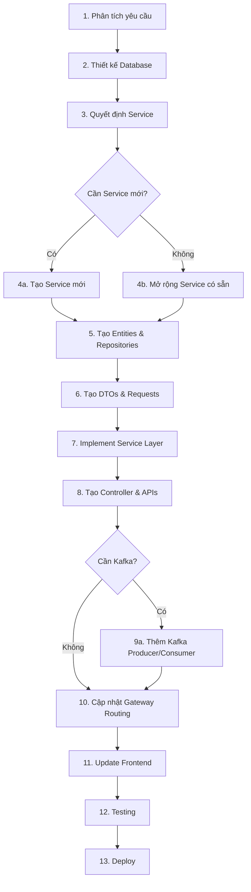

# 🛠️ HƯỚNG DẪN PHÁT TRIỂN & THÊM CHỨC NĂNG MỚI

## 📋 MỤC LỤC

1. [Tổng Quan Dự Án](#tổng-quan-dự-án)
2. [Các Chức Năng Hiện Tại](#các-chức-năng-hiện-tại)
3. [Kiến Trúc Từng Service](#kiến-trúc-từng-service)
4. [Hướng Dẫn Thêm Chức Năng Mới](#hướng-dẫn-thêm-chức-năng-mới)
5. [Ví Dụ Chi Tiết: Thêm Shipping Integration](#ví-dụ-chi-tiết-thêm-shipping-integration)
6. [Ví Dụ: Thêm Payment Gateway](#ví-dụ-thêm-payment-gateway)
7. [Ví Dụ: Thêm Review System](#ví-dụ-thêm-review-system)
8. [Best Practices & Checklist](#best-practices--checklist)

---

## 🎯 TỔNG QUAN DỰ ÁN

### Kiến Trúc Microservice

Dự án Shopee Clone được xây dựng theo mô hình **Microservices** với các thành phần chính:

```
┌─────────────────────────────────────────────────────────────┐
│                        Frontend (React)                      │
│                     merier-fe (Port 5173)                    │
└──────────────────────┬──────────────────────────────────────┘
                       │ HTTP/WebSocket
                       ▼
┌─────────────────────────────────────────────────────────────┐
│                    Nginx Reverse Proxy                       │
│                  shopee-fake.id.vn (Port 80)                 │
└──────────────────────┬──────────────────────────────────────┘
                       │
                       ▼
┌─────────────────────────────────────────────────────────────┐
│              API Gateway (Spring Cloud Gateway)              │
│                        Port 8080                             │
│  - Routing                                                   │
│  - Load Balancing                                            │
│  - CORS                                                      │
└──────────────────────┬──────────────────────────────────────┘
                       │
        ┌──────────────┼──────────────┬──────────────┐
        ▼              ▼              ▼              ▼
   ┌────────┐    ┌─────────┐    ┌─────────┐    ┌─────────┐
   │  Auth  │    │  User   │    │  Stock  │    │  Order  │
   │ :8001  │    │  :8002  │    │  :8004  │    │  :8005  │
   └────────┘    └─────────┘    └─────────┘    └─────────┘
        │              │              │              │
        └──────────────┴──────────────┴──────────────┘
                       │
              ┌────────┼────────┐
              ▼        ▼        ▼
         ┌────────┬────────┬────────┐
         │ MySQL  │ Redis  │ Kafka  │
         └────────┴────────┴────────┘
```

### Nguyên Tắc Thiết Kế

1. **Single Responsibility**: Mỗi service chịu trách nhiệm 1 domain cụ thể
2. **Loose Coupling**: Services giao tiếp qua Feign Client & Kafka
3. **Database Per Service**: Mỗi service có database riêng
4. **Event-Driven**: Sử dụng Kafka cho async communication
5. **API Gateway Pattern**: Tất cả requests đi qua Gateway
6. **Service Discovery**: Eureka giúp services tìm thấy nhau

---

## 📦 CÁC CHỨC NĂNG HIỆN TẠI

### 1. 🔐 Authentication & Authorization (Auth Service)

**Chức năng:**
- ✅ Đăng ký tài khoản (Email/Password)
- ✅ Đăng nhập (Email/Password)
- ✅ Google OAuth2 Login
- ✅ OTP qua Email (Quên mật khẩu)
- ✅ JWT Token Generation & Validation

**Công nghệ:**
- Spring Security
- BCryptPasswordEncoder
- Google OAuth2 Client
- Gmail SMTP
- Redis (lưu OTP)

**API Endpoints:**
```
POST /v1/auth/register
POST /v1/auth/login
POST /v1/auth/login/google
POST /v1/auth/forgot-password
POST /v1/auth/verify-otp
POST /v1/auth/reset-password
```

---

### 2. 👤 User Management (User Service)

**Chức năng:**
- ✅ Quản lý Profile (Tên, Email, Phone, Avatar, v.v.)
- ✅ Quản lý Địa chỉ (CRUD, Set Default)
- ✅ Yêu cầu Nâng cấp Shop Owner
- ✅ Admin Duyệt/Từ chối Role Requests
- ✅ Quản lý Shop Owner Profile
- ✅ User Activities Logging

**Database Tables:**
```sql
users (id, username, email, password, roles, user_details)
addresses (id, user_id, street, city, lat, long, is_default)
role_requests (id, user_id, requested_role, status, reason)
shop_owners (user_id, shop_name, owner_name, image_url, verified)
user_activities (id, user_id, activity_type, description)
```

**API Endpoints:**
```
GET    /v1/user
PUT    /v1/user/update
GET    /v1/user/address
POST   /v1/user/address
PUT    /v1/user/address/{id}
DELETE /v1/user/address/{id}
POST   /v1/user/role-requests
GET    /v1/user/role-requests (Admin)
PUT    /v1/user/role-requests/approve/{id} (Admin)
PUT    /v1/user/role-requests/reject/{id} (Admin)
GET    /v1/user/shop-owners
PUT    /v1/user/shop-owners
```

---

### 3. 📦 Product & Inventory (Stock Service)

**Chức năng:**
- ✅ Quản lý Categories (CRUD)
- ✅ Quản lý Products (CRUD)
- ✅ Quản lý Sizes/Variants (CRUD)
- ✅ Quản lý Tồn kho (Stock Management)
- ✅ Giỏ hàng (Cart) với Redis Cache
- ✅ Search & Filter Products

**Database Tables:**
```sql
category_products (id, name, description)
products (id, category_id, user_id, name, price, image_id, status)
sizes (id, product_id, name, stock, price_modifier)
carts (id, user_id, total_amount)
cart_items (id, cart_id, product_id, size_id, quantity)
```

**API Endpoints:**
```
GET    /v1/stock/category
POST   /v1/stock/category
GET    /v1/stock/product
POST   /v1/stock/product
PUT    /v1/stock/product/{id}
DELETE /v1/stock/product/{id}
POST   /v1/stock/size
GET    /v1/stock/cart
POST   /v1/stock/cart/add
PUT    /v1/stock/cart/update
DELETE /v1/stock/cart/remove/{id}
```

**Kafka Integration:**
- Subscribe: `order-topic` (giảm stock khi có đơn hàng)

---

### 4. 🛒 Order Management (Order Service)

**Chức năng:**
- ✅ Checkout từ Giỏ hàng
- ✅ Tạo đơn hàng
- ✅ Theo dõi đơn hàng
- ✅ Cập nhật trạng thái đơn
- ✅ Xem đơn hàng theo User/Shop Owner

**Database Tables:**
```sql
orders (id, user_id, address_id, total_price, status, created_at)
order_items (id, order_id, product_id, size_id, quantity, unit_price)
```

**Order Status Flow:**
```
PENDING → PROCESSING → SHIPPED → DELIVERED
                  ↓
              CANCELLED
```

**API Endpoints:**
```
POST   /v1/order/create-from-cart
GET    /v1/order/user
GET    /v1/order/{id}
GET    /v1/order/shop-owner
PUT    /v1/order/{id}/status
```

**Kafka Integration:**
- Publish: `order-topic` (sau khi tạo đơn)
- Publish: `notification-topic` (gửi thông báo)

---

### 5. 🔔 Notification System (Notification Service)

**Chức năng:**
- ✅ Lưu trữ Notifications
- ✅ Push Realtime qua WebSocket
- ✅ Mark as Read
- ✅ Phân biệt User & Shop Owner Notifications

**Database Tables:**
```sql
notifications (id, user_id, shop_id, order_id, message, is_read, created_at)
```

**WebSocket Flow:**
```
Frontend → Connect: ws://.../api/ws/notifications
         → Subscribe: /user/queue/notifications
         ← Receive: Real-time messages
```

**API Endpoints:**
```
GET /v1/notifications/user
PUT /v1/notifications/mark-read/{id}
WS  /ws/notifications
```

**Kafka Integration:**
- Subscribe: `notification-topic`

---

### 6. 📁 File Storage (File Storage Service)

**Chức năng:**
- ✅ Upload Files (Avatar, Product Images)
- ✅ Download Files
- ✅ Delete Files
- ✅ Store Metadata in MySQL

**Database Tables:**
```sql
files (id, type, file_path)
```

**API Endpoints:**
```
POST   /v1/file-storage/upload
GET    /v1/file-storage/{id}
DELETE /v1/file-storage/{id}
```

---

## 🏗️ KIẾN TRÚC TỪNG SERVICE

### Cấu Trúc Chuẩn Của Mỗi Service

```
service-name/
├── src/
│   ├── main/
│   │   ├── java/com/example/servicename/
│   │   │   ├── ServiceNameApplication.java
│   │   │   ├── config/
│   │   │   │   ├── SecurityConfig.java
│   │   │   │   ├── FeignConfig.java
│   │   │   │   └── KafkaConfig.java (nếu cần)
│   │   │   ├── controller/
│   │   │   │   └── XxxController.java
│   │   │   ├── service/
│   │   │   │   ├── XxxService.java (interface)
│   │   │   │   └── XxxServiceImpl.java
│   │   │   ├── repository/
│   │   │   │   └── XxxRepository.java
│   │   │   ├── model/
│   │   │   │   └── XxxEntity.java
│   │   │   ├── dto/
│   │   │   │   └── XxxDto.java
│   │   │   ├── request/
│   │   │   │   └── XxxRequest.java
│   │   │   ├── enums/
│   │   │   │   └── XxxEnum.java
│   │   │   ├── jwt/
│   │   │   │   ├── JwtUtil.java
│   │   │   │   └── JwtAuthenticationFilter.java
│   │   │   ├── client/
│   │   │   │   └── OtherServiceClient.java
│   │   │   └── exception/
│   │   │       └── GlobalExceptionHandler.java
│   │   └── resources/
│   │       └── application.yml
│   └── test/
├── pom.xml
└── Dockerfile (optional)
```

### Dependencies Chung

```xml
<!-- Spring Boot Starter -->
<dependency>
    <groupId>org.springframework.boot</groupId>
    <artifactId>spring-boot-starter-web</artifactId>
</dependency>

<!-- Spring Data JPA -->
<dependency>
    <groupId>org.springframework.boot</groupId>
    <artifactId>spring-boot-starter-data-jpa</artifactId>
</dependency>

<!-- MySQL Driver -->
<dependency>
    <groupId>com.mysql</groupId>
    <artifactId>mysql-connector-j</artifactId>
</dependency>

<!-- Eureka Client -->
<dependency>
    <groupId>org.springframework.cloud</groupId>
    <artifactId>spring-cloud-starter-netflix-eureka-client</artifactId>
</dependency>

<!-- Config Client -->
<dependency>
    <groupId>org.springframework.cloud</groupId>
    <artifactId>spring-cloud-starter-config</artifactId>
</dependency>

<!-- Feign Client -->
<dependency>
    <groupId>org.springframework.cloud</groupId>
    <artifactId>spring-cloud-starter-openfeign</artifactId>
</dependency>

<!-- Lombok -->
<dependency>
    <groupId>org.projectlombok</groupId>
    <artifactId>lombok</artifactId>
</dependency>
```

---

## 🚀 HƯỚNG DẪN THÊM CHỨC NĂNG MỚI

### Quy Trình Tổng Quan



### Các Bước Chi Tiết

#### Bước 1: Phân Tích Yêu Cầu

**Câu hỏi cần trả lời:**
- [ ] Chức năng này thuộc domain nào? (User, Product, Order, v.v.)
- [ ] Cần thêm service mới hay mở rộng service có sẵn?
- [ ] Cần database tables mới không?
- [ ] Có cần giao tiếp với service khác không? (Feign Client)
- [ ] Có cần xử lý bất đồng bộ không? (Kafka)
- [ ] Cần WebSocket/Realtime không?
- [ ] Yêu cầu bảo mật? (JWT, Role-based)

#### Bước 2: Thiết Kế Database

Tạo ERD và định nghĩa tables:

```sql
-- Ví dụ: Bảng cho Shipping
CREATE TABLE shippings (
    id VARCHAR(255) PRIMARY KEY,
    order_id VARCHAR(255) NOT NULL,
    provider ENUM('GHN', 'GHTK', 'VNPost'),
    tracking_number VARCHAR(100),
    shipping_fee DECIMAL(10,2),
    estimated_delivery_date DATE,
    actual_delivery_date DATE,
    status ENUM('PENDING', 'PICKED_UP', 'IN_TRANSIT', 'DELIVERED', 'FAILED'),
    created_at TIMESTAMP DEFAULT CURRENT_TIMESTAMP,
    updated_at TIMESTAMP DEFAULT CURRENT_TIMESTAMP ON UPDATE CURRENT_TIMESTAMP,
    FOREIGN KEY (order_id) REFERENCES orders(id)
);

CREATE TABLE shipping_addresses (
    id VARCHAR(255) PRIMARY KEY,
    shipping_id VARCHAR(255),
    address_id VARCHAR(255),
    recipient_name VARCHAR(255),
    phone VARCHAR(20),
    full_address TEXT,
    ward_code VARCHAR(50),
    district_code VARCHAR(50),
    province_code VARCHAR(50),
    FOREIGN KEY (shipping_id) REFERENCES shippings(id)
);
```

#### Bước 3: Quyết Định Service

**Thêm vào Service có sẵn nếu:**
- Liên quan trực tiếp đến domain của service đó
- Không quá phức tạp
- Ít dependencies với services khác

**Tạo Service mới nếu:**
- Là domain hoàn toàn độc lập
- Có logic phức tạp riêng
- Cần scale riêng biệt
- Có nhiều external integrations

#### Bước 4: Implement (Chi tiết ở các ví dụ bên dưới)

---

## 📦 VÍ DỤ CHI TIẾT: THÊM SHIPPING INTEGRATION

### 1. Phân Tích

**Yêu cầu:**
- Tích hợp với GHN/GHTK API
- Tính phí vận chuyển
- Tạo vận đơn
- Tracking đơn hàng
- Webhook nhận cập nhật

**Quyết định:**
- ✅ Tạo **shipping-service** mới (Port 8006)
- Database riêng cho shipping data
- Feign Client gọi Order Service & User Service
- Kafka để đồng bộ shipping status

### 2. Tạo Service Mới

```bash
# Tạo Spring Boot project mới
cd shopee-fake/
mvn archetype:generate \
  -DgroupId=com.example \
  -DartifactId=shipping-service \
  -DarchetypeArtifactId=maven-archetype-quickstart \
  -DinteractiveMode=false

cd shipping-service
```

**pom.xml:**
```xml
<dependencies>
    <!-- Spring Boot Web -->
    <dependency>
        <groupId>org.springframework.boot</groupId>
        <artifactId>spring-boot-starter-web</artifactId>
    </dependency>
    
    <!-- Spring Data JPA -->
    <dependency>
        <groupId>org.springframework.boot</groupId>
        <artifactId>spring-boot-starter-data-jpa</artifactId>
    </dependency>
    
    <!-- MySQL -->
    <dependency>
        <groupId>com.mysql</groupId>
        <artifactId>mysql-connector-j</artifactId>
    </dependency>
    
    <!-- Eureka Client -->
    <dependency>
        <groupId>org.springframework.cloud</groupId>
        <artifactId>spring-cloud-starter-netflix-eureka-client</artifactId>
    </dependency>
    
    <!-- Feign Client -->
    <dependency>
        <groupId>org.springframework.cloud</groupId>
        <artifactId>spring-cloud-starter-openfeign</artifactId>
    </dependency>
    
    <!-- Kafka -->
    <dependency>
        <groupId>org.springframework.kafka</groupId>
        <artifactId>spring-kafka</artifactId>
    </dependency>
    
    <!-- WebClient for API calls -->
    <dependency>
        <groupId>org.springframework.boot</groupId>
        <artifactId>spring-boot-starter-webflux</artifactId>
    </dependency>
    
    <!-- Lombok -->
    <dependency>
        <groupId>org.projectlombok</groupId>
        <artifactId>lombok</artifactId>
    </dependency>
</dependencies>
```

### 3. Tạo Database Schema

**shipping-service/src/main/resources/application.yml:**
```yaml
spring:
  datasource:
    url: jdbc:mysql://localhost:3306/shopee_shipping
    username: sa
    password: Thuan@417
  jpa:
    hibernate:
      ddl-auto: update
    show-sql: true
  
  application:
    name: shipping-service
  
server:
  port: 8006

eureka:
  client:
    service-url:
      defaultZone: http://localhost:8761/eureka/
```

### 4. Tạo Entities

**model/Shipping.java:**
```java
package com.example.shippingservice.model;

import jakarta.persistence.*;
import lombok.Data;
import java.math.BigDecimal;
import java.time.LocalDate;
import java.time.LocalDateTime;

@Entity
@Table(name = "shippings")
@Data
public class Shipping extends BaseEntity {
    
    @Id
    private String id;
    
    @Column(name = "order_id", nullable = false)
    private String orderId;
    
    @Enumerated(EnumType.STRING)
    @Column(nullable = false)
    private ShippingProvider provider;
    
    @Column(name = "tracking_number", unique = true)
    private String trackingNumber;
    
    @Column(name = "shipping_fee")
    private BigDecimal shippingFee;
    
    @Column(name = "estimated_delivery_date")
    private LocalDate estimatedDeliveryDate;
    
    @Column(name = "actual_delivery_date")
    private LocalDate actualDeliveryDate;
    
    @Enumerated(EnumType.STRING)
    @Column(nullable = false)
    private ShippingStatus status = ShippingStatus.PENDING;
    
    @OneToOne(cascade = CascadeType.ALL, fetch = FetchType.LAZY)
    @JoinColumn(name = "shipping_address_id")
    private ShippingAddress shippingAddress;
    
    @Column(name = "provider_response", columnDefinition = "TEXT")
    private String providerResponse; // JSON từ GHN/GHTK
}
```

**model/ShippingAddress.java:**
```java
@Entity
@Table(name = "shipping_addresses")
@Data
public class ShippingAddress extends BaseEntity {
    
    @Id
    private String id;
    
    @Column(name = "recipient_name", nullable = false)
    private String recipientName;
    
    @Column(nullable = false)
    private String phone;
    
    @Column(name = "full_address", columnDefinition = "TEXT")
    private String fullAddress;
    
    @Column(name = "ward_code")
    private String wardCode;
    
    @Column(name = "district_code")
    private String districtCode;
    
    @Column(name = "province_code")
    private String provinceCode;
}
```

**enums/ShippingProvider.java:**
```java
package com.example.shippingservice.enums;

public enum ShippingProvider {
    GHN,     // Giao Hàng Nhanh
    GHTK,    // Giao Hàng Tiết Kiệm
    VNPOST,  // Viettel Post
    J_T      // J&T Express
}
```

**enums/ShippingStatus.java:**
```java
package com.example.shippingservice.enums;

public enum ShippingStatus {
    PENDING,        // Chờ lấy hàng
    PICKED_UP,      // Đã lấy hàng
    IN_TRANSIT,     // Đang vận chuyển
    OUT_FOR_DELIVERY, // Đang giao
    DELIVERED,      // Đã giao thành công
    FAILED,         // Giao thất bại
    RETURNED        // Hoàn trả
}
```

### 5. Tạo Repository

```java
package com.example.shippingservice.repository;

import com.example.shippingservice.model.Shipping;
import org.springframework.data.jpa.repository.JpaRepository;
import java.util.List;
import java.util.Optional;

public interface ShippingRepository extends JpaRepository<Shipping, String> {
    Optional<Shipping> findByOrderId(String orderId);
    Optional<Shipping> findByTrackingNumber(String trackingNumber);
    List<Shipping> findByStatus(ShippingStatus status);
}
```

### 6. Tạo DTOs & Requests

**dto/ShippingDto.java:**
```java
@Data
public class ShippingDto {
    private String id;
    private String orderId;
    private ShippingProvider provider;
    private String trackingNumber;
    private BigDecimal shippingFee;
    private LocalDate estimatedDeliveryDate;
    private ShippingStatus status;
    private ShippingAddressDto shippingAddress;
}
```

**request/CreateShippingRequest.java:**
```java
@Data
public class CreateShippingRequest {
    private String orderId;
    private ShippingProvider provider;
    private String recipientName;
    private String phone;
    private String addressId; // Lấy từ User Service
    private Integer weight; // gram
    private Integer length; // cm
    private Integer width;  // cm
    private Integer height; // cm
}
```

**request/CalculateShippingFeeRequest.java:**
```java
@Data
public class CalculateShippingFeeRequest {
    private ShippingProvider provider;
    private String fromDistrictCode;
    private String toDistrictCode;
    private Integer weight; // gram
    private Integer length;
    private Integer width;
    private Integer height;
}
```

### 7. Implement Service Layer

**service/ShippingService.java:**
```java
package com.example.shippingservice.service;

public interface ShippingService {
    BigDecimal calculateShippingFee(CalculateShippingFeeRequest request);
    ShippingDto createShipping(CreateShippingRequest request);
    ShippingDto getShippingByOrderId(String orderId);
    ShippingDto updateShippingStatus(String shippingId, ShippingStatus newStatus);
    void handleWebhook(String provider, String payload);
}
```

**service/ShippingServiceImpl.java:**
```java
@Service
@RequiredArgsConstructor
@Slf4j
public class ShippingServiceImpl implements ShippingService {
    
    private final ShippingRepository shippingRepository;
    private final GhnApiClient ghnApiClient;
    private final GhtkApiClient ghtkApiClient;
    private final OrderServiceClient orderServiceClient;
    private final UserServiceClient userServiceClient;
    private final KafkaTemplate<String, Object> kafkaTemplate;
    
    @Override
    public BigDecimal calculateShippingFee(CalculateShippingFeeRequest request) {
        switch (request.getProvider()) {
            case GHN:
                return ghnApiClient.calculateFee(request);
            case GHTK:
                return ghtkApiClient.calculateFee(request);
            default:
                throw new UnsupportedOperationException("Provider not supported");
        }
    }
    
    @Override
    @Transactional
    public ShippingDto createShipping(CreateShippingRequest request) {
        // 1. Lấy thông tin đơn hàng
        OrderDto order = orderServiceClient.getOrderById(request.getOrderId());
        if (order == null) {
            throw new NotFoundException("Order not found");
        }
        
        // 2. Lấy địa chỉ từ User Service
        AddressDto address = userServiceClient.getAddressById(request.getAddressId());
        
        // 3. Tạo shipping address
        ShippingAddress shippingAddress = new ShippingAddress();
        shippingAddress.setId(UUID.randomUUID().toString());
        shippingAddress.setRecipientName(request.getRecipientName());
        shippingAddress.setPhone(request.getPhone());
        shippingAddress.setFullAddress(address.getFullAddress());
        shippingAddress.setWardCode(address.getWardCode());
        shippingAddress.setDistrictCode(address.getDistrictCode());
        shippingAddress.setProvinceCode(address.getProvinceCode());
        
        // 4. Tính phí ship
        CalculateShippingFeeRequest feeRequest = buildFeeRequest(request, address);
        BigDecimal fee = calculateShippingFee(feeRequest);
        
        // 5. Tạo vận đơn với provider
        String trackingNumber;
        LocalDate estimatedDate;
        
        switch (request.getProvider()) {
            case GHN:
                GhnCreateOrderResponse ghnResponse = ghnApiClient.createOrder(
                    request, shippingAddress, fee
                );
                trackingNumber = ghnResponse.getTrackingNumber();
                estimatedDate = ghnResponse.getExpectedDeliveryTime();
                break;
            
            case GHTK:
                GhtkCreateOrderResponse ghtkResponse = ghtkApiClient.createOrder(
                    request, shippingAddress, fee
                );
                trackingNumber = ghtkResponse.getTrackingId();
                estimatedDate = ghtkResponse.getEstimatedPickTime().plusDays(3);
                break;
                
            default:
                throw new UnsupportedOperationException("Provider not supported");
        }
        
        // 6. Lưu vào database
        Shipping shipping = new Shipping();
        shipping.setId(UUID.randomUUID().toString());
        shipping.setOrderId(request.getOrderId());
        shipping.setProvider(request.getProvider());
        shipping.setTrackingNumber(trackingNumber);
        shipping.setShippingFee(fee);
        shipping.setEstimatedDeliveryDate(estimatedDate);
        shipping.setStatus(ShippingStatus.PENDING);
        shipping.setShippingAddress(shippingAddress);
        
        Shipping saved = shippingRepository.save(shipping);
        
        // 7. Publish Kafka event
        kafkaTemplate.send("shipping-topic", new ShippingCreatedEvent(
            saved.getId(), saved.getOrderId(), trackingNumber
        ));
        
        return mapToDto(saved);
    }
    
    @Override
    public ShippingDto updateShippingStatus(String shippingId, ShippingStatus newStatus) {
        Shipping shipping = shippingRepository.findById(shippingId)
            .orElseThrow(() -> new NotFoundException("Shipping not found"));
        
        shipping.setStatus(newStatus);
        
        if (newStatus == ShippingStatus.DELIVERED) {
            shipping.setActualDeliveryDate(LocalDate.now());
        }
        
        Shipping updated = shippingRepository.save(shipping);
        
        // Publish status change event
        kafkaTemplate.send("shipping-status-topic", new ShippingStatusChangedEvent(
            updated.getId(), updated.getOrderId(), newStatus
        ));
        
        return mapToDto(updated);
    }
    
    @Override
    public void handleWebhook(String provider, String payload) {
        // Parse webhook từ GHN/GHTK
        // Cập nhật status tương ứng
        log.info("Received webhook from {}: {}", provider, payload);
        
        // Ví dụ: GHN webhook
        if ("GHN".equalsIgnoreCase(provider)) {
            GhnWebhookPayload webhook = parseGhnWebhook(payload);
            
            Shipping shipping = shippingRepository
                .findByTrackingNumber(webhook.getOrderCode())
                .orElse(null);
            
            if (shipping != null) {
                ShippingStatus newStatus = mapGhnStatusToOurs(webhook.getStatus());
                updateShippingStatus(shipping.getId(), newStatus);
            }
        }
    }
}
```

### 8. Tạo External API Clients

**client/GhnApiClient.java:**
```java
@Service
@Slf4j
public class GhnApiClient {
    
    @Value("${ghn.api.url}")
    private String apiUrl;
    
    @Value("${ghn.api.token}")
    private String apiToken;
    
    @Value("${ghn.shop.id}")
    private Integer shopId;
    
    private final WebClient webClient;
    
    public GhnApiClient(WebClient.Builder webClientBuilder) {
        this.webClient = webClientBuilder.baseUrl(apiUrl).build();
    }
    
    public BigDecimal calculateFee(CalculateShippingFeeRequest request) {
        GhnFeeRequest ghnRequest = GhnFeeRequest.builder()
            .service_type_id(2) // E-commerce delivery
            .from_district_id(Integer.parseInt(request.getFromDistrictCode()))
            .to_district_id(Integer.parseInt(request.getToDistrictCode()))
            .weight(request.getWeight())
            .length(request.getLength())
            .width(request.getWidth())
            .height(request.getHeight())
            .build();
        
        GhnFeeResponse response = webClient.post()
            .uri("/shiip/public-api/v2/shipping-order/fee")
            .header("Token", apiToken)
            .header("ShopId", shopId.toString())
            .bodyValue(ghnRequest)
            .retrieve()
            .bodyToMono(GhnFeeResponse.class)
            .block();
        
        return response.getData().getTotal();
    }
    
    public GhnCreateOrderResponse createOrder(
        CreateShippingRequest request, 
        ShippingAddress address,
        BigDecimal fee
    ) {
        GhnCreateOrderRequest ghnRequest = GhnCreateOrderRequest.builder()
            .payment_type_id(2) // Người nhận trả phí
            .required_note("KHONGCHOXEMHANG")
            .to_name(address.getRecipientName())
            .to_phone(address.getPhone())
            .to_address(address.getFullAddress())
            .to_ward_code(address.getWardCode())
            .to_district_id(Integer.parseInt(address.getDistrictCode()))
            .weight(request.getWeight())
            .length(request.getLength())
            .width(request.getWidth())
            .height(request.getHeight())
            .service_type_id(2)
            .build();
        
        return webClient.post()
            .uri("/shiip/public-api/v2/shipping-order/create")
            .header("Token", apiToken)
            .header("ShopId", shopId.toString())
            .bodyValue(ghnRequest)
            .retrieve()
            .bodyToMono(GhnCreateOrderResponse.class)
            .block();
    }
}
```

### 9. Tạo Controller

**controller/ShippingController.java:**
```java
@RestController
@RequestMapping("/v1/shipping")
@RequiredArgsConstructor
public class ShippingController {
    
    private final ShippingService shippingService;
    
    @PostMapping("/calculate-fee")
    public ResponseEntity<Map<String, Object>> calculateFee(
        @RequestBody CalculateShippingFeeRequest request
    ) {
        BigDecimal fee = shippingService.calculateShippingFee(request);
        return ResponseEntity.ok(Map.of(
            "fee", fee,
            "provider", request.getProvider()
        ));
    }
    
    @PostMapping
    public ResponseEntity<ShippingDto> createShipping(
        @RequestBody CreateShippingRequest request
    ) {
        ShippingDto shipping = shippingService.createShipping(request);
        return ResponseEntity.status(HttpStatus.CREATED).body(shipping);
    }
    
    @GetMapping("/order/{orderId}")
    public ResponseEntity<ShippingDto> getShippingByOrder(
        @PathVariable String orderId
    ) {
        ShippingDto shipping = shippingService.getShippingByOrderId(orderId);
        return ResponseEntity.ok(shipping);
    }
    
    @PutMapping("/{shippingId}/status")
    public ResponseEntity<ShippingDto> updateStatus(
        @PathVariable String shippingId,
        @RequestParam ShippingStatus status
    ) {
        ShippingDto updated = shippingService.updateShippingStatus(shippingId, status);
        return ResponseEntity.ok(updated);
    }
    
    @PostMapping("/webhook/{provider}")
    public ResponseEntity<Void> handleWebhook(
        @PathVariable String provider,
        @RequestBody String payload
    ) {
        shippingService.handleWebhook(provider, payload);
        return ResponseEntity.ok().build();
    }
}
```

### 10. Cập Nhật Gateway

**gateway/src/main/resources/application.yml:**
```yaml
spring:
  cloud:
    gateway:
      routes:
        # ... existing routes ...
        
        - id: shipping-service
          uri: lb://shipping-service
          predicates:
            - Path=/v1/shipping/**
          filters:
            - JwtAuthenticationFilter
```

### 11. Kafka Integration

**Order Service cần publish event:**
```java
// order-service/OrderServiceImpl.java
@Transactional
public OrderDto createOrder(...) {
    // ... existing code ...
    
    // Sau khi tạo order thành công
    kafkaTemplate.send("order-created-topic", new OrderCreatedEvent(
        order.getId(),
        order.getUserId(),
        order.getTotalPrice(),
        order.getAddressId()
    ));
    
    return orderDto;
}
```

**Shipping Service subscribe:**
```java
@KafkaListener(topics = "order-created-topic", groupId = "shipping-service")
public void handleOrderCreated(OrderCreatedEvent event) {
    log.info("Order created: {}, ready for shipping", event.getOrderId());
    // Có thể tự động tạo shipping hoặc chờ shop owner xác nhận
}
```

### 12. Frontend Integration

**pages/shop-owner/CreateShippingPage.jsx:**
```jsx
import React, { useState, useEffect } from 'react';
import axios from 'axios';

export default function CreateShippingPage() {
  const [order, setOrder] = useState(null);
  const [provider, setProvider] = useState('GHN');
  const [shippingFee, setShippingFee] = useState(null);
  const [loading, setLoading] = useState(false);

  const calculateFee = async () => {
    try {
      const response = await axios.post('/api/v1/shipping/calculate-fee', {
        provider,
        fromDistrictCode: '1542', // Quận 1, TPHCM
        toDistrictCode: order.address.districtCode,
        weight: 1000, // 1kg
        length: 20,
        width: 15,
        height: 10
      });
      setShippingFee(response.data.fee);
    } catch (error) {
      console.error('Error calculating fee:', error);
    }
  };

  const createShipping = async () => {
    setLoading(true);
    try {
      const response = await axios.post('/api/v1/shipping', {
        orderId: order.id,
        provider,
        recipientName: order.address.recipientName,
        phone: order.address.phone,
        addressId: order.addressId,
        weight: 1000,
        length: 20,
        width: 15,
        height: 10
      });
      
      alert('Tạo vận đơn thành công! Mã vận đơn: ' + response.data.trackingNumber);
    } catch (error) {
      alert('Lỗi: ' + error.response.data.message);
    } finally {
      setLoading(false);
    }
  };

  return (
    <div className="shipping-page">
      <h2>Tạo Vận Đơn</h2>
      
      <div className="provider-select">
        <label>Đơn vị vận chuyển:</label>
        <select value={provider} onChange={(e) => setProvider(e.target.value)}>
          <option value="GHN">Giao Hàng Nhanh</option>
          <option value="GHTK">Giao Hàng Tiết Kiệm</option>
          <option value="VNPOST">VNPost</option>
        </select>
      </div>

      <button onClick={calculateFee}>Tính Phí Vận Chuyển</button>
      
      {shippingFee && (
        <div className="fee-result">
          <p>Phí vận chuyển: {shippingFee.toLocaleString()} VNĐ</p>
          <button onClick={createShipping} disabled={loading}>
            {loading ? 'Đang tạo...' : 'Tạo Vận Đơn'}
          </button>
        </div>
      )}
    </div>
  );
}
```

### 13. Testing

```java
@SpringBootTest
@AutoConfigureMockMvc
class ShippingServiceTests {
    
    @Autowired
    private MockMvc mockMvc;
    
    @MockBean
    private GhnApiClient ghnApiClient;
    
    @Test
    void testCalculateShippingFee() throws Exception {
        when(ghnApiClient.calculateFee(any()))
            .thenReturn(new BigDecimal("25000"));
        
        mockMvc.perform(post("/v1/shipping/calculate-fee")
                .contentType(MediaType.APPLICATION_JSON)
                .content("{...}"))
            .andExpect(status().isOk())
            .andExpect(jsonPath("$.fee").value(25000));
    }
}
```

---

## 💳 VÍ DỤ: THÊM PAYMENT GATEWAY

### 1. Tạo Payment Service (Port 8007)

**Entities:**
```java
@Entity
@Table(name = "payments")
public class Payment {
    private String id;
    private String orderId;
    private PaymentMethod method; // VNPAY, MOMO, COD
    private BigDecimal amount;
    private PaymentStatus status; // PENDING, SUCCESS, FAILED
    private String transactionId;
    private String paymentUrl;
    private LocalDateTime paidAt;
}
```

**Flow:**
```
1. User chọn thanh toán online (VNPay/Momo)
2. POST /v1/payment/create → Tạo payment record
3. Redirect user đến payment gateway URL
4. User thanh toán
5. Gateway callback: GET /v1/payment/callback
6. Verify signature, update payment status
7. Publish Kafka event → Order Service cập nhật order status
8. Redirect user về trang success/failure
```

**Key Points:**
- Lưu trữ payment records
- Signature verification (HMAC SHA256)
- IPN (Instant Payment Notification) handling
- Timeout handling (15 phút)

---

## ⭐ VÍ DỤ: THÊM REVIEW SYSTEM

### 1. Mở Rộng Stock Service hoặc Tạo Review Service

**Entities:**
```java
@Entity
@Table(name = "reviews")
public class Review {
    private String id;
    private String productId;
    private String userId;
    private String orderId; // Chỉ cho phép review nếu đã mua
    private Integer rating; // 1-5 sao
    private String comment;
    private LocalDateTime createdAt;
    
    @OneToMany(cascade = CascadeType.ALL)
    private List<ReviewImage> images;
}

@Entity
@Table(name = "review_images")
public class ReviewImage {
    private String id;
    private String reviewId;
    private String imageId; // Link to File Storage
}
```

**Business Logic:**
```java
public ReviewDto createReview(CreateReviewRequest request) {
    // 1. Kiểm tra user đã mua sản phẩm chưa
    OrderDto order = orderServiceClient.getOrderById(request.getOrderId());
    if (order == null || !order.getStatus().equals(OrderStatus.DELIVERED)) {
        throw new BadRequestException("Chỉ có thể review sau khi nhận hàng");
    }
    
    // 2. Kiểm tra đã review chưa
    if (reviewRepository.existsByUserIdAndProductId(userId, productId)) {
        throw new BadRequestException("Đã review sản phẩm này rồi");
    }
    
    // 3. Tạo review
    Review review = new Review();
    review.setProductId(request.getProductId());
    review.setUserId(currentUserId);
    review.setRating(request.getRating());
    review.setComment(request.getComment());
    
    // 4. Upload images nếu có
    if (request.getImages() != null) {
        List<ReviewImage> images = uploadReviewImages(request.getImages());
        review.setImages(images);
    }
    
    Review saved = reviewRepository.save(review);
    
    // 5. Cập nhật rating trung bình của product
    updateProductRating(productId);
    
    return mapToDto(saved);
}
```

---

## ✅ BEST PRACTICES & CHECKLIST

### Checklist Khi Thêm Chức Năng Mới

#### Database
- [ ] Tạo ERD diagram
- [ ] Đặt tên tables theo convention (số nhiều, snake_case)
- [ ] Primary key là UUID/String
- [ ] Thêm indexes cho foreign keys
- [ ] Thêm created_at, updated_at timestamps
- [ ] Migrate database (Liquibase/Flyway khuyến nghị)

#### Backend
- [ ] Tạo Entities với annotations đầy đủ
- [ ] Tạo Repositories (extends JpaRepository)
- [ ] Tạo DTOs (Data Transfer Objects)
- [ ] Tạo Request classes với validation
- [ ] Implement Service (interface + impl)
- [ ] Tạo Controllers với proper HTTP methods
- [ ] Exception handling
- [ ] Logging (SLF4J)
- [ ] Unit tests (JUnit 5 + Mockito)

#### Integration
- [ ] Feign Client configuration nếu cần gọi service khác
- [ ] Kafka Producer/Consumer nếu cần async
- [ ] Update Gateway routes
- [ ] Update Eureka service registration

#### Frontend
- [ ] Tạo API service functions (axios)
- [ ] Tạo React components/pages
- [ ] Form validation
- [ ] Error handling & user feedback
- [ ] Loading states
- [ ] Responsive design

#### Security
- [ ] JWT authentication nếu cần
- [ ] Role-based authorization
- [ ] Input validation
- [ ] SQL injection prevention (JPA/PreparedStatement)
- [ ] XSS prevention

#### Documentation
- [ ] API documentation (Swagger/OpenAPI)
- [ ] Update README.md
- [ ] Code comments cho logic phức tạp
- [ ] Postman collection

#### Deployment
- [ ] Environment variables (.env)
- [ ] Build scripts
- [ ] Docker support (Dockerfile)
- [ ] Health check endpoints

### Code Convention

**Naming:**
```
- Classes: PascalCase (UserService, OrderController)
- Methods: camelCase (createOrder, getUserById)
- Variables: camelCase (userId, orderDto)
- Constants: UPPER_SNAKE_CASE (MAX_RETRY_COUNT)
- Database tables: snake_case (user_orders, order_items)
```

**Package Structure:**
```
com.example.servicename
├── config         // Configuration classes
├── controller     // REST controllers
├── service        // Business logic (interface + impl)
├── repository     // Data access layer
├── model          // JPA entities
├── dto            // Data transfer objects
├── request        // Request payloads
├── response       // Response payloads
├── enums          // Enumerations
├── exception      // Custom exceptions
├── jwt            // JWT utilities
├── client         // Feign clients
└── util           // Utility classes
```

### Performance Best Practices

1. **Database:**
   - Sử dụng indexes cho columns thường query
   - Lazy loading cho relationships
   - Pagination cho danh sách lớn
   - Connection pooling (HikariCP)

2. **Caching:**
   - Redis cho session/cart data
   - Cache static data (categories)
   - TTL (Time To Live) cho cache

3. **API:**
   - Compress responses (Gzip)
   - Minimize payload size
   - Use ETags for caching

4. **Kafka:**
   - Batch processing
   - Proper error handling
   - Retry mechanism

### Security Best Practices

1. **Never log sensitive data** (passwords, tokens)
2. **Use environment variables** for secrets
3. **Validate all inputs** (Bean Validation)
4. **Use HTTPS** in production
5. **Rate limiting** on APIs
6. **CORS configuration** properly
7. **SQL injection prevention** (use JPA/PreparedStatement)
8. **XSS prevention** (sanitize inputs)

---

## 🎓 KẾT LUẬN

Tài liệu này cung cấp:
✅ Tổng quan các chức năng hiện tại
✅ Kiến trúc từng service
✅ Hướng dẫn chi tiết thêm chức năng mới
✅ 3 Ví dụ thực tế: Shipping, Payment, Review
✅ Best practices & checklist

**Lời khuyên:**
- Bắt đầu từ chức năng đơn giản
- Test kỹ trước khi merge
- Maintain documentation
- Follow existing patterns
- Ask for code review

**Next Steps:**
1. Chọn chức năng muốn thêm
2. Phân tích requirements
3. Thiết kế database
4. Implement theo checklist
5. Test & Deploy

Good luck! 🚀
