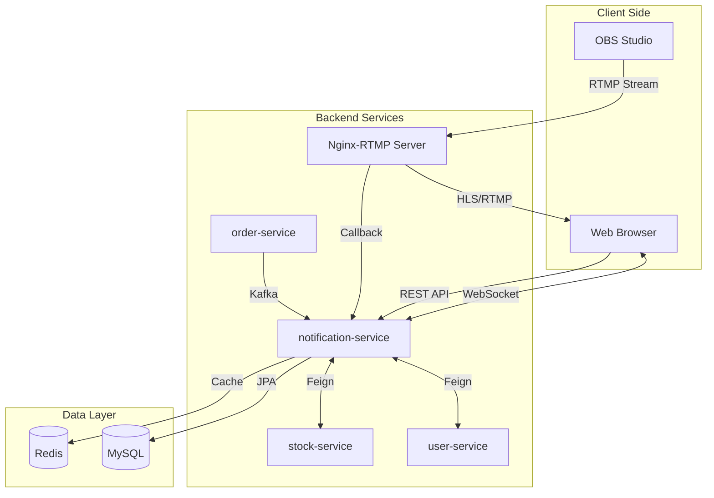
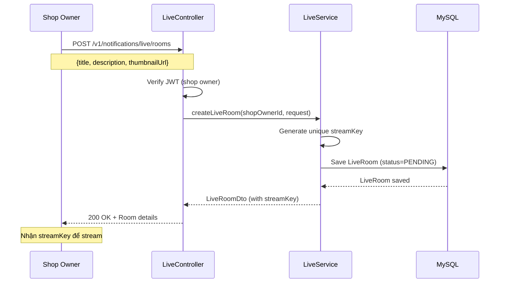
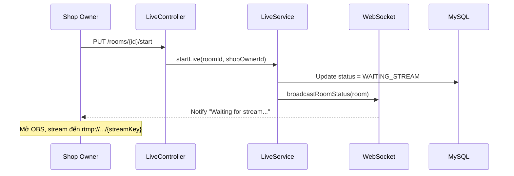
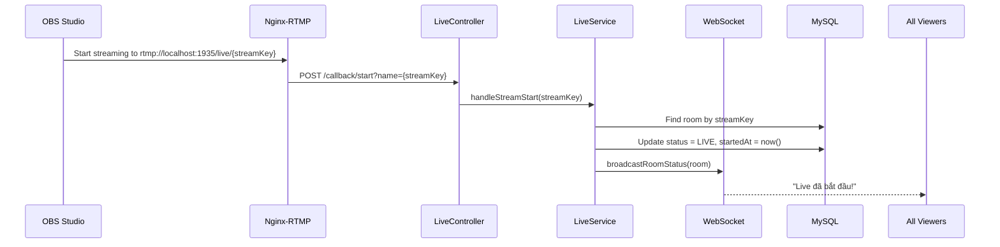
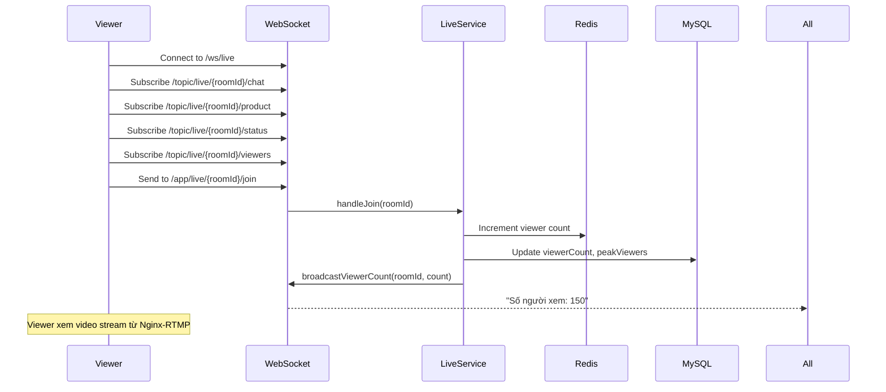
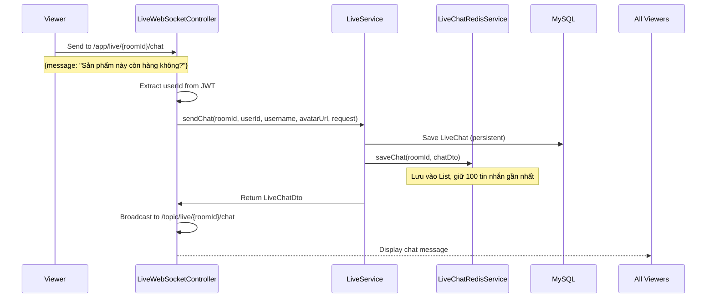
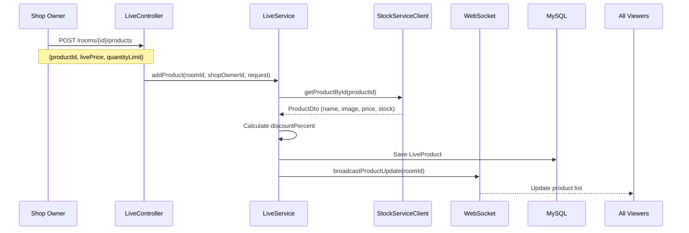
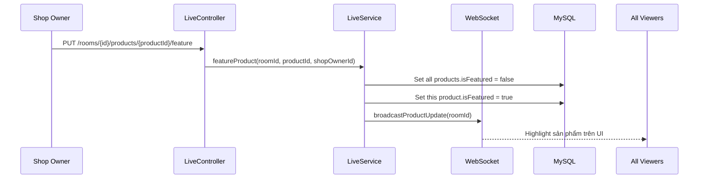
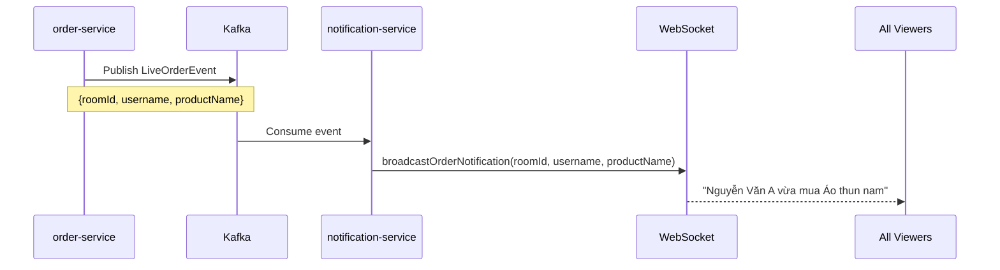
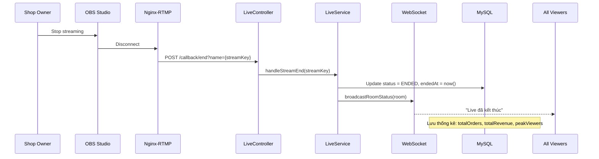

# Kiến Trúc Chức Năng Live Stream

## 📋 Mục Lục
1. [Tổng Quan](#tổng-quan)
2. [Công Nghệ Sử Dụng](#công-nghệ-sử-dụng)
3. [Kiến Trúc Hệ Thống](#kiến-trúc-hệ-thống)
4. [Luồng Hoạt Động Chi Tiết](#luồng-hoạt-động-chi-tiết)
5. [Cấu Trúc Code](#cấu-trúc-code)
6. [Bảo Mật](#bảo-mật)
7. [Tối Ưu Hiệu Năng](#tối-ưu-hiệu-năng)

---

## Tổng Quan

Chức năng **Live Stream** trong `notification-service` cho phép shop owner phát trực tiếp video để bán hàng, tương tác với khách hàng qua chat real-time, và quản lý sản phẩm trong phiên live.

**Tính năng chính:**
- ✅ Phát video trực tiếp qua RTMP
- ✅ Chat real-time với WebSocket
- ✅ Quản lý sản phẩm trong live
- ✅ Highlight sản phẩm đang bán
- ✅ Thống kê số người xem, đơn hàng, doanh thu
- ✅ Thông báo đơn hàng real-time

---

## Công Nghệ Sử Dụng

### 1. **WebSocket + STOMP Protocol**

**Mục đích:** Giao tiếp real-time 2 chiều giữa client và server

**Thư viện:** `spring-boot-starter-websocket`

**Protocol:** STOMP (Simple Text Oriented Messaging Protocol) over WebSocket

**Endpoint:** `/ws/live` (hỗ trợ cả SockJS fallback)

RTMP (Real-Time Messaging Protocol) là gì?
RTMP (Giao thức Tin nhắn Thời gian thực) là một công nghệ được phát triển bởi Adobe (trước đây là Macromedia) để truyền tải âm thanh, video và dữ liệu giữa máy tính của bạn và máy chủ.

1. Ý nghĩa và Vai trò trong Livestream
Trong hệ thống Livestream của chúng ta, RTMP đóng vai trò là "người vận chuyển" ở đầu vào (Ingest):

Cầu nối tin cậy: Nó là con đường độc đạo nối giữa phần mềm quay phim (OBS Studio) và Server xử lý Video (Media Server).
Duy trì kết nối: Khác với HTTP (gửi xong rồi ngắt), RTMP giữ một kết nối liên tục (TCP). Điều này giúp video được đẩy lên Server liên tục, mượt mà, độ trễ cực thấp (Low Latency).
2. Tại sao lại dùng RTMP để đẩy video lên (Ingestion)?
Tại sao OBS dùng RTMP mà không dùng cái khác?

Chuẩn mực công nghiệp: Hầu hết các phần mềm quay phát (OBS, vMix, XSplit) và các nền tảng lớn (Facebook Live, YouTube Live, TikTok) đều hỗ trợ chuẩn RTMP. Dùng RTMP giúp hệ thống dễ dàng tương thích với mọi công cụ có sẵn trên thị trường.
Ổn định: RTMP được thiết kế chuyên biệt cho việc gửi các gói tin Audio/Video theo thời gian thực. Ít bị hiện tượng "rớt gói" gây vỡ hình hơn so với các giao thức truyền file thông thường.


1. Luồng xử lý (Flow) hoạt động như thế nào?
Hệ thống Live Stream này hoạt động dựa trên mô hình tách biệt giữa Xử lý Video (Media Server) và Xử lý Nghiệp vụ (Backend Spring Boot).

Bước 1: Tạo Phòng Live (Trên Web App)
Shop Owner (Người bán) vào trang quản trị, bấm nút "Tạo phiên Live".
Backend Spring Boot sẽ tạo ra một bản ghi 
LiveRoom
 trong Database.
Quan trọng: Backend tự động sinh ra một chuỗi bí mật gọi là Stream Key.
Bước 2: Chuẩn bị Stream (Trên OBS)
Shop Owner copy Stream Key từ Web App.
Shop Owner mở phần mềm OBS Studio, dán Stream Key vào phần cài đặt Stream (URL: rtmp://[server-ip]:1935/live).
Bước 3: Bắt đầu phát (OBS -> Nginx Server)
Khi bấm "Start Streaming" trên OBS, video từ camera sẽ được bắn theo giao thức RTMP lên máy chủ Media (thường là Nginx có cài module RTMP).
Nginx Server nhận video và bắt đầu xử lý (thường là chuyển đổi sang chuẩn HLS .m3u8 để người xem có thể xem trên trình duyệt).
Bước 4: Đồng bộ trạng thái
Khi Nginx nhận được tín hiệu stream, nó sẽ gọi ngược lại (Callback) một API của Backend Spring Boot (/callback/start) để báo: "Ê, phòng này đang phát rồi nhé".
Backend cập nhật trạng thái phòng sang LIVE và thông báo cho mọi người xem (Viewers) qua WebSocket.
Bước 5: Người xem tương tác
Người xem mở Web -> Video được tải từ Nginx (qua HLS URL).
Chat, Mua hàng, thả tim -> Gửi qua WebSocket tới Backend Spring Boot -> Lưu vào Redis/MySQL.
2. Hệ thống cần "cái gì" để chạy?
Để hệ thống này hoạt động, bạn cần 3 thành phần chính chạy song song:

Backend App (Spring Boot - Notification Service): Để quản lý thông tin phòng, user, chat, bán hàng, đơn hàng. Đây là phần logic nghiệp vụ.
Media Server (Nginx-RTMP): Đây là thành phần bắt buộc riêng biệt (hoặc chạy trong Docker) để chịu tải video. Backend Java bình thường không nên trực tiếp xử lý dữ liệu video RTMP nặng nề.
OBS Studio (Phần mềm Client): Cài trên máy tính của người bán hàng để quay phim và đẩy tín hiệu lên.
3. Giải thích về Key (Stream Key) kết nối với OBS
"Key" này là gì?
Nó giống như một "Mật khẩu phòng". Hãy tưởng tượng Media Server như một khách sạn có ngàn phòng. Khi bạn gửi video lên, server cần biết video này chiếu vào phòng nào. Stream Key chính là định danh duy nhất cho phiên live đó.

Tại sao nó lại tạo ra được?
Trong mã nguồn Java (
LiveRoom.java
), Stream Key được hệ thống tự động sinh ra ngay khi bạn lưu phòng live vào Database:

java
// Trong file LiveRoom.java
@PrePersist
protected void onCreate() {
    if (streamKey == null) {
        // Tự động tạo một chuỗi ngẫu nhiên, ví dụ: "550e8400e29b41d4a716446655440000"
        streamKey = UUID.randomUUID().toString().replace("-", "");
    }
}
Lý do cần tạo ở Backend mà không để User tự nhập:

Tính Duy Nhất: Code dùng thuật toán UUID đảm bảo không bao giờ có 2 phòng bị trùng Key. Nếu trùng, video của người này sẽ hiện đè lên phòng người kia -> Thảm họa.
Bảo Mật: Key phải đủ dài và ngẫu nhiên để người lạ không đoán được. Nếu ai đó biết Stream Key của bạn, họ có thể dùng OBS của họ để phát video bậy bạ vào kênh bán hàng của bạn.


**Cách hoạt động:**
```
Client                          Server
  |                               |
  |--- Connect to /ws/live ------>|
  |<-- Connection Established ----|
  |                               |
  |--- Subscribe /topic/live/{roomId}/chat -->|
  |--- Subscribe /topic/live/{roomId}/product -->|
  |--- Subscribe /topic/live/{roomId}/status -->|
  |                               |
  |--- Send to /app/live/{roomId}/chat ------>|
  |<-- Broadcast to all subscribers ----------|
```

**Các channel chính:**

**Subscribe (nhận tin):**
- `/topic/live/{roomId}/chat` - Nhận tin nhắn chat
- `/topic/live/{roomId}/product` - Nhận cập nhật sản phẩm
- `/topic/live/{roomId}/status` - Nhận trạng thái phòng live
- `/topic/live/{roomId}/viewers` - Nhận số lượng người xem

**Send (gửi tin):**
- `/app/live/{roomId}/chat` - Gửi tin nhắn
- `/app/live/{roomId}/join` - Join room (tăng viewer count)
- `/app/live/{roomId}/leave` - Leave room (giảm viewer count)

**Ưu điểm so với HTTP Polling:**
- 🚀 Latency thấp hơn: ~50ms vs ~1000ms
- 💾 Tiết kiệm bandwidth: giảm 90%
- ⚡ Real-time: cập nhật tức thì

---

### 2. **Redis Cache**

**Mục đích:** Lưu trữ tạm thời chat messages và viewer count

**Thư viện:** `spring-boot-starter-data-redis`

**Lý do sử dụng:**
- ⚡ Tốc độ cao cho real-time chat
- 💾 Giảm tải cho database chính
- ⏰ Auto-expire sau 24h (TTL)

**Cấu trúc dữ liệu trong Redis:**
```
Key: "live:chat:{roomId}"
Type: List (FIFO)
Value: [LiveChatDto, LiveChatDto, ...]
Max Size: 100 messages (giữ 100 tin nhắn gần nhất)
TTL: 24 hours

Key: "live:viewers:{roomId}"
Type: String
Value: viewer_count (số nguyên)
TTL: 24 hours
```

**Flow lưu chat:**
1. User gửi chat qua WebSocket
2. Server lưu vào Redis List (FIFO)
3. Nếu vượt quá 100 tin nhắn → xóa tin nhắn cũ nhất
4. Đồng thời lưu vào MySQL để backup lâu dài
5. Sau 24h, Redis tự động xóa (TTL)

---

### 3. **MySQL Database (JPA)**

**Mục đích:** Lưu trữ lâu dài thông tin phòng live, sản phẩm, và lịch sử chat

**Thư viện:** `spring-boot-starter-data-jpa` + `mysql-connector-j`

**Các bảng chính:**

**`live_rooms`** - Thông tin phòng live
```sql
CREATE TABLE live_rooms (
    id VARCHAR(36) PRIMARY KEY,
    shop_owner_id VARCHAR(36) NOT NULL,
    title VARCHAR(500) NOT NULL,
    description TEXT,
    stream_key VARCHAR(100) UNIQUE NOT NULL,
    thumbnail_url VARCHAR(500),
    status ENUM('PENDING', 'WAITING_STREAM', 'LIVE', 'ENDED'),
    viewer_count INT DEFAULT 0,
    peak_viewers INT DEFAULT 0,
    total_orders INT DEFAULT 0,
    total_revenue DOUBLE DEFAULT 0.0,
    started_at DATETIME,
    ended_at DATETIME,
    created_at DATETIME NOT NULL,
    updated_at DATETIME,
    INDEX idx_shop_owner (shop_owner_id),
    INDEX idx_status (status)
);
```

**`live_products`** - Sản phẩm trong phòng live
```sql
CREATE TABLE live_products (
    id VARCHAR(36) PRIMARY KEY,
    live_room_id VARCHAR(36) NOT NULL,
    product_id VARCHAR(36) NOT NULL,
    product_name VARCHAR(500),
    product_image_url VARCHAR(500),
    original_price DOUBLE,
    live_price DOUBLE,
    discount_percent DOUBLE DEFAULT 0.0,
    quantity_limit INT,
    stock_available INT,
    sold_count INT DEFAULT 0,
    is_featured BOOLEAN DEFAULT FALSE,
    display_order INT DEFAULT 0,
    created_at DATETIME NOT NULL,
    INDEX idx_live_room (live_room_id),
    INDEX idx_featured (is_featured),
    FOREIGN KEY (live_room_id) REFERENCES live_rooms(id)
);
```

**`live_chats`** - Lịch sử chat
```sql
CREATE TABLE live_chats (
    id VARCHAR(36) PRIMARY KEY,
    live_room_id VARCHAR(36) NOT NULL,
    user_id VARCHAR(36) NOT NULL,
    username VARCHAR(255),
    avatar_url VARCHAR(500),
    message TEXT NOT NULL,
    type ENUM('CHAT', 'SYSTEM', 'ORDER') DEFAULT 'CHAT',
    is_pinned BOOLEAN DEFAULT FALSE,
    product_id VARCHAR(36),
    product_name VARCHAR(255),
    created_at DATETIME NOT NULL,
    INDEX idx_live_room_time (live_room_id, created_at)
);
```

---

### 4. **RTMP (Real-Time Messaging Protocol)**
RTMP (Real-Time Messaging Protocol) là một giao thức truyền tải dữ liệu thời gian thực được phát triển bởi Adobe Systems, chủ yếu được sử dụng để truyền tải âm thanh, video và dữ liệu giữa các máy chủ và người dùng trong các ứng dụng phát trực tuyến (live streaming). Mặc dù RTMP ban đầu được thiết kế để làm việc với Adobe Flash Player, nhưng hiện nay nó vẫn được sử dụng rộng rãi trong các dịch vụ phát video trực tuyến.

**Mục đích:** Nhận video stream từ OBS Studio

**Server:** Nginx-RTMP (chạy riêng, không phải trong Spring Boot)

**URL Stream:** `rtmp://localhost:1935/live/{streamKey}`

**Luồng RTMP:**
```
OBS Studio                    Nginx-RTMP                Spring Boot
    |                              |                           |
    |-- Stream to rtmp://... ---->|                           |
    |                              |-- POST /callback/start -->|
    |                              |                           |
    |                              |                    (Update status to LIVE)
    |                              |                           |
    |<-- Stream to viewers --------|                           |
    |                              |                           |
    |-- Stop streaming ----------->|                           |
    |                              |-- POST /callback/end ---->|
    |                              |                    (Update status to ENDED)
```

**Cấu hình Nginx-RTMP:**
```nginx
rtmp {
    server {
        listen 1935;
        application live {
            live on;
            record off;
            
            # Callback khi stream bắt đầu
            on_publish http://localhost:8009/v1/notifications/live/callback/start;
            
            # Callback khi stream kết thúc
            on_publish_done http://localhost:8009/v1/notifications/live/callback/end;
            
            # HLS output (cho web player)
            hls on;
            hls_path /tmp/hls;
            hls_fragment 3s;
        }
    }
}

# HTTP server để serve HLS
http {
    server {
        listen 8080;
        location /hls {
            types {
                application/vnd.apple.mpegurl m3u8;
                video/mp2t ts;
            }
            root /tmp;
            add_header Cache-Control no-cache;
            add_header Access-Control-Allow-Origin *;
        }
    }
}
```

**Cách shop owner stream:**
1. Mở OBS Studio
2. Settings → Stream
3. Service: Custom
4. Server: `rtmp://localhost:1935/live`
5. Stream Key: `{streamKey}` (lấy từ API khi tạo phòng)
6. Start Streaming

---

### 5. **OpenFeign**

**Mục đích:** Gọi API sang các service khác

**Thư viện:** `spring-cloud-starter-openfeign`

**Sử dụng cho:**

**UserServiceClient** - Lấy thông tin user
```java
@FeignClient(name = "user-service")
public interface UserServiceClient {
    @GetMapping("/v1/users/{userId}")
    UserDto getUserById(@PathVariable String userId);
}
```

**StockServiceClient** - Lấy thông tin sản phẩm
```java
@FeignClient(name = "stock-service")
public interface StockServiceClient {
    @GetMapping("/v1/products/{productId}")
    ProductDto getProductById(@PathVariable String productId);
}
```

**Khi nào gọi:**
- Khi user gửi chat → gọi UserService lấy username, avatar
- Khi thêm sản phẩm vào live → gọi StockService lấy tên, giá, hình ảnh, tồn kho

---

### 6. **JWT Authentication**

**Mục đích:** Xác thực user khi kết nối WebSocket và gọi API

**Thư viện:** `jjwt-api`, `jjwt-impl`, `jjwt-jackson`

**Interceptor:** `WebSocketJwtInterceptor` - Kiểm tra JWT trong WebSocket handshake

**Flow xác thực WebSocket:**
```
Client                          WebSocketJwtInterceptor           Server
  |                                        |                         |
  |-- Connect /ws/live?token=xxx -------->|                         |
  |                                        |-- Verify JWT           |
  |                                        |-- Extract userId       |
  |                                        |-- Set to session ----->|
  |<-- Connection Established -----------------------------|
```

**Lấy userId từ JWT trong message:**
```java
@MessageMapping("/live/{roomId}/chat")
public void handleChat(@DestinationVariable String roomId,
                       @Payload LiveChatRequest request,
                       SimpMessageHeaderAccessor headerAccessor) {
    // Lấy userId từ JWT đã được set bởi interceptor
    String userId = (String) headerAccessor.getSessionAttributes().get("userId");
    String username = (String) headerAccessor.getSessionAttributes().get("username");
    
    // Xử lý chat...
}
```

---

### 7. **Kafka (Tích hợp sẵn)**

**Mục đích:** Nhận event từ các service khác

**Thư viện:** `spring-kafka`

**Use case:** Khi có đơn hàng mới từ sản phẩm trong live → broadcast thông báo

**Flow:**
```
order-service                  Kafka                  notification-service
      |                          |                            |
      |-- Publish LiveOrderEvent -->|                         |
      |                          |-- Consume event --------->|
      |                          |                            |
      |                          |                    (Broadcast to WebSocket)
      |                          |                            |
      |                          |                    All viewers see notification
```

**Event structure:**
```java
public class LiveOrderEvent {
    private String roomId;
    private String userId;
    private String username;
    private String productId;
    private String productName;
    private Double amount;
    private LocalDateTime timestamp;
}
```

---

## Kiến Trúc Hệ Thống



**Giải thích:**
1. **OBS Studio** → stream video qua RTMP đến **Nginx-RTMP**
2. **Nginx-RTMP** → phân phối video đến người xem (HLS/RTMP)
3. **Nginx-RTMP** → gọi callback đến **notification-service** khi stream bắt đầu/kết thúc
4. **Web Browser** → kết nối WebSocket đến **notification-service** để chat
5. **notification-service** → gọi **user-service** lấy thông tin user
6. **notification-service** → gọi **stock-service** lấy thông tin sản phẩm
7. **order-service** → gửi event qua Kafka khi có đơn hàng mới
8. **notification-service** → lưu dữ liệu vào MySQL và Redis

---

## Luồng Hoạt Động Chi Tiết

### **1. Tạo Phòng Live**



**Request:**
```json
POST /v1/notifications/live/rooms
Authorization: Bearer {jwt_token}
Content-Type: application/json

{
  "title": "Flash Sale Cuối Năm - Giảm giá 50%",
  "description": "Livestream bán hàng với nhiều ưu đãi hấp dẫn",
  "thumbnailUrl": "https://example.com/thumbnail.jpg"
}
```

**Response:**
```json
{
  "id": "550e8400-e29b-41d4-a716-446655440000",
  "shopOwnerId": "90310e6c-f00a-4385-b5ec-97f5b3620c9f",
  "title": "Flash Sale Cuối Năm - Giảm giá 50%",
  "description": "Livestream bán hàng với nhiều ưu đãi hấp dẫn",
  "streamKey": "abc123xyz456def789",
  "thumbnailUrl": "https://example.com/thumbnail.jpg",
  "status": "PENDING",
  "viewerCount": 0,
  "createdAt": "2025-12-30T20:00:00"
}
```

**Dữ liệu trong database:**
```java
LiveRoom {
    id: "550e8400-e29b-41d4-a716-446655440000",
    shopOwnerId: "90310e6c-f00a-4385-b5ec-97f5b3620c9f",
    title: "Flash Sale Cuối Năm - Giảm giá 50%",
    description: "Livestream bán hàng với nhiều ưu đãi hấp dẫn",
    streamKey: "abc123xyz456def789", // Unique key
    thumbnailUrl: "https://example.com/thumbnail.jpg",
    status: PENDING,
    viewerCount: 0,
    peakViewers: 0,
    totalOrders: 0,
    totalRevenue: 0.0,
    startedAt: null,
    endedAt: null,
    createdAt: "2025-12-30T20:00:00",
    updatedAt: "2025-12-30T20:00:00"
}
```

---

### **2. Bắt Đầu Live Stream**

**Cách 1: Shop owner bấm "Start Live" trên web**



**Request:**
```http
PUT /v1/notifications/live/rooms/550e8400-e29b-41d4-a716-446655440000/start
Authorization: Bearer {jwt_token}
```

**Response:**
```json
{
  "id": "550e8400-e29b-41d4-a716-446655440000",
  "status": "WAITING_STREAM",
  "message": "Phòng live đã sẵn sàng. Vui lòng bắt đầu stream từ OBS."
}
```

**Cách 2: OBS bắt đầu stream (RTMP callback)**



**RTMP Callback Request:**
```http
POST /v1/notifications/live/callback/start?name=abc123xyz456def789
```

**Code xử lý:**
```java
public void handleStreamStart(String streamKey) {
    LiveRoom room = liveRoomRepository.findByStreamKey(streamKey)
        .orElseThrow(() -> new RuntimeException("Room not found"));
    
    room.setStatus(LiveStatus.LIVE);
    room.setStartedAt(LocalDateTime.now());
    liveRoomRepository.save(room);
    
    // Broadcast to all viewers
    broadcastRoomStatus(room);
}
```

---

### **3. Người Xem Join Phòng Live**



**Frontend code (JavaScript):**
```javascript
// Kết nối WebSocket
const socket = new SockJS('http://localhost:8009/ws/live');
const stompClient = Stomp.over(socket);

stompClient.connect({}, function(frame) {
    console.log('Connected: ' + frame);
    
    // Subscribe các channel
    stompClient.subscribe('/topic/live/' + roomId + '/chat', function(message) {
        const chat = JSON.parse(message.body);
        displayChat(chat);
    });
    
    stompClient.subscribe('/topic/live/' + roomId + '/product', function(message) {
        const products = JSON.parse(message.body);
        updateProductList(products);
    });
    
    stompClient.subscribe('/topic/live/' + roomId + '/viewers', function(message) {
        const data = JSON.parse(message.body);
        updateViewerCount(data.count);
    });
    
    // Join room
    stompClient.send('/app/live/' + roomId + '/join', {}, JSON.stringify({}));
});

// Khi user rời trang
window.addEventListener('beforeunload', function() {
    stompClient.send('/app/live/' + roomId + '/leave', {}, JSON.stringify({}));
});
```

---

### **4. Chat Real-time**



**Frontend code:**
```javascript
// Gửi chat
function sendChat(message) {
    stompClient.send('/app/live/' + roomId + '/chat', {}, JSON.stringify({
        message: message,
        type: 'CHAT'
    }));
}

// Nhận chat
stompClient.subscribe('/topic/live/' + roomId + '/chat', function(message) {
    const chat = JSON.parse(message.body);
    displayChat(chat);
});

function displayChat(chat) {
    const chatHtml = `
        <div class="chat-message">
            
            <div class="content">
                <span class="username">${chat.username}</span>
                <span class="message">${chat.message}</span>
                <span class="time">${formatTime(chat.createdAt)}</span>
            </div>
        </div>
    `;
    document.getElementById('chat-container').innerHTML += chatHtml;
}
```

**Backend code:**
```java
@MessageMapping("/live/{roomId}/chat")
public void handleChat(@DestinationVariable String roomId,
                       @Payload LiveChatRequest request,
                       SimpMessageHeaderAccessor headerAccessor) {
    // Lấy userId từ JWT
    String userId = (String) headerAccessor.getSessionAttributes().get("userId");
    String username = (String) headerAccessor.getSessionAttributes().get("username");
    String avatarUrl = (String) headerAccessor.getSessionAttributes().get("avatarUrl");
    
    // Gọi service để lưu chat
    LiveChatDto chatDto = liveService.sendChat(roomId, userId, username, avatarUrl, request);
    
    // Broadcast đến tất cả viewers
    messagingTemplate.convertAndSend("/topic/live/" + roomId + "/chat", chatDto);
}
```

**Cấu trúc tin nhắn chat:**
```java
LiveChatDto {
    id: "chat-uuid-123",
    liveRoomId: "550e8400-e29b-41d4-a716-446655440000",
    userId: "user-id-456",
    username: "Nguyễn Văn A",
    avatarUrl: "https://example.com/avatar.jpg",
    message: "Sản phẩm này còn hàng không?",
    type: CHAT, // hoặc SYSTEM, ORDER
    isPinned: false,
    createdAt: "2025-12-30T20:15:00"
}
```

---

### **5. Thêm Sản Phẩm Vào Live**



**Request:**
```json
POST /v1/notifications/live/rooms/550e8400-e29b-41d4-a716-446655440000/products
Authorization: Bearer {jwt_token}
Content-Type: application/json

{
  "productId": "product-123",
  "livePrice": 149000,
  "quantityLimit": 50,
  "displayOrder": 1
}
```

**Backend code:**
```java
public LiveProductDto addProduct(String roomId, String shopOwnerId, AddLiveProductRequest request) {
    // 1. Verify room ownership
    LiveRoom room = liveRoomRepository.findById(roomId)
        .orElseThrow(() -> new RuntimeException("Room not found"));
    
    if (!room.getShopOwnerId().equals(shopOwnerId)) {
        throw new RuntimeException("Unauthorized");
    }
    
    // 2. Get product info from stock-service
    ProductDto productDto = stockServiceClient.getProductById(request.getProductId());
    
    // 3. Calculate discount
    double discountPercent = ((productDto.getPrice() - request.getLivePrice()) / productDto.getPrice()) * 100;
    
    // 4. Create LiveProduct
    LiveProduct liveProduct = LiveProduct.builder()
        .liveRoom(room)
        .productId(request.getProductId())
        .productName(productDto.getName())
        .productImageUrl(productDto.getImageUrl())
        .originalPrice(productDto.getPrice())
        .livePrice(request.getLivePrice())
        .discountPercent(discountPercent)
        .quantityLimit(request.getQuantityLimit())
        .stockAvailable(productDto.getStock())
        .soldCount(0)
        .isFeatured(false)
        .displayOrder(request.getDisplayOrder())
        .build();
    
    liveProductRepository.save(liveProduct);
    
    // 5. Broadcast update
    broadcastProductUpdate(roomId);
    
    return mapToDto(liveProduct);
}
```

**Dữ liệu sản phẩm:**
```java
LiveProduct {
    id: "product-uuid-789",
    liveRoomId: "550e8400-e29b-41d4-a716-446655440000",
    productId: "product-123",
    productName: "Áo thun nam cao cấp",
    productImageUrl: "https://example.com/product.jpg",
    originalPrice: 299000,
    livePrice: 149000,
    discountPercent: 50.17,
    quantityLimit: 50,
    stockAvailable: 100,
    soldCount: 0,
    isFeatured: false,
    displayOrder: 1,
    createdAt: "2025-12-30T20:10:00"
}
```

---

### **6. Highlight Sản Phẩm (Feature)**



**Request:**
```http
PUT /v1/notifications/live/rooms/550e8400-e29b-41d4-a716-446655440000/products/product-uuid-789/feature
Authorization: Bearer {jwt_token}
```

**Backend code:**
```java
public void featureProduct(String roomId, String productId, String shopOwnerId) {
    LiveRoom room = liveRoomRepository.findById(roomId)
        .orElseThrow(() -> new RuntimeException("Room not found"));
    
    if (!room.getShopOwnerId().equals(shopOwnerId)) {
        throw new RuntimeException("Unauthorized");
    }
    
    // Unfeatured all products in this room
    List<LiveProduct> allProducts = liveProductRepository.findByLiveRoomId(roomId);
    allProducts.forEach(p -> p.setIsFeatured(false));
    liveProductRepository.saveAll(allProducts);
    
    // Feature this product
    LiveProduct product = liveProductRepository.findById(productId)
        .orElseThrow(() -> new RuntimeException("Product not found"));
    product.setIsFeatured(true);
    liveProductRepository.save(product);
    
    // Broadcast update
    broadcastProductUpdate(roomId);
}
```

**Frontend hiển thị:**
```javascript
stompClient.subscribe('/topic/live/' + roomId + '/product', function(message) {
    const products = JSON.parse(message.body);
    
    products.forEach(product => {
        if (product.isFeatured) {
            // Hiển thị sản phẩm này to hơn, có badge "ĐANG BÁN"
            displayFeaturedProduct(product);
        } else {
            displayNormalProduct(product);
        }
    });
});
```

---

### **7. Nhận Thông Báo Đơn Hàng (Kafka)**



**Kafka Consumer:**
```java
@KafkaListener(topics = "live-order-topic", groupId = "notification-service")
public void handleLiveOrder(LiveOrderEvent event) {
    log.info("Received live order event: {}", event);
    
    // Broadcast to all viewers in the room
    liveService.broadcastOrderNotification(
        event.getRoomId(),
        event.getUsername(),
        event.getProductName()
    );
    
    // Update sold count
    LiveProduct product = liveProductRepository.findByLiveRoomIdAndProductId(
        event.getRoomId(), 
        event.getProductId()
    );
    if (product != null) {
        product.setSoldCount(product.getSoldCount() + 1);
        liveProductRepository.save(product);
    }
    
    // Update room statistics
    LiveRoom room = liveRoomRepository.findById(event.getRoomId()).orElse(null);
    if (room != null) {
        room.setTotalOrders(room.getTotalOrders() + 1);
        room.setTotalRevenue(room.getTotalRevenue() + event.getAmount());
        liveRoomRepository.save(room);
    }
}
```

**Broadcast method:**
```java
public void broadcastOrderNotification(String roomId, String username, String productName) {
    Map<String, Object> notification = Map.of(
        "type", "ORDER",
        "username", username,
        "productName", productName,
        "message", username + " vừa mua " + productName,
        "timestamp", LocalDateTime.now()
    );
    
    messagingTemplate.convertAndSend("/topic/live/" + roomId + "/chat", notification);
}
```

**Frontend hiển thị:**
```javascript
stompClient.subscribe('/topic/live/' + roomId + '/chat', function(message) {
    const data = JSON.parse(message.body);
    
    if (data.type === 'ORDER') {
        // Hiển thị animation đặc biệt cho thông báo đơn hàng
        showOrderNotification(data.username, data.productName);
    } else {
        displayChat(data);
    }
});

function showOrderNotification(username, productName) {
    const notification = `
        <div class="order-notification animate-slide-in">
            🎉 <strong>${username}</strong> vừa mua <strong>${productName}</strong>
        </div>
    `;
    // Hiển thị 5 giây rồi tự động ẩn
    showToast(notification, 5000);
}
```

---

### **8. Kết Thúc Live**



**Backend code:**
```java
public void handleStreamEnd(String streamKey) {
    LiveRoom room = liveRoomRepository.findByStreamKey(streamKey)
        .orElseThrow(() -> new RuntimeException("Room not found"));
    
    room.setStatus(LiveStatus.ENDED);
    room.setEndedAt(LocalDateTime.now());
    liveRoomRepository.save(room);
    
    // Broadcast to all viewers
    broadcastRoomStatus(room);
    
    // Clear Redis cache (optional, vì có TTL)
    liveChatRedisService.clearRoomChats(room.getId());
    
    log.info("Live stream ended for room {}: {} orders, {} revenue, {} peak viewers",
        room.getId(), room.getTotalOrders(), room.getTotalRevenue(), room.getPeakViewers());
}
```

**Response:**
```json
{
  "id": "550e8400-e29b-41d4-a716-446655440000",
  "status": "ENDED",
  "startedAt": "2025-12-30T20:00:00",
  "endedAt": "2025-12-30T22:30:00",
  "duration": "2h 30m",
  "peakViewers": 523,
  "totalOrders": 87,
  "totalRevenue": 12950000,
  "message": "Live đã kết thúc. Cảm ơn bạn đã tham gia!"
}
```

---

## Cấu Trúc Code

### **Package Structure**
```
notification-service/
├── src/main/java/com/example/notificationservice/
│   ├── config/
│   │   └── WebSocketConfig.java              # Cấu hình WebSocket + STOMP
│   ├── controller/
│   │   ├── LiveController.java               # REST API endpoints
│   │   └── LiveWebSocketController.java      # WebSocket message handlers
│   ├── service/
│   │   ├── LiveService.java                  # Business logic chính
│   │   └── LiveChatRedisService.java         # Redis operations
│   ├── model/
│   │   ├── LiveRoom.java                     # Entity phòng live
│   │   ├── LiveProduct.java                  # Entity sản phẩm
│   │   └── LiveChat.java                     # Entity chat
│   ├── dto/
│   │   ├── LiveRoomDto.java
│   │   ├── LiveProductDto.java
│   │   └── LiveChatDto.java
│   ├── request/
│   │   ├── CreateLiveRoomRequest.java
│   │   ├── AddLiveProductRequest.java
│   │   └── LiveChatRequest.java
│   ├── repository/
│   │   ├── LiveRoomRepository.java
│   │   ├── LiveProductRepository.java
│   │   └── LiveChatRepository.java
│   ├── enums/
│   │   ├── LiveStatus.java                   # PENDING, WAITING_STREAM, LIVE, ENDED
│   │   └── LiveChatType.java                 # CHAT, SYSTEM, ORDER
│   ├── client/
│   │   ├── UserServiceClient.java            # Feign client
│   │   └── StockServiceClient.java           # Feign client
│   └── jwt/
│       └── WebSocketJwtInterceptor.java      # JWT authentication
```

---

## Bảo Mật

### **1. JWT Authentication**

**WebSocket handshake:**
```java
@Component
public class WebSocketJwtInterceptor implements ChannelInterceptor {
    
    @Override
    public Message<?> preSend(Message<?> message, MessageChannel channel) {
        StompHeaderAccessor accessor = StompHeaderAccessor.wrap(message);
        
        if (StompCommand.CONNECT.equals(accessor.getCommand())) {
            // Lấy token từ header hoặc query param
            String token = accessor.getFirstNativeHeader("Authorization");
            if (token == null) {
                List<String> tokenList = accessor.getNativeHeader("token");
                if (tokenList != null && !tokenList.isEmpty()) {
                    token = tokenList.get(0);
                }
            }
            
            if (token != null && token.startsWith("Bearer ")) {
                token = token.substring(7);
            }
            
            // Verify JWT
            Claims claims = jwtUtil.validateToken(token);
            String userId = claims.get("userId", String.class);
            String username = claims.getSubject();
            
            // Lưu vào session
            accessor.getSessionAttributes().put("userId", userId);
            accessor.getSessionAttributes().put("username", username);
        }
        
        return message;
    }
}
```

**Frontend kết nối:**
```javascript
const socket = new SockJS('http://localhost:8009/ws/live?token=' + jwtToken);
// hoặc
const headers = {
    'Authorization': 'Bearer ' + jwtToken
};
stompClient.connect(headers, function(frame) {
    // Connected
});
```

### **2. Authorization**

**Phân quyền:**
```java
public LiveRoomDto startLive(String roomId, String shopOwnerId) {
    LiveRoom room = liveRoomRepository.findById(roomId)
        .orElseThrow(() -> new RuntimeException("Room not found"));
    
    // Chỉ shop owner mới được start live
    if (!room.getShopOwnerId().equals(shopOwnerId)) {
        throw new UnauthorizedException("You are not the owner of this room");
    }
    
    // ... logic
}
```

**Matrix phân quyền:**

| Action | Shop Owner | Viewer | Guest |
|--------|-----------|--------|-------|
| Tạo phòng live | ✅ | ❌ | ❌ |
| Bắt đầu/kết thúc live | ✅ (chỉ phòng của mình) | ❌ | ❌ |
| Thêm/xóa sản phẩm | ✅ (chỉ phòng của mình) | ❌ | ❌ |
| Highlight sản phẩm | ✅ (chỉ phòng của mình) | ❌ | ❌ |
| Xem live | ✅ | ✅ | ✅ |
| Gửi chat | ✅ | ✅ | ❌ |
| Join/leave room | ✅ | ✅ | ✅ |

### **3. CORS**

**WebSocket CORS:**
```java
@Override
public void registerStompEndpoints(StompEndpointRegistry registry) {
    registry.addEndpoint("/ws/live")
            .setAllowedOriginPatterns(
                "http://localhost:5173",
                "http://shopee-fake.id.vn",
                "http://www.shopee-fake.id.vn"
            )
            .withSockJS();
}
```

### **4. Rate Limiting (Tùy chọn)**

**Giới hạn số tin nhắn chat:**
```java
@Component
public class ChatRateLimiter {
    private final Map<String, RateLimiter> limiters = new ConcurrentHashMap<>();
    
    public boolean allowChat(String userId) {
        RateLimiter limiter = limiters.computeIfAbsent(userId, 
            k -> RateLimiter.create(5.0)); // 5 messages per second
        
        return limiter.tryAcquire();
    }
}
```

---

## Tối Ưu Hiệu Năng

### **1. Redis Cache**

**Lợi ích:**
- ⚡ Tốc độ: ~1ms vs MySQL ~50ms
- 💾 Giảm tải database: 90% read queries
- 🔄 Auto-expire: tiết kiệm bộ nhớ

**Cấu hình:**
```yaml
spring:
  redis:
    host: localhost
    port: 6379
    timeout: 2000ms
    lettuce:
      pool:
        max-active: 8
        max-idle: 8
        min-idle: 0
```

### **2. Database Indexing**

**Index quan trọng:**
```sql
-- live_rooms
CREATE INDEX idx_shop_owner ON live_rooms(shop_owner_id);
CREATE INDEX idx_status ON live_rooms(status);

-- live_products
CREATE INDEX idx_live_room ON live_products(live_room_id);
CREATE INDEX idx_featured ON live_products(is_featured);

-- live_chats
CREATE INDEX idx_live_room_time ON live_chats(live_room_id, created_at);
```

**Query performance:**
```sql
-- Trước khi có index: ~500ms
-- Sau khi có index: ~5ms
SELECT * FROM live_chats 
WHERE live_room_id = '550e8400-e29b-41d4-a716-446655440000' 
ORDER BY created_at DESC 
LIMIT 100;
```

### **3. Lazy Loading**

**Tránh N+1 query:**
```java
@Entity
public class LiveProduct {
    @ManyToOne(fetch = FetchType.LAZY)
    @JoinColumn(name = "live_room_id")
    private LiveRoom liveRoom;
}

// Khi cần load room, dùng JOIN FETCH
@Query("SELECT p FROM LiveProduct p JOIN FETCH p.liveRoom WHERE p.id = :id")
LiveProduct findByIdWithRoom(@Param("id") String id);
```

### **4. WebSocket vs HTTP Polling**

**So sánh:**

| Metric | WebSocket | HTTP Polling |
|--------|-----------|--------------|
| Latency | ~50ms | ~1000ms |
| Bandwidth | 1KB/message | 10KB/request |
| Server load | Low | High (100x) |
| Battery (mobile) | Low | High |

**Ví dụ:**
- 1000 viewers
- 10 messages/second
- WebSocket: ~10KB/s bandwidth
- HTTP Polling (1s interval): ~10MB/s bandwidth (1000x)

### **5. Connection Pooling**

**Feign client:**
```yaml
feign:
  client:
    config:
      default:
        connectTimeout: 5000
        readTimeout: 5000
  httpclient:
    enabled: true
    max-connections: 200
    max-connections-per-route: 50
```

---

## 📝 Tóm Tắt

| Công nghệ | Vai trò | Lý do sử dụng |
|-----------|---------|---------------|
| **WebSocket + STOMP** | Real-time communication | Giao tiếp 2 chiều, latency thấp (~50ms) |
| **Redis** | Cache chat & viewer count | Tốc độ cao (~1ms), auto-expire |
| **MySQL** | Persistent storage | Lưu trữ lâu dài, transaction, backup |
| **RTMP** | Video streaming | Chuẩn công nghiệp cho live stream |
| **Nginx-RTMP** | RTMP server | Nhận stream từ OBS, phân phối đến viewers |
| **OpenFeign** | Inter-service communication | Gọi API sang user-service, stock-service |
| **JWT** | Authentication | Bảo mật WebSocket và REST API |
| **Kafka** | Event streaming | Nhận event từ order-service (đơn hàng mới) |

**Ưu điểm của kiến trúc này:**
- ✅ **Scalable**: Có thể scale WebSocket server riêng
- ✅ **Real-time**: Latency < 100ms
- ✅ **Reliable**: Redis + MySQL backup
- ✅ **Secure**: JWT authentication + authorization
- ✅ **Performant**: Redis cache, WebSocket, database indexing
- ✅ **Maintainable**: Code structure rõ ràng, separation of concerns

**Hạn chế và cải tiến:**
- ⚠️ **Single point of failure**: Nếu Nginx-RTMP down → không stream được
  - **Giải pháp**: Deploy multiple RTMP servers + load balancer
- ⚠️ **Redis memory**: Nếu có nhiều phòng live → tốn RAM
  - **Giải pháp**: Tăng TTL, hoặc dùng Redis Cluster
- ⚠️ **WebSocket scaling**: Sticky session required
  - **Giải pháp**: Dùng Redis Pub/Sub để sync giữa các WebSocket servers


  ///////////////////////////////////////////////////////////////////////////////////////////////////////////////////////////////////


  Q&A: Bảo vệ Đồ án/Chuyên đề - Chức năng Live Stream
Tài liệu này tổng hợp các câu hỏi thường gặp khi bảo vệ chức năng Live Stream, tập trung vào khía cạnh kỹ thuật, kiến trúc và quyết định công nghệ.

1. Các công nghệ được sử dụng trong Live Stream là gì?
Câu trả lời:

Hệ thống sử dụng mô hình kết hợp (Hybrid Architecture) giữa Media Streaming và Real-time Signaling:

Giao thức truyền tải video (Streaming Protocols):

RTMP (Real-Time Messaging Protocol): Sử dụng cho chiều Ingest (Đẩy luồng). Phần mềm OBS Studio sẽ gửi luồng video quay chiều lên Server qua giao thức này (rtmp://...).
HLS (HTTP Live Streaming): Sử dụng cho chiều Playback (Phát lại). Trình duyệt người xem sẽ tải các file .m3u8 và .ts qua HTTP để phát video.
Backend (Signaling & Business Logic):

Spring Boot (Java): Xử lý nghiệp vụ quản lý phòng Live, sản phẩm.
WebSocket (STOMP): Xử lý các tác vụ thời gian thực như Chat, đếm người xem, thả tim/reaction.
Frontend:

ReactJS: Xây dựng giao diện người dùng.
2. Luồng dữ liệu (Data Flow) hoạt động như thế nào?
Câu trả lời:

Quy trình được chia thành 2 luồng song song:

A. Luồng Video (Media Flow):

Quay & Mã hóa (Source): Chủ Shop dùng OBS Studio quay màn hình/camera.
Đẩy luồng (Push/Ingest): OBS gửi dữ liệu video đến Media Server (ví dụ: Nginx-RTMP module) qua giao thức RTMP (cổng 1935).
Chuyển đổi (Transcoding/Packaging): Media Server nhận luồng RTMP, cắt nhỏ video thành các đoạn (chunks) .ts ngắn (ví dụ: 2-4 giây) và tạo file danh sách phát .m3u8.
Phát (Playback):
Trình duyệt Client (Người xem) yêu cầu file .m3u8.
Frontend sử dụng thư viện hls.js để đọc file này, tải các đoạn .ts về và render lên thẻ <video>.
B. Luồng Tương tác (Interaction Flow):

Kết nối: Client kết nối đến Websocket Server (
notification-service
).
Giao tiếp:
Khi người xem Chat/Thả tim -> Client gửi message qua WebSocket lên Server.
Server nhận message -> Broadcast (Gửi quảng bá) lại cho tất cả người xem khác trong cùng roomId.
Frontend nhận sự kiện -> Cập nhật giao diện ngay lập tức (hiển thị tin nhắn, hiệu ứng tim bay).
3. Có sử dụng thêm thư viện (Library) nào đặc biệt không?
Câu trả lời:

Có, việc xử lý video và realtime trên trình duyệt cần các thư viện chuyên dụng:

hls.js:

Tác dụng: Giúp trình duyệt (đặc biệt là Chrome, Firefox trên Desktop) có thể phát được chuẩn HLS (.m3u8). Mặc định các trình duyệt này không hỗ trợ HLS native như Safari.
sockjs-client:
Tác dụng: Giả lập đối tượng WebSocket chuẩn, cung cấp cơ chế fallback (dự phòng) nếu trình duyệt hoặc mạng chặn WebSocket thuần.
sockjs-client là một thư viện JavaScript phía frontend giúp trình duyệt kết nối realtime với server một cách ổn định, ngay cả khi WebSocket không dùng được.

@stomp/stompjs:
Tác dụng: Cung cấp giao thức STOMP chạy trên nền WebSocket. Giúp việc gửi nhận tin nhắn theo cơ chế Pub/Sub (Publish/Subscribe) dễ dàng hơn (ví dụ: subscribe vào topic /topic/live/123/chat).

4. Tại sao lại chọn các công nghệ này? (Mục đích & Ý nghĩa)
Câu hỏi: Tại sao dùng HLS mà không dùng RTMP để phát cho người xem?

Đáp:
Tương thích: RTMP yêu cầu Flash Player (đã bị khai tử trên trình duyệt). HLS chạy trên HTTP chuẩn, tương thích mọi trình duyệt hiện đại & Mobile.
Firewall: HLS dùng cổng 80/443 (HTTP/HTTPS) nên không bị chặn bởi tường lửa công ty/trường học như cổng 1935 của RTMP.
Scalability (Mở rộng): HLS là các file tĩnh, dễ dàng cache qua CDN (Content Delivery Network) để phục vụ hàng triệu người xem.

Câu hỏi: Tại sao dùng WebSocket cho Chat/Tim?

Đáp:
HTTP truyền thống là mô hình Request-Response (Hỏi-Đáp). Để biết có tin nhắn mới, Client phải hỏi Server liên tục (Polling) -> Gây chậm trễ và tốn tài nguyên.
WebSocket tạo kết nối 2 chiều dâu dài. Server có thể chủ động đẩy tin nhắn xuống Client ngay khi có sự kiện -> Đảm bảo tính Real-time (Thời gian thực) và độ trễ thấp nhất cho tương tác.
Câu hỏi: WebSocket và Video có đồng bộ hoàn toàn không?

Đáp:
Thực tế Video HLS luôn có độ trễ (latency) khoảng 5-15 giây do việc cắt nhỏ file.
WebSocket thì gần như tức thời.
Kết quả: Người xem có thể thấy Chat hiện lên trước khi Video hiển thị hành động trả lời của chủ Shop 1 chút. Đây là giới hạn chấp nhận được của công nghệ HLS miễn phí.
5. Mock Interview Scenarios
Q: Làm sao để đảm bảo "Thả tim" không làm sập server nếu 1000 người ấn cùng lúc?

A:
Ở phía Client (Frontend), ta có thể dùng kỹ thuật Debounce/Throttle hoặc gửi theo lô (Batching) thay vì gửi từng request mỗi cú click.
Tuy nhiên, trong demo hiện tại, ta đang gửi trực tiếp (Optimistic UI) để tạo cảm giác mượt mà nhất.
Server WebSocket dùng mô hình bất đồng bộ (Asynchronous) non-blocking I/O nên chịu tải tốt hơn HTTP thông thường.
Q: Nếu mạng yếu thì sao?

A:
Video: HLS hỗ trợ Adaptive Bitrate Streaming (ABR). Nếu cấu hình Server tốt, nó có thể tự hạ chất lượng video xuống để không bị giật.
Socket: Thư viện sockjs có cơ chế tự động kết nối lại (Auto Reconnect) khi rớt mạng.

---

## 6. Chuyên Sâu & Phản Biện (Advanced & Defense)

Dưới đây là những câu hỏi "hóc búa" thường gặp trong các buổi bảo vệ đồ án hoặc phỏng vấn Senior/Principal cho vị trí Backend. Các câu hỏi này tập trung vào khả năng xử lý tình huống thực tế và hiểu sâu về kiến trúc hệ thống.

### 6.1. Về Kiến Trúc & Hệ Thống Phân Tán (System Design)

**Q: Nếu Shop đang Live mà internet bị đứt đột ngột, Server xử lý thế nào để người xem không bị "đơ" và tưởng là Live kết thúc?**

**A:**
- **Cơ chế Timeout:** Nginx-RTMP có cấu hình `drop_idle_publisher`. Khi OBS mất kết nối, server không ngắt ngay mà đợi một khoảng thời gian (ví dụ 15-30 giây).
- **Trạng thái gián đoạn (Interrupted):**
  - Backend nhận callback ngắt -> Cập nhật trạng thái phòng sang `INTERRUPTED` (thay vì `ENDED`).
  - Gửi sự kiện WebSocket `STREAM_INTERRUPTED` xuống Client.
  - Frontend hiển thị overlay: *"Chủ shop đang kết nối lại, vui lòng chờ..."*.
- **Tự động khôi phục:** Khi Shop có mạng lại và OBS reconnect (dùng lại Stream Key cũ), Nginx gọi callback start -> Backend chuyển trạng thái về `LIVE`.

**Q: Làm sao để scale hệ thống lên 100.000 người xem (CCU) cùng lúc? Các vấn đề sẽ gặp phải là gì?**

**A:**
- **Vấn đề 1: Băng thông Video:** Một server đơn lẻ không thể chịu tải stream video cho 100k người.
  - **Giải pháp:** Sử dụng CDN (Content Delivery Network). HLS là các file tĩnh (`.ts`, `.m3u8`), rất dễ cache. Origin Server chỉ phục vụ cho CDN Edge Servers, còn User lấy dữ liệu từ Edge Server gần nhất.
- **Vấn đề 2: Giới hạn kết nối WebSocket (C10K/C100K problem):**
  - **Giải pháp:** Scale Out (Ngang). Chạy nhiều instance của `notification-service`.
  - **Thách thức:** User A ở Server 1 chat, User B ở Server 2 không thấy.
  - **Xử lý:** Dùng **Redis Pub/Sub** hoặc **Message Broker (Kafka/RabbitMQ)** làm cầu nối. Khi Server 1 nhận chat, nó publish lên kênh chung, các Server khác subscribe và đẩy xuống cho user của mình.

### 6.2. Về Database & Tính Nhất Quán (Data Consistency)

**Q: Tại sao lại dùng cơ chế Write-Behind (Lưu Cache hiển thị trước, lưu DB sau) cho Chat? Nếu Server sập trước khi kịp lưu xuống DB thì mất dữ liệu chat sao?**

**A:**
- **Đánh đổi (Trade-off):** Trong ngữ cảnh Livestream, **Trải nghiệm Real-time** (độ trễ thấp) quan trọng hơn **Tính toàn vẹn tuyệt đối** của lịch sử chat cũ.
- **Thực tế:**
  1. Tin nhắn đẩy vào Redis List -> Trả về Client ngay (Latency < 10ms).
  2. Một Background Job định kỳ quét Redis hoặc khi List đầy (Batch Processing) mới insert vào MySQL (Bulk Insert).
- **Xử lý rủi ro:** Nếu Server Crash lúc chưa sync, ta chấp nhận mất vài chục tin nhắn gần nhất. Đây là rủi ro chấp nhận được (Acceptable Risk) so với việc bắt User chờ DB I/O mỗi lần chat (gây nghẽn cổ chai).

**Q: Tại sao lại thiết kế bảng `live_products` riêng mà không link trực tiếp (Foreign Key) sang bảng `products` của kho hàng?**

**A:**
- **Snapshot dữ liệu (Data Snapshot):** Giá và tên sản phẩm trong buổi Live có thể khác giá gốc (Flash Sale). Nếu tham chiếu trực tiếp, khi Shop sửa giá gốc, lịch sử đơn hàng trong Live sẽ bị sai lệch.
- **Độc lập (Decoupling):** Khi Service Stock/Product bảo trì hoặc bị chậm, chức năng Live vẫn hoạt động bình thường vì dữ liệu đã được copy sang `live_products`.
- **Hiệu năng:** Bảng `live_products` chỉ chứa vài chục sản phẩm của phiên live, query hiển thị danh sách ("Ghim giỏ hàng") sẽ nhanh hơn rất nhiều so với query bảng `products` triệu bản ghi.

### 6.3. Về Bảo Mật (Security)

**Q: Làm thế nào để ngăn chặn việc người khác biết Stream Key và phát luồng video bậy bạ vào phòng Live của tôi?**

**A:**
- **Stream Key đủ mạnh:** Sử dụng UUID (36 ký tự ngẫu nhiên) làm Stream Key, hầu như không thể đoán mò (Brute-force).
- **Callback Verification:** Khi Nginx gọi callback lên Backend để xác thực stream:
  - Backend kiểm tra Stream Key có tồn tại và thuộc về trạng thái `PENDING`/`WAITING` hay không.
  - Có thể cấu hình Nginx chỉ cho phép IP Local hoặc IP Whitelist gọi callback này.
- **One-time Key:** Thiết kế Stream Key chỉ dùng 1 lần. Khi phiên Live status chuyển sang `ENDED`, Stream Key đó bị vô hiệu hóa ngay lập tức.

**Q: Hacker có thể dùng Tool gửi 1 triệu tin nhắn chat trong 1 giây để làm sập server không (DDoS qua WebSocket)?**

**A:**
- **Rate Limiting (Giới hạn tốc độ):**
  - Sử dụng Redis Token Bucket. Mỗi `userId` chỉ được phép gửi tối đa 5 tin nhắn / 5 giây.
  - Nếu vượt quá -> Server chủ động đóng kết nối (Close Session).
- **Authentication:** Bắt buộc có JWT hợp lệ mới mở được kết nối WebSocket. Điều này ngăn chặn các bot ẩn danh (Anonymous Bots).

### 6.4. Về Công Nghệ & Lựa Chọn Kỹ Thuật (Technology Choices)

**Q: Tại sao lại chọn Kafka thay vì RabbitMQ để xử lý event đơn hàng trong Live?**

**A:**
- **Throughput (Thông lượng):** Kafka được thiết kế để xử lý hàng triệu message/giây (High Throughput), phù hợp khi livestream có bão đơn hàng (Flash Sale). RabbitMQ thiên về routing phức tạp nhưng throughput thấp hơn.
- **Log Retention:** Kafka lưu trữ message dưới dạng log file trên đĩa cứng, có thể replay lại event cũ nếu consumer bị lỗi logic cần chạy lại. RabbitMQ mặc định message bị xóa sau khi consume.

**Q: Redis dùng chủ yếu để làm gì trong hệ thống này? Nếu Redis sập thì hệ thống có chết không?**

**A:**
- **Vai trò:** Redis đóng vai trò Cache (giảm tải DB) và Message Broker nhỏ (cho Pub/Sub chat nội bộ).
- **Rủi ro:**
  - Nếu Redis sập, chức năng Chat và xem số người xem sẽ bị gián đoạn.
  - Tuy nhiên, luồng Video (RTMP/HLS) và đặt hàng (MySQL) vẫn hoạt động bình thường. Hệ thống chỉ bị "degraded" (suy giảm tính năng) chứ không tê liệt hoàn toàn (High Availability).

**Q: Tại sao dùng Spring Cloud OpenFeign thay vì RestTemplate hay WebClient để gọi giữa các service?**

**A:**
- **Declarative REST Client:** OpenFeign cho phép định nghĩa API call bằng Interface Java, code gọn gàng, dễ đọc, giống như gọi hàm nội bộ.
- **Tích hợp:** Nó tích hợp sẵn với Spring Cloud LoadBalancer (cân bằng tải client-side) và Circuit Breaker (ngắt mạch khi service đích chết), giúp hệ thống resilient hơn.

**Q: Làm sao để xử lý vấn đề "Tồn kho âm" khi 1000 người cùng bấm mua 1 sản phẩm còn 10 cái trong Live?**

**A:**
- **Database Transaction:** Sử dụng `@Transactional` của Spring.
- **Locking:**
  - **Pessimistic Locking (`SELECT ... FOR UPDATE`):** Chặn các request khác cho đến khi người trước mua xong. An toàn nhưng chậm.
  - **Optimistic Locking (`@Version`):** Cho phép đọc cùng lúc, nhưng khi update sẽ kiểm tra version. Nếu version đã bị người khác thay đổi -> Retry hoặc báo lỗi. Thường dùng cách này cho hiệu năng cao hơn.
  - **Redis Atomic Decrement:** Trừ tồn kho trên Redis trước (tốc độ cực nhanh), sau đó mới đẩy job cập nhật xuống MySQL sau.
