# 📊 PHÂN TÍCH DỰ ÁN SHOPEE CLONE - KIẾN TRÚC MICROSERVICE

## 📋 TỔNG QUAN DỰ ÁN

### Giới Thiệu
Dự án **Shopee Clone** là một hệ thống thương mại điện tử (E-commerce) được xây dựng theo kiến trúc **Microservices** với Spring Boot (Backend) và React + Vite (Frontend). Hệ thống mô phỏng các chức năng chính của Shopee bao gồm: quản lý người dùng, shop owner, sản phẩm, giỏ hàng, đặt hàng, và thông báo realtime.

### Mục Đích
- Xây dựng nền tảng thương mại điện tử scalable và maintainable
- Áp dụng kiến trúc Microservices để tách biệt nghiệp vụ
- Sử dụng Kafka cho event-driven architecture
- Tích hợp OAuth2 (Google Login) và JWT authentication
- Hỗ trợ thông báo realtime qua WebSocket

### Công Nghệ Sử Dụng

**Backend:**
- Java 17 + Spring Boot
- Spring Cloud (Eureka, Gateway, Config Server)
- Spring Data JPA + MySQL
- Redis (Cache + OTP)
- Apache Kafka + Zookeeper
- WebSocket (STOMP)
- Feign Client (Inter-service communication)
- JWT + OAuth2

**Frontend:**
- React 18
- Vite
- Axios
- SockJS + STOMP Client
- Context API

**Infrastructure:**
- Docker Compose
- MySQL 8.0
- Redis 7
- Kafka 3.8
- Nginx (Reverse Proxy)

---

## 🏗️ KIẾN TRÚC MICROSERVICE

### Sơ Đồ Tổng Quan

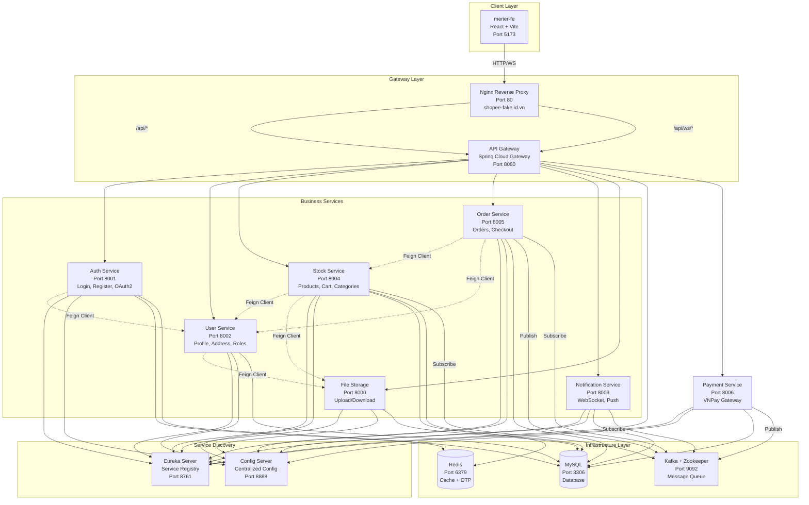

### Chi Tiết Các Microservice

| Service | Port | Nhiệm Vụ | Database | Message Queue | Cache |
|---------|------|----------|----------|---------------|-------|
| **config-server** | 8888 | Quản lý cấu hình tập trung cho tất cả services | N/A | N/A | N/A |
| **eureka-server** | 8761 | Service Discovery & Registry | N/A | N/A | N/A |
| **gateway** | 8080 | API Gateway, Routing, Load Balancing | N/A | N/A | N/A |
| **auth-service** | 8001 | Xác thực, Đăng ký, Login, Google OAuth2, OTP | MySQL (users via Feign) | N/A | Redis (OTP) |
| **user-service** | 8002 | Quản lý người dùng, địa chỉ, shop owner, role requests | MySQL (users, addresses, role_requests, shop_owners) | N/A | N/A |
| **stock-service** | 8004 | Quản lý sản phẩm, danh mục, size, giỏ hàng | MySQL (products, categories, sizes, carts, cart_items) | Kafka (order topic) | Redis (cart) |
| **order-service** | 8005 | Xử lý đơn hàng, checkout, đồng bộ tồn kho | MySQL (orders, order_items) | Kafka (order topic, notification topic) | N/A |
| **notification-service** | 8009 | Thông báo realtime qua WebSocket, Chat, lưu trữ notifications | MySQL (notifications, conversations, messages) | Kafka (notification topic) | N/A |
| **payment-service** | 8006 | Xử lý thanh toán VNPay, tạo payment URL, xử lý callback | MySQL (payments) | Kafka (payment-topic) | N/A |
| **file-storage** | 8000 | Upload/Download file (avatar, product images) | MySQL (files) | N/A | N/A |
| **merier-fe** | 5173 | Giao diện người dùng (React SPA) | N/A | N/A | LocalStorage |

---

## 🎯 CHỨC NĂNG THEO ACTOR

Phần này mô tả chi tiết các chức năng mà từng actor có thể thực hiện trong hệ thống, được tổ chức theo vai trò để dễ tra cứu và phát triển.

---

## 👥 PHÂN TÍCH ACTORS (NGƯỜI DÙNG)

### Sơ Đồ Actors

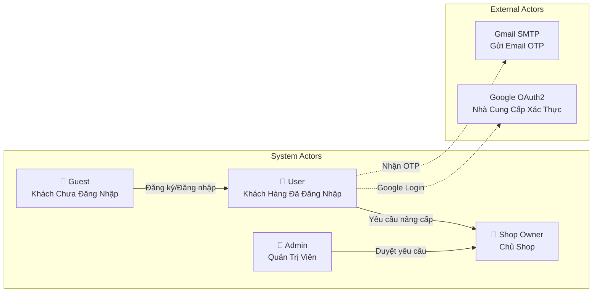

### Chi Tiết Vai Trò

#### 1. Guest (Khách Chưa Đăng Nhập)
**Quyền hạn:**
- ✅ Xem danh sách sản phẩm
- ✅ Tìm kiếm sản phẩm
- ✅ Xem chi tiết sản phẩm
- ✅ Xem thông tin shop
- ✅ Đăng ký tài khoản mới
- ✅ Đăng nhập (Email/Password hoặc Google)

**Hạn chế:**
- ❌ Không thể thêm giỏ hàng
- ❌ Không thể đặt hàng
- ❌ Không thể theo dõi đơn hàng

#### 2. User / Client (Khách Hàng Đã Đăng Nhập)
**Quyền hạn:**
- ✅ Tất cả quyền của Guest
- ✅ Quản lý hồ sơ cá nhân
- ✅ Quản lý sổ địa chỉ
- ✅ Thêm/Sửa/Xóa giỏ hàng
- ✅ Đặt hàng (Checkout) - COD hoặc VNPay
- ✅ Theo dõi đơn hàng
- ✅ Hủy đơn hàng (nếu status = PENDING)
- ✅ Nhận thông báo realtime
- ✅ Chat với Shop Owner về sản phẩm
- ✅ Yêu cầu nâng cấp lên Shop Owner
- ✅ Upload avatar
- ✅ Xem lịch sử đơn hàng và chi tiết

#### 3. Shop Owner (Chủ Shop)
**Quyền hạn:**
- ✅ Tất cả quyền của User (có thể mua hàng như khách hàng)
- ✅ Quản lý thông tin shop (tên, logo, địa chỉ, verified status)
- ✅ Tạo/Sửa/Xóa sản phẩm
- ✅ Quản lý tồn kho (sizes, stock)
- ✅ Xem đơn hàng thuộc sản phẩm của mình (phân trang, filter theo status)
- ✅ Cập nhật trạng thái đơn hàng (PENDING → PROCESSING → SHIPPED)
- ✅ Nhận thông báo khi có đơn hàng mới
- ✅ Chat với khách hàng về sản phẩm
- ✅ Upload logo shop và ảnh sản phẩm
- ✅ Xem thống kê shop (số sản phẩm, rating trung bình)

**Lưu ý:**
- Cần được Admin duyệt từ Role Request
- Một User có thể vừa là khách hàng vừa là chủ shop

#### 4. Admin (Quản Trị Viên)
**Quyền hạn:**
- ✅ Quản lý tất cả người dùng (xem, cập nhật, xóa, vô hiệu hóa)
- ✅ Duyệt/Từ chối Role Requests (nâng cấp Shop Owner)
- ✅ Quản lý danh mục sản phẩm (CRUD categories)
- ✅ Giám sát tất cả đơn hàng trong hệ thống
- ✅ Cập nhật trạng thái đơn hàng (xử lý khiếu nại)
- ✅ Vô hiệu hóa/Kích hoạt tài khoản
- ✅ Xem thống kê hệ thống
- ✅ Quản lý toàn bộ sản phẩm (nếu cần)

---

## 🎯 CHỨC NĂNG CHI TIẾT THEO ACTOR

### 👤 CLIENT / USER (Khách Hàng)

#### 1. Xác Thực & Tài Khoản

**1.1. Đăng Ký Tài Khoản**
- **API:** `POST /v1/auth/register`
- **Service:** Auth Service → User Service
- **Flow:**
  1. User điền form: email, password, tên, số điện thoại
  2. Validate email format, password strength
  3. Kiểm tra email đã tồn tại chưa
  4. Hash password với BCrypt
  5. Tạo User với role USER
  6. Tự động đăng nhập và trả về JWT token

**1.2. Đăng Nhập Email/Password**
- **API:** `POST /v1/auth/login`
- **Service:** Auth Service
- **Flow:**
  1. User nhập email và password
  2. Verify credentials
  3. Tạo JWT token (exp: 24h)
  4. Trả về token + user info
  5. Frontend lưu token vào LocalStorage

**1.3. Đăng Nhập Google OAuth2**
- **API:** `POST /v1/auth/login/google`
- **Service:** Auth Service → User Service
- **Flow:**
  1. Redirect đến Google consent screen
  2. User chọn tài khoản Google
  3. Google redirect về với authorization code
  4. Verify code với Google API
  5. Lấy email, tên từ Google
  6. Tạo user mới nếu chưa tồn tại
  7. Tạo JWT token và redirect về trang chủ

**1.4. Quên Mật Khẩu (OTP)**
- **APIs:** 
  - `POST /v1/auth/forgotPassword` - Gửi OTP
  - `POST /v1/auth/verifyOtp` - Xác thực OTP
  - `POST /v1/auth/updatePassword` - Đặt lại mật khẩu
- **Service:** Auth Service
- **Flow:**
  1. User nhập email
  2. Tạo OTP 6 chữ số, lưu vào Redis (TTL 5 phút)
  3. Gửi email OTP qua Gmail SMTP
  4. User nhập OTP → Verify
  5. User nhập mật khẩu mới → Hash và cập nhật

**1.5. Quản Lý Hồ Sơ Cá Nhân**
- **APIs:**
  - `GET /v1/user/information` - Lấy thông tin
  - `PUT /v1/user/update` - Cập nhật (có thể upload avatar)
- **Service:** User Service → File Storage (nếu upload avatar)
- **Thông tin có thể cập nhật:** Tên, email, phone, giới tính, ngày sinh, avatar

**1.6. Đổi Mật Khẩu**
- **API:** `PUT /v1/user/change-password`
- **Service:** User Service
- **Flow:** User nhập mật khẩu cũ và mật khẩu mới → Verify → Update

#### 2. Quản Lý Địa Chỉ

**2.1. Xem Danh Sách Địa Chỉ**
- **API:** `GET /v1/user/address/getAllAddresses`
- **Service:** User Service
- **Response:** Danh sách địa chỉ với thông tin: tên người nhận, SĐT, địa chỉ đầy đủ, isDefault

**2.2. Thêm Địa Chỉ Mới**
- **API:** `POST /v1/user/address/save`
- **Service:** User Service
- **Thông tin cần:** Tên người nhận, SĐT, tỉnh/thành, quận/huyện, phường/xã, địa chỉ cụ thể, lat/long (optional)

**2.3. Sửa Địa Chỉ**
- **API:** `PUT /v1/user/address/update`
- **Service:** User Service

**2.4. Xóa Địa Chỉ**
- **API:** `DELETE /v1/user/address/deleteAddressById/{id}`
- **Service:** User Service

**2.5. Đặt Địa Chỉ Mặc Định**
- **API:** `PUT /v1/user/address/setDefault/{id}`
- **Service:** User Service
- **Flow:** Set isDefault = true cho địa chỉ được chọn, false cho các địa chỉ khác

#### 3. Mua Sắm

**3.1. Xem Danh Sách Sản Phẩm**
- **API:** `GET /v1/stock/product/search?keyword={keyword}&page={page}&size={size}`
- **Service:** Stock Service
- **Features:** Tìm kiếm, phân trang, filter theo category, giá

**3.2. Xem Chi Tiết Sản Phẩm**
- **API:** `GET /v1/stock/product/getProductById/{id}`
- **Service:** Stock Service → User Service (lấy thông tin shop)
- **Thông tin hiển thị:** Tên, mô tả, giá, discount, sizes, stock, thông tin shop owner

**3.3. Thêm Vào Giỏ Hàng**
- **API:** `POST /v1/stock/cart/item/add`
- **Service:** Stock Service
- **Flow:**
  1. User chọn size và số lượng
  2. Kiểm tra tồn kho
  3. Tạo/Update cart item
  4. Tính lại total_amount
  5. Lưu vào MySQL và đồng bộ Redis cache

**3.4. Xem Giỏ Hàng**
- **API:** `GET /v1/stock/cart/getCartByUserId`
- **Service:** Stock Service
- **Response:** Danh sách items với thông tin sản phẩm, size, số lượng, giá

**3.5. Cập Nhật Số Lượng Trong Giỏ**
- **API:** `PUT /v1/stock/cart/item/update`
- **Service:** Stock Service

**3.6. Xóa Item Khỏi Giỏ**
- **API:** `DELETE /v1/stock/cart/item/remove/{cartItemId}`
- **Service:** Stock Service

#### 4. Đặt Hàng & Thanh Toán

**4.1. Đặt Hàng COD (Cash on Delivery)**
- **API:** `POST /v1/order/create-from-cart`
- **Service:** Order Service → Stock Service → Notification Service (via Kafka)
- **Flow:**
  1. User chọn địa chỉ giao hàng
  2. Chọn paymentMethod = "COD"
  3. Order Service tạo Order với status = PENDING
  4. Publish Kafka event lên `order-topic`
  5. Stock Service nhận event → Giảm stock, xóa cart items
  6. Notification Service tạo thông báo cho user và shop owner

**4.2. Đặt Hàng VNPay (Online Payment)**

**Bước 1: Tạo Payment Request**
- **API:** `POST /v1/payment/vnpay/create`
- **Service:** Payment Service
- **Request Body:**
  ```json
  {
    "amount": 100000,
    "userId": "uuid",
    "addressId": "uuid",
    "orderDataJson": "{\"selectedItems\": [...]}",
    "orderInfo": "Thanh toan don hang",
    "bankCode": "VNBANK",
    "locale": "vn",
    "returnUrl": "http://localhost:5173/payment/vnpay/return"
  }
  ```
- **Flow:**
  1. Frontend tính tổng tiền từ cart
  2. Gửi request đến Payment Service với:
     - `amount`: Tổng tiền (VND)
     - `userId`, `addressId`: Thông tin user và địa chỉ
     - `orderDataJson`: JSON string chứa selectedItems (để tạo order sau)
  3. Payment Service:
     - Tạo `txnRef` unique (12 chữ số)
     - Build VNPay payment URL với các params
     - Tạo secure hash
     - Lưu Payment với status = PENDING, method = VNPAY
     - `orderId` = null (chưa có order)
  4. Response: `{ code: "00", message: "success", paymentUrl: "...", txnRef: "..." }`
  5. Frontend redirect user đến `paymentUrl`

**Bước 2: User Thanh Toán tại VNPay**
- User nhập thông tin thẻ/ngân hàng tại VNPay gateway
- Xác nhận thanh toán
- VNPay redirect về `returnUrl` với query params

**Bước 3: Xử Lý Callback**
- **API:** `GET /v1/payment/vnpay/return?vnp_ResponseCode=00&vnp_TxnRef=...&vnp_SecureHash=...`
- **Service:** Payment Service
- **Flow:**
  1. Payment Service nhận callback từ VNPay
  2. Verify secure hash
  3. Parse callback parameters:
     - `vnp_ResponseCode`: "00" = thành công
     - `vnp_TxnRef`: Transaction reference
     - `vnp_Amount`: Số tiền
     - `vnp_BankCode`: Mã ngân hàng
     - `vnp_TransactionNo`: Mã giao dịch gateway
  4. Update Payment:
     - `status` = PAID (nếu thành công) hoặc FAILED
     - `responseCode`, `gatewayTxnNo`, `bankCode`, `cardType`
     - `rawCallback`: Lưu toàn bộ params dạng JSON
  5. **Publish Kafka event** lên `payment-topic`:
     ```json
     {
       "paymentId": "uuid",
       "txnRef": "string",
       "orderId": null,
       "status": "PAID",
       "method": "VNPAY",
       "userId": "uuid",
       "addressId": "uuid",
       "orderDataJson": "string"
     }
     ```

**Bước 4: Tạo Order từ Payment**
- **Service:** Order Service (Kafka Consumer)
- **Flow:**
  1. Order Service nhận PaymentEvent từ Kafka
  2. Kiểm tra `status = "PAID"`
  3. Parse `orderDataJson` → `selectedItems`
  4. Gọi `createOrderFromPayment()`:
     - Validate address, stock
     - Tạo Order với:
       - `orderStatus` = PENDING
       - `paymentMethod` = "VNPAY"
     - Tạo OrderItems và giảm stock
     - Cleanup cart
     - Gửi notifications
  5. Update Payment với `orderId` (link Payment với Order)
  6. Frontend nhận thông báo "Đặt hàng thành công"

**Đặc Điểm:**
- ✅ Order chỉ được tạo **SAU KHI thanh toán thành công**
- ✅ Payment được tạo trước với `orderId = null`
- ✅ Có Payment record với status = PAID
- ✅ Payment và Order được link qua orderId

**4.3. Xem Lịch Sử Đơn Hàng**
- **API:** `GET /v1/order/getOrderByUserId`
- **Service:** Order Service → Stock Service (lấy thông tin sản phẩm) → User Service (lấy địa chỉ)
- **Response:** Danh sách orders với: mã đơn, ngày đặt, tổng tiền, trạng thái, danh sách sản phẩm

**4.4. Xem Chi Tiết Đơn Hàng**
- **API:** `GET /v1/order/getOrderById/{id}`
- **Service:** Order Service
- **Thông tin:** Sản phẩm, số lượng, giá, địa chỉ giao hàng, lịch sử trạng thái

**4.5. Hủy Đơn Hàng**
- **API:** `PUT /v1/order/cancel/{orderId}`
- **Service:** Order Service
- **Điều kiện:** Chỉ được hủy nếu status = PENDING
- **Flow:** Update status = CANCELLED, rollback stock

**4.6. Tính Phí Vận Chuyển (GHN)**
- **API:** `POST /v1/order/calculate-shipping-fee`
- **Service:** Order Service → GHN API
- **Flow:**
  1. User chọn địa chỉ giao hàng
  2. Frontend gửi request với addressId và danh sách items
  3. Order Service lấy thông tin địa chỉ (cần có GHN fields: province, district, ward)
  4. Gọi GHN API để tính phí vận chuyển
  5. Trả về shipping fee
- **Lưu ý:** Địa chỉ cần có đầy đủ thông tin GHN (province, district, ward) để tính phí

#### 5. Review & Rating Sản Phẩm

**5.1. Tạo Review/Đánh Giá Sản Phẩm**
- **API:** `POST /v1/stock/reviews`
- **Service:** Stock Service → File Storage (nếu upload ảnh)
- **Thông tin cần:**
  - `productId`: ID sản phẩm
  - `userId`: ID người dùng
  - `username`: Tên người dùng (cache)
  - `userAvatar`: Avatar người dùng (optional)
  - `rating`: Điểm đánh giá (1-5 sao)
  - `comment`: Nội dung đánh giá
  - `imageIds`: Danh sách ID ảnh (optional, upload trước qua File Storage)
- **Flow:**
  1. User đã mua sản phẩm (có thể kiểm tra order history)
  2. User điền form: chọn số sao (1-5), viết comment, upload ảnh (nếu có)
  3. Upload ảnh lên File Storage → Nhận imageIds
  4. Tạo Review entity và lưu vào database
  5. Review được hiển thị trên trang sản phẩm

**5.2. Xem Danh Sách Review Của Sản Phẩm**
- **API:** `GET /v1/stock/reviews/product/{productId}`
- **Service:** Stock Service
- **Response:** Danh sách reviews với:
  - Username, avatar
  - Rating (số sao)
  - Comment
  - Ảnh đính kèm (nếu có)
  - Ngày đánh giá
- **Sắp xếp:** Mới nhất trước

**5.3. Đếm Số Review Của Shop**
- **API:** `GET /v1/stock/reviews/count/shop/{shopId}`
- **Service:** Stock Service
- **Response:** Tổng số reviews của tất cả sản phẩm trong shop
- **Mục đích:** Hiển thị số lượng đánh giá trên trang shop

**5.4. Tính Rating Trung Bình Của Shop**
- **API:** `GET /v1/stock/product/public/shop/{shopId}/stats`
- **Service:** Stock Service
- **Response:** 
  - `productCount`: Số lượng sản phẩm
  - `avgRating`: Rating trung bình (tính từ tất cả reviews của shop)
- **Mục đích:** Hiển thị rating trung bình trên trang shop

#### 6. Thông Báo & Chat

**5.1. Nhận Thông Báo Realtime**
- **API:** `WS /ws/notifications`
- **Service:** Notification Service
- **Flow:**
  1. User login → Frontend establish WebSocket connection
  2. Subscribe vào `/user/queue/notifications`
  3. Khi có event từ Kafka → Push qua WebSocket
  4. Frontend hiển thị toast notification và cập nhật badge

**5.2. Xem Danh Sách Thông Báo**
- **API:** `GET /v1/notifications/getAllByUserId`
- **Service:** Notification Service
- **Response:** Danh sách notifications với is_read flag

**5.3. Đánh Dấu Đã Đọc**
- **API:** `PUT /v1/notifications/markAsRead/{notificationId}`
- **Service:** Notification Service

**5.4. Chat Với Shop Owner**
- **APIs:**
  - `POST /v1/notifications/chat/conversations/start` - Bắt đầu conversation
  - `GET /v1/notifications/chat/conversations` - Lấy danh sách conversations
  - `GET /v1/notifications/chat/conversations/{id}/messages` - Lấy messages
  - `POST /v1/notifications/chat/messages` - Gửi message
  - `PUT /v1/notifications/chat/conversations/{id}/read` - Đánh dấu đã đọc
- **Service:** Notification Service
- **WebSocket:** `/topic/conversation/{conversationId}/messages`
- **Flow:** Client có thể chat với shop owner về sản phẩm, realtime qua WebSocket

#### 6. Yêu Cầu Nâng Cấp Shop Owner

**6.1. Gửi Yêu Cầu**
- **API:** `POST /v1/user/role-requests`
- **Service:** User Service
- **Flow:**
  1. User điền form: lý do, tên shop dự định
  2. Tạo RoleRequest với status = PENDING
  3. Admin sẽ nhận được yêu cầu để duyệt

---

### 🏪 SHOP OWNER (Chủ Shop)

#### 1. Quản Lý Shop

**1.1. Xem Thông Tin Shop**
- **API:** `GET /v1/user/shop-owners`
- **Service:** User Service
- **Thông tin:** Tên shop, logo, địa chỉ, verified status, followers, ratings

**1.2. Cập Nhật Thông Tin Shop**
- **API:** `PUT /v1/user/shop-owners`
- **Service:** User Service → File Storage (nếu upload logo)
- **Có thể cập nhật:** Tên shop, địa chỉ, logo

**1.3. Xem Thống Kê Shop**
- **API:** `GET /v1/stock/product/public/shop/{shopId}/stats`
- **Service:** Stock Service
- **Response:** Số lượng sản phẩm, rating trung bình

#### 2. Quản Lý Sản Phẩm

**2.1. Tạo Sản Phẩm**
- **API:** `POST /v1/stock/product/create`
- **Service:** Stock Service → File Storage (upload ảnh)
- **Thông tin cần:**
  - Tên, mô tả, category
  - Giá gốc, giá bán, % discount
  - Upload ảnh sản phẩm
  - Sizes/variants: tên size, tồn kho, price modifier
- **Flow:**
  1. Upload ảnh lên File Storage → Nhận imageId
  2. Tạo Product entity
  3. Tạo Size entities liên kết

**2.2. Xem Danh Sách Sản Phẩm Của Shop**
- **API:** `GET /v1/stock/product/getProductByUserId`
- **Service:** Stock Service
- **Response:** Danh sách sản phẩm với thông tin đầy đủ

**2.3. Sửa Sản Phẩm**
- **API:** `PUT /v1/stock/product/update`
- **Service:** Stock Service → File Storage (nếu upload ảnh mới)
- **Có thể cập nhật:** Tất cả thông tin sản phẩm

**2.4. Xóa Sản Phẩm**
- **API:** `DELETE /v1/stock/product/deleteProductById/{id}`
- **Service:** Stock Service
- **Flow:** Xóa product và các sizes liên quan (cascade)

#### 3. Quản Lý Tồn Kho

**3.1. Xem Tồn Kho**
- **API:** `GET /v1/stock/product/getProductByUserId` (kèm sizes)
- **Service:** Stock Service
- **Hiển thị:** Danh sách sản phẩm với tồn kho theo từng size

**3.2. Cập Nhật Tồn Kho**
- **API:** `PUT /v1/stock/size/update`
- **Service:** Stock Service
- **Flow:**
  1. Shop owner chọn size cần cập nhật
  2. Nhập số lượng mới
  3. Cập nhật `sizes.stock`
  4. Cảnh báo nếu stock < 10
  5. Tự động ẩn sản phẩm nếu tất cả sizes đều hết hàng

**3.3. Thêm Size Mới**
- **API:** `POST /v1/stock/size/create`
- **Service:** Stock Service

**3.4. Xóa Size**
- **API:** `DELETE /v1/stock/size/delete/{id}`
- **Service:** Stock Service

#### 4. Quản Lý Đơn Hàng

**4.1. Xem Đơn Hàng Của Shop**
- **API:** `GET /v1/order/shop-owner/orders?status={status}&pageNo={page}&pageSize={size}`
- **Service:** Order Service
- **Response:** Danh sách orders có chứa sản phẩm của shop (phân trang)
- **Filter:** Có thể filter theo status (PENDING, PROCESSING, SHIPPED, DELIVERED)

**4.2. Xem Chi Tiết Đơn Hàng**
- **API:** `GET /v1/order/getOrderById/{id}`
- **Service:** Order Service
- **Thông tin:** Chỉ hiển thị items thuộc sản phẩm của shop, thông tin khách hàng

**4.3. Cập Nhật Trạng Thái Đơn Hàng**
- **API:** `PUT /v1/order/updateStatus/{orderId}?status={status}`
- **Service:** Order Service → Notification Service (via Kafka)
- **Flow:**
  1. Shop owner cập nhật status (PENDING → PROCESSING → SHIPPED)
  2. Khi status = PROCESSING → Tự động tạo vận đơn GHN (nếu có địa chỉ GHN)
  3. Notification Service gửi thông báo cho user
  4. User nhận thông báo realtime qua WebSocket

**4.4. Xem Thống Kê Đơn Hàng**
- **API:** `GET /v1/order/shop-owner/stats`
- **Service:** Order Service
- **Response:** 
  - Số đơn theo status (pending, processing, shipped, delivered, cancelled, returned)
  - Doanh thu hôm nay (salesToday)
  - Đơn chờ lấy hàng (waitingForPickup)
  - Đơn đã xử lý (processed)

**4.5. Xem Analytics Chi Tiết**
- **API:** `GET /v1/order/shop-owner/analytics`
- **Service:** Order Service
- **Response:** 
  - Tổng doanh thu
  - Số đơn hàng
  - Số sản phẩm đã bán
  - Biểu đồ theo thời gian (có thể mở rộng)

**4.6. Xem Dashboard Stats**
- **API:** `GET /v1/order/shop-owner/dashboard-stats`
- **Service:** Order Service
- **Response:** Thống kê tổng quan cho dashboard shop owner

#### 5. Quản Lý Vận Chuyển (GHN)

**5.1. Tính Phí Vận Chuyển**
- **API:** `POST /v1/order/calculate-shipping-fee`
- **Service:** Order Service → GHN API
- **Flow:**
  1. Shop owner hoặc client chọn địa chỉ giao hàng
  2. Gửi request với addressId và danh sách items (weight, quantity)
  3. Order Service:
     - Lấy thông tin địa chỉ (cần có GHN fields: province, district, ward)
     - Lấy địa chỉ shop owner (cần có GHN fields)
     - Gọi GHN API để tính phí vận chuyển
  4. Trả về shipping fee
- **Lưu ý:** 
  - Địa chỉ cần có đầy đủ thông tin GHN (province, district, ward)
  - Shop owner cần cấu hình địa chỉ GHN trong Settings

**5.2. Tạo Vận Đơn GHN Tự Động**
- **Service:** Order Service (tự động khi order status = PROCESSING)
- **Flow:**
  1. Khi shop owner cập nhật order status = PROCESSING
  2. Order Service tự động:
     - Lấy thông tin địa chỉ khách hàng và shop owner
     - Validate GHN fields
     - Tính tổng weight từ order items
     - Gọi GHN API để tạo vận đơn
     - Lưu ShippingOrder vào database với:
       - `ghnOrderCode`: Mã vận đơn GHN
       - `shippingFee`: Phí vận chuyển
       - `expectedDeliveryTime`: Thời gian dự kiến giao hàng
  3. Nếu thiếu GHN fields → Bỏ qua, log warning
- **API GHN:** `POST https://dev-online-gateway.ghn.vn/shiip/public-api/v2/shipping-order/create`

**5.3. Xem Thông Tin Vận Đơn**
- **API:** `GET /v1/order/getOrderById/{id}` (kèm shippingFee trong OrderDto)
- **Service:** Order Service
- **Response:** OrderDto có thêm:
  - `shippingFee`: Phí vận chuyển từ GHN
  - `shippingAddress`: Địa chỉ giao hàng đầy đủ

#### 5. Chat Với Khách Hàng

**5.1. Xem Danh Sách Conversations**
- **API:** `GET /v1/notifications/chat/conversations`
- **Service:** Notification Service
- **Response:** Danh sách conversations với khách hàng, sản phẩm liên quan

**5.2. Xem Messages Của Conversation**
- **API:** `GET /v1/notifications/chat/conversations/{id}/messages`
- **Service:** Notification Service

**5.3. Gửi Message**
- **API:** `POST /v1/notifications/chat/messages`
- **Service:** Notification Service
- **WebSocket:** Push realtime đến client

**5.4. Đánh Dấu Đã Đọc**
- **API:** `PUT /v1/notifications/chat/conversations/{id}/read`
- **Service:** Notification Service

#### 6. Thông Báo

**6.1. Nhận Thông Báo Đơn Hàng Mới**
- **API:** `WS /ws/notifications`
- **Service:** Notification Service
- **Flow:** Tự động nhận thông báo khi có đơn hàng mới qua WebSocket

**6.2. Xem Danh Sách Thông Báo Shop**
- **API:** `GET /v1/notifications/getAllByShopId`
- **Service:** Notification Service
- **Response:** Danh sách notifications với flag `is_shop_owner_notification = true`

**6.3. Đánh Dấu Đã Đọc**
- **API:** `PUT /v1/notifications/markAsRead/{notificationId}`
- **Service:** Notification Service

---

### 👑 ADMIN (Quản Trị Viên)

#### 1. Quản Lý Người Dùng

**1.1. Xem Danh Sách Tất Cả Users**
- **API:** `GET /v1/user/getAll`
- **Service:** User Service
- **Response:** Danh sách users với: ID, username, email, roles, status, ngày đăng ký

**1.2. Xem Chi Tiết User**
- **API:** `GET /v1/user/getUserForAdminByUserId/{id}`
- **Service:** User Service
- **Thông tin:** Đầy đủ thông tin user, orders, activities, shop info (nếu có)

**1.3. Cập Nhật User**
- **API:** `PUT /v1/user/update`
- **Service:** User Service
- **Có thể cập nhật:** Thông tin user, roles, status (ACTIVE/INACTIVE)

**1.4. Vô Hiệu Hóa/Kích Hoạt Tài Khoản**
- **API:** `PUT /v1/user/update` (với active = INACTIVE/ACTIVE)
- **Service:** User Service
- **Flow:** Set `active = INACTIVE` → User không thể login

**1.5. Xóa User**
- **API:** `DELETE /v1/user/deleteUserById/{id}`
- **Service:** User Service
- **Lưu ý:** Có thể soft delete hoặc hard delete (cascade)

#### 2. Quản Lý Role Requests

**2.1. Xem Danh Sách Role Requests**
- **API:** `GET /v1/user/role-requests`
- **Service:** User Service
- **Response:** Danh sách requests với status = PENDING
- **Thông tin:** Tên user, email, lý do, ngày gửi

**2.2. Duyệt Role Request**
- **API:** `PUT /v1/user/role-requests/approve/{id}`
- **Service:** User Service
- **Flow:**
  1. Cập nhật `role_requests.status = APPROVED`
  2. Thêm role SHOP_OWNER vào `user_roles`
  3. Tạo ShopOwner entity
  4. Lưu `reviewed_by = admin_id`, `reviewed_at = now()`
  5. User login lại → Có quyền shop owner

**2.3. Từ Chối Role Request**
- **API:** `PUT /v1/user/role-requests/reject/{id}`
- **Service:** User Service
- **Flow:**
  1. Cập nhật `role_requests.status = REJECTED`
  2. Lưu `rejection_reason`
  3. User thấy thông báo bị từ chối với lý do

#### 3. Quản Lý Categories

**3.1. Xem Danh Sách Categories**
- **API:** `GET /v1/stock/category/getAll`
- **Service:** Stock Service
- **Response:** Danh sách categories với: ID, tên, mô tả, số lượng products

**3.2. Tạo Category Mới**
- **API:** `POST /v1/stock/category/create`
- **Service:** Stock Service
- **Thông tin:** Tên, mô tả

**3.3. Sửa Category**
- **API:** `PUT /v1/stock/category/update`
- **Service:** Stock Service

**3.4. Xóa Category**
- **API:** `DELETE /v1/stock/category/delete/{id}`
- **Service:** Stock Service
- **Điều kiện:** Chỉ được phép nếu không có product nào thuộc category

#### 4. Giám Sát Đơn Hàng

**4.1. Xem Tất Cả Đơn Hàng**
- **API:** `GET /v1/order/getAllOrders?status={status}`
- **Service:** Order Service
- **Response:** Tất cả orders trong hệ thống
- **Filter:** Có thể filter theo status, date range, user, shop

**4.2. Xem Chi Tiết Đơn Hàng**
- **API:** `GET /v1/order/getOrderById/{id}`
- **Service:** Order Service

**4.3. Cập Nhật Trạng Thái Đơn Hàng**
- **API:** `PUT /v1/order/updateStatus/{orderId}?status={status}`
- **Service:** Order Service
- **Mục đích:** Xử lý khiếu nại, can thiệp khi cần

**4.4. Hủy Đơn Hàng**
- **API:** `PUT /v1/order/cancel/{orderId}`
- **Service:** Order Service
- **Mục đích:** Hủy đơn nếu có vấn đề

#### 5. Thống Kê Hệ Thống

**5.1. Dashboard Thống Kê**
- **APIs:** (Cần bổ sung)
  - Tổng đơn hàng hôm nay
  - Doanh thu
  - Đơn pending cần xử lý
  - Chart theo thời gian
- **Service:** Order Service, User Service

---

## 📐 USE CASE DIAGRAM

### Use Case Tổng Quan

```mermaid
graph TB
    subgraph "Guest Use Cases"
        UC1[Xem Sản Phẩm]
        UC2[Tìm Kiếm Sản Phẩm]
        UC3[Xem Chi Tiết Sản Phẩm]
        UC4[Đăng Ký Tài Khoản]
        UC5[Đăng Nhập]
        UC6[Đăng Nhập Google]
        UC7[Quên Mật Khẩu]
    end

    subgraph "User Use Cases"
        UC8[Quản Lý Hồ Sơ]
        UC9[Quản Lý Địa Chỉ]
        UC10[Thêm Giỏ Hàng]
        UC11[Đặt Hàng]
        UC12[Theo Dõi Đơn Hàng]
        UC13[Nhận Thông Báo]
        UC14[Yêu Cầu Nâng Cấp Shop]
    end

    subgraph "Shop Owner Use Cases"
        UC15[Quản Lý Shop]
        UC16[Tạo Sản Phẩm]
        UC17[Cập Nhật Tồn Kho]
        UC18[Xem Đơn Hàng Shop]
    end

    subgraph "Admin Use Cases"
        UC19[Duyệt Role Request]
        UC20[Quản Lý Users]
        UC21[Quản Lý Categories]
        UC22[Giám Sát Đơn Hàng]
    end

    GUEST[👤 Guest] --> UC1
    GUEST --> UC2
    GUEST --> UC3
    GUEST --> UC4
    GUEST --> UC5
    GUEST --> UC6
    GUEST --> UC7

    USER[👤 User] --> UC8
    USER --> UC9
    USER --> UC10
    USER --> UC11
    USER --> UC12
    USER --> UC13
    USER --> UC14

    SHOP[🏪 Shop Owner] --> UC15
    SHOP --> UC16
    SHOP --> UC17
    SHOP --> UC18

    ADMIN[👑 Admin] --> UC19
    ADMIN --> UC20
    ADMIN --> UC21
    ADMIN --> UC22

    UC6 -.include.-> GOOGLE[Google OAuth2]
    UC7 -.include.-> SMTP[Gmail SMTP]
    UC11 -.include.-> KAFKA[Kafka Event]
    UC13 -.include.-> WS[WebSocket]
```

### Use Case Chi Tiết Theo Actor

#### 🎭 GUEST (Khách Chưa Đăng Nhập)

Guest là người dùng truy cập website nhưng chưa đăng nhập. Họ có thể xem sản phẩm nhưng không thể thực hiện giao dịch.

**UC1: Xem Danh Sách Sản Phẩm**
- **Trigger:** Guest truy cập trang chủ hoặc trang danh mục
- **Flow:**
  1. Guest mở website
  2. Hệ thống hiển thị danh sách sản phẩm từ database
  3. Sản phẩm được sắp xếp theo mới nhất/phổ biến
  4. Hiển thị ảnh, tên, giá, discount
- **API:** `GET /v1/stock/product`
- **Service:** Stock Service

**UC2: Tìm Kiếm Sản Phẩm**
- **Trigger:** Guest nhập từ khóa vào ô tìm kiếm
- **Flow:**
  1. Guest nhập keyword (VD: "áo thun")
  2. Frontend gửi request với keyword
  3. Stock Service tìm kiếm trong database (LIKE %keyword%)
  4. Trả về danh sách sản phẩm phù hợp
  5. Guest có thể filter theo giá, category
- **API:** `GET /v1/stock/product?keyword={keyword}`
- **Service:** Stock Service

**UC3: Xem Chi Tiết Sản Phẩm**
- **Trigger:** Guest click vào 1 sản phẩm
- **Flow:**
  1. Guest click sản phẩm
  2. Hiển thị thông tin đầy đủ: mô tả, giá, sizes, stock
  3. Hiển thị thông tin shop owner
  4. Nếu click "Thêm vào giỏ" → Redirect đến trang đăng nhập
- **API:** `GET /v1/stock/product/{id}`
- **Service:** Stock Service → User Service (lấy thông tin shop)

**UC4: Đăng Ký Tài Khoản**
- **Trigger:** Guest click "Đăng ký"
- **Flow:**
  1. Guest điền form: email, password, tên, số điện thoại
  2. Validate form (email format, password strength)
  3. Auth Service kiểm tra email đã tồn tại chưa
  4. Hash password với BCrypt
  5. Tạo User entity với role USER
  6. Lưu vào database
  7. Tự động đăng nhập và tạo JWT token
- **API:** `POST /v1/auth/register`
- **Service:** Auth Service → User Service

**UC5: Đăng Nhập Email/Password**
- **Trigger:** Guest click "Đăng nhập"
- **Flow:**
  1. Guest nhập email và password
  2. Auth Service validate credentials
  3. So sánh password đã hash
  4. Tạo JWT token (exp: 24h)
  5. Trả về token + user info
  6. Frontend lưu token vào LocalStorage
- **API:** `POST /v1/auth/login`
- **Service:** Auth Service

**UC6: Đăng Nhập Google OAuth2**
- **Trigger:** Guest click "Login with Google"
- **Flow:**
  1. Redirect đến Google consent screen
  2. User chọn tài khoản Google
  3. Google redirect về với authorization code
  4. Auth Service verify code với Google API
  5. Lấy email, tên từ Google
  6. Kiểm tra user đã tồn tại → Nếu chưa thì tạo mới
  7. Tạo JWT token và redirect về trang chủ
- **API:** `POST /v1/auth/login/google`
- **Service:** Auth Service → User Service
- **External:** Google OAuth2 API

**UC7: Quên Mật Khẩu (OTP)**
- **Trigger:** Guest click "Quên mật khẩu"
- **Flow:**
  1. Guest nhập email
  2. Auth Service kiểm tra email tồn tại
  3. Tạo OTP 6 chữ số random
  4. Lưu OTP vào Redis với TTL 5 phút
  5. Gửi email chứa OTP qua Gmail SMTP
  6. Guest nhập OTP
  7. Verify OTP từ Redis
  8. Guest nhập mật khẩu mới
  9. Hash và cập nhật password
- **API:** `POST /v1/auth/forgot-password`, `POST /v1/auth/verify-otp`, `POST /v1/auth/reset-password`
- **Service:** Auth Service
- **External:** Gmail SMTP

---

#### 👤 USER / CLIENT (Khách Hàng Đã Đăng Nhập)

User là khách hàng đã đăng ký và đăng nhập. Họ có thể mua sắm, quản lý đơn hàng, và yêu cầu trở thành shop owner.

**UC8: Quản Lý Hồ Sơ Cá Nhân**
- **Trigger:** User vào trang "Tài khoản của tôi"
- **Flow:**
  1. User click "Hồ sơ"
  2. Hiển thị thông tin: tên, email, phone, giới tính, ngày sinh, avatar
  3. User chỉnh sửa thông tin
  4. Có thể upload avatar mới (gọi File Storage)
  5. User Service cập nhật database
  6. Thông báo "Cập nhật thành công"
- **API:** `GET /v1/user`, `PUT /v1/user/update`
- **Service:** User Service → File Storage (nếu upload avatar)

**UC9: Quản Lý Sổ Địa Chỉ**
- **Trigger:** User vào "Địa chỉ của tôi"
- **Flow:**
  1. Hiển thị danh sách địa chỉ đã lưu
  2. User có thể:
     - **Thêm địa chỉ mới:** Điền form (tên người nhận, SĐT, tỉnh/thành, quận/huyện, phường/xã, địa chỉ cụ thể)
     - **Sửa địa chỉ:** Cập nhật thông tin địa chỉ hiện có
     - **Xóa địa chỉ:** Xóa địa chỉ không dùng nữa
     - **Đặt mặc định:** Chọn 1 địa chỉ làm mặc định cho checkout
  3. User Service lưu vào bảng `addresses`
- **API:** `GET /v1/user/address`, `POST /v1/user/address`, `PUT /v1/user/address/{id}`, `DELETE /v1/user/address/{id}`
- **Service:** User Service

**UC10: Thêm Sản Phẩm Vào Giỏ Hàng**
- **Trigger:** User click "Thêm vào giỏ" ở trang sản phẩm
- **Flow:**
  1. User chọn size và số lượng
  2. Frontend kiểm tra user đã login chưa
  3. Gửi request đến Stock Service
  4. Stock Service kiểm tra tồn kho
  5. Nếu đủ hàng:
     - Kiểm tra cart của user có chưa → Tạo mới nếu chưa có
     - Kiểm tra item (product + size) đã có trong cart chưa
     - Nếu có → Cập nhật quantity
     - Nếu chưa → Thêm cart item mới
     - Tính lại total_amount
     - Lưu vào MySQL và đồng bộ Redis
  6. Thông báo "Đã thêm vào giỏ hàng"
- **API:** `POST /v1/stock/cart/add`
- **Service:** Stock Service
- **Cache:** Redis (cart cache)

**UC11: Đặt Hàng (Checkout)**
- **Trigger:** User ở trang giỏ hàng, click "Đặt hàng"
- **Flow:**
  1. User review giỏ hàng (sản phẩm, số lượng, giá)
  2. User chọn địa chỉ giao hàng
  3. User chọn phương thức thanh toán (hiện tại: COD)
  4. Click "Đặt hàng"
  5. Order Service:
     - Lấy cart từ Stock Service
     - Validate cart không rỗng
     - Tạo Order entity
     - Tạo Order Items từ Cart Items
     - Lưu vào database
     - **Publish Kafka event** lên `order-topic`
  6. **Kafka Event Processing:**
     - Stock Service nhận event → Giảm stock, xóa cart items
     - Order Service publish lên `notification-topic`
     - Notification Service tạo thông báo cho user và shop owner
  7. User nhận thông báo realtime "Đặt hàng thành công"
- **API:** `POST /v1/order/create-from-cart`
- **Service:** Order Service → Stock Service → Notification Service (via Kafka)
- **Message Queue:** Kafka

**UC12: Theo Dõi Đơn Hàng**
- **Trigger:** User vào "Đơn hàng của tôi"
- **Flow:**
  1. Order Service lấy danh sách orders của user
  2. Hiển thị: mã đơn, ngày đặt, tổng tiền, trạng thái
  3. User click vào 1 đơn → Xem chi tiết:
     - Danh sách sản phẩm
     - Địa chỉ giao hàng
     - Lịch sử trạng thái
  4. User có thể hủy đơn nếu status = PENDING
- **API:** `GET /v1/order/user`, `GET /v1/order/{id}`
- **Service:** Order Service → Stock Service (lấy thông tin sản phẩm) → User Service (lấy địa chỉ)
- **Order Statuses:** PENDING → PROCESSING → SHIPPED → DELIVERED / CANCELLED

**UC13: Nhận Thông Báo Realtime**
- **Trigger:** Tự động khi có event (đơn hàng mới, cập nhật trạng thái)
- **Flow:**
  1. User login → Frontend tự động establish WebSocket connection
  2. Connect đến: `ws://shopee-fake.id.vn/api/ws/notifications`
  3. Notification Service validate JWT token
  4. Subscribe vào queue: `/user/queue/notifications`
  5. Khi có event từ Kafka:
     - Notification Service tạo Notification entity
     - Lưu vào MySQL
     - Kiểm tra user online → Push qua WebSocket
  6. Frontend nhận message → Hiển thị toast notification
  7. Cập nhật badge count (số thông báo chưa đọc)
  8. User click icon notification → Hiển thị danh sách
  9. User click 1 notification → Mark as read
- **API:** `WS /ws/notifications`, `GET /v1/notifications/user`, `PUT /v1/notifications/mark-read/{id}`
- **Service:** Notification Service
- **Protocol:** WebSocket (STOMP)

**UC14: Yêu Cầu Nâng Cấp Lên Shop Owner**
- **Trigger:** User muốn bán hàng, click "Đăng ký bán hàng"
- **Flow:**
  1. User điền form:
     - Lý do muốn bán hàng
     - Tên shop dự định
     - Thông tin liên hệ
  2. User Service tạo RoleRequest entity
  3. Set status = PENDING
  4. Lưu vào bảng `role_requests`
  5. Thông báo "Yêu cầu đã được gửi, chờ Admin duyệt"
  6. Admin sẽ nhận được yêu cầu và xem xét
- **API:** `POST /v1/user/role-requests`
- **Service:** User Service

---

#### 🏪 SHOP OWNER (Chủ Shop)

Shop Owner là user đã được admin duyệt để bán hàng. Họ có thể quản lý shop và sản phẩm của mình.

**UC15: Quản Lý Thông Tin Shop**
- **Trigger:** Shop Owner vào "Quản lý shop"
- **Flow:**
  1. Hiển thị thông tin shop hiện tại:
     - Tên shop
     - Tên chủ shop
     - Địa chỉ shop
     - Logo shop
     - Verified status
     - Số lượng followers
     - Rating trung bình
  2. Shop owner có thể:
     - Cập nhật tên shop, địa chỉ
     - Upload logo mới
     - Xem thống kê (followers, views)
  3. User Service cập nhật bảng `shop_owners`
- **API:** `GET /v1/user/shop-owners`, `PUT /v1/user/shop-owners`
- **Service:** User Service → File Storage (upload logo)

**UC16: Tạo & Quản Lý Sản Phẩm**
- **Trigger:** Shop Owner vào "Sản phẩm của tôi" → "Thêm sản phẩm"
- **Flow Tạo Sản Phẩm:**
  1. Shop owner điền form:
     - Tên sản phẩm
     - Mô tả
     - Category
     - Giá gốc
     - Giá bán (có thể giảm)
     - % Discount (tự động tính)
     - Upload ảnh sản phẩm
     - Thêm sizes/variants:
       - Tên size (S, M, L hoặc 250ml, 500ml...)
       - Tồn kho
       - Giá điều chỉnh (nếu có)
  2. Upload ảnh lên File Storage → Nhận imageId
  3. Stock Service:
     - Tạo Product entity (user_id = shop owner id)
     - Tạo Size entities liên kết với product
     - Lưu vào database
  4. Thông báo "Tạo sản phẩm thành công"

- **Flow Sửa Sản Phẩm:**
  1. Shop owner click "Sửa" trên sản phẩm
  2. Load thông tin hiện tại
  3. Cho phép chỉnh sửa tất cả thông tin
  4. Cập nhật database

- **Flow Xóa Sản Phẩm:**
  1. Shop owner click "Xóa"
  2. Confirm dialog
  3. Xóa product và các sizes liên quan (cascade)

- **API:** `POST /v1/stock/product`, `PUT /v1/stock/product/{id}`, `DELETE /v1/stock/product/{id}`, `GET /v1/stock/product/user/{userId}`
- **Service:** Stock Service → File Storage

**UC17: Cập Nhật Tồn Kho**
- **Trigger:** Shop Owner cần cập nhật số lượng hàng
- **Flow:**
  1. Shop owner vào "Quản lý kho"
  2. Hiển thị danh sách sản phẩm với tồn kho theo size
  3. Shop owner click "Cập nhật" trên 1 size
  4. Nhập số lượng mới
  5. Stock Service cập nhật `sizes.stock`
  6. Hiển thị cảnh báo nếu stock < 10 (sắp hết)
  7. Tự động ẩn sản phẩm nếu tất cả sizes đều hết hàng (stock = 0)
- **API:** `PUT /v1/stock/size/{id}`
- **Service:** Stock Service

**UC18: Xem Đơn Hàng Của Shop**
- **Trigger:** Shop Owner vào "Đơn hàng"
- **Flow:**
  1. Order Service filter orders có chứa sản phẩm của shop owner
  2. Hiển thị danh sách đơn hàng:
     - Chỉ hiển thị items thuộc sản phẩm của shop
     - Mã đơn
     - Tên khách hàng
     - Sản phẩm đã mua
     - Trạng thái
     - Tổng tiền (chỉ tính items của shop)
  3. Shop owner có thể:
     - Xem chi tiết đơn
     - Cập nhật trạng thái (PENDING → PROCESSING → SHIPPED)
     - Print invoice
  4. Khi cập nhật status → Notification Service gửi thông báo cho user
- **API:** `GET /v1/order/shop-owner`, `PUT /v1/order/{id}/status`
- **Service:** Order Service → Notification Service (via Kafka)

**UC19: Nhận Thông Báo Đơn Hàng Mới**
- **Trigger:** User đặt hàng sản phẩm của shop
- **Flow:**
  1. Order Service publish event lên Kafka
  2. Notification Service tạo 2 notifications:
     - 1 cho user (confirmation)
     - 1 cho shop owner (new order alert)
  3. Shop owner đang online → Nhận WebSocket message
  4. Frontend hiển thị: "Đơn hàng mới #12345"
  5. Click vào notification → Redirect đến trang chi tiết đơn
- **Service:** Notification Service
- **Flag:** `is_shop_owner_notification = true`

---

#### 👑 ADMIN (Quản Trị Viên)

Admin là quản trị viên hệ thống, có quyền cao nhất để quản lý toàn bộ platform.

**UC20: Duyệt/Từ Chối Role Requests**
- **Trigger:** Admin vào "Quản lý yêu cầu Shop Owner"
- **Flow:**
  1. User Service trả về danh sách role_requests với status = PENDING
  2. Hiển thị thông tin:
     - Tên user
     - Email
     - Lý do muốn bán hàng
     - Ngày gửi yêu cầu
  3. Admin review từng request
  4. **Nếu Approve:**
     - Click "Duyệt"
     - Có thể thêm admin note
     - User Service:
       - Cập nhật `role_requests.status = APPROVED`
       - Thêm role SHOP_OWNER vào `user_roles`
       - Tạo ShopOwner entity
       - Lưu `reviewed_by = admin_id`, `reviewed_at = now()`
     - User login lại → Có quyền shop owner
  5. **Nếu Reject:**
     - Click "Từ chối"
     - Điền lý do từ chối
     - User Service:
       - Cập nhật `role_requests.status = REJECTED`
       - Lưu `rejection_reason`
     - User thấy thông báo bị từ chối với lý do
- **API:** `GET /v1/user/role-requests`, `PUT /v1/user/role-requests/approve/{id}`, `PUT /v1/user/role-requests/reject/{id}`
- **Service:** User Service

**UC21: Quản Lý Users**
- **Trigger:** Admin vào "Quản lý người dùng"
- **Flow:**
  1. User Service trả về tất cả users
  2. Hiển thị danh sách với columns:
     - ID
     - Username
     - Email
     - Roles
     - Status (Active/Inactive)
     - Ngày đăng ký
  3. Admin có thể:
     - **Xem chi tiết user:** Orders, activities, shop info (nếu có)
     - **Vô hiệu hóa tài khoản:** Set `active = INACTIVE` → User không thể login
     - **Kích hoạt lại:** Set `active = ACTIVE`
     - **Xóa user:** Soft delete hoặc hard delete (cascade)
     - **Thay đổi role:** Thêm/xóa roles
  4. Search/Filter theo: email, role, status
- **API:** `GET /v1/user/getAll`, `PUT /v1/user/{id}`, `DELETE /v1/user/{id}`
- **Service:** User Service

**UC22: Quản Lý Categories**
- **Trigger:** Admin vào "Quản lý danh mục"
- **Flow:**
  1. Stock Service trả về danh sách categories
  2. Hiển thị: ID, tên, mô tả, số lượng products
  3. Admin có thể:
     - **Thêm category mới:** Điền tên, mô tả
     - **Sửa category:** Cập nhật thông tin
     - **Xóa category:** Chỉ được phép nếu không có product nào
  4. Categories được dùng cho phân loại sản phẩm
- **API:** `GET /v1/stock/category`, `POST /v1/stock/category`, `PUT /v1/stock/category/{id}`, `DELETE /v1/stock/category/{id}`
- **Service:** Stock Service

**UC23: Giám Sát Tất Cả Đơn Hàng**
- **Trigger:** Admin vào "Quản lý đơn hàng"
- **Flow:**
  1. Order Service trả về ALL orders trong hệ thống
  2. Hiển thị: mã đơn, user, shop, tổng tiền, status, ngày tạo
  3. Admin có thể:
     - Filter theo status, date range, user, shop
     - Xem chi tiết bất kỳ đơn hàng nào
     - Cập nhật status (xử lý khiếu nại)
     - Hủy đơn nếu có vấn đề
     - Export reports (Excel, PDF)
  4. Dashboard hiển thị thống kê:
     - Tổng đơn hàng hôm nay
     - Doanh thu
     - Đơn pending cần xử lý
     - Chart theo thời gian
- **API:** `GET /v1/order/all` (admin only), `PUT /v1/order/{id}/status`
- **Service:** Order Service

---

## 🔄 FLOWCHART CHI TIẾT CÁC CHỨC NĂNG

### 1. Flow Đăng Ký & Đăng Nhập

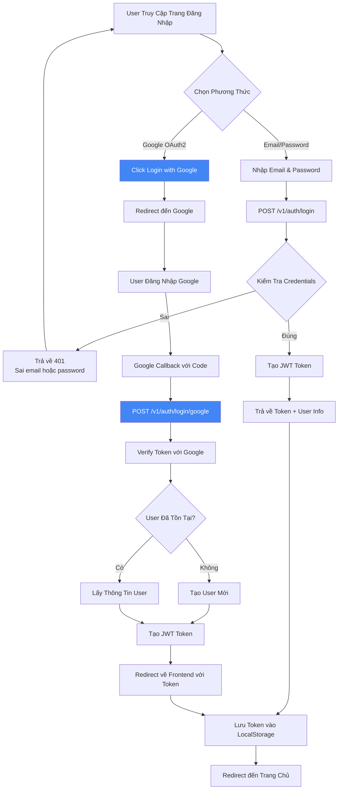

### 2. Flow Quên Mật Khẩu (OTP)

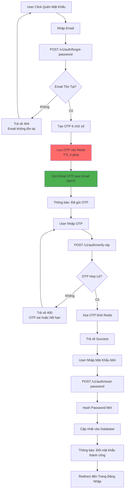

### 3. Flow Quản Lý Giỏ Hàng

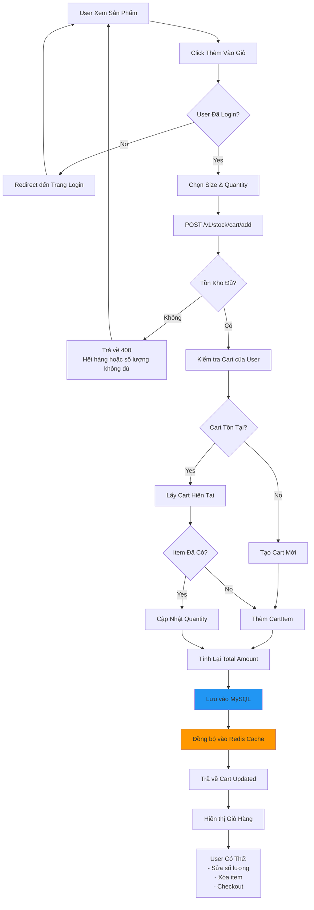

### 4. Flow Đặt Hàng (Checkout) với Kafka

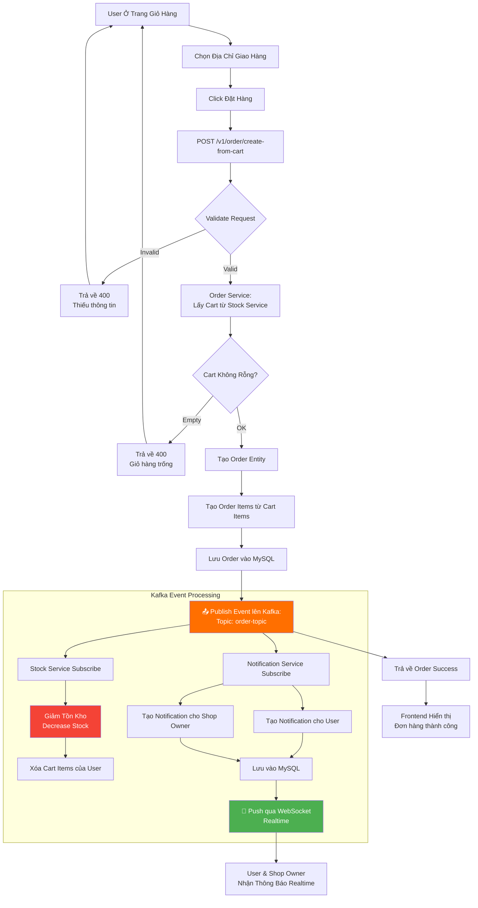

### 5. Flow Thông Báo Realtime (WebSocket)

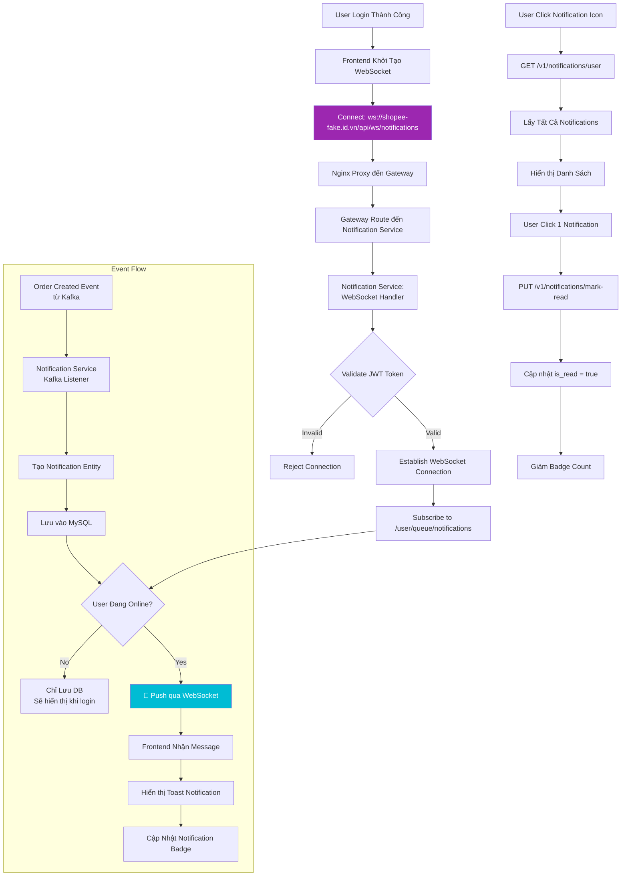

### 6. Flow Yêu Cầu Nâng Cấp Shop Owner

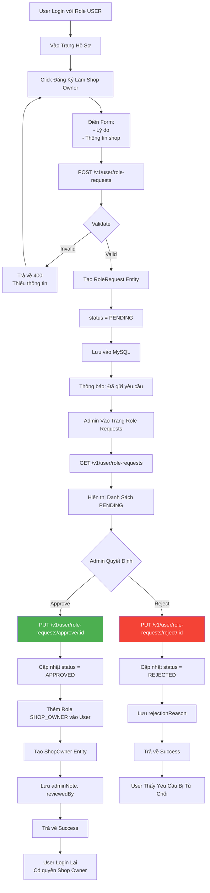

---

## 📨 KAFKA EVENT-DRIVEN ARCHITECTURE

### Sơ Đồ Kafka Topics và Consumers

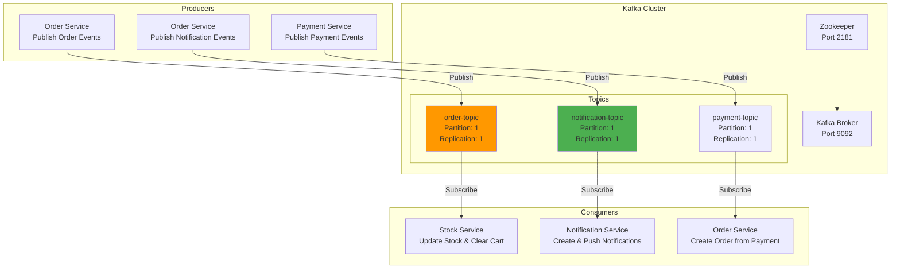

### Chi Tiết Kafka Events

#### 1. Order Topic (`order-topic`)

**Producer:** Order Service
**Consumers:** Stock Service
**Event Type:** `CheckOutKafkaRequest`

**Payload:**
```json
{
  "orderId": "uuid",
  "userId": "uuid",
  "items": [
    {
      "productId": "uuid",
      "sizeId": "uuid",
      "quantity": 3
    }
  ]
}
```

**Consumer Actions (Stock Service):**
1. Giảm tồn kho cho từng sản phẩm/size
2. Xóa các items khỏi giỏ hàng của user
3. Cập nhật vào MySQL
4. Đồng bộ Redis cache

#### 2. Notification Topic (`notification-topic`)

**Producer:** Order Service
**Consumers:** Notification Service
**Event Type:** `SendNotificationRequest`

**Payload:**
```json
{
  "userId": "uuid",
  "shopId": "uuid",
  "orderId": "uuid",
  "message": "Đơn hàng #12345 đã được đặt thành công",
  "isShopOwnerNotification": false
}
```

**Consumer Actions (Notification Service):**
1. Tạo Notification entity
2. Lưu vào MySQL
3. Kiểm tra user có đang online (WebSocket)
4. Nếu online: Push qua WebSocket
5. Nếu offline: Chỉ lưu DB (sẽ load khi login)

#### 3. Payment Topic (`payment-topic`)

**Producer:** Payment Service
**Consumers:** Order Service
**Event Type:** `PaymentEvent`

**Payload:**
```json
{
  "paymentId": "uuid",
  "txnRef": "string",
  "orderId": "uuid (nullable)",
  "status": "PAID",
  "method": "VNPAY",
  "userId": "uuid",
  "addressId": "uuid",
  "orderDataJson": "string (JSON của selectedItems)"
}
```

**Consumer Actions (Order Service):**
1. Nhận PaymentEvent với status = "PAID"
2. Parse orderDataJson → selectedItems
3. Gọi createOrderFromPayment()
4. Tạo Order với paymentMethod = "VNPAY"
5. Giảm stock, cleanup cart
6. Publish notification event

---

## 💾 DATABASE SCHEMA CHI TIẾT

### Sơ Đồ ERD (Entity Relationship Diagram)

```mermaid
erDiagram
    USERS ||--o{ ADDRESSES : has
    USERS ||--o{ ROLE_REQUESTS : creates
    USERS ||--|| SHOP_OWNERS : becomes
    USERS ||--o{ USER_ACTIVITIES : logs
    USERS ||--o{ USER_ROLES : has
    USERS ||--o{ CARTS : owns
    USERS ||--o{ ORDERS : places
    USERS ||--o{ NOTIFICATIONS : receives

    SHOP_OWNERS ||--o{ PRODUCTS : owns
    SHOP_OWNERS ||--o{ NOTIFICATIONS : receives

    CATEGORIES ||--o{ PRODUCTS : contains
    PRODUCTS ||--o{ SIZES : has
    PRODUCTS ||--o{ CART_ITEMS : in
    PRODUCTS ||--o{ ORDER_ITEMS : in

    CARTS ||--o{ CART_ITEMS : contains
    ORDERS ||--o{ ORDER_ITEMS : contains

    SIZES ||--o{ CART_ITEMS : selected
    SIZES ||--o{ ORDER_ITEMS : ordered

    ADDRESSES ||--o{ ORDERS : ships_to

    FILES ||--o{ PRODUCTS : image
    FILES ||--o{ SHOP_OWNERS : logo

    USERS ||--o{ CONVERSATIONS : "client_id"
    USERS ||--o{ CONVERSATIONS : "shop_owner_id"
    CONVERSATIONS ||--o{ MESSAGES : contains
    PRODUCTS ||--o{ CONVERSATIONS : about

    USERS ||--o{ PAYMENTS : makes
    ORDERS ||--o| PAYMENTS : paid_by

    USERS ||--o{ REVIEWS : writes
    PRODUCTS ||--o{ REVIEWS : has
    REVIEWS ||--o{ REVIEW_IMAGES : contains

    ORDERS ||--o| SHIPPING_ORDERS : has

    USERS {
        uuid id PK
        string username
        string password
        string email UK
        enum primary_role
        enum active
        string first_name
        string last_name
        string phone_number
        enum gender
        date birth_date
        string image_url
        timestamp created_at
        timestamp updated_at
    }

    USER_ROLES {
        uuid user_id FK
        enum role
    }

    ADDRESSES {
        uuid id PK
        uuid user_id FK
        string address_name
        string recipient_name
        string recipient_phone
        string street
        string district
        string city
        string province
        double latitude
        double longitude
        boolean is_default
    }

    ROLE_REQUESTS {
        uuid id PK
        uuid user_id FK
        enum requested_role
        enum status
        text reason
        text admin_note
        uuid reviewed_by FK
        timestamp reviewed_at
        text rejection_reason
        timestamp created_at
    }

    SHOP_OWNERS {
        uuid user_id PK_FK
        string shop_name
        string owner_name
        string address
        string image_url
        boolean verified
        int total_ratings
        int followers_count
        int following_count
        timestamp created_at
        timestamp updated_at
    }

    USER_ACTIVITIES {
        uuid id PK
        uuid user_id FK
        uuid shop_owner_id FK
        enum activity_type
        string description
        text details_json
        string ip_address
        string user_agent
        string session_id
        text metadata
        timestamp created_at
    }

    CATEGORIES {
        uuid id PK
        string name
        text description
    }

    PRODUCTS {
        uuid id PK
        uuid category_id FK
        uuid user_id FK
        string name
        text description
        decimal price
        decimal original_price
        decimal discount_percent
        enum status
        uuid image_id FK
        timestamp created_at
        timestamp updated_at
    }

    SIZES {
        uuid id PK
        uuid product_id FK
        string name
        text description
        int stock
        decimal price_modifier
    }

    CARTS {
        uuid id PK
        uuid user_id FK
        decimal total_amount
        timestamp created_at
        timestamp updated_at
    }

    CART_ITEMS {
        uuid id PK
        uuid cart_id FK
        uuid product_id FK
        uuid size_id FK
        int quantity
        decimal unit_price
        decimal total_price
    }

    ORDERS {
        uuid id PK
        uuid user_id FK
        uuid address_id FK
        decimal total_price
        enum status
        enum payment_method
        timestamp created_at
        timestamp updated_at
    }

    ORDER_ITEMS {
        uuid id PK
        uuid order_id FK
        uuid product_id FK
        uuid size_id FK
        int quantity
        decimal unit_price
        decimal total_price
    }

    NOTIFICATIONS {
        uuid id PK
        uuid user_id FK
        uuid shop_id FK
        uuid order_id FK
        text message
        boolean is_read
        boolean is_shop_owner_notification
        timestamp created_at
    }

    FILES {
        uuid id PK
        string type
        string file_path
    }

    PAYMENTS {
        uuid id PK
        uuid order_id FK
        string txn_ref UK
        decimal amount
        string currency
        enum method
        enum status
        string bank_code
        string card_type
        string gateway_txn_no
        string response_code
        string message
        string payment_url
        string return_url
        text raw_callback
        text order_data
        timestamp created_at
        timestamp updated_at
    }

    CONVERSATIONS {
        uuid id PK
        uuid client_id FK
        uuid shop_owner_id FK
        uuid product_id FK
        timestamp created_at
        timestamp updated_at
    }

    MESSAGES {
        uuid id PK
        uuid conversation_id FK
        uuid sender_id FK
        text content
        enum delivery_status
        boolean read
        timestamp created_at
    }

    REVIEWS {
        uuid id PK
        uuid user_id FK
        string username
        string user_avatar
        uuid product_id FK
        int rating
        text comment
        timestamp created_at
    }

    REVIEW_IMAGES {
        uuid review_id FK
        string image_id
    }

    SHIPPING_ORDERS {
        uuid id PK
        uuid order_id FK
        string ghn_order_code UK
        decimal shipping_fee
        timestamp expected_delivery_time
        text ghn_response
        timestamp created_at
        timestamp updated_at
    }
```

### Giải Thích Các Bảng Chính

#### User Service Database

**users**
- Bảng trung tâm chứa thông tin tài khoản
- 1 user có thể có nhiều roles (lưu trong bảng `user_roles`)
- Embedded `user_details` (first_name, last_name, phone, gender, etc.)

**addresses**
- Sổ địa chỉ của user
- Hỗ trợ nhiều địa chỉ, 1 địa chỉ mặc định
- Có lat/long để tính khoảng cách giao hàng

**role_requests**
- Lưu yêu cầu nâng cấp vai trò (USER → SHOP_OWNER)
- Admin duyệt/từ chối với `status`, `admin_note`, `reviewed_by`

**shop_owners**
- Share khóa với `users.id`
- Chứa thông tin shop: tên, địa chỉ, logo, verified, ratings

**user_activities**
- Log hành vi người dùng để phân tích

#### Stock Service Database

**category_products**
- Danh mục sản phẩm (Electronics, Fashion, etc.)

**products**
- Sản phẩm thuộc 1 category và 1 shop owner (user_id)
- Có giá gốc, giá giảm, % discount
- Liên kết với file image qua `image_id`

**sizes**
- Mỗi sản phẩm có nhiều size/variant
- Mỗi size có tồn kho riêng và price modifier

**carts & cart_items**
- Giỏ hàng của user
- Redis cache để tăng performance
- MySQL làm persistent storage

#### Order Service Database

**orders**
- Đơn hàng với status: PENDING, PROCESSING, SHIPPED, DELIVERED, CANCELLED
- `payment_method`: COD, VNPAY, CARD
- Liên kết với user và address (via Feign)

**order_items**
- Chi tiết từng sản phẩm trong đơn
- Lưu snapshot giá tại thời điểm đặt hàng

#### Notification Service Database

**notifications**
- Lưu thông báo cho user và shop owner
- `is_read` để track đã đọc chưa
- `is_shop_owner_notification` phân biệt loại thông báo

#### File Storage Database

**files**
- Metadata của file upload
- `file_path` trỏ đến filesystem thực tế
- Dùng cho avatar user, logo shop, ảnh sản phẩm

#### Payment Service Database

**payments**
- Lưu thông tin thanh toán
- `order_id` có thể null (nếu order chưa tạo)
- `txn_ref` unique để track transaction
- `order_data` lưu JSON tạm để tạo order sau
- `status`: PENDING, PAID, FAILED
- `method`: VNPAY, COD, CARD

#### Notification Service Database (Chat)

**conversations**
- Conversation giữa client và shop owner về sản phẩm
- Unique constraint: (client_id, shop_owner_id, product_id)
- Một conversation có nhiều messages

**messages**
- Messages trong conversation
- `sender_id` là user_id của người gửi
- `delivery_status`: SENT, DELIVERED, READ
- `read` flag để track đã đọc chưa

#### Stock Service Database (Review)

**reviews**
- Đánh giá sản phẩm từ khách hàng
- `rating`: 1-5 sao
- `comment`: Nội dung đánh giá
- `username`, `userAvatar`: Cache để hiển thị nhanh
- `imageIds`: Danh sách ảnh đính kèm (lưu trong bảng `review_images`)

**review_images**
- Ảnh đính kèm trong review
- Quan hệ many-to-many với reviews

#### Order Service Database (Shipping)

**shipping_orders**
- Vận đơn GHN
- `ghn_order_code`: Mã vận đơn từ GHN (unique)
- `shipping_fee`: Phí vận chuyển
- `expected_delivery_time`: Thời gian dự kiến giao hàng
- `ghn_response`: Raw response từ GHN API (JSON)
- Liên kết 1-1 với orders

---

## 🔐 BẢO MẬT VÀ XÁC THỰC

### Luồng JWT Authentication

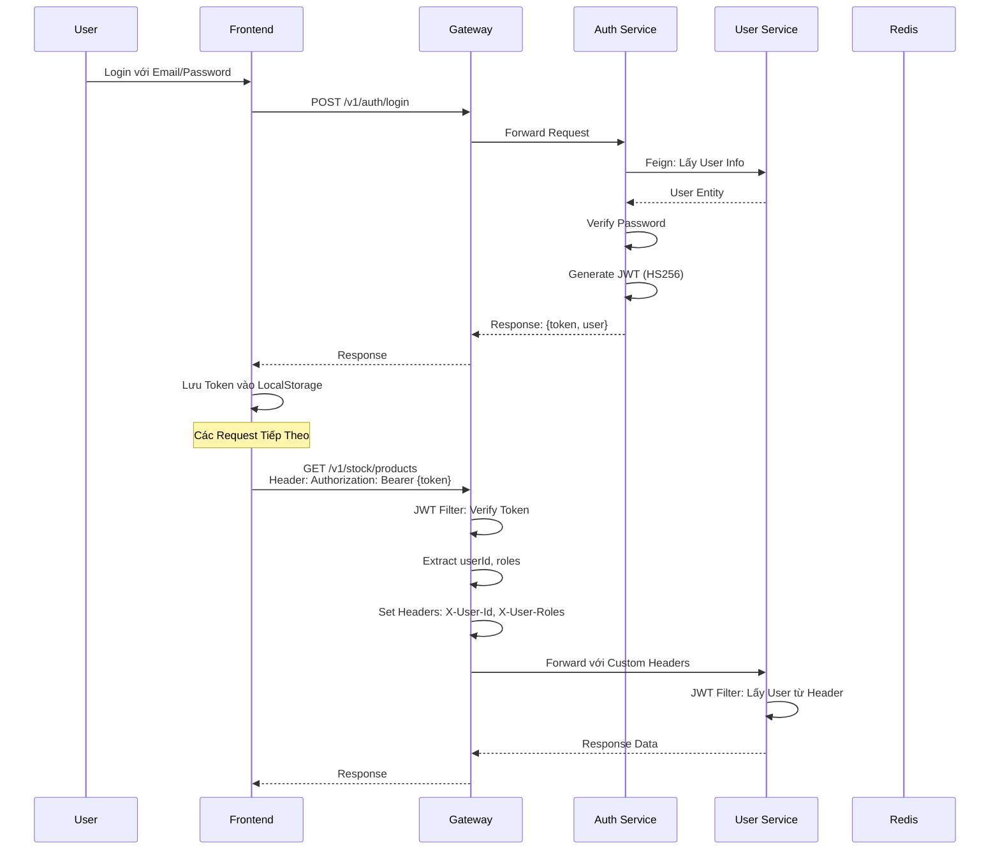

### Cơ Chế Bảo Mật

**1. JWT (JSON Web Token)**
- Algorithm: HS256
- Secret Key: Lưu trong Config Server
- Claims: userId, email, roles, exp
- Expiration: 24 giờ

**2. Password Encryption**
- BCryptPasswordEncoder
- Salt rounds: 10

**3. OTP Security**
- 6 chữ số random
- TTL: 5 phút trong Redis
- 1 email chỉ có 1 OTP active

**4. Gateway Security**
- CORS configuration cho phép origins cụ thể
- Rate limiting (future)
- Request/Response logging

**5. Service-to-Service Communication**
- Feign Client với JWT token forwarding
- Header `X-Internal-Call` để phân biệt internal vs external

---

## 🌐 API ENDPOINTS TỔNG HỢP

### Auth Service APIs

| Method | Endpoint | Description | Auth Required |
|--------|----------|-------------|---------------|
| POST | `/v1/auth/register` | Đăng ký tài khoản mới | ❌ |
| POST | `/v1/auth/login` | Đăng nhập Email/Password | ❌ |
| POST | `/v1/auth/login/google` | Đăng nhập Google OAuth2 | ❌ |
| POST | `/v1/auth/forgot-password` | Gửi OTP quên mật khẩu | ❌ |
| POST | `/v1/auth/verify-otp` | Xác thực OTP | ❌ |
| POST | `/v1/auth/reset-password` | Đặt lại mật khẩu mới | ❌ |

### User Service APIs

| Method | Endpoint | Description | Auth Required | Role |
|--------|----------|-------------|---------------|------|
| GET | `/v1/user/information` | Lấy thông tin user hiện tại | ✅ | USER |
| PUT | `/v1/user/update` | Cập nhật profile (có thể upload avatar) | ✅ | USER |
| POST | `/v1/user/update-password` | Đổi mật khẩu | ✅ | USER |
| GET | `/v1/user/address/getAllAddresses` | Lấy danh sách địa chỉ | ✅ | USER |
| GET | `/v1/user/address/getAddressById/{id}` | Lấy chi tiết địa chỉ | ✅ | USER |
| POST | `/v1/user/address/save` | Thêm địa chỉ mới | ✅ | USER |
| PUT | `/v1/user/address/update` | Sửa địa chỉ | ✅ | USER |
| DELETE | `/v1/user/address/deleteAddressById/{id}` | Xóa địa chỉ | ✅ | USER |
| POST | `/v1/user/role-requests` | Yêu cầu nâng cấp Shop Owner | ✅ | USER |
| GET | `/v1/user/role-requests` | Lấy danh sách role requests | ✅ | ADMIN |
| PUT | `/v1/user/role-requests/approve/{id}` | Duyệt yêu cầu | ✅ | ADMIN |
| PUT | `/v1/user/role-requests/reject/{id}` | Từ chối yêu cầu | ✅ | ADMIN |
| GET | `/v1/user/shop-owners` | Lấy thông tin shop | ✅ | SHOP_OWNER |
| PUT | `/v1/user/shop-owners` | Cập nhật thông tin shop | ✅ | SHOP_OWNER |
| GET | `/v1/user/getAll` | Lấy tất cả users | ✅ | ADMIN |
| GET | `/v1/user/getUserForAdminByUserId/{id}` | Lấy chi tiết user (admin) | ✅ | ADMIN |
| GET | `/v1/user/getUserById/{id}` | Lấy thông tin user theo ID | ✅ | ALL |
| DELETE | `/v1/user/deleteUserById/{id}` | Xóa user | ✅ | ADMIN |

### Stock Service APIs

| Method | Endpoint | Description | Auth Required | Role |
|--------|----------|-------------|---------------|------|
| GET | `/v1/stock/category` | Lấy danh sách categories | ❌ | ALL |
| POST | `/v1/stock/category` | Tạo category mới | ✅ | ADMIN |
| PUT | `/v1/stock/category/{id}` | Cập nhật category | ✅ | ADMIN |
| DELETE | `/v1/stock/category/{id}` | Xóa category | ✅ | ADMIN |
| GET | `/v1/stock/product` | Tìm kiếm sản phẩm | ❌ | ALL |
| GET | `/v1/stock/product/{id}` | Chi tiết sản phẩm | ❌ | ALL |
| POST | `/v1/stock/product` | Tạo sản phẩm | ✅ | SHOP_OWNER |
| PUT | `/v1/stock/product/{id}` | Sửa sản phẩm | ✅ | SHOP_OWNER |
| DELETE | `/v1/stock/product/{id}` | Xóa sản phẩm | ✅ | SHOP_OWNER |
| POST | `/v1/stock/size/create` | Thêm size cho sản phẩm | ✅ | SHOP_OWNER |
| PUT | `/v1/stock/size/update` | Cập nhật size | ✅ | SHOP_OWNER |
| DELETE | `/v1/stock/size/delete/{id}` | Xóa size | ✅ | SHOP_OWNER |
| GET | `/v1/stock/reviews/product/{productId}` | Lấy reviews của sản phẩm | ❌ | ALL |
| POST | `/v1/stock/reviews` | Tạo review/đánh giá sản phẩm | ✅ | USER |
| GET | `/v1/stock/reviews/count/shop/{shopId}` | Đếm reviews của shop | ❌ | ALL |
| POST | `/v1/order/calculate-shipping-fee` | Tính phí vận chuyển GHN | ✅ | USER/SHOP_OWNER |
| GET | `/v1/order/shop-owner/analytics` | Analytics chi tiết shop | ✅ | SHOP_OWNER |
| GET | `/v1/order/shop-owner/dashboard-stats` | Dashboard stats shop | ✅ | SHOP_OWNER |
| GET | `/v1/stock/cart/getCartByUserId` | Lấy giỏ hàng | ✅ | USER |
| POST | `/v1/stock/cart/item/add` | Thêm vào giỏ | ✅ | USER |
| PUT | `/v1/stock/cart/item/update` | Sửa số lượng | ✅ | USER |
| DELETE | `/v1/stock/cart/item/remove/{cartItemId}` | Xóa item | ✅ | USER |
| GET | `/v1/stock/product/getProductByUserId` | Sản phẩm của shop owner | ✅ | SHOP_OWNER |
| GET | `/v1/stock/product/public/shop/{shopId}/stats` | Thống kê shop | ❌ | ALL |
| GET | `/v1/stock/product/shop-owner/stats` | Thống kê shop (shop owner) | ✅ | SHOP_OWNER |

### Order Service APIs

| Method | Endpoint | Description | Auth Required | Role |
|--------|----------|-------------|---------------|------|
| POST | `/v1/order/create-from-cart` | Đặt hàng từ giỏ (COD) | ✅ | USER |
| GET | `/v1/order/getOrderByUserId` | Lấy đơn hàng của user | ✅ | USER |
| GET | `/v1/order/getOrderById/{id}` | Chi tiết đơn hàng | ✅ | USER/SHOP_OWNER/ADMIN |
| PUT | `/v1/order/cancel/{orderId}` | Hủy đơn hàng | ✅ | USER |
| GET | `/v1/order/shop-owner/orders` | Đơn hàng của shop (phân trang) | ✅ | SHOP_OWNER |
| GET | `/v1/order/shop-owner/orders/all` | Tất cả đơn hàng của shop | ✅ | SHOP_OWNER |
| PUT | `/v1/order/updateStatus/{orderId}` | Cập nhật trạng thái đơn | ✅ | SHOP_OWNER/ADMIN |
| GET | `/v1/order/getAllOrders` | Tất cả đơn hàng (admin) | ✅ | ADMIN |
| GET | `/v1/order/shop-owner/stats` | Thống kê đơn hàng shop | ✅ | SHOP_OWNER |
| POST | `/v1/order/internal/create-from-payment` | Tạo order từ payment (internal) | ✅ | Internal |

### Notification Service APIs

| Method | Endpoint | Description | Auth Required | Role |
|--------|----------|-------------|---------------|------|
| GET | `/v1/notifications/getAllByUserId` | Lấy thông báo của user | ✅ | USER |
| GET | `/v1/notifications/getAllByShopId` | Lấy thông báo của shop owner | ✅ | SHOP_OWNER |
| PUT | `/v1/notifications/markAsRead/{id}` | Đánh dấu đã đọc | ✅ | USER/SHOP_OWNER |
| PUT | `/v1/notifications/markAllAsReadByUserId` | Đánh dấu tất cả đã đọc (user) | ✅ | USER |
| PUT | `/v1/notifications/markAllAsReadByShopId` | Đánh dấu tất cả đã đọc (shop) | ✅ | SHOP_OWNER |
| DELETE | `/v1/notifications/delete/{id}` | Xóa thông báo | ✅ | USER/SHOP_OWNER |
| DELETE | `/v1/notifications/deleteAllByUserId` | Xóa tất cả thông báo (user) | ✅ | USER |
| DELETE | `/v1/notifications/deleteAllByShopId` | Xóa tất cả thông báo (shop) | ✅ | SHOP_OWNER |
| WS | `/ws/notifications` | WebSocket connection | ✅ | USER/SHOP_OWNER |

### Chat Service APIs (Notification Service)

| Method | Endpoint | Description | Auth Required | Role |
|--------|----------|-------------|---------------|------|
| POST | `/v1/notifications/chat/conversations/start` | Bắt đầu conversation | ✅ | USER |
| GET | `/v1/notifications/chat/conversations` | Lấy danh sách conversations | ✅ | USER/SHOP_OWNER |
| GET | `/v1/notifications/chat/conversations/{id}/messages` | Lấy messages của conversation | ✅ | USER/SHOP_OWNER |
| POST | `/v1/notifications/chat/messages` | Gửi message | ✅ | USER/SHOP_OWNER |
| PUT | `/v1/notifications/chat/conversations/{id}/read` | Đánh dấu đã đọc | ✅ | USER/SHOP_OWNER |
| WS | `/ws/chat` | WebSocket cho chat | ✅ | USER/SHOP_OWNER |

### Payment Service APIs

| Method | Endpoint | Description | Auth Required | Role |
|--------|----------|-------------|---------------|------|
| POST | `/v1/payment/vnpay/create` | Tạo VNPay payment URL | ✅ | USER |
| GET | `/v1/payment/vnpay/return` | Callback từ VNPay gateway | ❌ | N/A |

### File Storage APIs

| Method | Endpoint | Description | Auth Required |
|--------|----------|-------------|---------------|
| POST | `/v1/file-storage/upload` | Upload file | ✅ |
| GET | `/v1/file-storage/{id}` | Download file | ❌ |
| DELETE | `/v1/file-storage/{id}` | Xóa file | ✅ |

---

## 🚀 HƯỚNG PHÁT TRIỂN & CẢI TIẾN

### Các Chức Năng Đã Hoàn Thành ✅

- Xác thực và phân quyền (JWT + OAuth2)
- Quản lý người dùng và shop owner
- Quản lý sản phẩm, danh mục, size
- Giỏ hàng với Redis cache
- Đặt hàng với Kafka event
- Thông báo realtime WebSocket
- Upload/Download file
- Google Login OAuth2
- OTP quên mật khẩu

### Các Chức Năng Cần Bổ Sung 🔧

#### 1. Payment Gateway
- Tích hợp VNPay/Momo
- Xử lý thanh toán online
- Lưu lịch sử giao dịch
- Callback handling

#### 2. Review & Rating System
- Review sản phẩm
- Rating shop owner
- Upload ảnh review
- Báo cáo review spam

#### 3. Advanced Analytics
- Dashboard thống kê doanh thu
- Biểu đồ sản phẩm bán chạy
- Thống kê theo thời gian
- Export reports

#### 4. Shipping Integration
- Tích hợp GHN/GHTK
- Tính phí vận chuyển
- Tracking đơn hàng
- In vận đơn

#### 5. Return & Refund
- Yêu cầu trả hàng/hoàn tiền
- Quy trình duyệt return
- State machine cho return status
- Ảnh chứng minh

#### 6. Promotions & Vouchers
- Tạo mã giảm giá
- Flash sale
- Combo deals
- Loyalty program

#### 7. Search & Filter Enhancement
- Elasticsearch integration
- Faceted search
- Price range filter
- Sort by popularity/rating

#### 8. Observability
- Prometheus metrics
- Grafana dashboards
- Zipkin distributed tracing
- ELK Stack logging

#### 9. Security Enhancements
- API Rate Limiting
- File upload virus scan
- Signed URLs for file access
- 2FA authentication

#### 10. Performance Optimization
- Database indexing review
- Query optimization
- CDN for static files
- Caching strategies

---

## 📞 KẾT LUẬN

Dự án **Shopee Clone** đã xây dựng thành công một hệ thống E-commerce hoàn chỉnh với kiến trúc Microservices hiện đại, bao gồm:

✅ **9 Microservices** độc lập, có thể scale riêng biệt
✅ **Event-Driven Architecture** với Kafka
✅ **Realtime Notifications** qua WebSocket
✅ **JWT Authentication** + Google OAuth2
✅ **Redis Caching** cho hiệu năng cao
✅ **Feign Client** cho inter-service communication
✅ **Spring Cloud** ecosystem (Eureka, Gateway, Config)

Hệ thống có khả năng mở rộng cao, dễ bảo trì, và sẵn sàng cho các tính năng nâng cao trong tương lai như payment gateway, review system, và advanced analytics.
