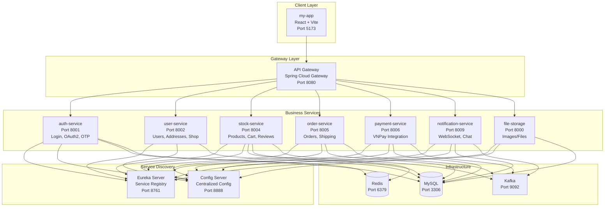
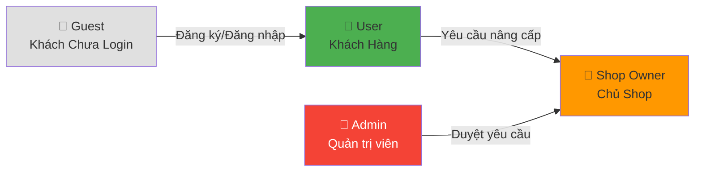
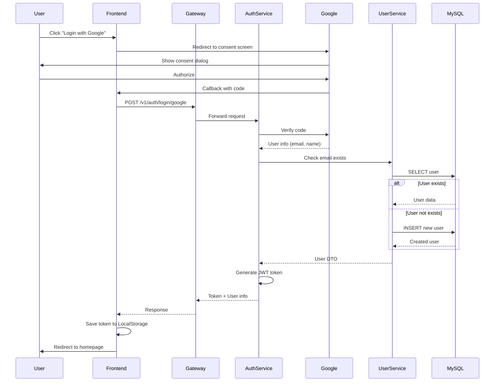
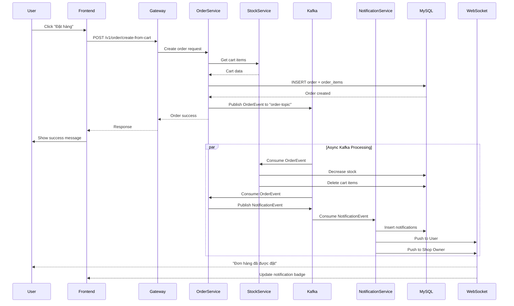
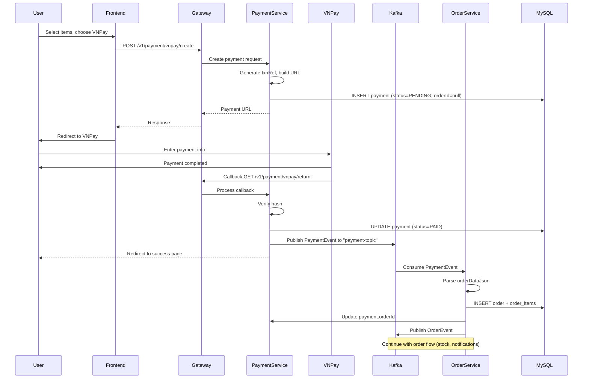
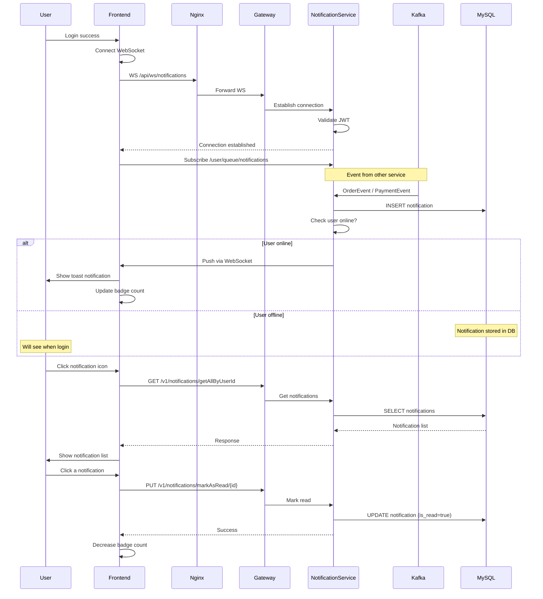

# 📊 PHÂN TÍCH TOÀN DIỆN DỰ ÁN E-COMMERCE MICROSERVICES

## 📌 TỔNG QUAN DỰ ÁN

### Mô Tả Hệ Thống
Dự án là một **nền tảng thương mại điện tử (E-commerce Platform)** xây dựng theo kiến trúc **Microservices**, mô phỏng các chức năng chính của Shopee. Hệ thống hỗ trợ 4 loại người dùng chính với các quyền hạn khác nhau, sử dụng event-driven architecture với Kafka để đảm bảo tính mở rộng và khả năng xử lý cao.

### Công Nghệ Sử Dụng

**Backend Stack:**
- Java 17 + Spring Boot
- Spring Cloud (Eureka, Gateway, Config Server)
- Spring Data JPA + MySQL 8.0
- Redis 7 (Caching + OTP Storage)
- Apache Kafka 3.8 + Zookeeper (Event-Driven)
- WebSocket / STOMP (Real-time Notifications)
- Feign Client (Inter-service Communication)
- JWT + OAuth2 (Google Login)

**Frontend Stack:**
- React 18 + Vite
- Axios (HTTP Client)
- SockJS + STOMP Client (WebSocket)
- Context API (State Management)

**Infrastructure:**
- Docker + Docker Compose
- Nginx (Reverse Proxy)
- MySQL, Redis, Kafka containers

---

## 🏗️ KIẾN TRÚC MICROSERVICES

### Sơ Đồ Tổng Quan

### Chi Tiết Các Microservices

| Service | Port | Nhiệm Vụ Chính | Database | Message Queue | Cache |
|---------|------|----------------|----------|---------------|-------|
| **config-server** | 8888 | Quản lý cấu hình tập trung | N/A | N/A | N/A |
| **eureka-server** | 8761 | Service Discovery & Registry | N/A | N/A | N/A |
| **gateway** | 8080 | API Gateway, Routing, Authentication | N/A | N/A | N/A |
| **auth-service** | 8001 | Login, Register, OAuth2, OTP | Feign to user-service | N/A | Redis (OTP) |
| **user-service** | 8002 | Users, Addresses, Shop Owners, Roles | MySQL (users, addresses, shop_owners, role_requests) | N/A | N/A |
| **stock-service** | 8004 | Products, Categories, Sizes, Cart, Reviews | MySQL (products, categories, sizes, carts, reviews) | Kafka (order-topic) | Redis (cart) |
| **order-service** | 8005 | Orders, Checkout, Shipping (GHN) | MySQL (orders, order_items, shipping_orders) | Kafka (order-topic, payment-topic) | N/A |
| **payment-service** | 8006 | VNPay Payment Gateway | MySQL (payments) | Kafka (payment-topic) | N/A |
| **notification-service** | 8009 | WebSocket, Notifications, Chat | MySQL (notifications, conversations, messages) | Kafka (notification-topic) | N/A |
| **file-storage** | 8000 | Upload/Download images | MySQL (files) | N/A | N/A |
| **my-app** | 5173 | React Frontend (SPA) | LocalStorage (JWT) | WebSocket | N/A |

---

## 👥 4 ACTORS TRONG HỆ THỐNG

### Sơ Đồ Actors và Quan Hệ

### 1. 👤 GUEST (Khách Chưa Đăng Nhập)

**Mô tả:** Người truy cập website nhưng chưa có tài khoản hoặc đăng nhập

**Quyền hạn:**
- ✅ Xem danh sách sản phẩm
- ✅ Tìm kiếm sản phẩm
- ✅ Xem chi tiết sản phẩm
- ✅ Xem thông tin shop
- ✅ Đăng ký tài khoản mới
- ✅ Đăng nhập (Email/Password hoặc Google OAuth2)
- ✅ Quên mật khẩu (OTP qua email)

**Hạn chế:**
- ❌ Không thể thêm vào giỏ hàng
- ❌ Không thể đặt hàng
- ❌ Không thể xem lịch sử đơn hàng

### 2. 👤 USER (Khách Hàng Đã Đăng Nhập)

**Mô tả:** Khách hàng đã đăng ký và đăng nhập hệ thống

**Quyền hạn (Bao gồm tất cả quyền của Guest +):**
- ✅ Quản lý hồ sơ cá nhân (profile, avatar)
- ✅ Quản lý sổ địa chỉ (CRUD addresses)
- ✅ Thêm/Sửa/Xóa sản phẩm trong giỏ hàng
- ✅ Đặt hàng (Checkout) với COD hoặc VNPay
- ✅ Theo dõi đơn hàng và lịch sử
- ✅ Hủy đơn hàng (nếu status = PENDING)
- ✅ Nhận thông báo realtime qua WebSocket
- ✅ Chat với Shop Owner
- ✅ Review và đánh giá sản phẩm (Rating 1-5 sao)
- ✅ Yêu cầu nâng cấp lên Shop Owner
- ✅ Đổi mật khẩu

### 3. 🏪 SHOP OWNER (Chủ Shop)

**Mô tả:** User đã được Admin duyệt để bán hàng trên nền tảng

**Quyền hạn (Bao gồm tất cả quyền của User +):**
- ✅ Quản lý thông tin shop (tên, logo, địa chỉ, verified status)
- ✅ Tạo/Sửa/Xóa sản phẩm
- ✅ Quản lý tồn kho (sizes, stock)
- ✅ Xem danh sách đơn hàng thuộc sản phẩm của shop (phân trang, filter)
- ✅ Cập nhật trạng thái đơn hàng (PENDING → PROCESSING → SHIPPED)
- ✅ Xem thống kê shop (số sản phẩm, rating, doanh thu)
- ✅ Nhận thông báo khi có đơn hàng mới
- ✅ Chat với khách hàng
- ✅ Tính phí vận chuyển (GHN API)
- ✅ Tạo vận đơn GHN tự động khi đơn hàng PROCESSING
- ✅ Quản lý voucher (Shop-level)
- ✅ Livestream bán hàng
- ✅ Quản lý subscription plan

**Lưu ý:**
- Một user có thể vừa là khách hàng vừa là shop owner
- Cần được Admin duyệt từ Role Request

### 4. 👑 ADMIN (Quản Trị Viên)

**Mô tả:** Quản trị viên hệ thống với quyền hạn cao nhất

**Quyền hạn:**
- ✅ Duyệt/Từ chối Role Requests (nâng cấp Shop Owner)
- ✅ Quản lý tất cả người dùng
  - Xem danh sách users
  - Xem chi tiết user (orders, activities)
  - Vô hiệu hóa/Kích hoạt tài khoản
  - Xóa user
  - Thay đổi roles
- ✅ Quản lý danh mục sản phẩm (CRUD categories)
- ✅ Giám sát tất cả đơn hàng trong hệ thống
- ✅ Cập nhật trạng thái đơn hàng (xử lý khiếu nại)
- ✅ Quản lý shop owners
- ✅ Quản lý banners
- ✅ Quản lý subscription plans
- ✅ Quản lý vouchers (Platform-level)
- ✅ Xem thống kê toàn hệ thống

---

## 🎯 USE CASES ĐẦY ĐỦ THEO ACTOR

### 👤 GUEST - USE CASES

| UC ID | Use Case | API Endpoint | Service | Mô tả |
|-------|----------|--------------|---------|-------|
| UC-G01 | Xem danh sách sản phẩm | `GET /v1/stock/product` | stock-service | Hiển thị tất cả sản phẩm có sẵn với phân trang, filter |
| UC-G02 | Tìm kiếm sản phẩm | `GET /v1/stock/product?keyword={keyword}` | stock-service | Tìm kiếm sản phẩm theo tên, mô tả |
| UC-G03 | Xem chi tiết sản phẩm | `GET /v1/stock/product/{id}` | stock-service → user-service | Hiển thị thông tin sản phẩm, sizes, stock, shop info |
| UC-G04 | Xem thông tin shop | `GET /v1/user/shop-owners/{id}` | user-service | Xem profile shop owner |
| UC-G05 | Đăng ký tài khoản | `POST /v1/auth/register` | auth-service → user-service | Tạo tài khoản mới với email + password |
| UC-G06 | Đăng nhập Email/Password | `POST /v1/auth/login` | auth-service | Xác thực và tạo JWT token |
| UC-G07 | Đăng nhập Google OAuth2 | `POST /v1/auth/login/google` | auth-service → user-service | Social login qua Google |
| UC-G08 | Quên mật khẩu (Gửi OTP) | `POST /v1/auth/forgotPassword` | auth-service | Tạo OTP lưu Redis, gửi email |
| UC-G09 | Xác thực OTP | `POST /v1/auth/verifyOtp` | auth-service | Kiểm tra OTP từ Redis |
| UC-G10 | Đặt lại mật khẩu | `POST /v1/auth/updatePassword` | auth-service → user-service | Reset password sau khi verify OTP |

---

### 👤 USER - USE CASES

#### Quản Lý Tài Khoản

| UC ID | Use Case | API Endpoint | Service | Mô tả |
|-------|----------|--------------|---------|-------|
| UC-U01 | Xem thông tin cá nhân | `GET /v1/user/information` | user-service | Lấy profile user hiện tại |
| UC-U02 | Cập nhật thông tin | `PUT /v1/user/update` | user-service → file-storage | Cập nhật profile, upload avatar |
| UC-U03 | Đổi mật khẩu | `PUT /v1/user/change-password` | user-service | Đổi password (cần verify old password) |
| UC-U04 | Xem danh sách địa chỉ | `GET /v1/user/address/getAllAddresses` | user-service | Lấy tất cả addresses của user |
| UC-U05 | Thêm địa chỉ mới | `POST /v1/user/address/save` | user-service | Tạo address mới |
| UC-U06 | Sửa địa chỉ | `PUT /v1/user/address/update` | user-service | Cập nhật address |
| UC-U07 | Xóa địa chỉ | `DELETE /v1/user/address/deleteAddressById/{id}` | user-service | Xóa address |
| UC-U08 | Đặt địa chỉ mặc định | `PUT /v1/user/address/setDefault/{id}` | user-service | Set isDefault = true |

#### Mua Sắm

| UC ID | Use Case | API Endpoint | Service | Mô tả |
|-------|----------|--------------|---------|-------|
| UC-U09 | Thêm vào giỏ hàng | `POST /v1/stock/cart/item/add` | stock-service | Thêm product + size vào cart, update Redis |
| UC-U10 | Xem giỏ hàng | `GET /v1/stock/cart/getCartByUserId` | stock-service | Lấy cart với tất cả items |
| UC-U11 | Cập nhật số lượng | `PUT /v1/stock/cart/item/update` | stock-service | Update quantity của cart item |
| UC-U12 | Xóa item khỏi giỏ | `DELETE /v1/stock/cart/item/remove/{cartItemId}` | stock-service | Remove item từ cart |
| UC-U13 | Đặt hàng COD | `POST /v1/order/create-from-cart` | order-service → stock-service → notification-service (Kafka) | Checkout với COD, publish Kafka event |
| UC-U14 | Tạo payment VNPay | `POST /v1/payment/vnpay/create` | payment-service | Tạo payment URL VNPay |
| UC-U15 | Callback VNPay | `GET /v1/payment/vnpay/return` | payment-service → order-service (Kafka) | Xử lý callback từ VNPay, tạo order nếu thành công |
| UC-U16 | Tính phí ship | `POST /v1/order/calculate-shipping-fee` | order-service → GHN API | Tính shipping fee trước khi checkout |

#### Quản Lý Đơn Hàng

| UC ID | Use Case | API Endpoint | Service | Mô tả |
|-------|----------|--------------|---------|-------|
| UC-U17 | Xem lịch sử đơn hàng | `GET /v1/order/getOrderByUserId` | order-service | Lấy tất cả orders của user |
| UC-U18 | Xem chi tiết đơn | `GET /v1/order/getOrderById/{id}` | order-service → stock-service → user-service | Chi tiết order với items, address, shipping |
| UC-U19 | Hủy đơn hàng | `PUT /v1/order/cancel/{orderId}` | order-service | Cancel order nếu status = PENDING |

#### Review & Rating

| UC ID | Use Case | API Endpoint | Service | Mô tả |
|-------|----------|--------------|---------|-------|
| UC-U20 | Tạo review sản phẩm | `POST /v1/stock/reviews` | stock-service → file-storage | Đánh giá sản phẩm với rating, comment, ảnh |
| UC-U21 | Xem reviews sản phẩm | `GET /v1/stock/reviews/product/{productId}` | stock-service | Lấy tất cả reviews của product |

#### Thông Báo & Chat

| UC ID | Use Case | API Endpoint | Service | Mô tả |
|-------|----------|--------------|---------|-------|
| UC-U22 | Kết nối WebSocket | `WS /ws/notifications` | notification-service | Establish WebSocket connection |
| UC-U23 | Nhận thông báo realtime | Subscribe `/user/queue/notifications` | notification-service | Nhận notifications qua WebSocket |
| UC-U24 | Xem danh sách thông báo | `GET /v1/notifications/getAllByUserId` | notification-service | Lấy tất cả notifications |
| UC-U25 | Đánh dấu đã đọc | `PUT /v1/notifications/markAsRead/{notificationId}` | notification-service | Mark notification as read |
| UC-U26 | Bắt đầu chat với shop | `POST /v1/notifications/chat/conversations/start` | notification-service | Tạo conversation mới |
| UC-U27 | Xem danh sách conversations | `GET /v1/notifications/chat/conversations` | notification-service | Lấy tất cả conversations |
| UC-U28 | Xem messages | `GET /v1/notifications/chat/conversations/{id}/messages` | notification-service | Lấy messages của conversation |
| UC-U29 | Gửi message | `POST /v1/notifications/chat/messages` | notification-service | Gửi message mới qua WebSocket |

#### Nâng Cấp Shop Owner

| UC ID | Use Case | API Endpoint | Service | Mô tả |
|-------|----------|--------------|---------|-------|
| UC-U30 | Gửi yêu cầu nâng cấp | `POST /v1/user/role-requests` | user-service | Tạo role request PENDING |
| UC-U31 | Xem trạng thái yêu cầu | `GET /v1/user/role-requests` | user-service | Check status của role request |

---

### 🏪 SHOP OWNER - USE CASES

#### Quản Lý Shop

| UC ID | Use Case | API Endpoint | Service | Mô tả |
|-------|----------|--------------|---------|-------|
| UC-S01 | Xem thông tin shop | `GET /v1/user/shop-owners` | user-service | Lấy shop owner profile |
| UC-S02 | Cập nhật thông tin shop | `PUT /v1/user/shop-owners` | user-service → file-storage | Update shop info, upload logo |
| UC-S03 | Xem thống kê shop | `GET /v1/stock/product/public/shop/{shopId}/stats` | stock-service | Số sản phẩm, avg rating |
| UC-S04 | Xem dashboard analytics | `GET /v1/order/shop-owner/analytics` | order-service | Doanh thu, số đơn, sản phẩm bán chạy |
| UC-S05 | Xem dashboard stats | `GET /v1/order/shop-owner/dashboard-stats` | order-service | Thống kê tổng quan dashboard |

#### Quản Lý Sản Phẩm

| UC ID | Use Case | API Endpoint | Service | Mô tả |
|-------|----------|--------------|---------|-------|
| UC-S06 | Tạo sản phẩm | `POST /v1/stock/product/create` | stock-service → file-storage | Tạo product mới với sizes |
| UC-S07 | Xem sản phẩm của shop | `GET /v1/stock/product/getProductByUserId` | stock-service | Lấy tất cả products của shop owner |
| UC-S08 | Sửa sản phẩm | `PUT /v1/stock/product/update` | stock-service → file-storage | Cập nhật product info |
| UC-S09 | Xóa sản phẩm | `DELETE /v1/stock/product/deleteProductById/{id}` | stock-service | Delete product và sizes (cascade) |
| UC-S10 | Thêm size mới | `POST /v1/stock/size/create` | stock-service | Tạo size mới cho product |
| UC-S11 | Cập nhật tồn kho | `PUT /v1/stock/size/update` | stock-service | Update stock của size |
| UC-S12 | Xóa size | `DELETE /v1/stock/size/delete/{id}` | stock-service | Delete size |

#### Quản Lý Đơn Hàng

| UC ID | Use Case | API Endpoint | Service | Mô tả |
|-------|----------|--------------|---------|-------|
| UC-S13 | Xem đơn hàng shop | `GET /v1/order/shop-owner/orders?status={status}&pageNo={page}&pageSize={size}` | order-service | Lấy orders có chứa products của shop |
| UC-S14 | Xem chi tiết đơn | `GET /v1/order/getOrderById/{id}` | order-service | Chi tiết order (chỉ items của shop) |
| UC-S15 | Cập nhật trạng thái | `PUT /v1/order/updateStatus/{orderId}?status={status}` | order-service → notification-service (Kafka) | Update order status, gửi notification |
| UC-S16 | Xem stats đơn hàng | `GET /v1/order/shop-owner/stats` | order-service | Số đơn theo status, doanh thu hôm nay |
| UC-S17 | Tạo vận đơn GHN | Auto trigger khi status = PROCESSING | order-service → GHN API | Tự động tạo shipping order |

#### Thông Báo & Chat

| UC ID | Use Case | API Endpoint | Service | Mô tả |
|-------|----------|--------------|---------|-------|
| UC-S18 | Nhận thông báo đơn mới | WS + `GET /v1/notifications/getAllByShopId` | notification-service | Notification khi có đơn hàng mới |
| UC-S19 | Chat với khách hàng | Same as User chat APIs | notification-service | Reply customer messages |

#### Voucher & Subscription

| UC ID | Use Case | API Endpoint | Service | Mô tả |
|-------|----------|--------------|---------|-------|
| UC-S20 | Quản lý voucher shop | `GET/POST/PUT /v1/stock/vouchers` | stock-service | CRUD shop-level vouchers |
| UC-S21 | Xem subscription plan | `GET /v1/user/subscriptions/shop/{shopId}` | user-service | Xem gói subscription hiện tại |
| UC-S22 | Quản lý wallet | `GET /v1/user/wallet` | user-service | Xem số dư, lịch sử giao dịch |

---

### 👑 ADMIN - USE CASES

#### Quản Lý Users

| UC ID | Use Case | API Endpoint | Service | Mô tả |
|-------|----------|--------------|---------|-------|
| UC-A01 | Xem tất cả users | `GET /v1/user/getAll` | user-service | Danh sách tất cả users trong hệ thống |
| UC-A02 | Xem chi tiết user | `GET /v1/user/getUserForAdminByUserId/{id}` | user-service | Chi tiết user với orders, activities |
| UC-A03 | Cập nhật user | `PUT /v1/user/update` | user-service | Update user info, roles, status |
| UC-A04 | Vô hiệu hóa user | `PUT /v1/user/update` (active = INACTIVE) | user-service | Disable account |
| UC-A05 | Xóa user | `DELETE /v1/user/deleteUserById/{id}` | user-service | Soft/hard delete user |

#### Quản Lý Shop Owners

| UC ID | Use Case | API Endpoint | Service | Mô tả |
|-------|----------|--------------|---------|-------|
| UC-A06 | Xem danh sách shops | `GET /v1/user/shop-owners` | user-service | Tất cả shop owners |
| UC-A07 | Xem chi tiết shop | `GET /v1/user/shop-owners/{id}` | user-service → stock-service | Shop info + products + stats |
| UC-A08 | Verify/Unverify shop | `PUT /v1/user/shop-owners` (verified = true/false) | user-service | Set verified status |

#### Quản Lý Role Requests

| UC ID | Use Case | API Endpoint | Service | Mô tả |
|-------|----------|--------------|---------|-------|
| UC-A09 | Xem danh sách requests | `GET /v1/user/role-requests` | user-service | Tất cả role requests (filter by status) |
| UC-A10 | Duyệt request | `PUT /v1/user/role-requests/approve/{id}` | user-service | Approve → Add role SHOP_OWNER, tạo ShopOwner |
| UC-A11 | Từ chối request | `PUT /v1/user/role-requests/reject/{id}` | user-service | Reject với lý do |

#### Quản Lý Categories

| UC ID | Use Case | API Endpoint | Service | Mô tả |
|-------|----------|--------------|---------|-------|
| UC-A12 | Xem categories | `GET /v1/stock/category/getAll` | stock-service | Tất cả categories |
| UC-A13 | Tạo category | `POST /v1/stock/category/create` | stock-service | Tạo category mới |
| UC-A14 | Sửa category | `PUT /v1/stock/category/update` | stock-service | Update category info |
| UC-A15 | Xóa category | `DELETE /v1/stock/category/delete/{id}` | stock-service | Delete nếu không có products |

#### Quản Lý Đơn Hàng

| UC ID | Use Case | API Endpoint | Service | Mô tả |
|-------|----------|--------------|---------|-------|
| UC-A16 | Xem tất cả đơn hàng | `GET /v1/order/getAllOrders?status={status}` | order-service | Tất cả orders trong hệ thống |
| UC-A17 | Xem chi tiết đơn | `GET /v1/order/getOrderById/{id}` | order-service | Chi tiết bất kỳ order nào |
| UC-A18 | Cập nhật status | `PUT /v1/order/updateStatus/{orderId}?status={status}` | order-service | Xử lý khiếu nại, can thiệp |
| UC-A19 | Hủy đơn hàng | `PUT /v1/order/cancel/{orderId}` | order-service | Cancel order |

#### Quản Lý Banners

| UC ID | Use Case | API Endpoint | Service | Mô tả |
|-------|----------|--------------|---------|-------|
| UC-A20 | Xem banners | `GET /v1/user/banners` | user-service | Tất cả banners |
| UC-A21 | Tạo banner | `POST /v1/user/banners` | user-service → file-storage | Tạo banner mới với image |
| UC-A22 | Cập nhật banner | `PUT /v1/user/banners/{id}` | user-service | Update banner info |
| UC-A23 | Xóa banner | `DELETE /v1/user/banners/{id}` | user-service | Delete banner |

#### Quản Lý Subscriptions

| UC ID | Use Case | API Endpoint | Service | Mô tả |
|-------|----------|--------------|---------|-------|
| UC-A24 | Xem subscription plans | `GET /v1/user/subscription-plans` | user-service | Tất cả plans |
| UC-A25 | Tạo plan | `POST /v1/user/subscription-plans` | user-service | Tạo subscription plan mới |
| UC-A26 | Cập nhật plan | `PUT /v1/user/subscription-plans/{id}` | user-service | Update plan info |
| UC-A27 | Xóa plan | `DELETE /v1/user/subscription-plans/{id}` | user-service | Delete plan |

#### Quản Lý Vouchers (Platform-level)

| UC ID | Use Case | API Endpoint | Service | Mô tả |
|-------|----------|--------------|---------|-------|
| UC-A28 | Quản lý vouchers | `GET/POST/PUT/DELETE /v1/stock/admin/vouchers` | stock-service | CRUD platform-wide vouchers |

---

## 🔄 LUỒNG XỬ LÝ CHÍNH

### 1. Flow Đăng Nhập Google OAuth2

### 2. Flow Đặt Hàng với Event-Driven (Kafka)

### 3. Flow Thanh Toán VNPay

### 4. Flow Thông Báo Realtime (WebSocket)

---

## 📊 PHÂN TÍCH SÂU

### Event-Driven Architecture với Kafka

**Kafka Topics:**
- `order-topic`: Order events (create, update status)
- `payment-topic`: Payment events (VNPay callback)
- `notification-topic`: Notification events

**Event Flow:**
1. **Order Service** publish OrderEvent → `order-topic`
2. **Stock Service** consume → Decrease stock, clear cart
3. **Order Service** consume own event → Publish NotificationEvent → `notification-topic`
4. **Notification Service** consume → Create notifications, push WebSocket

**Lợi ích:**
- ✅ Decoupling services
- ✅ Async processing
- ✅ Scalability
- ✅ Fault tolerance

### Inter-Service Communication

**Feign Clients:**
- `auth-service` → `user-service` (Get user info)
- `stock-service` → `user-service` (Get shop owner info)
- `stock-service` → `file-storage` (Upload product images)
- `order-service` → `stock-service` (Get cart, validate stock)
- `order-service` → `user-service` (Get address)

**API Gateway Routing:**
- `/v1/auth/**` → auth-service
- `/v1/user/**` → user-service
- `/v1/stock/**` → stock-service
- `/v1/order/**` → order-service
- `/v1/payment/**` → payment-service
- `/v1/notifications/**` → notification-service
- `/v1/file-storage/**` → file-storage
- `/ws/**` → WebSocket to notification-service

### Caching Strategy

**Redis Usage:**
1. **auth-service**: OTP storage (TTL 5 minutes)
2. **stock-service**: Cart cache (sync with MySQL)

**Benefits:**
- Fast OTP verification
- Reduced database load for frequent cart operations

### Security

**Authentication:**
- JWT tokens (24h expiration)
- Google OAuth2
- Password hashing (BCrypt)

**Authorization:**
- Role-based access control (USER, SHOP_OWNER, ADMIN)
- JWT validation at Gateway
- Service-level permission checks

---

## 📈 TỔNG KẾT

### Số Liệu Thống Kê

- **Tổng số services**: 9 microservices + 2 infrastructure services
- **Tổng số actors**: 4 (Guest, User, Shop Owner, Admin)
- **Tổng số use cases**: 80+ use cases
- **Số lượng APIs**: 100+ endpoints
- **Databases**: 9 MySQL schemas (mỗi service 1 schema)
- **Message queues**: 4 Kafka topics
- **Real-time connections**: WebSocket với STOMP

### Đặc Điểm Nổi Bật

1. **Microservices Architecture**: Tách biệt rõ ràng theo domain
2. **Event-Driven**: Sử dụng Kafka cho async processing
3. **Real-time**: WebSocket cho notifications và chat
4. **Payment Integration**: VNPay gateway
5. **Shipping Integration**: GHN API
6. **Social Login**: Google OAuth2
7. **Scalable**: Có thể scale từng service độc lập
8. **Modern Stack**: React, Spring Boot, Docker

### Điểm Mạnh

✅ Kiến trúc microservices chuẩn, dễ mở rộng
✅ Event-driven giúp tách biệt services
✅ Real-time notifications tăng trải nghiệm người dùng
✅ Hỗ trợ đa vai trò với phân quyền rõ ràng
✅ Tích hợp thanh toán và vận chuyển thực tế
✅ Docker hóa toàn bộ hệ thống

### Hướng Phát Triển

🔄 **Đã hoàn thiện:**
- Authentication & Authorization
- Product & Cart management
- Order processing với Kafka
- Payment integration (VNPay)
- Shipping integration (GHN)
- Real-time notifications
- Chat system
- Review & Rating
- Subscription management

🛠️ **Có thể cải thiện:**
- Thêm Elasticsearch cho search nâng cao
- Implement circuit breaker (Resilience4j)
- Add distributed tracing (Zipkin/Jaeger)
- Metrics & monitoring (Prometheus + Grafana)
- API rate limiting
- CDN cho static files
- Email/SMS notifications ngoài WebSocket
- Return/Refund flow hoàn chỉnh
- Advanced analytics & reporting
