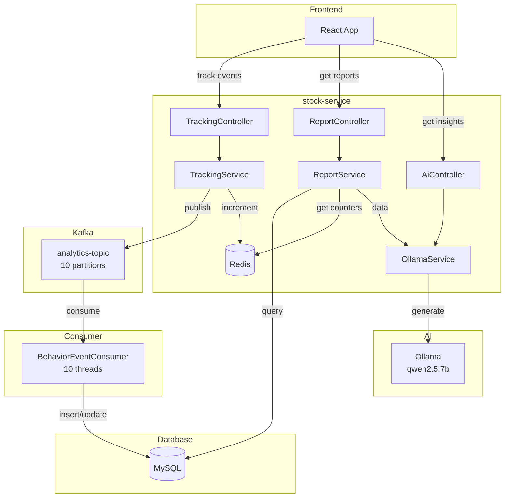
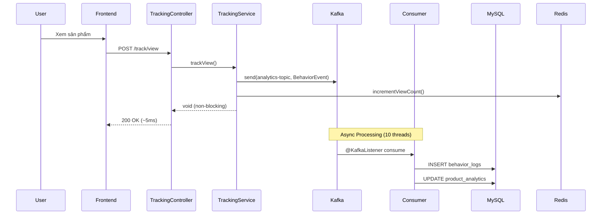

# 📊 USER BEHAVIOR ANALYTICS - Phân Tích Hành Vi Người Dùng

## 📌 Tổng Quan

Chức năng **Phân tích hành vi người dùng** cho phép Shop Owner theo dõi và phân tích cách khách hàng tương tác với sản phẩm, từ đó đưa ra quyết định kinh doanh tốt hơn.

### Công Nghệ Sử Dụng

| Component | Technology | Purpose |
|-----------|------------|---------|
| **Event Processing** | Apache Kafka | High throughput async tracking |
| **Data Storage** | MySQL | Historical data & aggregates |
| **Real-time Cache** | Redis | Instant counters |
| **AI Insights** | Ollama (qwen2.5:7b) | Smart recommendations |
| **Service** | stock-service | Backend integration |

---

## 🏗️ Kiến Trúc Hệ Thống



---

## 📈 Các Loại Hành Vi Được Track

| Event Type | Mô Tả | Trigger |
|------------|-------|---------|
| `VIEW` | Xem sản phẩm | User click vào product detail |
| `SEARCH` | Tìm kiếm | User search keyword |
| `ADD_CART` | Thêm giỏ hàng | User add product to cart |
| `PURCHASE` | Mua hàng | Order completed |

---

## 📊 Metrics Analytics

### Cho Shop Owner

| Metric | Mô tả | Công thức |
|--------|-------|-----------|
| **View Count** | Số lần sản phẩm được xem | `COUNT(views)` |
| **Add-to-Cart Rate** | Tỷ lệ thêm giỏ hàng | `carts / views * 100%` |
| **Conversion Rate** | Tỷ lệ mua hàng | `purchases / views * 100%` |
| **Abandoned Products** | Sản phẩm xem nhiều nhưng không mua | `views > 100 AND purchases < 5` |

### Phễu Chuyển Đổi (Funnel)

```
Views (12,450)
    ↓ 14.6%
Add to Cart (1,823)
    ↓ 25.0%
Purchase (456)
```

---

## 🗄️ Database Schema

### Table: behavior_logs

```sql
CREATE TABLE behavior_logs (
    id VARCHAR(36) PRIMARY KEY,
    user_id VARCHAR(36),
    session_id VARCHAR(36),
    event_type ENUM('VIEW', 'SEARCH', 'ADD_CART', 'PURCHASE'),
    product_id VARCHAR(36),
    shop_id VARCHAR(36),
    search_keyword VARCHAR(255),
    source VARCHAR(50),
    duration_seconds INT,
    created_at DATETIME DEFAULT CURRENT_TIMESTAMP,
    
    INDEX idx_product_id (product_id),
    INDEX idx_shop_id (shop_id),
    INDEX idx_event_type (event_type),
    INDEX idx_created_at (created_at)
);
```

### Table: product_analytics

```sql
CREATE TABLE product_analytics (
    product_id VARCHAR(36) PRIMARY KEY,
    shop_id VARCHAR(36),
    view_count BIGINT DEFAULT 0,
    cart_count BIGINT DEFAULT 0,
    purchase_count BIGINT DEFAULT 0,
    unique_viewers BIGINT DEFAULT 0,
    conversion_rate DOUBLE DEFAULT 0,
    last_viewed_at DATETIME,
    updated_at DATETIME DEFAULT CURRENT_TIMESTAMP ON UPDATE CURRENT_TIMESTAMP,
    
    INDEX idx_shop_id (shop_id),
    INDEX idx_view_count (view_count DESC)
);
```

### Table: search_analytics

```sql
CREATE TABLE search_analytics (
    id VARCHAR(36) PRIMARY KEY,
    keyword VARCHAR(255),
    search_count BIGINT DEFAULT 0,
    click_count BIGINT DEFAULT 0,
    date DATE,
    
    UNIQUE KEY uk_keyword_date (keyword, date),
    INDEX idx_date (date)
);
```

---

## 🔄 Kafka Flow



### Kafka Configuration

- **Topic**: `analytics-topic`
- **Partitions**: 10
- **Replicas**: 1
- **Consumer Threads**: 10 (ConcurrentKafkaListenerContainerFactory)
- **Throughput**: ~2000-5000 events/second

---

## 🤖 Ollama AI Integration

### Model: qwen2.5:7b

Được chọn vì hỗ trợ tiếng Việt rất tốt.

### Features

| Feature | Mô Tả |
|---------|-------|
| **Trend Analysis** | Phân tích xu hướng sản phẩm |
| **Recommendations** | Đề xuất hành động cho shop owner |
| **Alert Detection** | Phát hiện bất thường |
| **Report Generation** | Tạo báo cáo tự động |

### Sample AI Output

```json
{
  "insights": [
    "iPhone 15 đang hot, tăng 45% views tuần này",
    "Conversion rate tăng 12% so với tuần trước",
    "3 sản phẩm có views cao nhưng 0 orders"
  ],
  "recommendations": [
    "Nên giảm giá Samsung S24 vì conversion rate thấp (1.2%)",
    "Tạo combo deal cho AirPods + iPhone case",
    "Review lại mô tả sản phẩm có views cao nhưng ít mua"
  ],
  "summary": "Shop hoạt động tốt với 12,450 views tuần này. Conversion rate 3.6% cao hơn trung bình ngành. Cần chú ý 3 sản phẩm abandoned."
}
```

---

## 🔌 API Endpoints

### Tracking APIs (Public - Frontend gọi)

| Method | Endpoint | Description |
|--------|----------|-------------|
| POST | `/v1/stock/analytics/track/view` | Track product view |
| POST | `/v1/stock/analytics/track/search` | Track search |
| POST | `/v1/stock/analytics/track/cart` | Track add to cart |

#### Request Examples

```bash
# Track view
POST /v1/stock/analytics/track/view
{
  "productId": "prod-123",
  "source": "homepage",
  "duration": 30,
  "sessionId": "sess-abc"
}

# Track search
POST /v1/stock/analytics/track/search
{
  "keyword": "iphone 15",
  "sessionId": "sess-abc"
}

# Track add to cart
POST /v1/stock/analytics/track/cart
{
  "productId": "prod-123"
}
```

### Report APIs (Shop Owner only)

| Method | Endpoint | Description |
|--------|----------|-------------|
| GET | `/v1/stock/analytics/shop/overview` | Shop analytics overview |
| GET | `/v1/stock/analytics/shop/top-products` | Top viewed products |
| GET | `/v1/stock/analytics/shop/funnel` | Conversion funnel |
| GET | `/v1/stock/analytics/shop/abandoned-products` | High view, low purchase |
| GET | `/v1/stock/analytics/shop/ai-insights` | AI-generated insights |

#### Response Examples

```json
// GET /v1/stock/analytics/shop/overview
{
  "totalViews": 12450,
  "totalCarts": 1823,
  "totalPurchases": 456,
  "overallConversionRate": 3.66,
  "topViewedProducts": [...],
  "abandonedProducts": [...],
  "funnel": {
    "views": 12450,
    "carts": 1823,
    "purchases": 456,
    "viewToCartRate": 14.64,
    "cartToPurchaseRate": 25.01
  }
}
```

---

## 🎨 Dashboard UI Mockup

```
┌──────────────────────────────────────────────────────────────┐
│  📊 ANALYTICS DASHBOARD - [TÊN SHOP]                         │
├──────────────────────────────────────────────────────────────┤
│  ┌────────────┐  ┌────────────┐  ┌────────────┐  ┌─────────┐ │
│  │ 👁️ Views   │  │ 🛒 Add Cart │  │ 💳 Orders  │  │ 📈 CVR  │ │
│  │   12,450   │  │    1,823    │  │     456    │  │  3.66%  │ │
│  │   +12%     │  │    +8%      │  │    +15%    │  │  +0.5%  │ │
│  └────────────┘  └────────────┘  └────────────┘  └─────────┘ │
├──────────────────────────────────────────────────────────────┤
│  📦 TOP SẢN PHẨM                  │  🤖 AI INSIGHTS          │
│  ┌─────────────────────────────┐  │  ┌─────────────────────┐ │
│  │ 1. iPhone 15 Pro   2,340 👁️ │  │  │ 💡 iPhone 15 đang   │ │
│  │ 2. Samsung S24     1,890 👁️ │  │  │    hot, +45% views  │ │
│  │ 3. AirPods Pro 2   1,567 👁️ │  │  │ 💡 Nên giảm giá     │ │
│  └─────────────────────────────┘  │  │    Samsung S24...   │ │
│                                   │  └─────────────────────┘ │
├───────────────────────────────────┴──────────────────────────┤
│  📉 PHỄU CHUYỂN ĐỔI                                          │
│  Views ████████████████████████████████ 12,450               │
│  Cart  ██████                            1,823 (14.6%)       │
│  Buy   ██                                  456 (25.0%)       │
└──────────────────────────────────────────────────────────────┘
```

---

## 🐳 Docker Setup

### docker-compose.yml (thêm Ollama)

```yaml
services:
  ollama:
    image: ollama/ollama:latest
    container_name: ollama
    ports:
      - "11434:11434"
    volumes:
      - ollama_data:/root/.ollama
    deploy:
      resources:
        reservations:
          devices:
            - driver: nvidia
              count: 1
              capabilities: [gpu]

volumes:
  ollama_data:
```

### Pull Model

```bash
# Sau khi container chạy
docker exec ollama ollama pull qwen2.5:7b
```

---

## ⚙️ Application Configuration

### application.yml (stock-service)

```yaml
# Kafka Analytics
kafka:
  topic:
    analytics: analytics-topic

spring:
  kafka:
    consumer:
      bootstrap-servers: ${KAFKA_BOOTSTRAP_SERVERS:localhost:9092}
      group-id: stock-service
    producer:
      bootstrap-servers: ${KAFKA_BOOTSTRAP_SERVERS:localhost:9092}
      key-serializer: org.apache.kafka.common.serialization.StringSerializer
      value-serializer: org.springframework.kafka.support.serializer.JsonSerializer

  # Ollama AI
  ai:
    ollama:
      base-url: http://localhost:11434
      chat:
        model: qwen2.5:7b
        options:
          temperature: 0.7
```

---

## 📁 File Structure

```
stock-service/src/main/java/com/example/stockservice/
├── config/
│   ├── KafkaConfig.java                     [MODIFY]
│   └── OllamaConfig.java                    [NEW]
├── controller/
│   └── analytics/
│       ├── AnalyticsTrackingController.java [NEW]
│       └── AnalyticsReportController.java   [NEW]
├── dto/
│   └── analytics/
│       ├── BehaviorEvent.java               [NEW]
│       ├── ProductAnalyticsDto.java         [NEW]
│       ├── FunnelDto.java                   [NEW]
│       ├── SearchKeywordDto.java            [NEW]
│       └── AiInsightsResponse.java          [NEW]
├── enums/
│   └── EventType.java                       [NEW]
├── kafka/
│   └── BehaviorEventConsumer.java           [NEW]
├── model/
│   └── analytics/
│       ├── BehaviorLog.java                 [NEW]
│       ├── ProductAnalytics.java            [NEW]
│       └── SearchAnalytics.java             [NEW]
├── repository/
│   └── analytics/
│       ├── BehaviorLogRepository.java       [NEW]
│       ├── ProductAnalyticsRepository.java  [NEW]
│       └── SearchAnalyticsRepository.java   [NEW]
├── request/
│   └── analytics/
│       ├── TrackViewRequest.java            [NEW]
│       ├── TrackSearchRequest.java          [NEW]
│       └── TrackCartRequest.java            [NEW]
├── response/
│   └── analytics/
│       └── ShopAnalyticsResponse.java       [NEW]
└── service/
    └── analytics/
        ├── AnalyticsTrackingService.java    [NEW]
        ├── AnalyticsReportService.java      [NEW]
        ├── AnalyticsRedisService.java       [NEW]
        └── OllamaInsightsService.java       [NEW]
```

---

## ✅ Verification Checklist

### Backend

- [ ] Kafka topic `analytics-topic` được tạo
- [ ] Consumer group `stock-service-analytics` hoạt động
- [ ] API tracking trả về 200 OK nhanh (~5ms)
- [ ] Data được insert vào `behavior_logs`
- [ ] `product_analytics` được update
- [ ] Redis counters hoạt động

### AI

- [ ] Ollama container chạy
- [ ] Model `qwen2.5:7b` được pull
- [ ] API `/ai-insights` trả về insights

### Frontend

- [ ] Tracking hook được gọi khi xem sản phẩm
- [ ] Dashboard hiển thị đúng data
- [ ] AI insights hiển thị

---

## 📊 Tổng Kết

| Aspect | Description |
|--------|-------------|
| **Actor** | Shop Owner |
| **Throughput** | ~2000-5000 events/second |
| **Response Time** | Tracking: ~5ms, Reports: ~100ms |
| **AI Model** | qwen2.5:7b (Vietnamese support) |
| **Storage** | MySQL (historical) + Redis (real-time) |
| **Timeline** | ~20 hours implementation |
