# AI Chat Activity Diagrams

Activity diagrams cho AI Chatbot - đơn giản và dễ nhìn.

---

## 1. Basic Chat Flow (Luồng Cơ Bản)

**User gửi tin nhắn → AI trả lời**

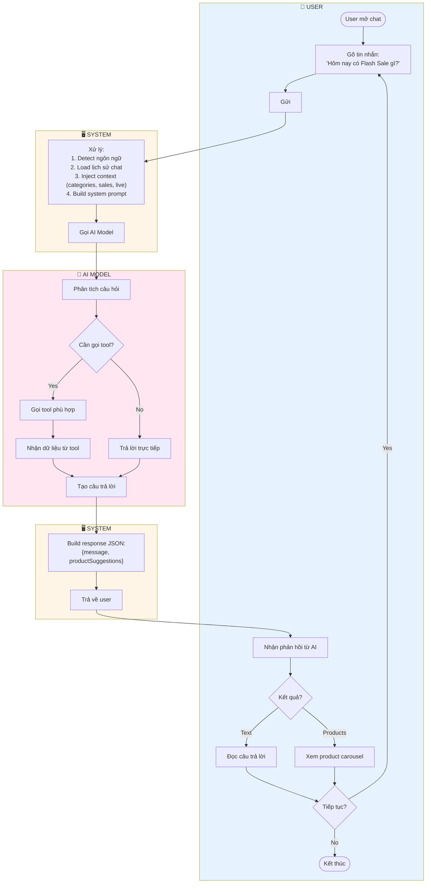

---

## 2. AI Tool Routing (Chọn Tool)

**AI phân tích và chọn tool phù hợp với câu hỏi**

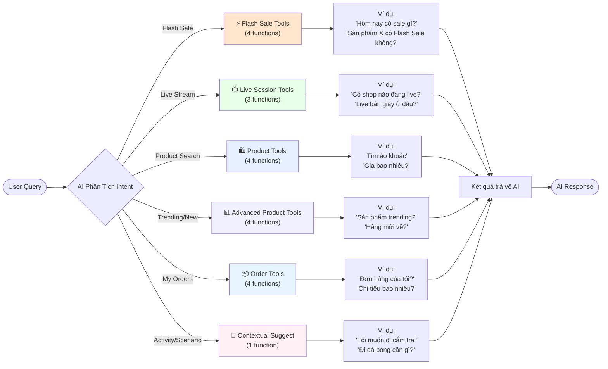

---

## 3. Context Injection (Tiêm Ngữ Cảnh)

**System inject real-time context vào AI mỗi request**

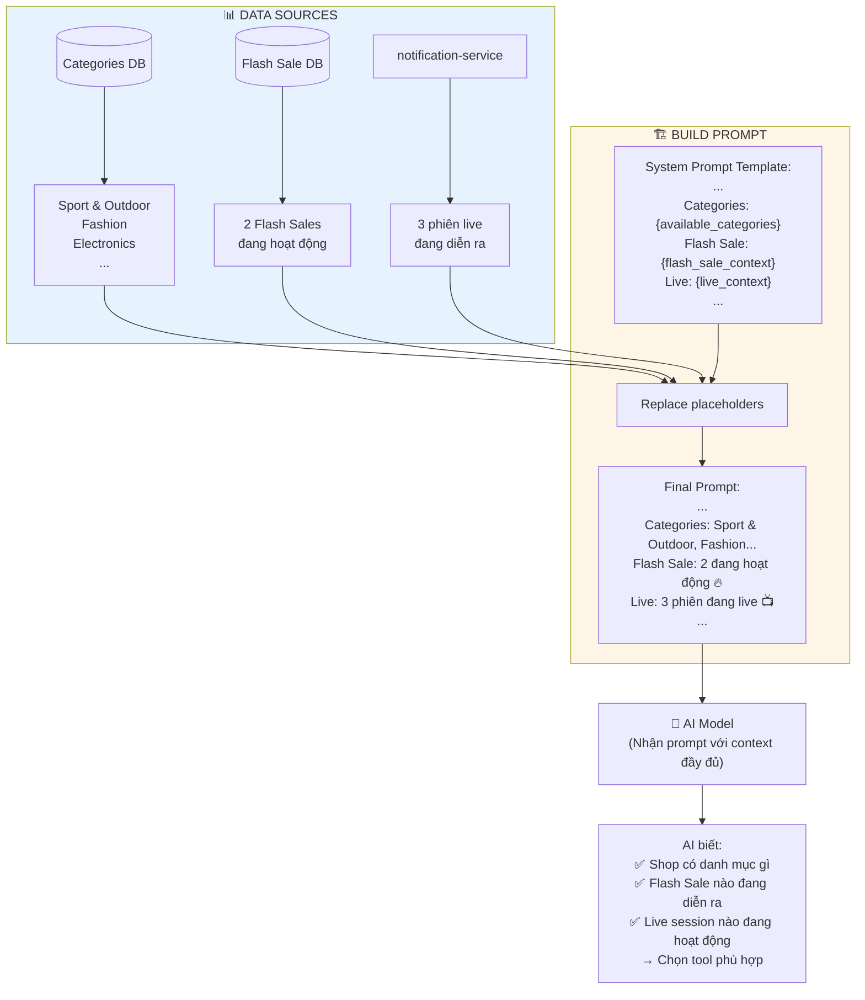

---

## 4. Tool Functions Summary

**Tổng hợp 20 AI functions**

| Tool Class | Count | Functions | Example Questions |
|------------|-------|-----------|-------------------|
| ⚡ **Flash Sale** | 4 | getCurrentFlashSales, getFlashSaleProducts, checkProductInFlashSale, getUpcomingFlashSales | "Flash Sale hôm nay?", "Sản phẩm X có sale không?" |
| 📺 **Live Sessions** | 3 | getActiveLiveSessions, searchLiveByKeyword, getLiveDetails | "Shop nào đang live?", "Live bán giày?" |
| 📊 **Advanced Products** | 4 | getTrendingProducts, getNewArrivals, getProductsByCategory, getCategories | "Trending?", "Hàng mới?", "Danh mục?" |
| 🛍️ **Products** | 4 | searchProducts, getProductPrice, getDiscountedProducts, getProductDetails | "Tìm giày", "Giá?", "Giảm giá?" |
| 📦 **Orders** | 4 | getMyOrders, getOrderStatus, getOrdersByPayment, getSpendingStats | "Đơn hàng?", "Trạng thái?", "Chi tiêu?" |
| 🎯 **Contextual** | 1 | suggestProductsByScenario | "Tôi muốn đi cắm trại" |

**Total: 20 functions**

---

## Key Features

✅ **Context-Aware**: AI biết shop có gì, Flash Sale nào, Live nào  
✅ **Real-time**: Context được inject mỗi request  
✅ **Smart Routing**: AI tự chọn tool phù hợp  
✅ **Product Carousel**: Hiển thị kèm danh sách sản phẩm  
✅ **Complete Order Info**: Fix hiển thị đầy đủ (ID, status, tổng tiền ✅, items, date)

---

**Last Updated:** 2026-01-15  
**Status:** ✅ Complete - 3 simplified diagrams

**Tổng hợp toàn bộ luồng chat với 20 AI functions**

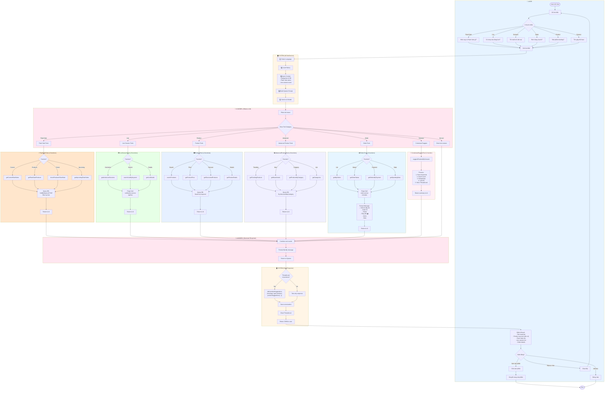

---

## 2. Context Injection & System Initialization

**Cơ chế tiêm ngữ cảnh động vào AI prompt**

```mermaid
flowchart LR
    subgraph Init["⚙️ SYSTEM INIT (Startup)"]
        A[AIChatService<br/>Khởi tạo] --> B[Load Categories]
        B --> C[CategoryRepository<br/>findAll]
        C --> D["Categories List:<br/>Sport & Outdoor,<br/>Fashion, Electronics,..."]
    end
    
    subgraph Request["📨 MỖI REQUEST"]
        R1[User gửi message] --> R2[Get Flash Sale Context]
        R2 --> R3["FlashSaleTools:<br/>getCurrentFlashSales<br/>→ '2 Flash Sales đang hoạt động'"]
        
        R3 --> R4[Get Live Context]
        R4 --> R5["LiveSessionTools:<br/>getActiveLiveSessions<br/>→ '3 phiên live đang hoạt động'"]
    end
    
    subgraph Build["🏗️ BUILD PROMPT"]
        D --> P1[System Prompt Template]
        R3 --> P1
        R5 --> P1
        
        P1 --> P2["Replace placeholders:<br/>{available_categories}<br/>{flash_sale_context}<br/>{live_context}<br/>{current_time}<br/>{user_id}"]
        
        P2 --> P3[Final System Prompt]
    end
    
    subgraph Prompt["📝 FINAL PROMPT"]
        P3 --> Content["CONTEXT:<br/>- Categories: Sport & Outdoor, Fashion...<br/>- Flash Sale: 2 đang hoạt động 🔥<br/>- Live: 3 phiên đang live 📺<br/>- Time: 15/01/2026 00:00<br/><br/>TOOLS AVAILABLE:<br/>- Flash Sale Tools (4)<br/>- Live Tools (3)<br/>- Product Tools (8)<br/>- Order Tools (4)<br/>- Contextual Suggest (1)"]
    end
    
    Content --> Send[Send to AI Model]
    Send --> AI[AI có đầy đủ context<br/>để quyết định tool phù hợp]
    
    style Init fill:#fff5e6
    style Request fill:#e6f3ff
    style Build fill:#f0fff0
    style Prompt fill:#ffe6f0
```

---

## AI Capabilities Summary

### 🎯 20 AI Functions Across 6 Tool Classes

| Category | Functions | Use Cases |
|----------|-----------|-----------|
| **🔥 Flash Sale** | 4 | "Hôm nay có Flash Sale gì?", "Sản phẩm X có sale không?" |
| **📺 Live Sessions** | 3 | "Có shop nào đang live?", "Live bán giày ở đâu?" |
| **📊 Advanced Products** | 4 | "Sản phẩm trending?", "Hàng mới về?", "Danh mục nào?" |
| **🛍️ Basic Products** | 4 | "Tìm giày", "Giá bao nhiêu?", "Sản phẩm giảm giá?" |
| **📦 Orders** | 4 | "Đơn hàng của tôi?", "Chi tiêu bao nhiêu?", "Trạng thái đơn?" |
| **🎯 Contextual** | 1 | "Tôi muốn đi cắm trại" → gợi ý lều, túi ngủ, thảm |

### ✅ Key Features

- **Context-Aware**: AI biết shop có danh mục gì, Flash Sale nào, Live nào
- **Real-time Data**: Context được inject mỗi request
- **Smart Routing**: AI tự chọn tool phù hợp dựa trên intent
- **Product Carousel**: Kết quả trả về kèm carousel (nếu có)
- **Fixed Order Display**: Hiển thị đủ thông tin đơn hàng (ID, status, tổng tiền ✅, items, date)

---

**Last Updated:** 2026-01-15  
**Status:** ✅ Complete - 2 consolidated diagrams

---

## Table of Contents

**Core Features:**
1. [Basic Chat Flow](#1-basic-chat-flow) - User sends message → AI responds
2. [Flash Sale Query](#2-flash-sale-query) - Query active/upcoming Flash Sales
3. [Live Session Discovery](#3-live-session-discovery) - Find active live streams
4. [Product Suggestion by Scenario](#4-product-suggestion-by-scenario) - Contextual product recommendations
5. [Order Management Query](#5-order-management-query) - View orders and spending
6. [Advanced Product Discovery](#6-advanced-product-discovery) - Trending, new arrivals, categories

---

## 1. Basic Chat Flow

**User sends message and receives AI response with context awareness**

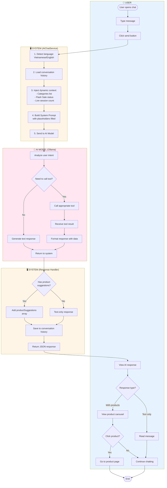

---

## 2. Flash Sale Query

**User asks about Flash Sales - AI calls FlashSaleTools**

```mermaid
flowchart TD
    Start([User asks:<br/>'Hôm nay có Flash Sale gì?'])
    
    subgraph User["👤 USER"]
        Start --> SendMsg[Send message]
        
        ViewFlashSales["View Flash Sale info:<br/>- Session name<br/>- Time range<br/>- Product count<br/>- Max discount %"]
        ViewFlashSales --> UserAction{Action?}
        UserAction -->|View products| AskProducts[Ask about specific sale]
        UserAction -->|Check product| AskCheck[Ask if product in sale]
        UserAction -->|Continue| ContinueChat[Continue chatting]
    end
    
    subgraph System["🖥️ SYSTEM"]
        SendMsg --> PreInject[Context already injected:<br/>'2 Flash Sales đang hoạt động']
        PreInject --> SendAI[Send to AI]
    end
    
    subgraph AI["🤖 AI MODEL"]
        SendAI --> SeeContext[AI sees context in prompt]
        SeeContext --> Decide{User query<br/>type?}
        Decide -->|Current sales| CallCurrent[Call: getCurrentFlashSales]
        Decide -->|Upcoming| CallUpcoming[Call: getUpcomingFlashSales]
        Decide -->|Check product| CallCheck[Call: checkProductInFlashSale]
        Decide -->|View products| CallProducts[Call: getFlashSaleProducts]
    end
    
    subgraph FlashSaleTools["⚡ FlashSaleTools"]
        CallCurrent --> QueryActive[Query: findByStatus(ACTIVE)<br/>filter by time]
        CallUpcoming --> QueryUpcoming[Query: ACTIVE sessions<br/>with future startTime]
        CallCheck --> QueryProduct[Query: findByProductId]
        CallProducts --> QueryBySession[Query: findBySessionId]
        
        QueryActive --> FormatFlash[Format response:<br/>sessionInfo + message]
        QueryUpcoming --> FormatFlash
        QueryProduct --> FormatFlash
        QueryBySession --> FormatFlash
        FormatFlash --> ReturnTool[Return to AI]
    end
    
    subgraph AI2["🤖 AI MODEL (cont)"]
        ReturnTool --> GenerateMsg[Generate friendly message]
        GenerateMsg --> ReturnSystem[Return to system]
    end
    
    ReturnSystem --> ViewFlashSales
    AskProducts --> End([End])
    AskCheck --> End
    ContinueChat --> End
    
    style User fill:#e6f3ff
    style System fill:#fff5e6
    style AI fill:#ffe6f0
    style AI2 fill:#ffe6f0
    style FlashSaleTools fill:#ffe6cc
```

---

## 3. Live Session Discovery

**User searches for active live streaming sessions**

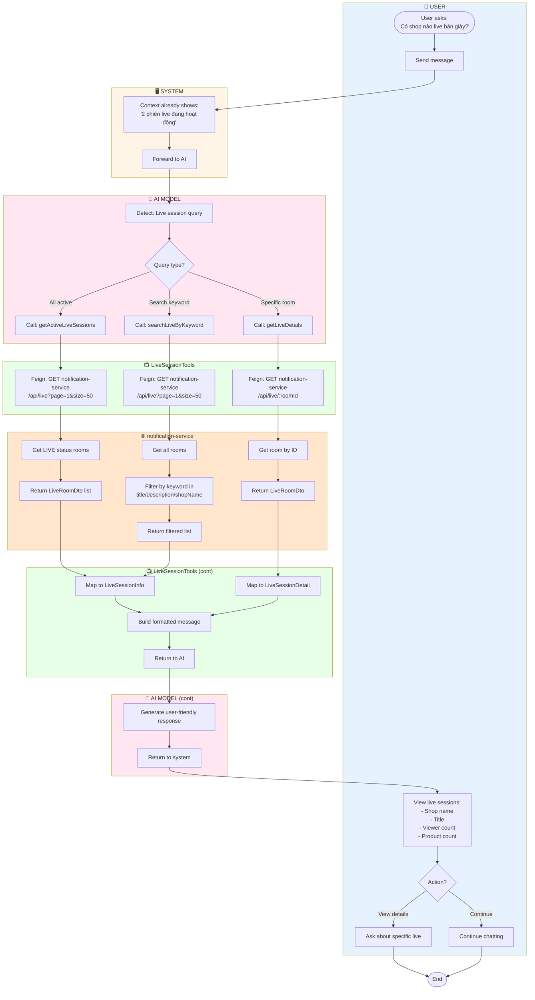

---

## 4. Product Suggestion by Scenario

**Context-aware product suggestions based on user activity**

```mermaid
flowchart TD
    Start([User says:<br/>'Tôi muốn đi cắm trại'])
    
    subgraph User["👤 USER"]
        Start --> SendScenario[Send scenario message]
        
        ViewSuggestions["View suggestions:<br/>- AI text explanation<br/>- Product carousel<br/>- Click to view product"]
        ViewSuggestions --> UserChoice{Action?}
        UserChoice -->|View product| ClickCard[Click product card]
        UserChoice -->|Ask more| AskMore[Ask follow-up question]
        ClickCard --> Navigate[Go to product page]
    end
    
    subgraph System["🖥️ SYSTEM"]
        SendScenario --> LoadCategories[Categories already in prompt:<br/>'Sport & Outdoor (Camping gear)']
        LoadCategories --> SendAI[Send to AI]
    end
    
    subgraph AI["🤖 AI MODEL"]
        SendAI --> ReadContext[Read shop categories]
        ReadContext --> InferKeywords["Infer keywords matching inventory:<br/>'lều', 'túi ngủ', 'thảm'"]
        InferKeywords --> CallSuggest[Call: suggestProductsByScenario<br/>(keywords)]
    end
    
    subgraph ContextualTool["🎯 ContextualSuggestTool"]
        CallSuggest --> ParseKeywords[Parse keyword list]
        ParseKeywords --> LoopSearch{For each keyword}
        LoopSearch --> SearchDB[searchProducts(keyword)]
        SearchDB --> AddResults[Add to results list]
        AddResults --> LoopSearch
        LoopSearch -->|All done| Deduplicate[Remove duplicates]
        Deduplicate --> LimitResults[Limit to top 20]
        LimitResults --> StoreThread[Store in ThreadLocal]
        StoreThread --> ReturnText[Return summary text to AI]
    end
    
    subgraph AI2["🤖 AI MODEL (cont)"]
        ReturnText --> GenerateFriendly[Generate friendly explanation]
        GenerateFriendly --> ReturnSys[Return to system]
    end
    
    subgraph System2["🖥️ SYSTEM (Response)"]
        ReturnSys --> CheckThread{ThreadLocal<br/>has products?}
        CheckThread -->|Yes| EnrichJSON["Enrich response:<br/>{message, type: 'products',<br/>productSuggestions: [...]}"]
        CheckThread -->|No| TextJSON[Text-only response]
        EnrichJSON --> ClearThread[Clear ThreadLocal]
        TextJSON --> ReturnUser
        ClearThread --> ReturnUser[Return to user]
    end
    
    ReturnUser --> ViewSuggestions
    Navigate --> End([End])
    AskMore --> End
    
    style User fill:#e6f3ff
    style System fill:#fff5e6
    style System2 fill:#fff5e6
    style AI fill:#ffe6f0
    style AI2 fill:#ffe6f0
    style ContextualTool fill:#fff0f5
```

---

## 5. Order Management Query

**User views their orders with full details**

```mermaid
flowchart TD
    Start([User asks:<br/>'Đơn hàng của tôi thế nào?'])
    
    subgraph User["👤 USER"]
        Start --> SendQuery[Send message]
        
        ViewOrders["View order list:<br/>📦 Đơn hàng của bạn (X đơn):<br/>- Order ID<br/>- Status<br/>- Total amount ✅<br/>- Item count<br/>- Created date"]
        ViewOrders --> UserAction{What next?}
        UserAction -->|Check status| AskStatus[Ask about order status]
        UserAction -->|View spending| AskSpending[Ask about spending stats]
        UserAction -->|Done| FinishChat[End conversation]
    end
    
    subgraph System["🖥️ SYSTEM"]
        SendQuery --> ForwardAI[Forward to AI]
    end
    
    subgraph AI["🤖 AI MODEL"]
        ForwardAI --> DetectOrder[Detect: Order query]
        DetectOrder --> ChooseFunc{Query type?}
        ChooseFunc -->|List orders| CallGetOrders[Call: getMyOrders<br/>(userId)]
        ChooseFunc -->|Order status| CallStatus[Call: getOrderStatus<br/>(orderId)]
        ChooseFunc -->|Payment filter| CallPayment[Call: getOrdersByPayment<br/>(paymentType)]
        ChooseFunc -->|Spending| CallSpending[Call: getSpendingStats<br/>(userId)]
    end
    
    subgraph OrderTools["📦 OrderTools"]
        CallGetOrders --> FetchOrders[Feign: GET order-service<br/>/v1/order/user/:userId]
        CallStatus --> FetchStatus[Feign: GET order-service<br/>/v1/order/:orderId]
        CallPayment --> FetchPayment[Feign: GET order-service<br/>/v1/order/user/:userId<br/>filter by payment]
        CallSpending --> FetchStats[Feign: GET order-service<br/>/v1/order/user/:userId<br/>aggregate stats]
        
        FetchOrders --> MapOrders[Map to OrderSummary]
        FetchStatus --> MapStatus[Map to OrderDetail]
        FetchPayment --> MapPayment[Map to OrderSummary list]
        FetchStats --> MapStats[Calculate total/avg/count]
        
        MapOrders --> BuildMessage["Build formatted message:<br/>- Order ID<br/>- Trạng thái<br/>- Tổng tiền 💰<br/>- Số sản phẩm<br/>- Ngày đặt"]
        MapStatus --> BuildMessage
        MapPayment --> BuildMessage
        MapStats --> BuildMessage
        BuildMessage --> ReturnAI[Return to AI]
    end
    
    subgraph AI2["🤖 AI MODEL (cont)"]
        ReturnAI --> FormatNatural[Format in natural language]
        FormatNatural --> ReturnSys[Return to system]
    end
    
    ReturnSys --> ViewOrders
    AskStatus --> End([End])
    AskSpending --> End
    FinishChat --> End
    
    style User fill:#e6f3ff
    style System fill:#fff5e6
    style AI fill:#ffe6f0
    style AI2 fill:#ffe6f0
    style OrderTools fill:#e6f5ff
```

---

## 6. Advanced Product Discovery

**Trending products, new arrivals, category browsing**

```mermaid
flowchart TD
    Start([User asks:<br/>'Sản phẩm nào đang trending?'])
    
    subgraph User["👤 USER"]
        Start --> SendQuery[Send message]
        
        ViewResults["View product list:<br/>- Product name<br/>- Price<br/>- Discount %<br/>- Category<br/>- Stock status"]
        ViewResults --> UserAction{Action?}
        UserAction -->|Browse category| AskCategory[Ask about category]
        UserAction -->|View new| AskNew[Ask about new arrivals]
        UserAction -->|Continue| Continue[Continue chat]
    end
    
    subgraph System["🖥️ SYSTEM"]
        SendQuery --> ForwardAI[Forward to AI]
    end
    
    subgraph AI["🤖 AI MODEL"]
        ForwardAI --> AnalyzeQuery[Analyze query intent]
        AnalyzeQuery --> SelectFunc{Query type?}
        SelectFunc -->|Trending| CallTrending[Call: getTrendingProducts<br/>(limit)]
        SelectFunc -->|New arrivals| CallNew[Call: getNewArrivals<br/>(days, limit)]
        SelectFunc -->|By category| CallCategory[Call: getProductsByCategory<br/>(categoryName)]
        SelectFunc -->|List categories| CallList[Call: getCategories]
    end
    
    subgraph AdvancedTools["📊 AdvancedProductTools"]
        CallTrending --> QueryTrending["Query products:<br/>ORDER BY discountPercent DESC<br/>LIMIT X"]
        CallNew --> QueryNew["Query products:<br/>createdTimestamp > cutoffDate<br/>ORDER BY createdTimestamp DESC"]
        CallCategory --> QueryCategory["Query products:<br/>WHERE category.name = X"]
        CallList --> QueryCategories[Query: findAll categories]
        
        QueryTrending --> MapProducts[Map to ProductInfo]
        QueryNew --> MapProducts
        QueryCategory --> MapProducts
        QueryCategories --> MapCategories[Map to CategoryInfo]
        
        MapProducts --> FormatProduct["Format message:<br/>- Name<br/>- Price + discount<br/>- Category<br/>- Stock"]
        MapCategories --> FormatCat["Format categories:<br/>- Name<br/>- Product count"]
        FormatProduct --> ReturnAI
        FormatCat --> ReturnAI[Return to AI]
    end
    
    subgraph AI2["🤖 AI MODEL (cont)"]
        ReturnAI --> GenerateResponse[Generate user-friendly response]
        GenerateResponse --> ReturnSys[Return to system]
    end
    
    ReturnSys --> ViewResults
    AskCategory --> End([End])
    AskNew --> End
    Continue --> End
    
    style User fill:#e6f3ff
    style System fill:#fff5e6
    style AI fill:#ffe6f0
    style AI2 fill:#ffe6f0
    style AdvancedTools fill:#f0f0ff
```

---

## AI Tools Summary

| Tool Class | Functions | Purpose |
|------------|-----------|---------|
| 🔥 **FlashSaleTools** | 4 | Query Flash Sales, check product status |
| 📺 **LiveSessionTools** | 3 | Discover live streams via notification-service |
| 📊 **AdvancedProductTools** | 4 | Trending, new, category browsing |
| 🛍️ **ProductTools** | 4 | Search, price, discounts, details |
| 📦 **OrderTools** | 4 | Orders, status, payment filter, spending |
| 🎯 **ContextualSuggestTool** | 1 | Scenario-based suggestions |

**Total**: **20 AI Functions**

---

## Context Injection Mechanism

The system dynamically injects real-time context into the AI prompt:

```plaintext
REAL-TIME UPDATES:
- 🔥 Flash Sale: {flash_sale_context}
  → Example: "2 Flash Sale đang hoạt động"
  
- 📺 Live Sessions: {live_context}
  → Example: "3 phiên live đang hoạt động"
  
- 📂 Categories: {available_categories}
  → Example: "Sport & Outdoor, Fashion, Electronics, Home & Living"
```

This allows AI to:
1. **Know** what's happening in real-time
2. **Suggest** relevant tools to call
3. **Infer** keywords matching actual inventory

---

**Last Updated:** 2026-01-15  
**Status:** ✅ Complete - Flowchart with swimlanes

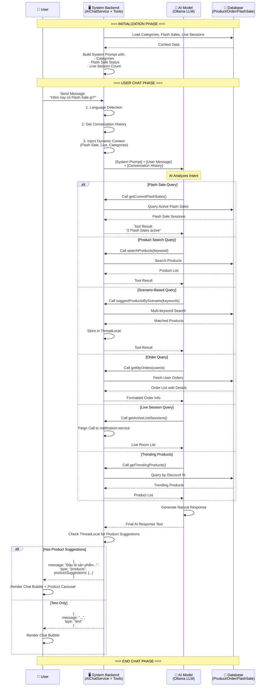

---

## 2. AI Tool Decision Tree

```mermaid
flowchart TD
    Start([User Message]) --> Analyze{AI Phân Tích Intent}
    
    Analyze -->|Flash Sale Query| FlashTools[Flash Sale Tools]
    Analyze -->|Product Search| ProductTools[Product Tools]
    Analyze -->|Scenario/Activity| ContextTools[Contextual Suggest]
    Analyze -->|Order/Spending| OrderTools[Order Tools]
    Analyze -->|Live/Shopping| LiveTools[Live Session Tools]
    Analyze -->|Category Browse| AdvancedTools[Advanced Product Tools]
    
    subgraph FlashSaleTools["🔥 Flash Sale Tools"]
        FlashTools --> FS1[getCurrentFlashSales]
        FlashTools --> FS2[getFlashSaleProducts]
        FlashTools --> FS3[checkProductInFlashSale]
        FlashTools --> FS4[getUpcomingFlashSales]
    end
    
    subgraph ProductTools["🛍️ Product Tools"]
        ProductTools --> PT1[searchProducts]
        ProductTools --> PT2[getProductPrice]
        ProductTools --> PT3[getDiscountedProducts]
        ProductTools --> PT4[getProductDetails]
    end
    
    subgraph ContextualSuggest["🎯 Contextual Tools"]
        ContextTools --> CT1[suggestProductsByScenario<br/>Extract keywords → Search → Dedupe]
    end
    
    subgraph OrderTools["📦 Order Tools"]
        OrderTools --> OT1[getMyOrders]
        OrderTools --> OT2[getOrderStatus]
        OrderTools --> OT3[getOrdersByPayment]
        OrderTools --> OT4[getSpendingStats]
    end
    
    subgraph LiveSessionTools["📺 Live Session Tools"]
        LiveTools --> LT1[getActiveLiveSessions]
        LiveTools --> LT2[searchLiveByKeyword]
        LiveTools --> LT3[getLiveDetails]
    end
    
    subgraph AdvancedProductTools["📊 Advanced Product Tools"]
        AdvancedTools --> AT1[getTrendingProducts]
        AdvancedTools --> AT2[getNewArrivals]
        AdvancedTools --> AT3[getProductsByCategory]
        AdvancedTools --> AT4[getCategories]
    end
    
    FS1 --> Return[Return Tool Result to AI]
    FS2 --> Return
    FS3 --> Return
    FS4 --> Return
    PT1 --> Return
    PT2 --> Return
    PT3 --> Return
    PT4 --> Return
    CT1 --> Return
    OT1 --> Return
    OT2 --> Return
    OT3 --> Return
    OT4 --> Return
    LT1 --> Return
    LT2 --> Return
    LT3 --> Return
    AT1 --> Return
    AT2 --> Return
    AT3 --> Return
    AT4 --> Return
    
    Return --> AIResponse[AI Format Response]
    AIResponse --> End([Send to User])
    
    style FlashSaleTools fill:#ffe6e6
    style ProductTools fill:#e6f3ff
    style ContextualSuggest fill:#fff5e6
    style OrderTools fill:#f0fff0
    style LiveSessionTools fill:#f3e6ff
    style AdvancedProductTools fill:#ffe6f5
```

---

## 3. Context Injection Flow (Real-Time Updates)

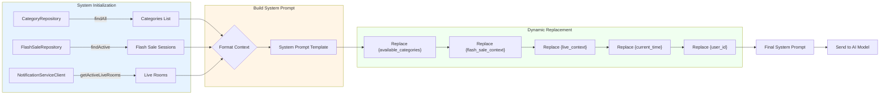

---

## 4. Example: Flash Sale Query Flow

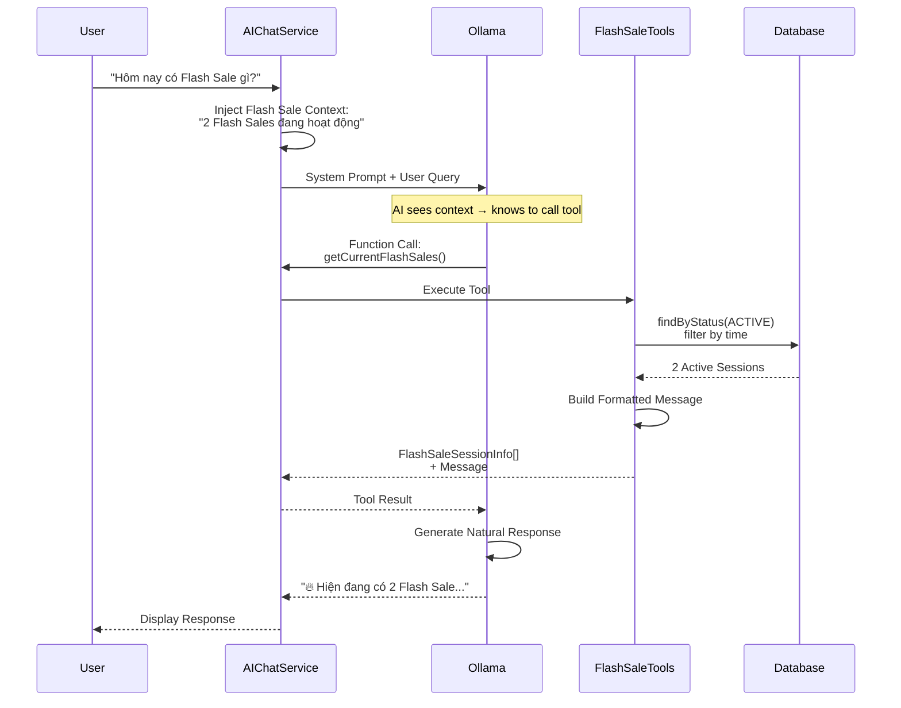

---

## 5. Example: Live Session Discovery Flow

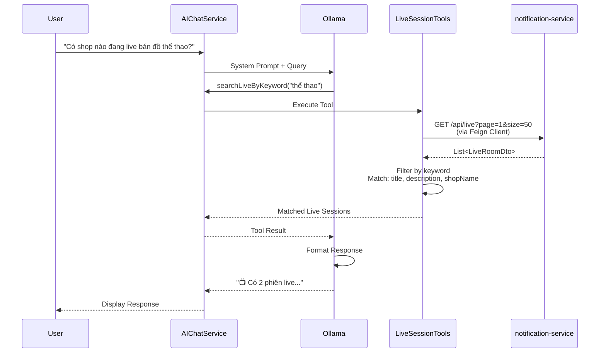

---

## 6. Summary of AI Capabilities

| Category | Functions | Description |
|----------|-----------|-------------|
| 🔥 **Flash Sale** | 4 | Query active/upcoming Flash Sales, check product status |
| 📺 **Live Sessions** | 3 | Find live streams, search by keyword, get details |
| 📊 **Product Discovery** | 4 | Trending, new arrivals, browse by category |
| 🛍️ **Product Search** | 4 | Search, price check, discounts, details |
| 📦 **Order Management** | 4 | View orders, status, filter by payment, spending stats |
| 🎯 **Contextual Suggest** | 1 | Scenario-based product suggestions |

**Total**: **20 AI Functions** (9 existing + 11 new)
