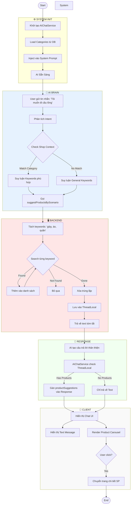
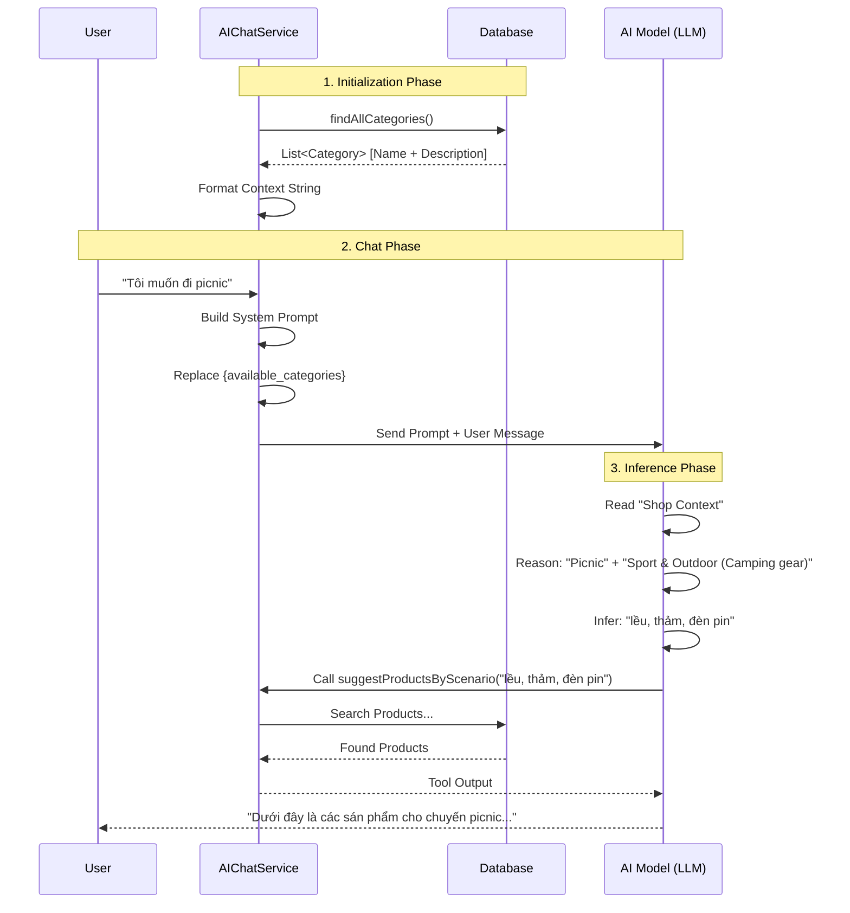

# Activity Diagrams - Context-Aware AI Assistant

Tài liệu mô tả luồng hoạt động của hệ thống AI Chat với khả năng nhận diện ngữ cảnh (Context-Aware) và gợi ý sản phẩm thông minh.

---

## 1. Context-Aware Product Suggestion (Gợi Ý Sản Phẩm Có Ngữ Cảnh)

---

## 2. Dynamic Context Injection Flow (Cơ Chế Tiêm Ngữ Cảnh Động)

---

## 3. Keyword Inference Logic (Logic Suy Luận Từ Khóa)

| User Input | Shop Context (Inventory) | AI Implied Action (Suy Luận) |
|------------|--------------------------|------------------------------|
| "Đánh cầu lông" | Chỉ có `Quần áo`, `Giày` | Tìm: "giày cầu lông", "áo thể thao" (Bỏ qua "vợt") |
| "Đi picnic" | Có `Sport & Outdoor (Camping)` | Tìm: "lều", "túi ngủ", "thảm" |
| "Đi tiệc" | Có `Men Clothes`, `Women Clothes` | Tìm: "váy dạ hội", "vest nam", "giày tây" |
| "Đi bơi" | Không có category liên quan | Tìm: "kính bơi", "đồ bơi" (Fallback general search) |
