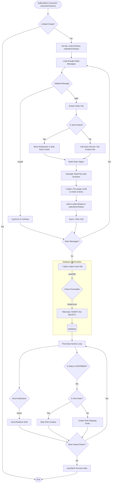

# Optimized Batch Order Processing Activity

## 1. Overview
This document illustrates the high-throughput order processing flow implemented to handle heavy traffic (target: 500-1000 orders/s). The optimization focuses on resolving N+1 Select issues and leveraging Hibernate Batch Inserts.

## 2. Configuration & Key Concepts

### A. `application.properties`
To enable efficient batching, the following configurations are crucial:
```properties
# Batch size: Send 50 inserts in one go
spring.jpa.properties.hibernate.jdbc.batch_size=50

# Order inserts: Group statements by table to maximize batching
spring.jpa.properties.hibernate.order_inserts=true
```

### B. `BaseEntity.java` (The "N+1 Select" Fix)
*   **Problem:** When manually assigning UUIDs (`order.setId(...)`), Hibernate's default behavior (`merge`) triggers a `SELECT` statement to check if the ID exists before inserting. This causes N+1 Selects, killing performance.
*   **Solution:** Implemented `Persistable<String>` interface.
    *   Added `boolean isNew = true` (transient field).
    *   Hibernate checks `isNew()`. If true, it skips the `SELECT` and queues the `INSERT` directly.
    *   This enables **True Batch Insert**.

## 3. Process Flow

1.  **Kafka Consumer (Batch Mode)**: Receives a list of messages (e.g., 50 orders) at once.
2.  **In-Memory Preparation**:
    *   Validates messages.
    *   Constructs `Order` objects.
    *   **Pre-assigns UUIDs** manually (`ensureIdsAssignedForBatchInsert`).
    *   Adds to `ordersToSave` list.
3.  **Batch Insert (The "Magic" Step)**:
    *   `orderRepository.saveAll(ordersToSave)` is called once.
    *   Hibernate converts this into **1 single SQL batch INSERT** (or very few).
    *   Latency drops mainly to IO time.
4.  **Post-Processing**:
    *   After database transaction commits successfuly.
    *   Sends Notifications (Async).
    *   Creates Shipping Orders (GHN) (Sync/Async).

## 4. Activity Diagram


