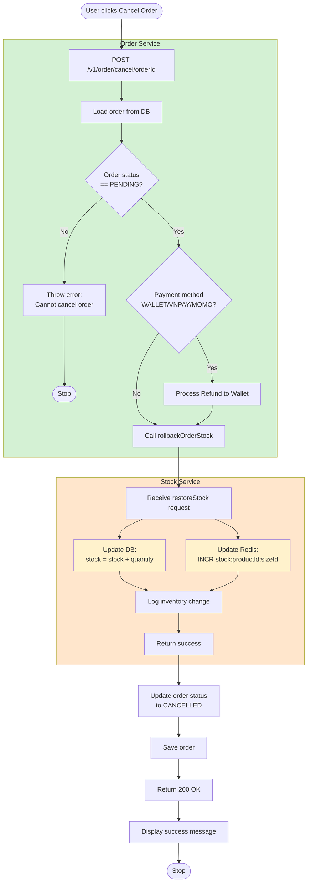
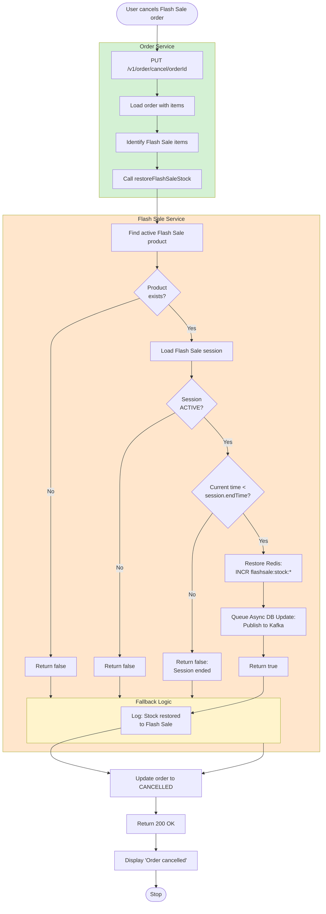
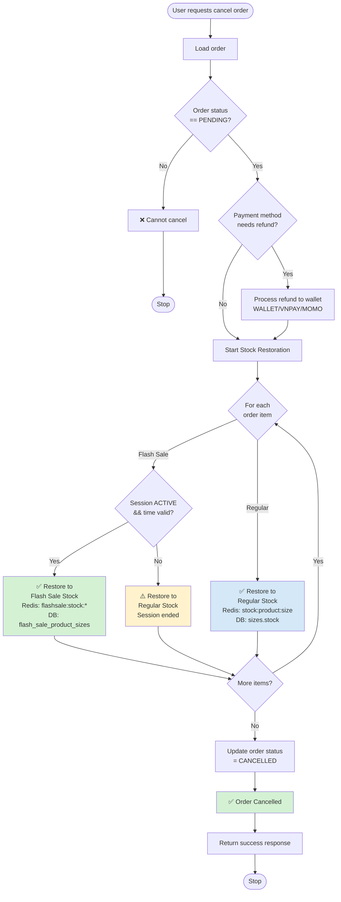

# Cancel Order Activity Documentation

## 🔄 CANCEL ORDER ACTIVITY

### Overview

Cancel Order flow restores stock to both **Redis + DB** for consistency. Flash Sale items are checked for session status - if session ended, stock is restored to regular inventory instead.

---

## Cancel Order - Regular Product

---

## Cancel Order - Flash Sale Product (Active Session)

---

## Cancel Order - Complete Decision Flow

---

## Key Features

### 1. Redis + DB Synchronization
- Before: Only DB updated → Redis cache stale
- After: Both Redis + DB updated → Always in sync

### 2. Flash Sale Session Validation
- Active Session → Restore to Flash Sale Stock
- Ended Session → Restore to Regular Stock (security)

### 3. Refund Processing
- WALLET: Direct refund to user wallet
- VNPAY/MOMO: Refund via wallet
- COD: No refund needed

### 4. Error Resilience
- Continue with other items if one fails
- Log all errors for debugging
- Status updated regardless of minor failures

---

## Performance Metrics

| Operation | Latency | Notes |
|-----------|---------|-------|
| Load order | ~5ms | Single DB query |
| Check refund eligibility | ~2ms | In-memory check |
| Process refund | ~50ms | UserService call |
| Restore regular stock | ~10ms | Redis + DB parallel |
| Restore flash sale stock | ~15ms | + session validation |
| Update order status | ~5ms | Single DB update |
| **Total (Regular)** | **~70ms** | Including refund |
| **Total (Flash Sale)** | **~75ms** | Including session check |

---

**Last Updated:** 2026-01-13  
**Status:** ✅ Implementation Complete
