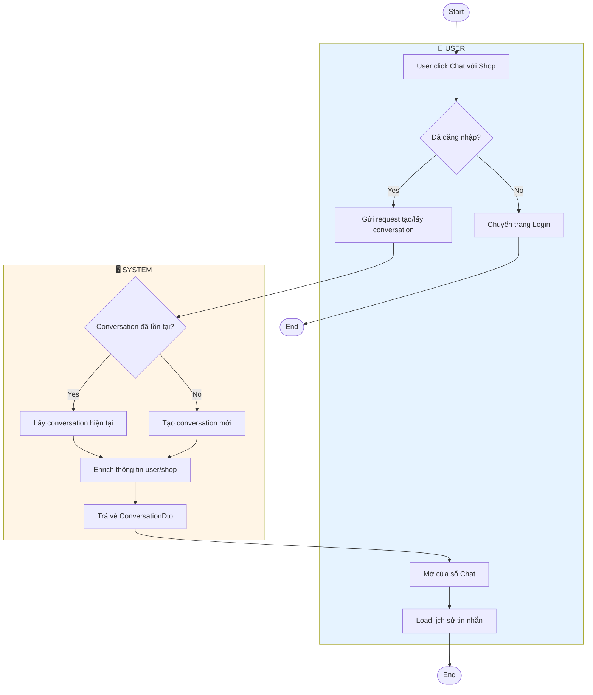
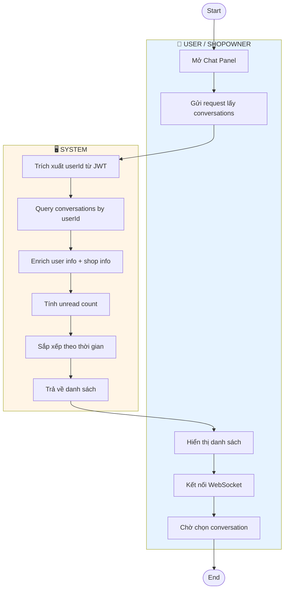
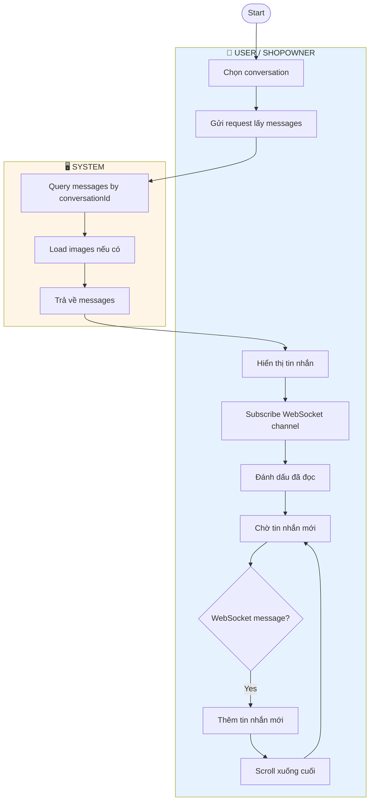
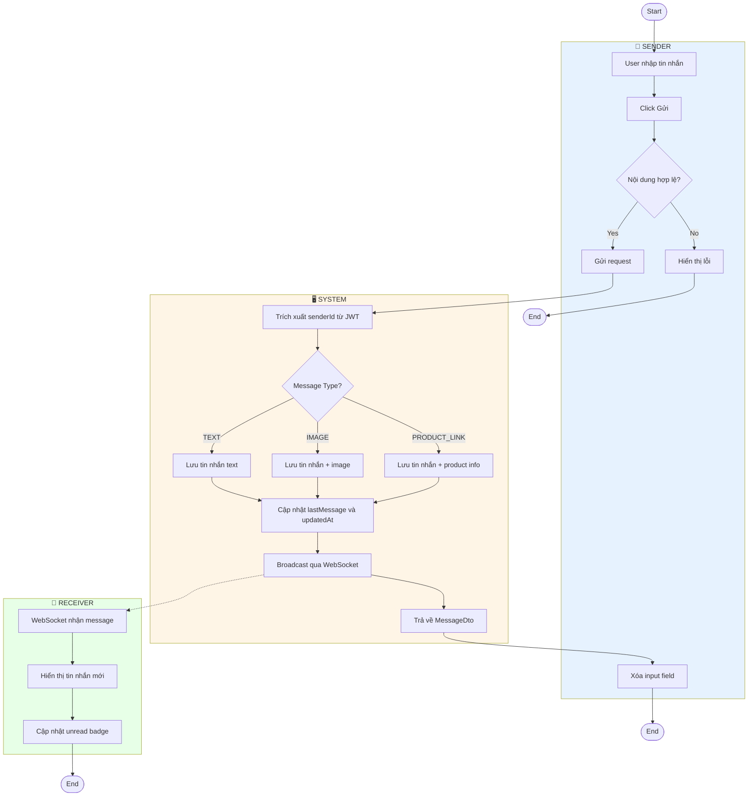
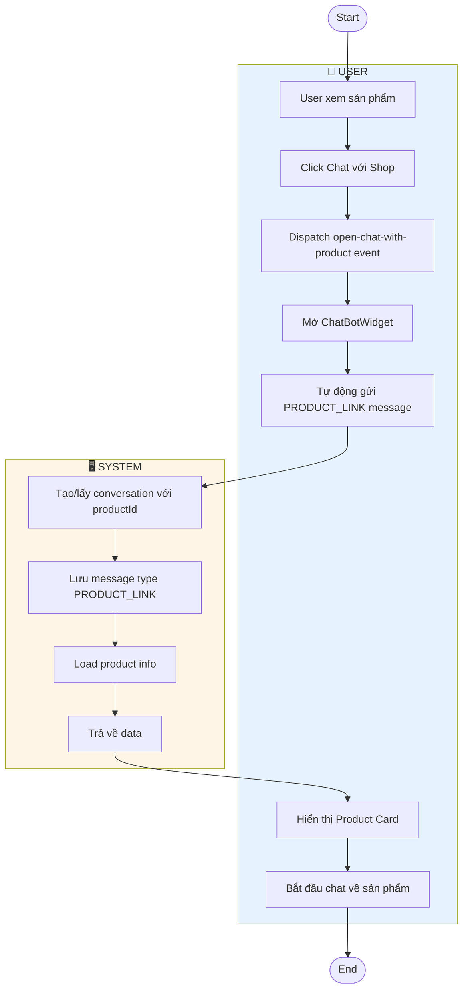
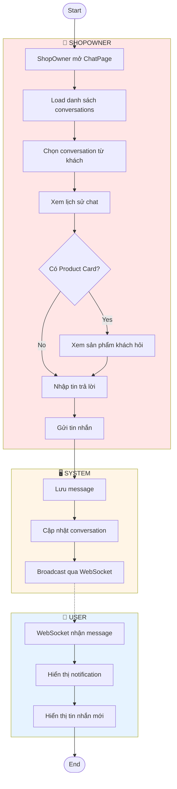
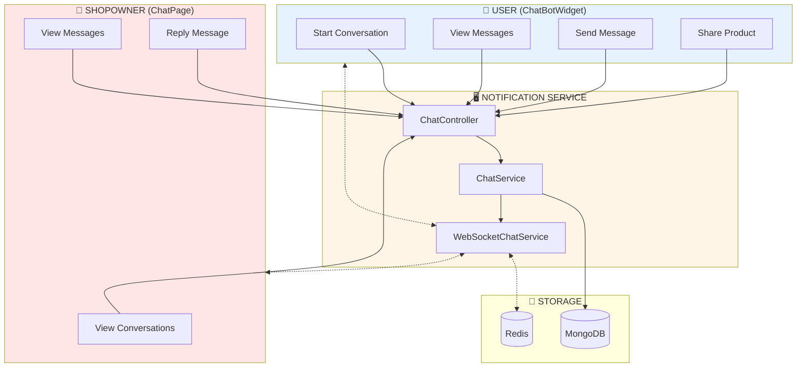
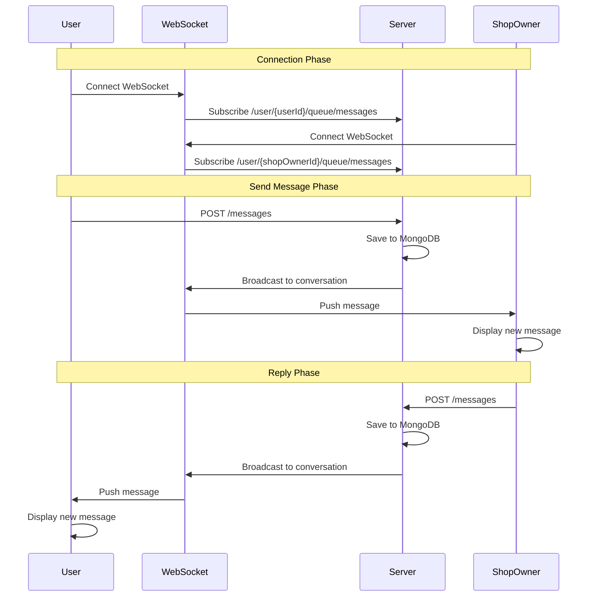

# Activity Diagrams - Chat

Tài liệu mô tả Activity Diagram cho hệ thống Chat giữa User và ShopOwner.

---

## 1. Start Conversation (Bắt Đầu Hội Thoại)

---

## 2. View Conversations (Xem Danh Sách Hội Thoại)

---

## 3. View Messages (Xem Tin Nhắn)

---

## 4. Send Message (Gửi Tin Nhắn)

---

## 5. Share Product (Chia Sẻ Sản Phẩm)

---

## 6. ShopOwner Reply (Shop Trả Lời Khách)

---

## 7. Tổng Quan Kiến Trúc

---

## 8. WebSocket Real-time Flow

---

## Bảng Tổng Hợp API

| Chức Năng | Endpoint | Method |
|-----------|----------|--------|
| Bắt đầu/lấy conversation | `/v1/notifications/chat/conversations/start` | POST |
| Lấy danh sách conversations | `/v1/notifications/chat/conversations` | GET |
| Lấy messages | `/v1/notifications/chat/conversations/{id}/messages` | GET |
| Gửi tin nhắn | `/v1/notifications/chat/messages` | POST |
| Đánh dấu đã đọc | `/v1/notifications/chat/conversations/{id}/read` | PUT |

---

## WebSocket Endpoints

| Chức Năng | Endpoint |
|-----------|----------|
| Kết nối | `/ws` |
| Subscribe messages | `/user/{userId}/queue/messages` |
| Subscribe conversation | `/topic/conversation/{conversationId}` |
