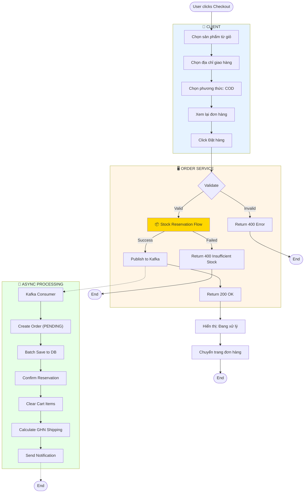
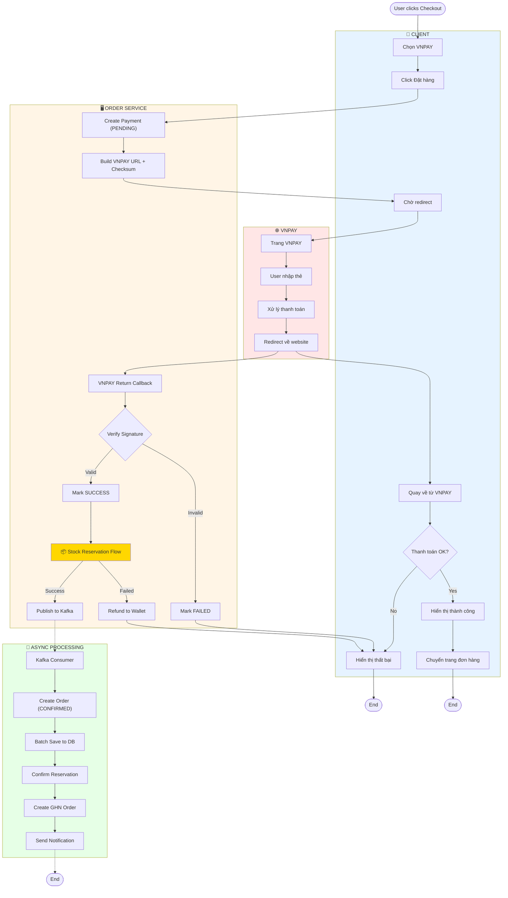
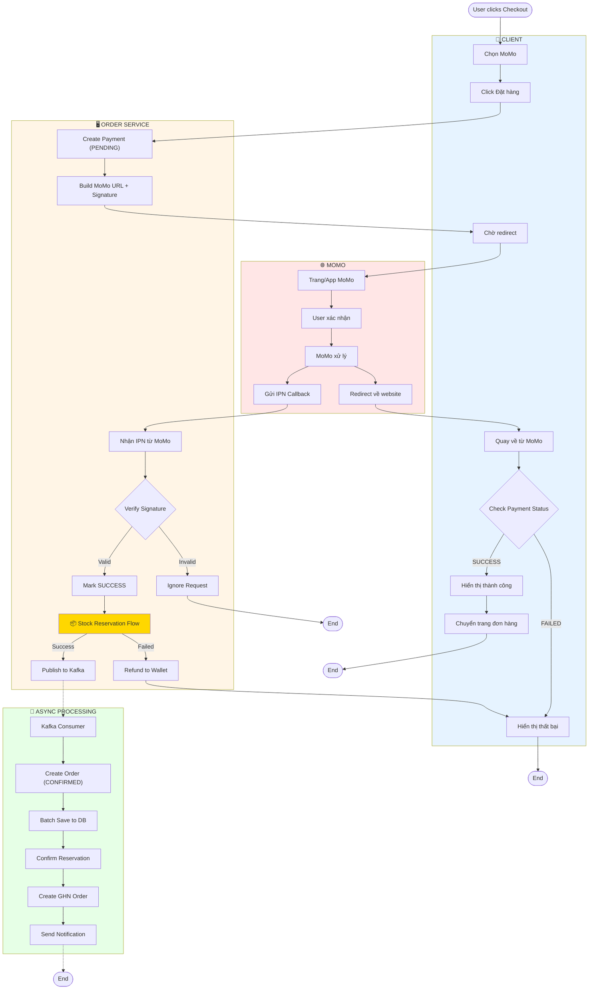
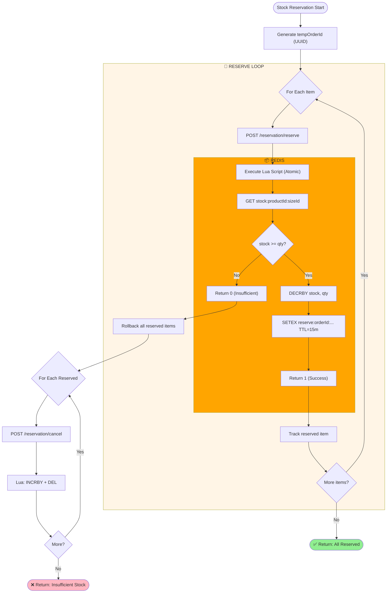
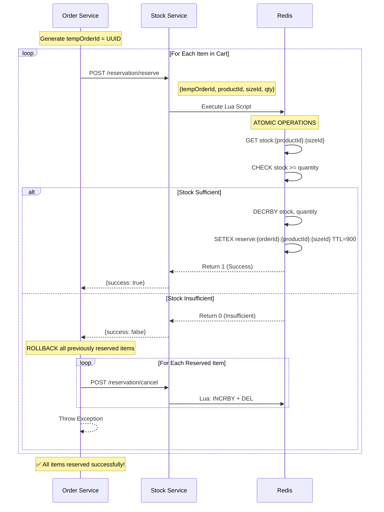

# Checkout Activity Diagrams

Tài liệu mô tả Activity Diagram cho hệ thống Checkout với **3 phương thức thanh toán** và **1 module xử lý Stock riêng biệt**.

---

## Mục lục

1. [Checkout COD](#1-checkout-cod)
2. [Checkout VNPAY](#2-checkout-vnpay)
3. [Checkout MoMo](#3-checkout-momo)
4. [Stock Reservation Flow](#4-stock-reservation-flow-pre-reserve-pattern)

---

## 1. Checkout COD

**Luồng thanh toán khi nhận hàng (Cash On Delivery)**



### COD Flow Summary

| Bước | Mô tả | Thời gian |
|------|-------|-----------|
| 1 | User chọn COD và click Đặt hàng | - |
| 2 | **Stock Reservation** (xem Section 4) | ~10ms |
| 3 | Publish to Kafka | ~5ms |
| 4 | Return 200 OK | **~20ms total** |
| 5 | Async: Create Order + Notify | ~200ms (background) |

---

## 2. Checkout VNPAY

**Luồng thanh toán online qua VNPAY**



### VNPAY Flow Summary

| Bước | Mô tả |
|------|-------|
| 1 | User chọn VNPAY → Redirect sang trang VNPAY |
| 2 | User thanh toán trên VNPAY |
| 3 | VNPAY redirect về với callback |
| 4 | Verify signature → **Stock Reservation** |
| 5 | Publish to Kafka → Async create order |

---

## 3. Checkout MoMo

**Luồng thanh toán qua ví MoMo**



### MoMo Flow Summary

| Bước | Mô tả |
|------|-------|
| 1 | User chọn MoMo → Redirect sang MoMo |
| 2 | User xác nhận trên app MoMo |
| 3 | MoMo gửi **IPN Callback** (không đợi redirect) |
| 4 | Verify IPN → **Stock Reservation** |
| 5 | Publish to Kafka → Async create order |

---

## 4. Stock Reservation Flow (Pre-Reserve Pattern)

**Module xử lý trừ tồn kho - được import bởi cả 3 luồng checkout**

### 4.1. Activity Diagram



### 4.2. Sequence Diagram



### 4.3. Redis Data Model

```
┌─────────────────────────────────────────────────────────────────┐
│                    REDIS KEYS                                   │
├─────────────────────────────────────────────────────────────────┤
│                                                                 │
│  STOCK (Permanent, synced from DB)                             │
│  ══════════════════════════════════                            │
│  Key: stock:{productId}:{sizeId}                               │
│  Value: Integer (available stock)                              │
│                                                                 │
│  Example: stock:prod-001:size-M = 100                          │
│                                                                 │
│  RESERVATION (Temporary, TTL = 15 minutes)                     │
│  ══════════════════════════════════════════                    │
│  Key: reserve:{orderId}:{productId}:{sizeId}                   │
│  Value: Integer (reserved quantity)                            │
│  TTL: 900 seconds                                              │
│                                                                 │
│  Example: reserve:abc-123:prod-001:size-M = 2 (TTL: 850s)      │
│                                                                 │
└─────────────────────────────────────────────────────────────────┘
```

### 4.4. Lua Scripts

**reserve_stock.lua**
```lua
local stock = redis.call('GET', KEYS[1])
if not stock then return -1 end

local stockNum = tonumber(stock)
if stockNum < tonumber(ARGV[1]) then return 0 end

redis.call('DECRBY', KEYS[1], ARGV[1])
redis.call('SETEX', KEYS[2], ARGV[2], ARGV[1])
return 1
```

**cancel_reservation.lua**
```lua
local reserved = redis.call('GET', KEYS[2])
if not reserved then return 0 end

redis.call('INCRBY', KEYS[1], reserved)
redis.call('DEL', KEYS[2])
return tonumber(reserved)
```

---

## So Sánh 3 Phương Thức

| Đặc Điểm | COD | VNPAY | MoMo |
|----------|-----|-------|------|
| **Luồng** | Order → Ship → Pay | Pay → Order | Pay → Order |
| **Stock Reserve** | Trước Kafka | Sau verify payment | Sau IPN callback |
| **Order Status** | PENDING | CONFIRMED | CONFIRMED |
| **Callback** | ❌ | ✅ Return URL | ✅ IPN |
| **Refund khi hết hàng** | ❌ (chưa trả tiền) | ✅ Wallet | ✅ Wallet |

---

## Performance

| Metric | Before | After Pre-Reserve |
|--------|--------|-------------------|
| Throughput | 100-200 req/s | **5,000-10,000 req/s** |
| Latency | 500-2000ms | **10-50ms** |
| Race Condition | Possible | **Impossible** |
| Overselling | Possible | **Impossible** |
