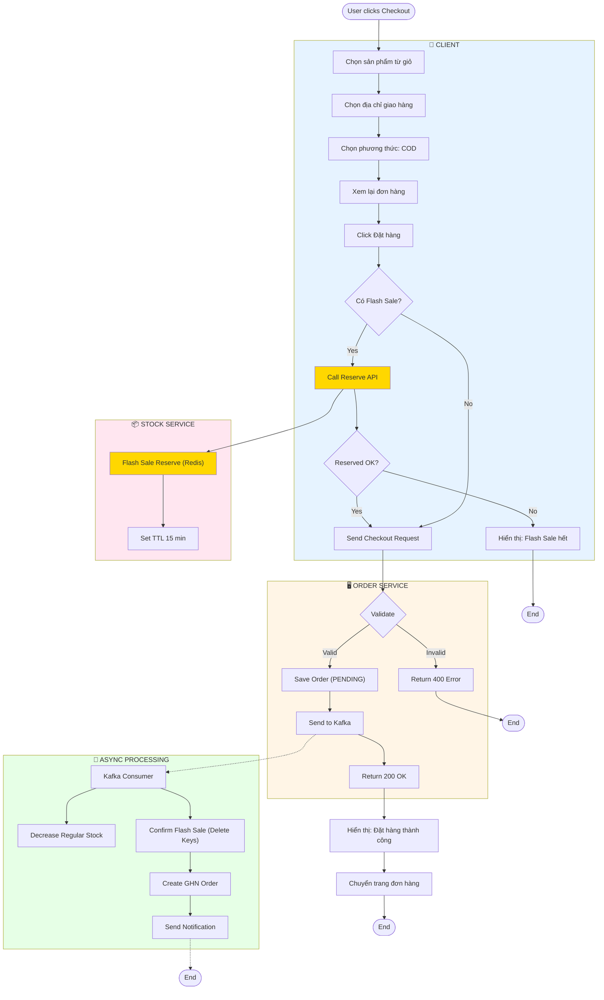
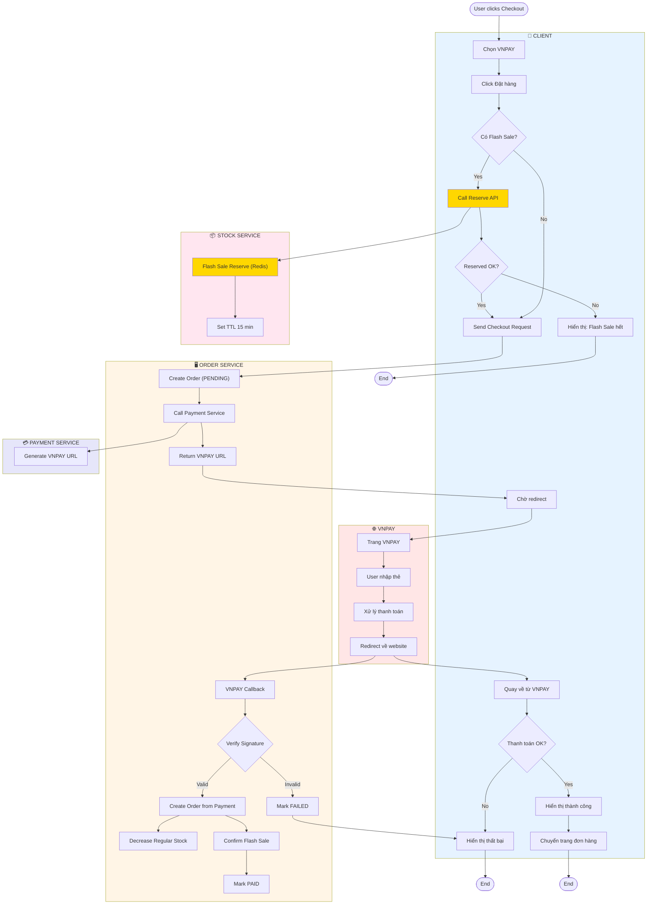
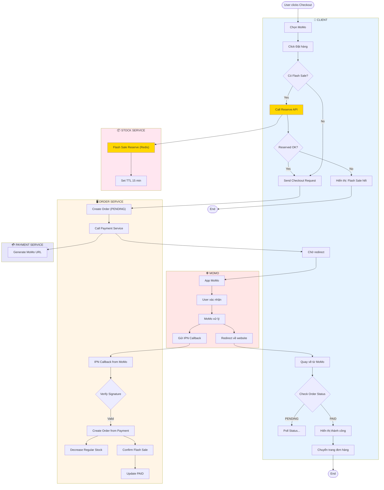
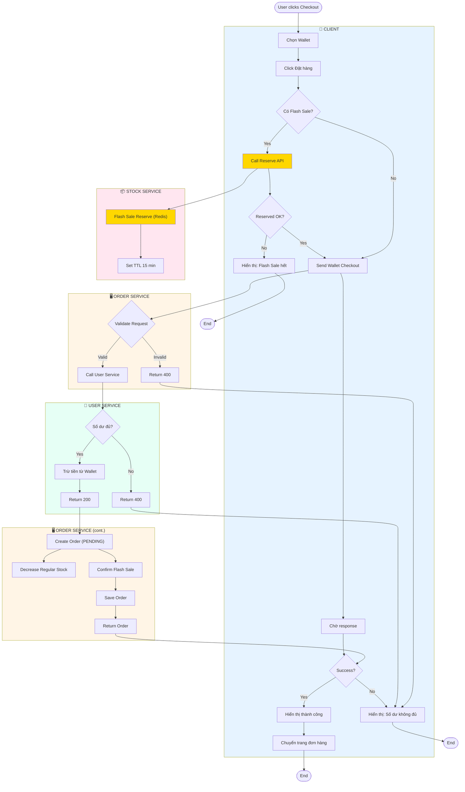
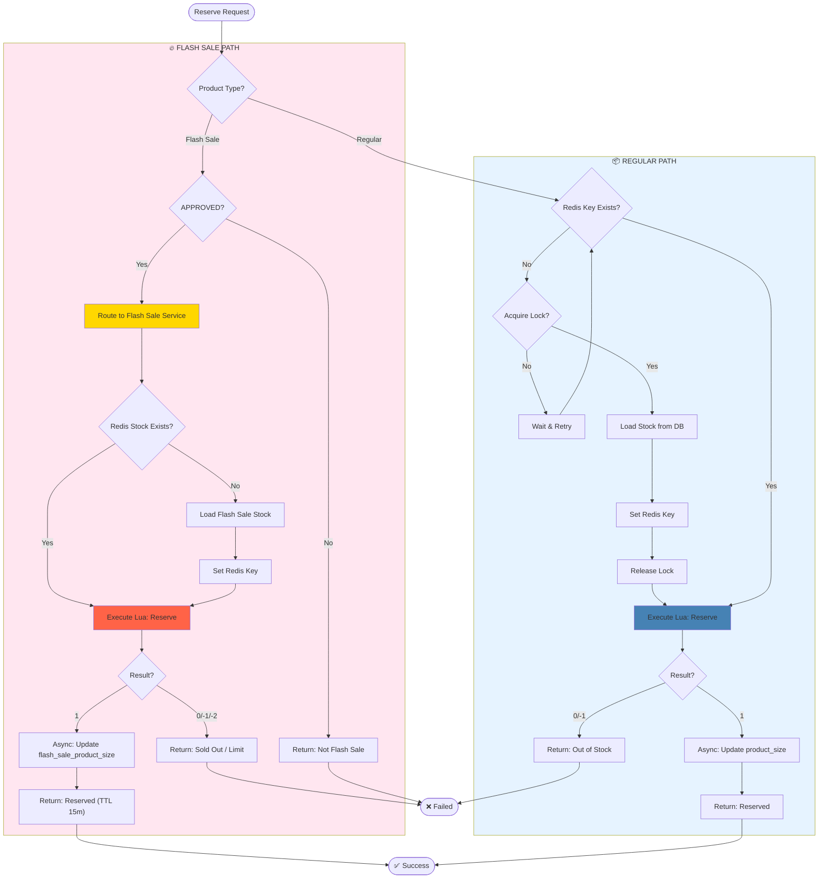
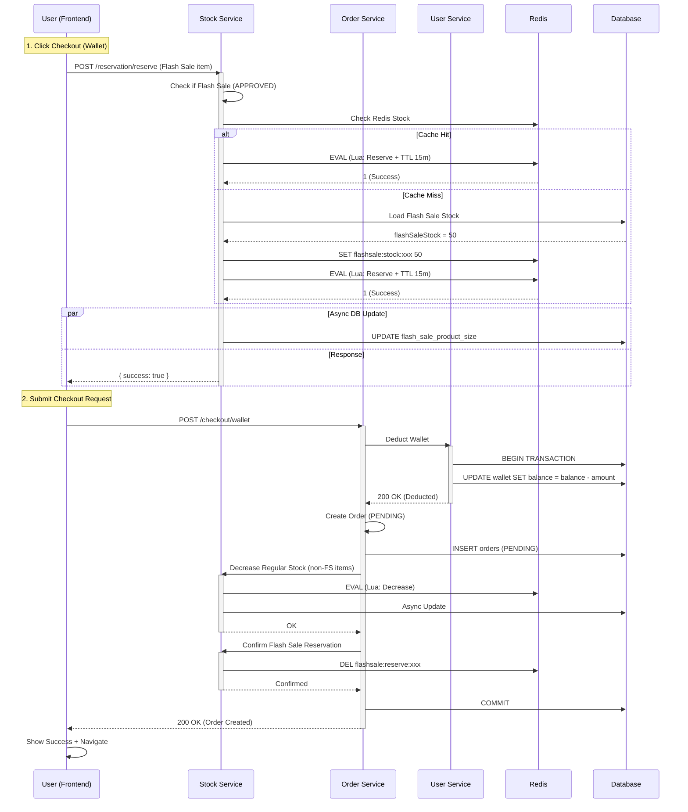

# Checkout Activity Diagrams

Tài liệu mô tả Activity Diagram cho hệ thống Checkout với **Option C Flash Sale Reservation**, **Smart Cache Strategy**, **Distributed Lock**, và **Async Persistence**.

---

## Mục lục

1. [Checkout COD](#1-checkout-cod)
2. [Checkout VNPAY](#2-checkout-vnpay)
3. [Checkout MoMo](#3-checkout-momo)
4. [Checkout Wallet](#4-checkout-wallet)
5. [Smart Stock Reservation Flow](#5-smart-stock-reservation-flow)

---

## 1. Checkout COD

**Luồng thanh toán khi nhận hàng (Cash On Delivery)**

### COD Flow Summary

| Bước | Mô tả | Thời gian |
|------|-------|-----------|
| 1 | **Frontend**: Reserve Flash Sale items (if any) | ~10ms |
| 2 | User chọn COD và click Đặt hàng | - |
| 3 | Save Order (PENDING) | ~10ms |
| 4 | Send to Kafka | ~5ms |
| 5 | Return 200 OK | **~25ms total** |
| 6 | Async: Decrease stock + Confirm FS + Create GHN | Background |

---

## 2. Checkout VNPAY

**Luồng thanh toán online qua VNPAY**

### VNPAY Flow Summary

| Bước | Mô tả |
|------|-------|
| 1 | **Frontend**: Reserve Flash Sale trước khi redirect |
| 2 | Create Order (PENDING) + Generate VNPAY URL |
| 3 | Redirect sang trang VNPAY |
| 4 | User thanh toán thành công → Callback về Order Service |
| 5 | **Confirm Stock**: Xóa reservation keys, decrease regular stock |
| 6 | Update Order Status: PAID |

---

## 3. Checkout MoMo

**Luồng thanh toán qua ví MoMo (IPN)**

---

## 4. Checkout Wallet

**Luồng thanh toán qua Ví điện tử (E-Wallet)**

### Wallet Flow Summary

| Bước | Mô tả | Thời gian |
|------|-------|-----------|
| 1 | **Frontend**: Reserve Flash Sale items (if any) | ~10ms |
| 2 | Send Wallet Checkout Request | - |
| 3 | **User Service**: Validate & Deduct Wallet | ~20ms |
| 4 | **Order Service**: Create Order + Decrease Stock + Confirm FS | ~30ms |
| 5 | Return 200 OK | **~60ms total** |
| 6 | User sees success immediately | Instant |

**Ưu điểm:** 
- Synchronous flow - User nhận kết quả ngay lập tức
- Không cần redirect như VNPAY/MoMo
- Tự động rollback nếu có lỗi (Transaction)

---

## 5. Smart Stock Reservation Flow

**Logic xử lý tồn kho tối ưu (Flash Sale & Regular)**

### 5.1. Flash Sale Reservation (Frontend-triggered)

### 5.2. Sequence Diagram (Wallet + Flash Sale)

---

## Flow Comparison

| Feature | COD | VNPAY | MoMo | Wallet |
|---------|-----|-------|------|--------|
| **Frontend Reserve FS** | ✅ Yes | ✅ Yes | ✅ Yes | ✅ Yes |
| **Payment Flow** | None | Redirect | Redirect | Synchronous |
| **Stock Decrease** | Async (Kafka) | Sync (Callback) | Sync (IPN) | Sync (Direct) |
| **Order Creation** | Async | Async | Async | Sync |
| **User Experience** | Instant | Wait redirect | Wait redirect | Instant |
| **Response Time** | ~25ms | ~5s (redirect) | ~5s (redirect) | ~60ms |

---

## Performance Metrics (Estimated)

| Metric | Legacy Logic | Smart Cache Strategy |
|--------|--------------|----------------------|
| **Latency** | 100-500ms (DB Hit) | **5-20ms (Redis Hit)** |
| **Concurrency** | Low (DB Lock) | **High (Redis Atomic)** |
| **Consistency** | Strong | **Eventual (Async DB Sync)** |
| **Thundering Herd** | Vulnerable | **Protected (Distributed Lock)** |
| **Flash Sale Protection** | Race Conditions | **TTL + Lua Atomic Operations** |
