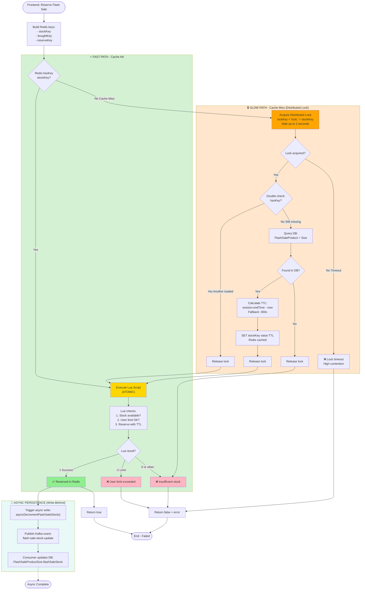
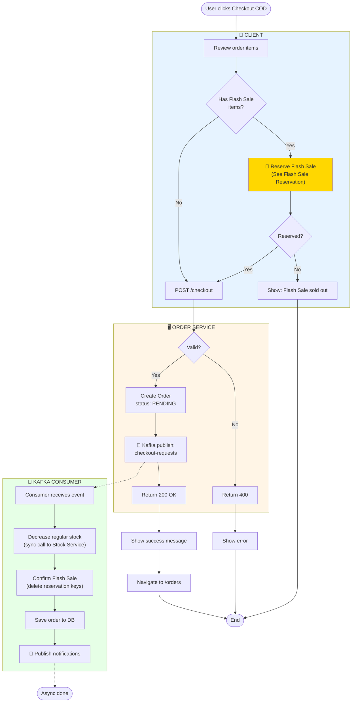
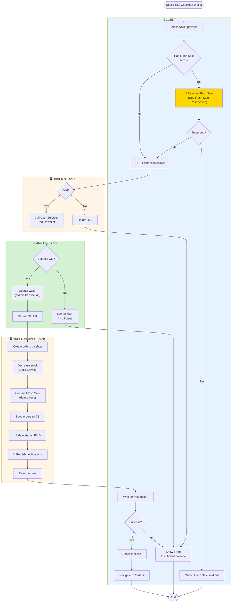

# Checkout Activity Diagrams

Tài liệu mô tả Activity Diagram cho Checkout Flow với **Flash Sale Reservation**, **Payment Gateway Integration**, và **Kafka-based Async Processing**.

---

## Table of Contents

1. [Flash Sale Reservation Flow](#flash-sale-reservation-flow) - Cache-Aside + Distributed Lock
2. [Checkout COD](#1-checkout-cod) - Async via Kafka
3. [Checkout Online Gateway (VNPAY/MOMO)](#2-checkout-online-gateway-vnpaymomo) - Payment callback + Kafka
4. [Checkout Wallet](#3-checkout-wallet) - Sync wallet deduction
5. [Comparison Table](#so-sánh-payment-methods)

---

## Flash Sale Reservation Flow

**High-Performance Stock Reservation với Cache-Aside Pattern + Distributed Lock**

> **🎯 Mục đích**: Xử lý hàng ngàn requests đồng thời cho Flash Sale với performance cao (~10ms) và tránh cache stampede.
> 
> **📌 Note**: Flow này được gọi **trước** khi checkout cho tất cả payment methods (COD, VNPAY, MOMO, Wallet) nếu có Flash Sale items.



### Flash Sale Technology Stack

| Component | Technology | Purpose |
|-----------|-----------|---------|
| **Cache Layer** | Redis | Fast stock check (~1ms) |
| **Distributed Lock** | Redis Lock | Prevent cache stampede |
| **Atomic Operation** | Lua Script | Guarantee consistency |
| **Persistence** | Kafka + DB | Async eventual consistency |
| **Performance** | ~10ms total | Ultra-fast response |

### Key Implementation

**1. Cache-Aside Pattern:**
```java
if (!redisTemplate.hasKey(stockKey)) {
    handleCacheMissWithLock(stockKey, productId, sizeId);
}
```

**2. Distributed Lock:**
```java
redisLockService.executeWithLock(lockKey, 2, () -> {
    if (!hasKey(stockKey)) {
        // Load from DB → Set Redis with TTL
    }
});
```

**3. Lua Script (Atomic):**
- Check stock availability
- Reserve with TTL (15 minutes)
- Atomic DECRBY operation

**4. Async Persistence:**
- Kafka event → Consumer → DB update
- Non-blocking, eventual consistency

---

## 1. Checkout COD

**Cash on Delivery - Async order creation via Kafka**



**Flow Summary:**
1. Frontend → Flash Sale Reservation (if needed)
2. POST /checkout → Order Service
3. Save PENDING order
4. Publish Kafka `checkout-requests`
5. Return 200 OK ⚡ (~25ms)
6. Kafka Consumer → Decrease stock → Confirm FS → Save DB (async)

---

## 2. Checkout Online Gateway (VNPAY/MOMO)

**Payment via external gateway - Async order creation after payment callback**

> **Note**: VNPAY và MOMO dùng **cùng architecture**, chỉ khác gateway provider (web vs app redirect)

```mermaid
flowchart TD
    Start([User clicks Checkout]) --> SelectMethod
    
    subgraph User["👤 USER (Client)"]
        SelectMethod{Select VNPAY<br/>or MOMO?} -->|Choose| FSCheck{Has Flash Sale<br/>items?}
        
        FSCheck -->|Yes| FSReserve["📌 Reserve Flash Sale<br/>(See Flash Sale Reservation)"]
        FSReserve --> FSResult{Reserved?}
        FSResult -->|No| ShowFSError[Show: Flash Sale sold out]
        FSResult -->|Yes| ClickCheckout
        FSCheck -->|No| ClickCheckout[Click Checkout]
        
        ClickCheckout --> SendRequest[Send checkout request]
        
        WaitRedirect[⏳ Wait redirect...]
        
        ReturnFromGateway[↩️ Return from gateway]
        ReturnFromGateway --> PollStatus[Poll order status]
        PollStatus --> CheckStatus{Status?}
        CheckStatus -->|PENDING| PollStatus
        CheckStatus -->|PAID| ShowSuccess[✅ Show success]
        ShowSuccess --> Navigate[Navigate to /orders]
    end
    
    subgraph System["🖥️ SYSTEM (Backend Services)"]
        direction TB
        
        subgraph OrderService["Order Service"]
            SendRequest --> CreateTemp["Create temp order<br/>status: PENDING<br/>(no items yet)"]
            CreateTemp --> CallPayment[Call Payment Service]
        end
        
        subgraph PaymentService["Payment Service"]
            CallPayment --> CheckMethod{VNPAY<br/>or MOMO?}
            CheckMethod -->|VNPAY| GenVNPAY[Generate VNPAY URL]
            CheckMethod -->|MOMO| GenMOMO[Generate MoMo URL]
            GenVNPAY --> ReturnURL
            GenMOMO --> ReturnURL[Return gateway URL]
            
            ReceiveCallback[Receive IPN/Callback]
            ReceiveCallback --> VerifySig{Valid<br/>signature?}
            VerifySig -->|No| LogError[Log error & reject]
            VerifySig -->|Yes| SavePayment["Save PaymentRecord<br/>to database"]
            SavePayment --> PublishKafka["📨 Publish Kafka:<br/>payment-events topic"]
        end
        
        subgraph OrderConsumer["Order Service Consumer"]
            ConsumePayment[Consume payment event]
            ConsumePayment --> ParseData["Parse orderDataJson:<br/>- userId, addressId<br/>- selectedItems<br/>- shippingFee"]
            ParseData --> CreateOrders["Create Order entities<br/>(split by shop)"]
            CreateOrders --> DecrStock["📦 Decrease stock<br/>Call Stock Service"]
            DecrStock --> ConfirmFS["✅ Confirm Flash Sale<br/>(delete reservation keys)"]
            ConfirmFS --> SaveOrders[Save orders to DB]
            SaveOrders --> UpdatePaid["Update status<br/>→ PAID"]
            UpdatePaid --> PublishNotif["📨 Publish Kafka:<br/>- notifyOrderPlaced<br/>- notifyShopOwners"]
        end
        
        PublishKafka -.-> ConsumePayment
    end
    
    subgraph Gateway["🌐 VNPAY/MOMO GATEWAY"]
        ReturnURL --> WaitRedirect
        WaitRedirect --> RedirectToGateway[Redirect to gateway]
        RedirectToGateway --> ShowPaymentUI{Gateway type?}
        ShowPaymentUI -->|VNPAY| VNPAYWeb[VNPAY web page]
        ShowPaymentUI -->|MOMO| MOMOApp[MoMo app deep link]
        
        VNPAYWeb --> UserConfirm
        MOMOApp --> UserConfirm[User confirms payment]
        UserConfirm --> ProcessPayment[Gateway processes payment]
        
        ProcessPayment --> SendCallback["Send IPN callback<br/>to Payment Service"]
        ProcessPayment --> RedirectBack["Redirect user<br/>back to website"]
        
        SendCallback --> ReceiveCallback
        RedirectBack --> ReturnFromGateway
    end
    
    ShowFSError --> End([End])
    Navigate --> End
    PublishNotif -.-> EndAsync([Async Complete])
    
    style User fill:#e6f3ff
    style System fill:#fff5e6
    style Gateway fill:#ffe6e6
    style FSReserve fill:#FFD700
    style PublishKafka fill:#90EE90
    style ConsumePayment fill:#87CEEB
```



**Flow Summary:**
1. **User**: Flash Sale Reservation (if needed) → Click checkout
2. **System**: Create temp PENDING order → Generate gateway URL
3. **Gateway**: User redirected → Confirms payment → Callback + Redirect
4. **System**: Payment Service receives callback → Publish Kafka
5. **System**: Order Consumer → Create orders → Decrease stock → Confirm FS → PAID
6. **User**: Poll status → See success

---

## 3. Checkout Wallet

**Internal wallet payment - Sync order creation**

```mermaid
    
    subgraph Client["👤 CLIENT"]
        SelectGateway -->|VNPAY/MOMO| FSCheck{Has Flash Sale<br/>items?}
        FSCheck -->|Yes| FSReserve["📌 Reserve Flash Sale<br/>(See Flash Sale Reservation)"]
        FSReserve --> FSResult{Reserved?}
        FSResult -->|No| ShowFSError[Show: Flash Sale sold out]
        FSResult -->|Yes| SendCheckout
        FSCheck -->|No| SendCheckout[POST /checkout]
        
        WaitRedirect[Wait for redirect...]
        ReturnFromGateway[Return from gateway]
        ReturnFromGateway --> PollStatus[Poll order status]
        PollStatus --> CheckStatus{Status?}
        CheckStatus -->|PENDING| PollStatus
        CheckStatus -->|PAID| ShowSuccess[Show success]
        ShowSuccess --> Navigate[Navigate to /orders]
    end
    
    subgraph OrderService["🖥️ ORDER SERVICE"]
        SendCheckout --> CreateTemp["Create temp order<br/>status: PENDING"]
        CreateTemp --> CallPayment[Call Payment Service]
        CallPayment --> ReturnURL[Return gateway URL]
    end
    
    subgraph PaymentService["💳 PAYMENT SERVICE"]
        CallPayment --> GenerateURL{Method?}
        GenerateURL -->|VNPAY| GenVNPAY[Generate VNPAY URL]
        GenerateURL -->|MOMO| GenMOMO[Generate MOMO URL]
        
        Callback[Receive IPN/Callback]
        Callback --> VerifySig{Valid signature?}
        VerifySig -->|No| LogError[Log error]
        VerifySig -->|Yes| SavePayment[Save PaymentRecord]
        SavePayment --> PublishKafka["📨 Kafka publish:<br/>payment-events"]
    end
    
    subgraph Gateway["🌐 GATEWAY"]
        GenVNPAY --> RedirectVNPAY
        GenMOMO --> RedirectMOMO[Redirect to gateway]
        RedirectVNPAY --> RedirectMOMO
        RedirectMOMO --> WaitRedirect
        RedirectMOMO --> UserPay[User confirms payment]
        UserPay --> ProcessPay[Gateway processes]
        ProcessPay --> SendCallback[Send callback]
        SendCallback --> Callback
        ProcessPay --> RedirectBack[Redirect to website]
        RedirectBack --> ReturnFromGateway
    end
    
    subgraph OrderConsumer["🖥️ ORDER SERVICE CONSUMER"]
        PublishKafka -.-> ConsumePayment[Consumer receives event]
        ConsumePayment --> ParseData[Parse orderDataJson]
        ParseData --> CreateOrders[Create orders by shop]
        CreateOrders --> DecrStock["Decrease stock<br/>(Stock Service)"]
        DecrStock --> ConfirmFS["Confirm Flash Sale<br/>(delete keys)"]
        ConfirmFS --> SaveOrders[Save orders to DB]
        SaveOrders --> UpdatePaid[Update status: PAID]
        UpdatePaid --> SendNotif["📨 Publish notifications"]
    end
    
    ReturnURL --> WaitRedirect
    ShowFSError --> End([End])
    Navigate --> End
    SendNotif -.-> EndAsync([Async done])
    
    style Client fill:#e6f3ff
    style OrderService fill:#fff5e6
    style PaymentService fill:#e6e6fa
    style Gateway fill:#ffe6e6
    style OrderConsumer fill:#fff5e6
    style FSReserve fill:#FFD700
```

**Flow Summary:**
1. Frontend → Flash Sale Reservation (if needed)
2. POST /checkout → Create temp PENDING order
3. Redirect to VNPAY/MOMO
4. User pays → Gateway callback
5. Payment Service → Publish Kafka `payment-events`
6. Order Service Consumer → Create orders → Decrease stock → Confirm FS → PAID

---

## 3. Checkout Wallet

**Internal wallet payment - Sync order creation**



**Flow Summary:**
1. Frontend → Flash Sale Reservation (if needed)
2. POST /checkout/wallet → Validate
3. User Service → Deduct wallet (sync, atomic)
4. Create orders → Decrease stock → Confirm FS
5. Save to DB → Update PAID
6. Publish notifications
7. Return orders (~60ms)

---

## So Sánh Payment Methods

| Aspect | COD | VNPAY/MOMO | Wallet |
|--------|-----|------------|--------|
| **Flash Sale** | ✅ Same flow | ✅ Same flow | ✅ Same flow |
| **Payment Flow** | None (pay later) | Redirect to gateway | Internal deduction |
| **Kafka Topic** | `checkout-requests` | `payment-events` | None |
| **Order Creation** | **Async (Kafka)** | **Async (Kafka)** | **Sync (Direct)** |
| **Triggered By** | Frontend | Payment callback | Frontend |
| **Stock Decrease** | Async (consumer) | Sync (in consumer) | Sync (direct) |
| **Notifications** | Kafka | Kafka | Kafka |
| **Response Time** | ~25ms | ~5s (redirect) | ~60ms |
| **User Experience** | Instant ⚡ | Wait for redirect | Instant ⚡ |

### Architecture Comparison

**COD:**
```
Frontend → Reserve FS → POST /checkout 
  → Publish Kafka → Return 200 ⚡
  → Consumer → Decrease stock → Confirm FS
```

**VNPAY/MOMO:**
```
Frontend → Reserve FS → POST /checkout → Redirect
  → Gateway → Callback → Payment Service
  → Publish Kafka → Consumer → Create orders
```

**Wallet:**
```
Frontend → Reserve FS → POST /checkout/wallet
  → Deduct wallet → Create orders (sync)
  → Decrease stock → Confirm FS → Return 200
```

---

## Performance Metrics

| Metric | COD | VNPAY/MOMO | Wallet | Flash Sale Reserve |
|--------|-----|------------|--------|-------------------|
| **API Response** | 25ms | 5s (redirect) | 60ms | 10ms |
| **Order Created** | ~500ms (async) | ~1s (async) | Immediate | N/A |
| **Stock Updated** | ~500ms | ~1s | Immediate | Async (~100ms) |

---

## See Also

- [Cancel Order Activity](./CANCEL_ORDER_ACTIVITY.md) - Order cancellation với stock restoration
- [Order Management Activity](./ORDER_MANAGEMENT_ACTIVITY.md) - Post-checkout order management

**Last Updated:** 2026-01-14  
**Status:** ✅ Complete - Restructured with Flash Sale reference pattern