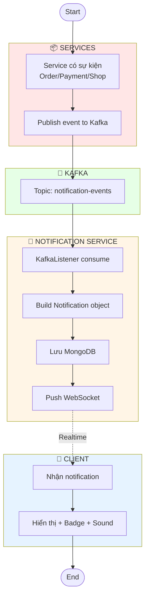
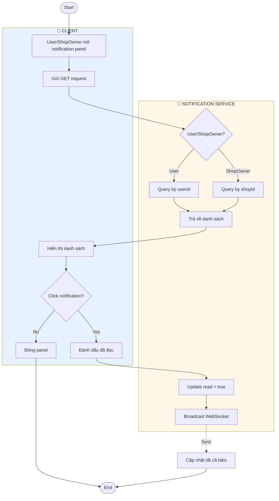
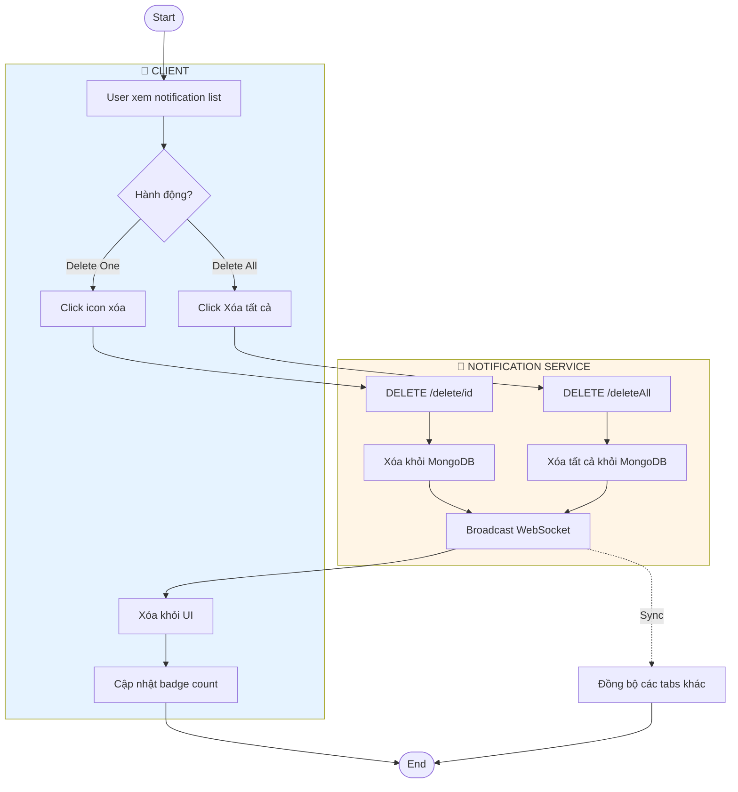
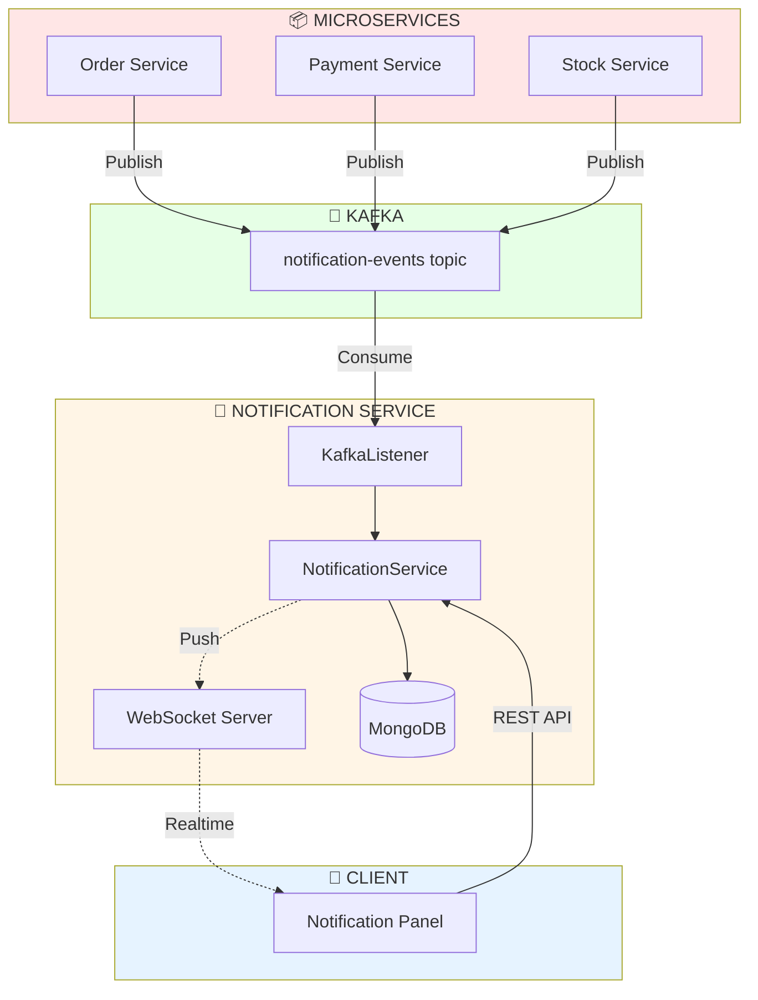

# Activity Diagrams - Notification Management

Tài liệu mô tả Activity Diagram cho hệ thống quản lý Thông Báo (Notification).

---

## 1. Create Notification (Tạo Thông Báo)

---

## 2. View Notification (Xem Thông Báo)

---

## 3. Delete Notification (Xóa Thông Báo)

---

---

## 4. Tổng Quan Kiến Trúc

---

## Bảng Tổng Hợp API

| Chức Năng | Endpoint | Method | Role |
|-----------|----------|--------|------|
| Tạo notification | `/v1/notifications/send` | POST | System |
| Xem notification (User) | `/v1/notifications/getAllByUserId` | GET | User |
| Xem notification (Shop) | `/v1/notifications/getAllByShopId` | GET | ShopOwner |
| Đánh dấu đã đọc | `/v1/notifications/markAsRead/{id}` | PUT | User/ShopOwner |
| Xóa notification | `/v1/notifications/delete/{id}` | DELETE | User/ShopOwner/Admin |
| Xóa tất cả (User) | `/v1/notifications/deleteAllByUserId` | DELETE | User |
| Xóa tất cả (Shop) | `/v1/notifications/deleteAllByShopId` | DELETE | ShopOwner |
| Đánh dấu tất cả đã đọc (User) | `/v1/notifications/markAllAsReadByUserId` | PUT | User |
| Đánh dấu tất cả đã đọc (Shop) | `/v1/notifications/markAllAsReadByShopId` | PUT | ShopOwner |

---

## WebSocket Events

| Event Type | Direction | Description |
|------------|-----------|-------------|
| `NEW_NOTIFICATION` | Server → Client | Có notification mới |
| `MARKED_AS_READ` | Server → Client | Đã đánh dấu đọc |
| `DELETED` | Server → Client | Đã xóa notification |
| `DELETED_ALL` | Server → Client | Đã xóa tất cả |
| `MARKED_ALL_AS_READ` | Server → Client | Đã đánh dấu tất cả đã đọc |

---

## Luồng Dữ Liệu Chính

1. **Service Events → Kafka** → Services (Order, Payment, Stock) publish events to Kafka topic `notification-events`
2. **Kafka → Notification Service** → KafkaListener consume events from Kafka
3. **Create & Store** → Lưu notification vào MongoDB
4. **Real-time Push** → Push notification qua WebSocket đến user đang online
5. **Client Display** → Client hiển thị notification với badge và âm thanh
6. **User Interaction** → User xem/đánh dấu đã đọc/xóa notification
7. **Sync** → WebSocket đồng bộ trạng thái notification trên tất cả tabs/devices
