# Order Management Activity Diagrams

Activity diagrams cho post-checkout order management features (User & Shop Owner).

---

## Table of Contents

**User Features:**
1. [Track Order Status](#1-track-order-status) - View order list & tracking
2. [View GHN Tracking](#2-view-ghn-tracking) - Delivery timeline
3. [Confirm Receipt](#3-confirm-receipt) - Mark delivered → completed
4. [Cancel Order](#4-cancel-order) - Cancel with refund

**Shop Owner Features:**
5. [View Shop Orders](#5-view-shop-orders) - Manage order list
6. [View Order Details](#6-view-order-details) - Single order view
7. [Update Order Status](#7-update-order-status) - Status transitions
8. [Create Shipping Order](#8-create-shipping-order-ghn) - GHN integration
9. [Bulk Update Status](#9-bulk-update-order-status) - Batch operations

---

## User Features

### 1. Track Order Status

**View order list and track delivery progress**

```mermaid
flowchart TD
    Start([Open My Orders page])
    
    subgraph User["👤 USER"]
        Start --> ViewTabs[View st status tabs:<br/>All/To Pay/To Ship/<br/>To Receive/Completed]
        ViewTabs --> SelectTab{Select tab?}
        SelectTab -->|Filter| ShowFiltered[Show filtered orders]
        ShowFiltered --> ViewTabs
        
        SelectTab -->|Track order| ClickTrack[Click tracking button]
        ClickTrack --> ViewTracking[Navigate to tracking page]
        
        ViewTracking --> ViewActions{Choose action?}
        ViewActions -->|View shop| GoShop[Navigate to shop]
        ViewActions -->|Chat| OpenChat[Open chat]
        ViewActions -->|Cancel| CancelOrder[See Cancel Order flow]
        ViewActions -->|Confirm| ConfirmReceipt[See Confirm Receipt flow]
    end
    
    subgraph System["🖥️ SYSTEM"]
        Start --> LoadOrders[GET /v1/order/user<br/>Load user's orders]
        LoadOrders --> FetchData[Fetch images & shop info]
        FetchData --> ReturnOrders[Return order list]
        
        ClickTrack --> GetDetail[GET /v1/order/:orderId<br/>Load order details]
        GetDetail --> CheckGHN{Has GHN<br/>shipping?}
        CheckGHN -->|Yes| GetGHN[GET /v1/order/shipping/:orderId]
        CheckGHN -->|No| ReturnBasic[Return basic order info]
        GetGHN --> ReturnTracking[Return tracking timeline]
    end
    
    ReturnOrders --> ViewTabs
    ReturnTracking --> ViewActions
    ReturnBasic --> ViewActions
    
    GoShop --> End([End])
    OpenChat --> End
    CancelOrder --> End
    ConfirmReceipt --> End
    
    style User fill:#e6f3ff
    style System fill:#fff5e6
```

---

### 2. View GHN Tracking

**Detailed GHN delivery timeline with status mapping**

```mermaid
flowchart TD
    Start([View GHN tracking])
    
    subgraph User["👤 USER"]
        Start --> ClickView[Click tracking details]
        ShowTimeline[Display tracking timeline:<br/>- Order code<br/>- Status badges<br/>- Timeline events<br/>- Expected delivery]
        ShowTimeline --> UserAction{Action?}
        UserAction -->|Copy code| CopyCode[Copy order code]
        UserAction -->|Back| GoBack[Return to orders]
        CopyCode --> ShowTimeline
    end
    
    subgraph System["🖥️ SYSTEM"]
        ClickView --> GetOrder[GET /v1/order/:orderId]
        GetOrder --> CheckShip{Has GHN<br/>shipping?}
        CheckShip -->|No| ReturnBasic[Return basic info only]
        CheckShip -->|Yes| CallGHN[GET /v1/order/shipping/:orderId]
    end
    
    subgraph GHN["🌐 GHN API"]
        CallGHN --> FetchGHN[Fetch from GHN API]
        FetchGHN --> MapStatus["Map status:<br/>ready_to_pick → 📦 Chờ lấy hàng<br/>picking → 🚚 Đang lấy<br/>picked → ✅ Đã lấy<br/>delivering → 🚛 Đang giao<br/>delivered → ✅ Đã giao"]
        MapStatus --> ReturnData[Return tracking data]
    end
    
    ReturnData --> ShowTimeline
    ReturnBasic --> ShowTimeline
    GoBack --> End([End])
    
    style User fill:#e6f3ff
    style System fill:#fff5e6
    style GHN fill:#ffe6cc
```

---

### 3. Confirm Receipt

**User confirms order delivery**

```mermaid
flowchart TD
    Start([Click Confirm Receipt])
    
    subgraph User["👤 USER"]
        Start --> ShowDialog[Show confirmation dialog]
        ShowDialog --> UserConfirm{Confirm?}
        UserConfirm -->|No| Cancel[Close dialog]
        UserConfirm -->|Yes| SubmitConfirm[Submit confirmation]
        
        ShowSuccess[✅ Show success message]
        ShowSuccess --> AskReview{Leave review?}
        AskReview -->|Yes| OpenReview[Open review modal]
        AskReview -->|No| RefreshList[Refresh order list]
        OpenReview --> SubmitReview[Submit review]
        SubmitReview --> RefreshList
    end
    
    subgraph System["🖥️ SYSTEM"]
        SubmitConfirm --> Validate{Status ==<br/>DELIVERED?}
        Validate -->|No| ReturnError[Return 400:<br/>Can only confirm delivered orders]
        Validate -->|Yes| UpdateStatus[Update status → COMPLETED]
        UpdateStatus --> SaveDB[Save to database]
        SaveDB --> LogEvent[Log completion event]
        LogEvent --> ReturnOK[Return 200 OK]
        
        SubmitReview --> SaveReview[POST /api/reviews/create<br/>Save product review]
    end
    
    ReturnError --> ShowError[Show error]
    ReturnOK --> ShowSuccess
    ShowError --> End([End])
    Cancel --> End
    RefreshList --> End
    
    style User fill:#e6f3ff
    style System fill:#fff5e6
```

---

### 4. Cancel Order

**Cancel order with stock restoration and refund**

> **See Also**: [CANCEL_ORDER_ACTIVITY.md](./CANCEL_ORDER_ACTIVITY.md) for detailed cancellation flow

---

## Shop Owner Features

### 5. View Shop Orders

**Manage shop's order list with filters**

---

### 6. View Order Details

**Detailed view of single order**

```mermaid
flowchart TD
    Start([Click expand order])
    
    subgraph ShopOwner["🏪 SHOP OWNER"]
        Start --> ViewDetails["View order info:<br/>- Customer details<br/>- Products list<br/>- Payment info<br/>- Current status<br/>- GHN tracking (if exists)"]
        ViewDetails --> OwnerAction{Action?}
        OwnerAction -->|Update status| CheckTransition{Valid<br/>transition?}
        CheckTransition -->|Yes| UpdateFlow[See Update Status flow]
        CheckTransition -->|No| ShowError[Show error message]
        
        OwnerAction -->|Create shipping| CheckCreate{Can create<br/>GHN?}
        CheckCreate -->|Yes| CreateFlow[See Create Shipping flow]
        CheckCreate -->|No| ShowGHNError[Show error:<br/>Must be CONFIRMED]
        
        OwnerAction -->|Print| PrintOrder[Generate print view]
        OwnerAction -->|View timeline| ShowGHN[Show GHN timeline]
        OwnerAction -->|Close| CollapseRow[Collapse details]
    end
    
    subgraph System["🖥️ SYSTEM"]
        Start --> LoadFull[GET /v1/order/:orderId<br/>Load complete order]
        LoadFull --> CheckShipping{Has GHN<br/>shipping?}
        CheckShipping -->|Yes| LoadGHN[GET /v1/order/shipping/:orderId]
        CheckShipping -->|No| ReturnBasic[Return basic info]
        LoadGHN --> ReturnFull[Return full details]
        ReturnBasic --> ReturnFull
    end
    
    ReturnFull --> ViewDetails
    ShowError --> ViewDetails
    ShowGHNError --> ViewDetails
    UpdateFlow --> End([End])
    CreateFlow --> End
    PrintOrder --> End
    ShowGHN --> End
    CollapseRow --> End
    
    style ShopOwner fill:#ffe6f0
    style System fill:#fff5e6
```

---

### 7. Update Order Status

**Update order status following lifecycle**

---

### 8. Create Shipping Order (GHN)

**Create GHN shipping order for delivery**

---

### 9. Bulk Update Order Status

**Update multiple orders at once via Kafka**

```mermaid
flowchart TD
    Start([Select multiple orders])
    
    subgraph ShopOwner["🏪 SHOP OWNER"]
        Start --> CheckSelect{Orders<br/>selected?}
        CheckSelect -->|None| ShowWarning[⚠️ Warning: Select orders first]
        CheckSelect -->|Has selection| FilterEditable["Filter editable orders<br/>(exclude DELIVERED/COMPLETED/CANCELLED)"]
        FilterEditable --> ShowCount[Display: X orders selected]
        ShowCount --> SelectTarget[Select target status from dropdown]
        SelectTarget --> ValidateAll{All can<br/>transition?}
        ValidateAll -->|No| ShowInvalid["Show invalid orders:<br/>- Order ID<br/>- Current status<br/>- Reason"]
        ValidateAll -->|Yes| ShowConfirm[Confirmation dialog:<br/>Update X orders to STATUS?]
        ShowConfirm --> UserConfirm{Confirm?}
        UserConfirm -->|No| CancelAction[Cancel]
        UserConfirm -->|Yes| SubmitBulk[Submit bulk update]
        
        ShowImmediate[⏳ Processing X orders...]
        ShowImmediate --> WaitNotif[Wait for notification]
        WaitNotif --> ShowResult{Result?}
        ShowResult -->|All success| ShowSuccess[✅ All X orders updated]
        ShowResult -->|Partial| ShowPartial[⚠️ Y succeeded, Z failed]
        ShowResult -->|All failed| ShowFailed[❌ All orders failed]
        
        ShowSuccess --> RefreshList
        ShowPartial --> RefreshList
        ShowFailed --> RefreshList[Refresh order list]
    end
    
    subgraph System["🖥️ SYSTEM"]
        SubmitBulk --> PublishKafka["📨 Publish Kafka:<br/>bulk-order-status-update"]
        PublishKafka --> ReturnImmediate[Return 202 Accepted]
        
        PublishKafka -.-> ConsumeKafka[Kafka Consumer]
        ConsumeKafka --> ProcessEach["Process each order:<br/>1. Validate transition<br/>2. Update status<br/>3. Log change"]
        ProcessEach --> CountResults[Count: success/failed]
        CountResults --> SendWebSocket["📨 Send WebSocket<br/>notification to shop owner"]
    end
    
    ReturnImmediate --> ShowImmediate
    SendWebSocket -.-> WaitNotif
    ShowWarning --> End([End])
    ShowInvalid --> End
    CancelAction --> End
    RefreshList --> End
    
    style ShopOwner fill:#ffe6f0
    style System fill:#fff5e6
```

---

## Order Status Lifecycle

### Allowed Transitions

| From | To | Who |
|------|-----|-----|
| PENDING | CONFIRMED, CANCELLED | Shop Owner, User |
| CONFIRMED | READY_TO_SHIP, CANCELLED | Shop Owner |
| READY_TO_SHIP | SHIPPED | GHN (auto) |
| SHIPPED | DELIVERED, CANCELLED | GHN (auto) |
| DELIVERED | COMPLETED | User |

---

## Feature Summary

**User Features:**
- ✅ Multi-status order filtering
- ✅ GHN tracking with timeline
- ✅ Order cancellation with refund
- ✅ Delivery confirmation
- ✅ Product rating

**Shop Owner Features:**
- ✅ Order list management
- ✅ Status transitions
- ✅ GHN shipping integration
- ✅ Bulk operations (Kafka async)
- ✅ Real-time updates (WebSocket)

---

**See Also:**
- [CHECKOUT_ACTIVITY.md](./CHECKOUT_ACTIVITY.md) - Checkout flows
- [CANCEL_ORDER_ACTIVITY.md](./CANCEL_ORDER_ACTIVITY.md) - Detailed cancellation

**Last Updated:** 2026-01-14  
**Status:** ✅ Complete - Simplified with 2-3 lanes
