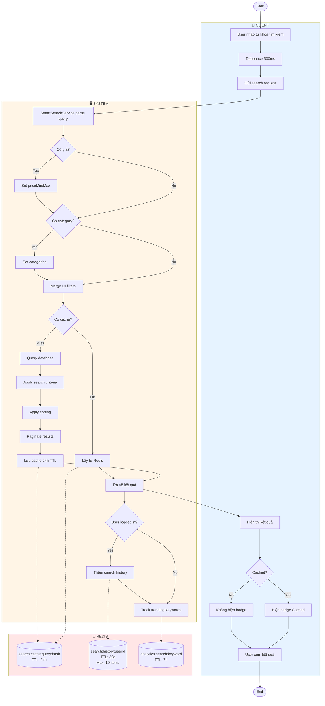
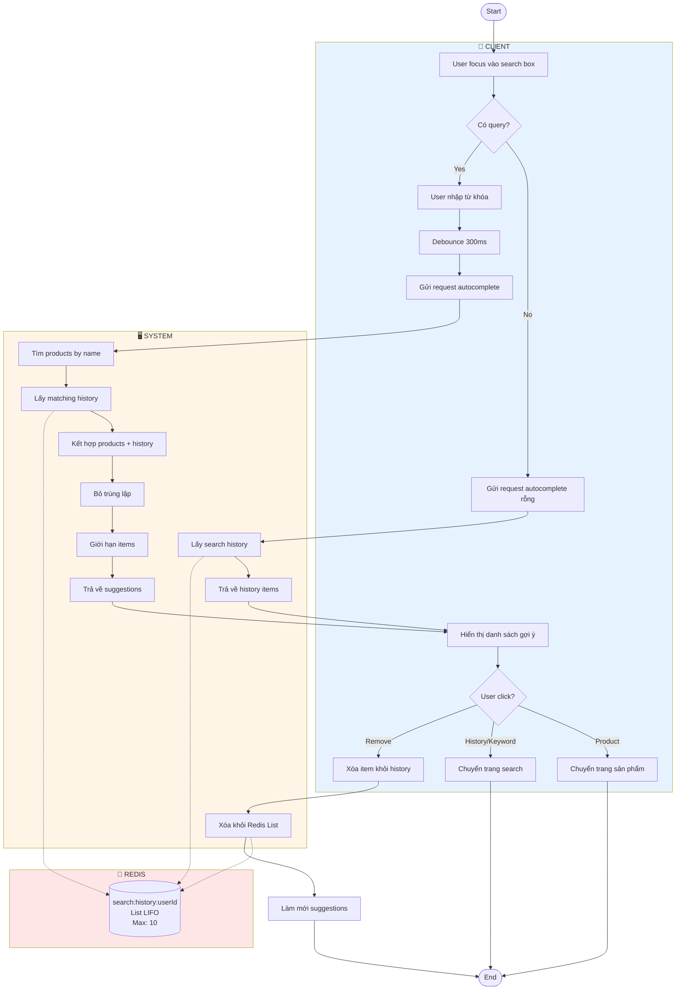
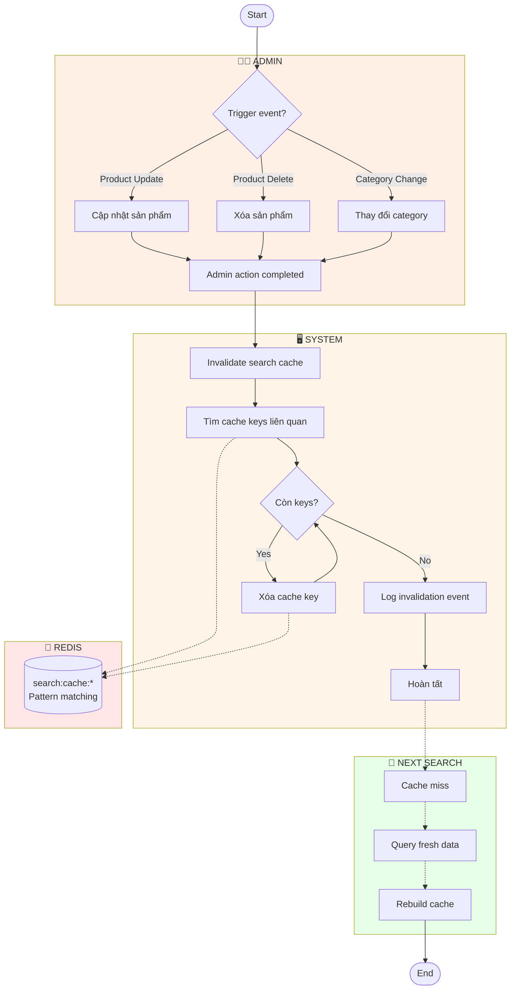
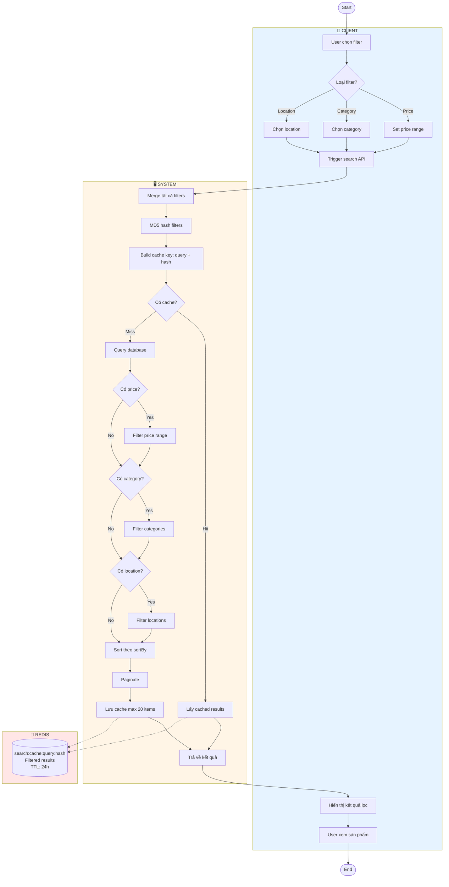
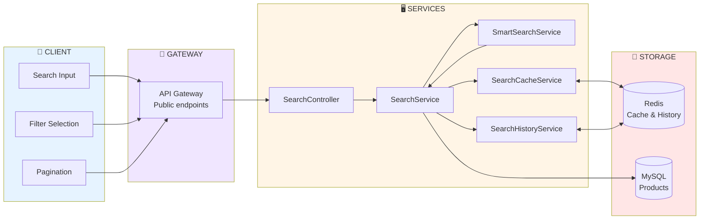

# Activity Diagrams - Search & Cache

Tài liệu mô tả Activity Diagram cho hệ thống tìm kiếm thông minh với Redis Cache.

---

## 1. Smart Search with Cache (Tìm Kiếm với Cache)

---

## 2. Autocomplete with History (Gợi Ý với Lịch Sử)

---

## 3. Cache Invalidation (Vô Hiệu Cache)

---

## 4. Search with Filters (Tìm Kiếm với Bộ Lọc)

---

## 5. Tổng Quan Search Architecture

---

## Bảng Tổng Hợp

| Feature | Redis Key Pattern | TTL | Description |
|---------|-------------------|-----|-------------|
| **Search Cache** | `search:cache:{query}:{hash}` | 24h | Cached search results (max 20 items) |
| **Search History** | `search:history:{userId}` | 30d | User's recent searches (max 10, LIFO) |
| **Trending Keywords** | `analytics:search:{keyword}` | 7d | Search count for trending |

## Cache Strategy

| Scenario | Action | Performance |
|----------|--------|-------------|
| **First Search** | Cache Miss → Query DB → Save Cache | ~300-500ms |
| **Repeated Search** | Cache Hit → Return from Redis | < 50ms |
| **Filter Change** | New cache key (different hash) → Query DB | ~300-500ms |
| **Page 2+** | Always query DB (no cache) | ~300-500ms |
| **Product Update** | Invalidate related cache keys | Auto rebuild on next search |

## Smart Query Examples

| User Input | Parsed Result |
|------------|---------------|
| "laptop dưới 10tr" | keywords: [laptop], priceMax: 10000000 |
| "áo thun size M" | keywords: [áo, thun], sizes: [M] |
| "máy ảnh hà nội" | keywords: [máy, ảnh], locations: [Hà Nội] |
| "phone từ 5tr đến 10tr" | keywords: [phone], priceMin: 5000000, priceMax: 10000000 |
