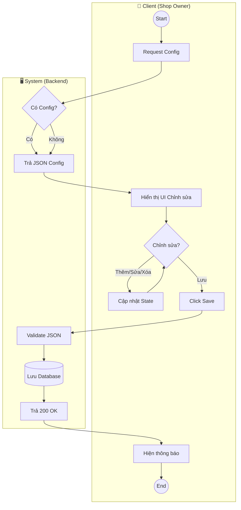

# Hướng Dẫn Vẽ Activity Diagram - Shop Decoration
*(Dựa trên logic thực tế source code và style Swimlane mẫu)*

Tài liệu này phân rã quy trình thành các bước cụ thể theo làn (Swimlane) để bạn dễ dàng vẽ lại.

## 1. Luồng: Quản lý & Lưu Trang Trí (Manage Decoration)

Đây là luồng khi Shop Owner thực hiện chỉnh sửa và lưu.

**Các Làn (Swimlanes):**
1.  **Client** (Frontend - Shop Owner)
2.  **System** (Backend - API & Database)

**Chi tiết các bước:**

| Bước | Swimlane | Hành động (Action Node) | Điều kiện / Ghi chú |
| :--- | :--- | :--- | :--- |
| 1 | **Client** | Start / Vào trang Decoration | Nút tròn đen |
| 2 | **Client** | Gửi yêu cầu lấy cấu hình cũ | Gọi API `GET /me` |
| 3 | **System** | Kiểm tra cấu hình trong DB | |
| 4 | **System** | Trả về dữ liệu | Decision: Có/Không |
| 5 | **Client** | Nhận dữ liệu & Render UI | Nếu null -> Init rỗng |
| 6 | **Client** | Thực hiện chỉnh sửa (Add/Edit Widget) | Loop: User tương tác nhiều lần |
| 7 | **Client** | Click "Lưu thay đổi" | User hoàn tất sửa |
| 8 | **Client** | Gửi JSON cấu hình lên Server | Gọi API `POST` |
| 9 | **System** | Validate dữ liệu | Kiểm tra format JSON |
| 10 | **System** | Lưu vào Database | Table: `shop_decorations` |
| 11 | **System** | Trả về thành công | HTTP 200 |
| 12 | **Client** | Hiển thị thông báo (Toast) | "Lưu thành công" |
| 13 | **Client** | End | Nút tròn kết thúc |

---

## 2. Luồng: Hiển thị cho Khách (View Shop Decoration)

Đây là luồng khi Khách hàng (User/Guest) truy cập trang shop.

**Các Làn (Swimlanes):**
1.  **Client** (Frontend - Người mua)
2.  **System** (Backend - API & Database)

**Chi tiết các bước:**

| Bước | Swimlane | Hành động (Action Node) | Điều kiện / Ghi chú |
| :--- | :--- | :--- | :--- |
| 1 | **Client** | Start / Truy cập Shop | URL: `/shop/{id}` |
| 2 | **Client** | Request thông tin Shop & Decoration | Gọi API Shop Info |
| 3 | **System** | Query DB & Trả về JSON Decoration | |
| 4 | **Client** | Parse JSON Widget List | Duyệt từng widget |
| 5 | **Client** | Kiểm tra loại Widget | Decision Node (Switch case) |
| 6a | **Client** | (Nếu là Banner) Render Slider | Dùng thư viện Swiper |
| 6b | **Client** | (Nếu là Video) Embed Youtube | Parse URL -> Iframe |
| 6c | **Client** | (Nếu là Products) Lấy danh sách ID | Tách list IDs từ JSON |
| 7 | **Client** | (Flow Products) Gọi API lấy chi tiết SP | `GET /product/{id}` (Batch/Loop) |
| 8 | **System** | Trả về tên, giá, hình ảnh mới nhất | Đảm bảo data realtime |
| 9 | **Client** | Render Grid Sản phẩm | Hiển thị Card sản phẩm |
| 10 | **Client** | Hoàn tất hiển thị (End) | Trang load xong |

---

## 3. Lưu ý khi vẽ (Tips)

*   **Decision Node (Hình thoi)**: Dùng khi kiểm tra dữ liệu cũ (Có/Không) hoặc kiểm tra loại Widget (Banner/Video/Product).
*   **Async Actions**: Bước số 7 ở luồng 2 (Gọi API lấy chi tiết SP) là bước quan trọng, thể hiện việc Client tự đi lấy dữ liệu mới nhất chứ không tin tưởng data cũ trong JSON configuration.
*   **Datastore**: Có thể vẽ thêm một object "Database" hoặc "Redis" ở làn System nếu muốn chi tiết như hình mẫu (phần Redis), nhưng logic hiện tại chủ yếu là MySQL.

## 4. Mermaid Code tham khảo (Style Swimlane)

Bạn có thể dùng đoạn code này dán vào Mermaid.live để xem hình mẫu trước khi vẽ lại bằng tool của bạn.

