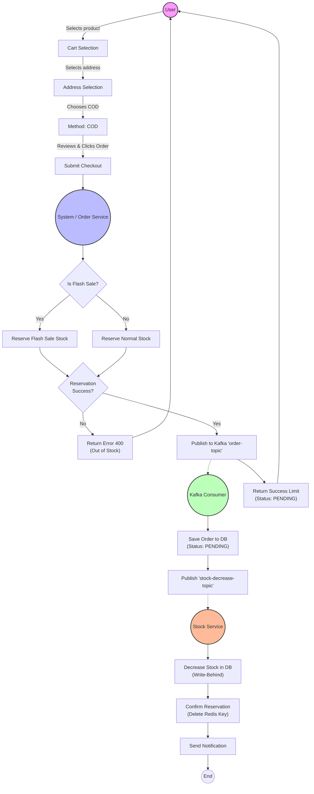

```mermaid
flowchart TD
    %% Actors
    User((User))
    System(("System / Order Service"))
    Consumer(("Kafka Consumer"))
    StockService(("Stock Service"))

    %% User Actions
    User -->|Selects product| A[Cart Selection]
    A -->|Selects address| B[Address Selection]
    B -->|Chooses COD| C["Method: COD"]
    C -->|"Reviews & Clicks Order"| D[Submit Checkout]

    %% System Logic
    D --> System
    System --> E{"Is Flash Sale?"}

    %% Reserve Logic (BOTH branches must reserve)
    E -- Yes --> F[Reserve Flash Sale Stock]
    E -- No --> G[Reserve Normal Stock]

    F --> H{"Reservation\nSuccess?"}
    G --> H

    %% Reservation Fail
    H -- No --> I["Return Error 400\n(Out of Stock)"]
    I --> User

    %% Reservation Success
    H -- Yes --> K["Publish to Kafka 'order-topic'"]
    K --> L["Return Success Limit\n(Status: PENDING)"]
    L --> User

    %% Async Consumer Logic
    K -.-> Consumer
    Consumer --> M["Save Order to DB\n(Status: PENDING)"]
    M --> N["Publish 'stock-decrease-topic'"]
    
    %% Stock Service & Confirm
    N -.-> StockService
    StockService --> O["Decrease Stock in DB\n(Write-Behind)"]
    O --> P["Confirm Reservation\n(Delete Redis Key)"]
    
    %% Finalize
    P --> Q[Send Notification]
    Q --> R((End))

    %% Styling
    style User fill:#f9f,stroke:#333,stroke-width:2px
    style System fill:#bbf,stroke:#333,stroke-width:2px
    style Consumer fill:#bfb,stroke:#333,stroke-width:2px
    style StockService fill:#fb9,stroke:#333,stroke-width:2px
```
