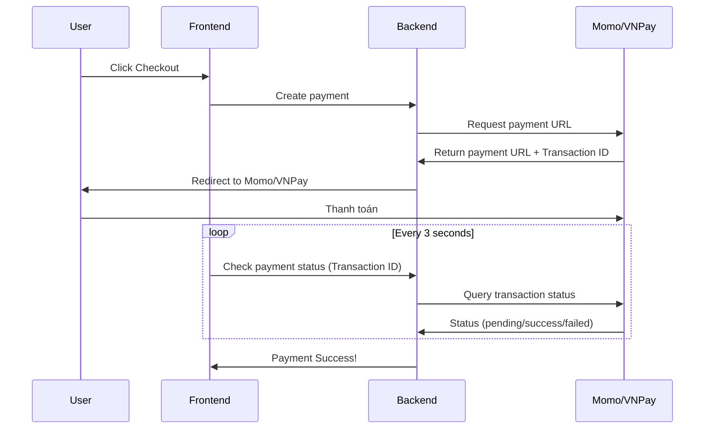

# Plan Triển Khai Microservices qua Ngrok

## 🎯 Tình Hình Hiện Tại

### ✅ Đã Hoạt Động Hoàn Hảo
- **Google OAuth Login**: Đã chạy ổn với ngrok URL `https://unbrawny-suk-nonillatively.ngrok-free.dev`
- **Frontend Config (`my-app/src/config/config.js`)**: ✅ HOÀN HẢO!
  ```javascript
  // Tự động detect origin → Khi qua ngrok sẽ dùng ngrok URL
  const getBaseUrl = () => {
    return window.location.origin;
  };
  ```
  → Frontend **TỰ ĐỘNG THÍCH ỨNG** với ngrok URL, không cần sửa gì!

- **Nginx Proxy (`my-app/nginx.conf`)**: ✅ ĐÚNG!
  ```nginx
  location /v1/ {
      proxy_pass http://gateway:8080;  # Proxy API đến gateway
  }
  ```
  → Routing đúng từ ngrok → nginx → gateway ✅

### ⚠️ Các Vấn Đề Còn Lại (Backend Environment Variables)

#### 1. **Payment Services (Momo, VNPay)**
**Vấn đề:**
```yaml
payment-service:
  environment:
    - VNPAY_RETURN_URL=http://localhost/payment/vnpay/return
    - MOMO_RETURN_URL=http://localhost/payment/momo/return
    - MOMO_IPN_URL=http://localhost/v1/payment/momo/ipn
```

> [!CAUTION]
> **CALLBACK VỀ LOCALHOST SẼ THẤT BẠI!**
> 
> Khi user thanh toán từ máy khác:
> 1. User chọn thanh toán Momo/VNPay
> 2. Redirect đến trang thanh toán Momo/VNPay
> 3. Momo/VNPay callback về `http://localhost/payment/...`
> 4. **Localhost là máy của USER, không phải máy host Docker** → 💥 Lỗi!

#### 2. **Ollama AI Connection**
**Vấn đề:**
```yaml
stock-service:
  environment:
    - OLLAMA_BASE_URL=http://26.20.214.252:11434  # IP Radmin VPN
```

> [!WARNING]
> **IP RADMIN VPN CHỈ HOẠT ĐỘNG TRONG MẠNG LAN!**
> 
> Khi demo qua Ngrok (public internet):
> - User từ internet **KHÔNG thể truy cập** `26.20.214.252` (IP private)
> - API AI sẽ timeout hoặc lỗi connection refused

---

## 🔧 Giải Pháp Chi Tiết

### 1. Payment Services (Momo/VNPay)

#### **Giải pháp A: Thay localhost → Ngrok URL** (Khuyên dùng)

**Cách làm:**

```yaml
payment-service:
  environment:
    - VNPAY_RETURN_URL=https://unbrawny-suk-nonillatively.ngrok-free.dev/payment/vnpay/return
    - MOMO_RETURN_URL=https://unbrawny-suk-nonillatively.ngrok-free.dev/payment/momo/return
    - MOMO_IPN_URL=https://unbrawny-suk-nonillatively.ngrok-free.dev/v1/payment/momo/ipn
```

**Ưu điểm:**
- ✅ Đơn giản nhất
- ✅ Hoạt động ngay lập tức
- ✅ User ở bất kỳ đâu đều checkout được

**Nhược điểm:**
- ⚠️ Cần cập nhật lại khi ngrok URL thay đổi (nếu không dùng static domain)
- ⚠️ Phải đăng ký callback URL với Momo/VNPay (nếu họ yêu cầu whitelist)

**Triển khai:**
1. Sửa `docker-compose.yml` (3 dòng trên)
2. Rebuild `payment-service`:
   ```bash
   docker-compose up -d --build payment-service
   ```
3. **Nếu Momo/VNPay yêu cầu whitelist callback URL:**
   - Đăng nhập vào Momo/VNPay developer portal
   - Thêm `https://unbrawny-suk-nonillatively.ngrok-free.dev` vào danh sách callback URLs

---

#### **Giải pháp B: Polling Status** (Backup nếu A không khả thi)

Nếu Momo/VNPay không cho phép thêm ngrok URL vào whitelist, dùng **polling**:



**Nhược điểm:** 
- Chậm hơn (delay 3-5s)
- Tốn API calls đến Momo/VNPay

---

### 2. Ollama AI Connection

#### **Giải pháp A: Ngrok Tunnel cho Ollama** (Dễ nhất)

**Bước 1:** Trên máy chạy Ollama (`26.20.214.252`), mở một terminal ngrok khác:
```bash
ngrok http 11434
```

Output:
```
Forwarding   https://xyz789.ngrok-free.app -> http://localhost:11434
```

**Bước 2:** Cập nhật `docker-compose.yml`:
```yaml
stock-service:
  environment:
    - OLLAMA_BASE_URL=https://xyz789.ngrok-free.app  # URL ngrok của Ollama
```

**Bước 3:** Rebuild:
```bash
docker-compose up -d --build stock-service
```

**Ưu điểm:**
- ✅ Không cần di chuyển Ollama
- ✅ Ollama vẫn ở máy hiện tại

**Nhược điểm:**
- ⚠️ Phải chạy 2 ngrok tunnels (1 cho web, 1 cho Ollama)
- ⚠️ Free tier ngrok chỉ cho 1 tunnel đồng thời → **Cần upgrade Ngrok ($10/tháng) hoặc dùng tài khoản khác**

---

#### **Giải pháp B: Deploy Ollama cùng Docker** (Tốt nhất cho production)

**Thêm Ollama vào `docker-compose.yml`:**

```yaml
services:
  ollama:
    image: ollama/ollama:latest
    container_name: ollama
    restart: unless-stopped
    ports:
      - "11434:11434"
    volumes:
      - ollama_data:/root/.ollama
    networks: [ vibe-network ]
    deploy:
      resources:
        limits:
          memory: 8G  # Ollama cần nhiều RAM cho model AI
    # Nếu có GPU:
    # deploy:
    #   resources:
    #     reservations:
    #       devices:
    #         - driver: nvidia
    #           count: 1
    #           capabilities: [gpu]

  stock-service:
    environment:
      - OLLAMA_BASE_URL=http://ollama:11434  # Dùng tên service Docker
      - OLLAMA_MODEL=qwen2.5:7b

volumes:
  ollama_data:
```

**Sau đó pull model:**
```bash
docker-compose up -d ollama
docker exec -it ollama ollama pull qwen2.5:7b
```

**Ưu điểm:**
- ✅ Tất cả trong 1 docker-compose
- ✅ Không cần ngrok tunnel riêng
- ✅ Dễ deploy sang server khác

**Nhược điểm:**
- ⚠️ Cần RAM lớn (model 7B cần ~8GB)
- ⚠️ Chậm hơn nếu máy host không có GPU

---

### 3. Các Services Khác

#### **Notification Service**
```yaml
notification-service:
  # Không cần sửa gì, hoạt động qua Kafka internal
```
✅ Không cần thay đổi (Kafka chỉ dùng trong Docker network)

#### **Order Service**
```yaml
order-service:
  # Không cần sửa gì
```
✅ Không cần thay đổi

---

## 📋 Plan Triển Khai (Step-by-step)

### Phase 1: Fix Payment Services (Cao nhất)

- [ ] **Bước 1.1:** Cập nhật payment callback URLs trong `docker-compose.yml`
  ```yaml
  - VNPAY_RETURN_URL=https://unbrawny-suk-nonillatively.ngrok-free.dev/payment/vnpay/return
  - MOMO_RETURN_URL=https://unbrawny-suk-nonillatively.ngrok-free.dev/payment/momo/return
  - MOMO_IPN_URL=https://unbrawny-suk-nonillatively.ngrok-free.dev/v1/payment/momo/ipn
  ```

- [ ] **Bước 1.2:** Rebuild payment-service
  ```bash
  docker-compose up -d --build payment-service
  ```

- [ ] **Bước 1.3:** Kiểm tra logs
  ```bash
  docker logs payment-service
  ```

- [ ] **Bước 1.4:** (Nếu cần) Đăng ký callback URL với Momo/VNPay
  - Truy cập Momo/VNPay developer portal
  - Thêm ngrok URL vào whitelist

- [ ] **Bước 1.5:** Test thanh toán end-to-end

---

### Phase 2: Fix Ollama AI Connection

**Chọn 1 trong 2 giải pháp:**

#### **Option A: Ngrok Tunnel cho Ollama**

- [ ] **Bước 2A.1:** Kiểm tra ngrok free tier limitations
  - Free plan: **1 tunnel đồng thời**
  - Cần: 2 tunnels (web + Ollama)
  - **Giải pháp:** Dùng tài khoản ngrok thứ 2 HOẶC upgrade ($10/tháng)

- [ ] **Bước 2A.2:** Trên máy Ollama, chạy ngrok
  ```bash
  ngrok http 11434
  ```

- [ ] **Bước 2A.3:** Cập nhật `docker-compose.yml`
  ```yaml
  - OLLAMA_BASE_URL=https://xyz789.ngrok-free.app
  ```

- [ ] **Bước 2A.4:** Rebuild stock-service
  ```bash
  docker-compose up -d --build stock-service
  ```

- [ ] **Bước 2A.5:** Test AI features

---

#### **Option B: Deploy Ollama trong Docker** (Khuyên dùng)

- [ ] **Bước 2B.1:** Kiểm tra RAM máy host
  ```bash
  docker stats
  ```
  - Cần ít nhất **8GB RAM trống** cho Ollama

- [ ] **Bước 2B.2:** Thêm Ollama service vào `docker-compose.yml`
  ```yaml
  ollama:
    image: ollama/ollama:latest
    container_name: ollama
    ports:
      - "11434:11434"
    volumes:
      - ollama_data:/root/.ollama
    networks: [ vibe-network ]
    deploy:
      resources:
        limits:
          memory: 8G
  
  volumes:
    ollama_data:
  ```

- [ ] **Bước 2B.3:** Cập nhật stock-service
  ```yaml
  - OLLAMA_BASE_URL=http://ollama:11434
  ```

- [ ] **Bước 2B.4:** Khởi động Ollama
  ```bash
  docker-compose up -d ollama
  ```

- [ ] **Bước 2B.5:** Pull model
  ```bash
  docker exec -it ollama ollama pull qwen2.5:7b
  ```
  (Lưu ý: Download ~4GB, mất 5-10 phút)

- [ ] **Bước 2B.6:** Rebuild stock-service
  ```bash
  docker-compose up -d --build stock-service
  ```

- [ ] **Bước 2B.7:** Test AI features

---

### Phase 3: Verification

- [ ] **Bước 3.1:** Test toàn bộ flow
  - Login Google ✅
  - Checkout Momo ⏳
  - Checkout VNPay ⏳
  - AI Product Description ⏳
  - Notifications ✅ (không cần sửa)

- [ ] **Bước 3.2:** Kiểm tra logs tất cả services
  ```bash
  docker-compose logs -f
  ```

- [ ] **Bước 3.3:** Test từ máy khác qua ngrok URL

---

## 🎯 Khuyến Nghị

### Cho Demo Ngắn Hạn (1-2 ngày)
1. **Payment:** Dùng Giải pháp A (thay localhost → ngrok)
2. **Ollama:** Giữ nguyên IP `26.20.214.252`, **tắt AI features** khi demo qua internet
   - Hoặc nếu bạn có tài khoản ngrok thứ 2, dùng Giải pháp A

### Cho Demo Dài Hạn hoặc Production
1. **Payment:** Giải pháp A + Đăng ký static ngrok domain
2. **Ollama:** Giải pháp B (deploy trong Docker)

---

## ⚠️ Limitations của Ngrok Free

| Tính năng | Free Plan | Paid Plan ($10/tháng) |
|-----------|-----------|----------------------|
| Tunnels đồng thời | 1 | 3 |
| Static domain | 1 (ngẫu nhiên) | Custom domain |
| Bandwidth | 1GB/tháng | Unlimited |
| Requests | 20K/tháng | Unlimited |
| Banner "Visit Site" | Có | Không |

**→ Với free plan, bạn cần chọn:**
- **Chỉ 1 ngrok tunnel** → Chọn tunnel web app, tắt Ollama AI khi demo
- **HOẶC** Upgrade ($10/tháng) → Chạy 2 tunnels (web + Ollama)
- **HOẶC** Dùng 2 tài khoản ngrok khác nhau → 2 tunnels free

---

## 🚀 Quick Start (Ngay Bây Giờ)

**Để giải quyết payment ngay:**

```bash
# Bước 1: Sửa docker-compose.yml
# Thay 3 dòng trong payment-service:
#   - VNPAY_RETURN_URL=https://unbrawny-suk-nonillatively.ngrok-free.dev/payment/vnpay/return
#   - MOMO_RETURN_URL=https://unbrawny-suk-nonillatively.ngrok-free.dev/payment/momo/return
#   - MOMO_IPN_URL=https://unbrawny-suk-nonillatively.ngrok-free.dev/v1/payment/momo/ipn

# Bước 2: Rebuild
docker-compose up -d --build payment-service

# Bước 3: Kiểm tra
docker logs payment-service

# Bước 4: Test thanh toán!
```

**Về Ollama:** Tôi khuyên bạn **TẠM THỜI bỏ qua** AI features khi demo qua internet (giữ nguyên IP, nhưng user demo sẽ không dùng được AI). Nếu cần AI, chọn 1 trong 2 giải pháp ở Phase 2.
