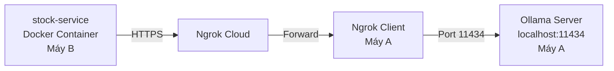

# 🤖 Hướng dẫn Expose Ollama qua Ngrok

## 📋 Tình huống

Bạn có 2 máy:
- **Máy A (Server)**: Máy chạy Ollama server (GPU mạnh để chạy AI model)
- **Máy B (Docker)**: Máy chạy Docker với `stock-service` cần connect đến Ollama

**Mục tiêu:** Máy B (Docker) connect đến Ollama trên Máy A qua Internet (dùng Ngrok)

---

## 🎯 Architecture



---

## ⚙️ Máy A (Máy chạy Ollama Server)

### Bước 1: Cài đặt và khởi động Ollama

Download Ollama: https://ollama.com/download

Sau khi cài, kiểm tra version:
```cmd
ollama --version
```

### Bước 2: Expose Ollama ra 0.0.0.0 (cho phép kết nối từ bên ngoài)

Mặc định Ollama chỉ listen trên `127.0.0.1` (localhost only). Để Ngrok có thể forward, cần expose ra `0.0.0.0`.

**Trên Windows:**
```cmd
set OLLAMA_HOST=0.0.0.0:11434
ollama serve
```

> **Lưu ý:** Giữ cửa sổ CMD này **mở** (để Ollama server chạy).

**Kiểm tra:**
```cmd
# Mở CMD mới
curl http://localhost:11434/api/version
```

Kết quả mong đợi:
```json
{"version":"0.1.x"}
```

### Bước 3: Pull model cần dùng

```cmd
ollama pull qwen2.5:7b
```

Hoặc model khác tùy theo config của bạn.

**Xem danh sách model:**
```cmd
ollama list
```

### Bước 4: Cài đặt Ngrok trên Máy A

1. Download: https://ngrok.com/download
2. Đăng ký tài khoản: https://dashboard.ngrok.com/signup
3. Lấy authtoken từ: https://dashboard.ngrok.com/get-started/your-authtoken

**Setup authtoken:**
```cmd
ngrok config add-authtoken YOUR_AUTHTOKEN_HERE
```

### Bước 5: Expose Ollama qua Ngrok

```cmd
ngrok http 11434
```

**Output:**
```
Session Status                online
Account                       your-email@gmail.com
Forwarding                    https://abc123xyz.ngrok-free.app -> http://localhost:11434

Connections                   ttl     opn     rt1     rt5     p50     p90
                              0       0       0.00    0.00    0.00    0.00
```

> [!IMPORTANT]
> **GHI LẠI URL này**: `https://abc123xyz.ngrok-free.app`
> 
> Đây là public URL để truy cập Ollama từ Internet.

**Giữ cửa sổ CMD này mở** (đừng tắt ngrok).

### Bước 6: Verify Ngrok hoạt động

Từ **máy khác** (hoặc máy B), test:
```cmd
curl https://abc123xyz.ngrok-free.app/api/version
```

Nếu thấy `{"version":"0.1.x"}` → **Thành công!** ✅

---

## 🐳 Máy B (Máy chạy Docker)

### Bước 1: Cập nhật docker-compose.yml

Mở file `docker-compose.yml`, tìm phần `stock-service` và sửa:

```yaml
stock-service:
  <<: *spring-boot-common
  build: ./stock-service
  container_name: stock-service
  environment:
    # ===== THAY URL NGROK VÀO ĐÂY =====
    - OLLAMA_BASE_URL=https://abc123xyz.ngrok-free.app
    - OLLAMA_MODEL=qwen2.5:7b
    - SPRING_CLOUD_CONFIG_URI=http://config-server:8888
    - EUREKA_URI=http://eureka-server:8761/eureka
    # ... các biến khác
```

### Bước 2: Restart stock-service

```cmd
cd d:\CP2496H07_GROUP1
docker-compose up -d --force-recreate stock-service
```

### Bước 3: Kiểm tra logs

```cmd
docker logs stock-service --tail 100 -f
```

**Tìm xem có log này:**
```
✅ Connected to Ollama at https://abc123xyz.ngrok-free.app
```

hoặc error:
```
❌ Failed to connect to Ollama: Connection refused
```

---

## ⚠️ Lưu ý quan trọng

### 1. URL Ngrok thay đổi mỗi lần restart

Ngrok Free tier cho URL **ngẫu nhiên** mỗi lần chạy:
- Lần 1: `https://abc123.ngrok-free.app`
- Lần 2: `https://xyz789.ngrok-free.app` ← **Khác!**

**Giải pháp:** Dùng **Ngrok Static Domain** (Free)

#### Claim Static Domain (Miễn phí)

1. Đăng nhập: https://dashboard.ngrok.com/
2. **Cloud Edge** → **Domains**
3. Click **+ Create Domain** → **Create**
4. Ví dụ được: `ollama-server.ngrok-free.app`

#### Chạy với static domain:
```cmd
ngrok http 11434 --domain=ollama-server.ngrok-free.app
```

→ URL **cố định**, không thay đổi khi restart! ✅

---

### 2. Performance \u0026 Latency

```
Docker → Internet → Ngrok Cloud (US/SG) → Máy A
```

- **Latency thêm:** ~100-500ms
- **Throughput giảm:** Do băng thông Internet

**Khuyến nghị:**
- Dùng cho **demo** hoặc **testing**
- **KHÔNG dùng production** (chậm + không ổn định)

---

### 3. Bandwidth Limit (Ngrok Free)

- **1GB/tháng**
- Ollama AI model response có thể lớn (~1-10KB/request)
- Ước tính: ~100,000-1,000,000 requests/tháng

**Lưu ý:** Nếu vượt quota → Ngrok ngừng hoạt động.

---

### 4. Security

> [!CAUTION]
> - Ngrok thấy được **TẤT CẢ traffic** (SSL terminated tại Ngrok)
> - **KHÔNG gửi dữ liệu nhạy cảm** (API keys, passwords)
> - Chỉ dùng cho **demo/development**

---

## 🔧 Troubleshooting

### Lỗi: Connection refused

**Nguyên nhân:** Ollama không expose ra 0.0.0.0

**Giải pháp:**
```cmd
# Trên Máy A
set OLLAMA_HOST=0.0.0.0:11434
ollama serve
```

---

### Lỗi: Model not found

**Nguyên nhân:** Model chưa download

**Giải pháp:**
```cmd
# Trên Máy A
ollama pull qwen2.5:7b
ollama list  # Verify
```

---

### Lỗi: Ngrok tunnel not working

**Nguyên nhân:** Chưa authenticate

**Giải pháp:**
```cmd
ngrok config add-authtoken YOUR_TOKEN
ngrok http 11434
```

---

## 📚 Các lệnh cần nhớ

### Máy A (Ollama Server)

```cmd
# 1. Start Ollama (expose ra 0.0.0.0)
set OLLAMA_HOST=0.0.0.0:11434
ollama serve

# 2. Pull model (terminal mới)
ollama pull qwen2.5:7b

# 3. Start Ngrok (terminal mới)
ngrok http 11434 --domain=ollama-server.ngrok-free.app
```

### Máy B (Docker)

```yaml
# docker-compose.yml
stock-service:
  environment:
    - OLLAMA_BASE_URL=https://ollama-server.ngrok-free.app
    - OLLAMA_MODEL=qwen2.5:7b
```

```cmd
# Restart stock-service
docker-compose up -d --force-recreate stock-service

# Check logs
docker logs stock-service -f
```

---

## ✅ Checklist tổng quan

**Trên Máy A (Ollama Server):**
- [ ] Cài đặt Ollama
- [ ] Pull model: `ollama pull qwen2.5:7b`
- [ ] Expose Ollama: `set OLLAMA_HOST=0.0.0.0:11434` → `ollama serve`
- [ ] Cài đặt Ngrok
- [ ] Authenticate Ngrok: `ngrok config add-authtoken`
- [ ] (Optional) Claim static domain
- [ ] Start Ngrok: `ngrok http 11434 --domain=your-domain.ngrok-free.app`
- [ ] Copy Ngrok URL

**Trên Máy B (Docker):**
- [ ] Sửa `docker-compose.yml`: `OLLAMA_BASE_URL=https://your-ngrok-url.ngrok-free.app`
- [ ] Restart: `docker-compose up -d --force-recreate stock-service`
- [ ] Check logs: `docker logs stock-service -f`

---

## 🎯 Alternative: LAN Direct Connection

Nếu 2 máy trong cùng mạng LAN (hoặc VPN):

**Máy A:**
```cmd
set OLLAMA_HOST=0.0.0.0:11434
ollama serve
```

**Tìm IP của Máy A:**
```cmd
ipconfig
# Ví dụ: 192.168.1.100
```

**Máy B (docker-compose.yml):**
```yaml
stock-service:
  environment:
    - OLLAMA_BASE_URL=http://192.168.1.100:11434
```

> **Lưu ý:** Cách này nhanh hơn Ngrok nhưng chỉ dùng được trong LAN.

---

## 📞 Kết luận

- **Ngrok + Ollama**: Phù hợp cho remote demo, testing từ xa
- **LAN Direct**: Phù hợp cho local development, nhanh hơn
- **Production**: Nên dùng VPS/Cloud với static IP + reverse proxy

Chúc bạn thành công! 🚀
