# 📊 TỔNG HỢP USE CASE DIAGRAMS - VIBE E-COMMERCE PLATFORM

## 📌 Tổng Quan Hệ Thống

Hệ thống E-Commerce Vibe có **4 actors chính** với các quyền hạn khác nhau:

| Actor | Mô Tả | Số Use Cases |
|-------|-------|--------------|
| 👑 **Admin** | Quản trị viên hệ thống | 16 nhóm |
| 🏪 **ShopOwner** | Chủ shop, người bán hàng | 14 nhóm |
| 👤 **User** | Khách hàng đã đăng nhập | 17 nhóm |
| 👤 **Guest** | Khách chưa đăng nhập | 10 nhóm |

---

## 🎯 SƠ ĐỒ USE CASE TỔNG QUAN

---

## 👑 ADMIN USE CASES

```mermaid
graph LR
    ADMIN[👑 Admin]
    
    subgraph "User Management"
        UC1((Manage Users))
        UC2((Manage User/Owner))
        UC3((Manage Role Requests))
    end
    
    subgraph "Content Management"
        UC4((Manage Categories))
        UC5((Manage Advertising))
        UC6((Manage Notifications))
    end
    
    subgraph "Business Management"
        UC7((Manage Orders))
        UC8((Manage Subscription))
        UC9((Manage Voucher))
        UC10((Manage Live))
    end
    
    subgraph "Analytics & Dashboard"
        UC11((Create Dashboard))
        UC12((Analys User))
        UC13((Manage Admin's Wallet))
    end
    
    subgraph "Communication"
        UC14((Login))
        UC15((Chat))
        UC16((ChatBot))
    end
    
    ADMIN --> UC1 & UC2 & UC3 & UC4 & UC5 & UC6 & UC7 & UC8 & UC9 & UC10 & UC11 & UC12 & UC13 & UC14 & UC15 & UC16
```

### Chi Tiết Admin Use Cases

| # | Use Case | Sub-Functions |
|---|----------|---------------|
| 1 | **Manage Users** | Search Users, Edit Users, Disable User Accounts, Delete Users, View User Details |
| 2 | **Manage User/Owner** | View All Shops, View Shop Details, Verify/Unverify Shop, Disable Shop |
| 3 | **Manage Categories** | View Categories, Create Category, Edit Category, Delete Category |
| 4 | **Manage Subscription** | View Plans, Create Plan, Edit Plan, Delete Plan |
| 5 | **Manage Voucher** | View Vouchers, Create Voucher, Edit Voucher, Delete Voucher, Activate/Deactivate |
| 6 | **Manage Admin's Wallet** | View Balance, View Transactions, Withdraw, View Revenue Report |
| 7 | **Create Dashboard** | View System Stats, View Sales Report, View User Analytics, Generate Reports |
| 8 | **Manage Notifications** | Send System Notification, View Sent Notifications, Schedule Notification |
| 9 | **Manage Advertising** | View Banners, Create Banner, Edit Banner, Delete Banner, Set Banner Position |
| 10 | **Manage Role Requests** | View Pending Requests, View Request Details, Approve Request, Reject Request |
| 11 | **Manage Orders** | View All Orders, View Order Details, Update Order Status, Cancel Order, Handle Disputes |
| 12 | **Manage Live** | View Active Streams, End Livestream, View Stream History, Set Stream Rules |
| 13 | **Analys User** | View User Behavior, View Conversion Funnel, View Retention Stats, Export Analytics |
| 14 | **Login** | Login with Credentials, Two-Factor Auth, Logout |
| 15 | **Chat** | View All Conversations, Reply to Messages, Close Ticket |
| 16 | **ChatBot** | Configure Chatbot, View Chatbot Stats, Train Chatbot |

---

## 🏪 SHOP OWNER USE CASES

```mermaid
graph LR
    SHOP[🏪 ShopOwner]
    
    subgraph "Shop Management"
        UC1((Manage Shop Profile))
        UC2((Manage Products))
        UC3((Manage Sizes & Stock))
    end
    
    subgraph "Order Management"
        UC4((Manage Orders))
        UC5((Tracking Order))
    end
    
    subgraph "Finance"
        UC6((Manage ShopOwner Wallet))
        UC7((Shop Analytic Revenue))
        UC8((Manage Subscription))
    end
    
    subgraph "Marketing"
        UC9((Manage Vouchers))
        UC10((Manage Live))
    end
    
    subgraph "Communication"
        UC11((Manage Notifications))
        UC12((Chat))
        UC13((Login))
        UC14((View Dashboard Stats))
    end
    
    SHOP --> UC1 & UC2 & UC3 & UC4 & UC5 & UC6 & UC7 & UC8 & UC9 & UC10 & UC11 & UC12 & UC13 & UC14
```

### Chi Tiết ShopOwner Use Cases

| # | Use Case | Sub-Functions |
|---|----------|---------------|
| 1 | **Manage Shop Profile** | View Shop Info, Edit Shop Info, Upload Logo, Set Shop Address |
| 2 | **Manage Products** | View Products, Create Product, Edit Product, Delete Product, Upload Images |
| 3 | **Manage Sizes & Stock** | View Sizes, Create Size, Update Stock, Delete Size |
| 4 | **Manage Orders** | View Shop Orders, View Order Details, Update Order Status, View Order Stats, Create Shipping Order |
| 5 | **Manage ShopOwner Wallet** | View Balance, View Transactions, Request Withdrawal, View Pending Payout |
| 6 | **Manage Live** | Start Livestream, End Livestream, Add Products to Live, View Live Stats, Chat in Live |
| 7 | **Tracking Order** | Track Shipping Status, View GHN Tracking, Update Delivery Info |
| 8 | **Shop Analytic Revenue** | View Revenue Overview, View Sales by Product, View Top Products, Export Revenue Report |
| 9 | **Manage Vouchers** | View Vouchers, Create Voucher, Edit Voucher, Delete Voucher, View Usage Stats |
| 10 | **Manage Subscription** | View Current Plan, View Available Plans, Upgrade/Downgrade Plan, View Subscription History |
| 11 | **Manage Notifications** | View Notifications, Mark as Read, Configure Preferences |
| 12 | **Chat** | View Conversations, View Messages, Send Message, Quick Replies |
| 13 | **Login** | Login, Logout, Change Password |
| 14 | **View Dashboard Stats** | Overview Stats, Recent Orders, Low Stock Alert, Review Summary |

---

## 👤 USER USE CASES

```mermaid
graph LR
    USER[👤 User]
    
    subgraph "Account Management"
        UC1((Manage User Profile))
        UC2((Manage Address))
        UC3((Login))
    end
    
    subgraph "Shopping"
        UC4((View Products))
        UC5((Search Products))
        UC6((Manage Cart))
        UC7((Checkout Orders))
        UC8((Manage Flash Sale))
    end
    
    subgraph "Order & Review"
        UC9((Tracking Order))
        UC10((Review Products))
    end
    
    subgraph "Finance"
        UC11((Manage User's Wallet))
    end
    
    subgraph "Social & Live"
        UC12((Follow ShopOwner))
        UC13((View Live))
        UC14((Chat))
        UC15((ChatBot))
    end
    
    subgraph "Notifications & Upgrade"
        UC16((Manage Notifications))
        UC17((Request Shop Owner Role))
    end
    
    USER --> UC1 & UC2 & UC3 & UC4 & UC5 & UC6 & UC7 & UC8 & UC9 & UC10 & UC11 & UC12 & UC13 & UC14 & UC15 & UC16 & UC17
```

### Chi Tiết User Use Cases

| # | Use Case | Sub-Functions |
|---|----------|---------------|
| 1 | **Manage User Profile** | View Profile, Edit Profile, Upload Avatar, Change Password |
| 2 | **Manage Address** | View Addresses, Add Address, Edit Address, Delete Address, Set Default |
| 3 | **Manage User's Wallet** | View Balance, View Transactions, Daily Check-in, Complete Missions, Use Coins |
| 4 | **Manage Flash Sale** | View Active Sales, View Upcoming Sales, Set Reminder, Quick Buy |
| 5 | **Review Products** | Create Review, Upload Review Images, Edit Review, View My Reviews |
| 6 | **Manage Cart** | View Cart, Add to Cart, Update Quantity, Remove Item, Select Items |
| 7 | **Checkout Orders** | Select Address, Apply Voucher, Calculate Shipping, Pay with COD/VNPay/Coins |
| 8 | **Follow ShopOwner** | Follow Shop, Unfollow Shop, View Following, Get Shop Updates |
| 9 | **Login** | Login Email, Login Google, Logout, Refresh Token |
| 10 | **ChatBot** | Start Chat, Get Auto Response, Escalate to Human |
| 11 | **Chat** | Start Conversation, View Messages, Send Message, Share Product |
| 12 | **View Live** | Browse Live Streams, Join Live, Chat in Live, Buy from Live, React/Like |
| 13 | **Tracking Order** | View Order History, View Order Details, Track Shipping, Cancel Order, Confirm Receipt |
| 14 | **View Products** | Browse Products, View Product Details, View Reviews, View Shop Info |
| 15 | **Search Products** | Search by Keyword, Filter Results, Sort Results, View Search History |
| 16 | **Manage Notifications** | View Notifications, Mark as Read, Configure Preferences |
| 17 | **Request Shop Owner Role** | Submit Request, View Request Status, Cancel Request |

---

## 👤 GUEST USE CASES

```mermaid
graph LR
    GUEST[👤 Guest]
    
    subgraph "Browsing"
        UC1((View Products))
        UC2((Search Products))
        UC3((View Shop Info))
        UC4((View Categories))
    end
    
    subgraph "Promotions"
        UC5((View Banners))
        UC6((View Flash Sales))
        UC7((View Live Streams))
    end
    
    subgraph "Authentication"
        UC8((Register User))
        UC9((Login))
        UC10((Forgot Password))
    end
    
    GUEST --> UC1 & UC2 & UC3 & UC4 & UC5 & UC6 & UC7 & UC8 & UC9 & UC10
```

### Chi Tiết Guest Use Cases

| # | Use Case | Sub-Functions |
|---|----------|---------------|
| 1 | **View Products** | Browse Products, View Product Details, View Product Reviews, View Product Images |
| 2 | **Search Products** | Search by Keyword, Filter by Category, Filter by Price, Sort Results |
| 3 | **View Shop Info** | View Shop Profile, View Shop Products, View Shop Rating |
| 4 | **Register User** | Register with Email, Register with Google, Verify Email |
| 5 | **Login** | Login with Email, Login with Google |
| 6 | **Forgot Password** | Request OTP, Verify OTP, Reset Password |
| 7 | **View Categories** | View All Categories, View Category Products |
| 8 | **View Banners** | View Homepage Banners, Click Banner |
| 9 | **View Flash Sales** | View Active Sales, View Sale Products |
| 10 | **View Live Streams** | Browse Live Streams, Watch Live (read-only) |

---

## 📁 Tệp Tin Chi Tiết

Tham khảo các file chi tiết sau để xem đầy đủ thông tin về từng Use Case:

| File | Actor | Link |
|------|-------|------|
| `USECASE_SPECIFICATION_ADMIN.md` | 👑 Admin | [Xem chi tiết](./USECASE_SPECIFICATION_ADMIN.md) |
| `USECASE_SPECIFICATION_SHOPOWNER.md` | 🏪 ShopOwner | [Xem chi tiết](./USECASE_SPECIFICATION_SHOPOWNER.md) |
| `USECASE_SPECIFICATION_USER.md` | 👤 User | [Xem chi tiết](./USECASE_SPECIFICATION_USER.md) |
| `USECASE_SPECIFICATION_GUEST.md` | 👤 Guest | [Xem chi tiết](./USECASE_SPECIFICATION_GUEST.md) |

---

## 📊 Thống Kê

### Tổng Số Use Cases

| Actor | Nhóm | Sub-Functions |
|-------|------|---------------|
| Admin | 16 | 55+ |
| ShopOwner | 14 | 50+ |
| User | 17 | 65+ |
| Guest | 10 | 25+ |
| **Tổng** | **57** | **195+** |

### Phân Chia Theo Chức Năng

```mermaid
pie title Phân Bố Use Cases Theo Actor
    "Admin" : 16
    "ShopOwner" : 14
    "User" : 17
    "Guest" : 10
```

---

## 🔗 Quan Hệ Kế Thừa

```mermaid
graph TB
    GUEST[👤 Guest] --> |"extends"| USER[👤 User]
    USER --> |"extends"| SHOP[🏪 ShopOwner]
    ADMIN[👑 Admin] --> |"manages"| USER
    ADMIN --> |"manages"| SHOP
    
    style GUEST fill:#e0e0e0
    style USER fill:#4caf50
    style SHOP fill:#ff9800
    style ADMIN fill:#f44336,color:#fff
```

**Giải thích:**
- **Guest → User**: User kế thừa tất cả chức năng của Guest (xem sản phẩm, tìm kiếm) + thêm chức năng mua sắm
- **User → ShopOwner**: ShopOwner kế thừa tất cả chức năng của User + thêm chức năng quản lý shop
- **Admin**: Có quyền quản lý User và ShopOwner
