# 👑 ADMIN - USE CASE SPECIFICATIONS

## Tổng Quan
**Actor:** Admin (Quản trị viên)
**Mô tả:** Quản trị viên hệ thống với quyền hạn cao nhất, quản lý toàn bộ hệ thống e-commerce.

---

## 1. MANAGE USERS (Quản Lý Người Dùng)

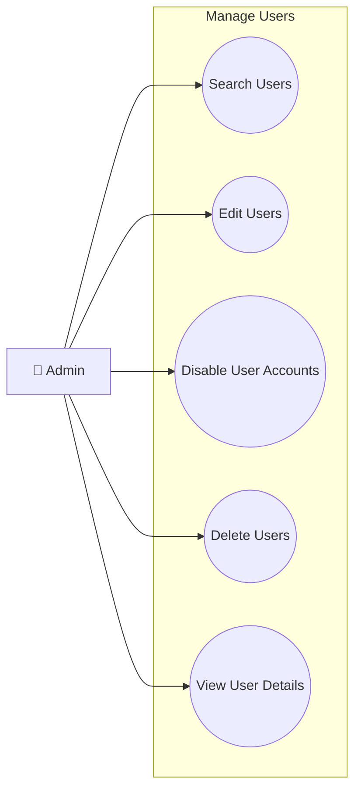

### 1.1 Search Users
| Field | Description |
|-------|-------------|
| **Purpose** | Tìm kiếm người dùng trong hệ thống theo các tiêu chí khác nhau |
| **Inputs** | Keyword (name, email), Role filter, Status filter, Page number, Page size |
| **Outputs** | Danh sách users phù hợp với tiêu chí tìm kiếm (paginated) |
| **API Endpoint** | `GET /v1/user/getAll?keyword={}&role={}&status={}&pageNo={}&pageSize={}` |

### 1.2 Edit Users
| Field | Description |
|-------|-------------|
| **Purpose** | Chỉnh sửa thông tin người dùng (profile, roles, status) |
| **Inputs** | User ID, Updated user data (name, email, phone, roles[], status) |
| **Outputs** | Updated user object, Success/Error message |
| **API Endpoint** | `PUT /v1/user/update` |

### 1.3 Disable User Accounts
| Field | Description |
|-------|-------------|
| **Purpose** | Vô hiệu hóa tài khoản người dùng (không thể đăng nhập) |
| **Inputs** | User ID, Reason for disabling |
| **Outputs** | Updated user status (INACTIVE), Confirmation message |
| **API Endpoint** | `PUT /v1/user/update` (set active = INACTIVE) |

### 1.4 Delete Users
| Field | Description |
|-------|-------------|
| **Purpose** | Xóa tài khoản người dùng khỏi hệ thống (soft/hard delete) |
| **Inputs** | User ID |
| **Outputs** | Success/Error message, Confirmation of deletion |
| **API Endpoint** | `DELETE /v1/user/deleteUserById/{id}` |

### 1.5 View User Details
| Field | Description |
|-------|-------------|
| **Purpose** | Xem thông tin chi tiết của người dùng bao gồm orders, activities |
| **Inputs** | User ID |
| **Outputs** | User profile, Order history, Activity logs, Addresses |
| **API Endpoint** | `GET /v1/user/getUserForAdminByUserId/{id}` |

---

## 2. MANAGE USER/OWNER (Quản Lý Shop Owner)

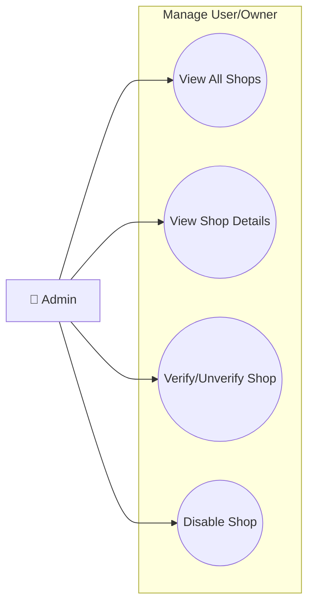

### 2.1 View All Shops
| Field | Description |
|-------|-------------|
| **Purpose** | Xem danh sách tất cả shop owners trong hệ thống |
| **Inputs** | Page number, Page size, Status filter, Verified filter |
| **Outputs** | Paginated list of shop owners với basic info |
| **API Endpoint** | `GET /v1/user/shop-owners` |

### 2.2 View Shop Details
| Field | Description |
|-------|-------------|
| **Purpose** | Xem chi tiết thông tin shop bao gồm products và stats |
| **Inputs** | Shop Owner ID |
| **Outputs** | Shop profile, Product count, Rating, Revenue stats |
| **API Endpoint** | `GET /v1/user/shop-owners/{id}` |

### 2.3 Verify/Unverify Shop
| Field | Description |
|-------|-------------|
| **Purpose** | Xác thực hoặc hủy xác thực shop (verified badge) |
| **Inputs** | Shop Owner ID, Verified status (true/false) |
| **Outputs** | Updated shop owner object, Confirmation message |
| **API Endpoint** | `PUT /v1/user/shop-owners` (set verified = true/false) |

### 2.4 Disable Shop
| Field | Description |
|-------|-------------|
| **Purpose** | Vô hiệu hóa shop, ngăn không cho bán hàng |
| **Inputs** | Shop Owner ID, Reason for disabling |
| **Outputs** | Updated shop status, Confirmation message |
| **API Endpoint** | `PUT /v1/user/shop-owners` (set status = INACTIVE) |

---

## 3. MANAGE CATEGORIES (Quản Lý Danh Mục)

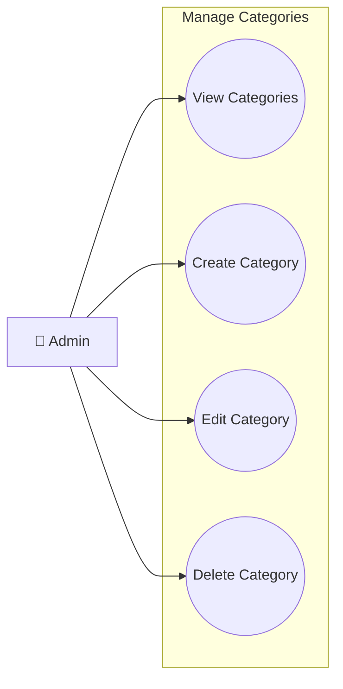

### 3.1 View Categories
| Field | Description |
|-------|-------------|
| **Purpose** | Xem danh sách tất cả danh mục sản phẩm |
| **Inputs** | None (or optional filters) |
| **Outputs** | List of all categories với product count |
| **API Endpoint** | `GET /v1/stock/category/getAll` |

### 3.2 Create Category
| Field | Description |
|-------|-------------|
| **Purpose** | Tạo danh mục sản phẩm mới |
| **Inputs** | Category name, Description, Image, Parent category ID (optional) |
| **Outputs** | Created category object, Success message |
| **API Endpoint** | `POST /v1/stock/category/create` |

### 3.3 Edit Category
| Field | Description |
|-------|-------------|
| **Purpose** | Chỉnh sửa thông tin danh mục |
| **Inputs** | Category ID, Updated data (name, description, image) |
| **Outputs** | Updated category object, Success message |
| **API Endpoint** | `PUT /v1/stock/category/update` |

### 3.4 Delete Category
| Field | Description |
|-------|-------------|
| **Purpose** | Xóa danh mục (chỉ khi không có products) |
| **Inputs** | Category ID |
| **Outputs** | Success/Error message (error nếu có products) |
| **API Endpoint** | `DELETE /v1/stock/category/delete/{id}` |

---

## 4. MANAGE SUBSCRIPTION (Quản Lý Gói Đăng Ký)

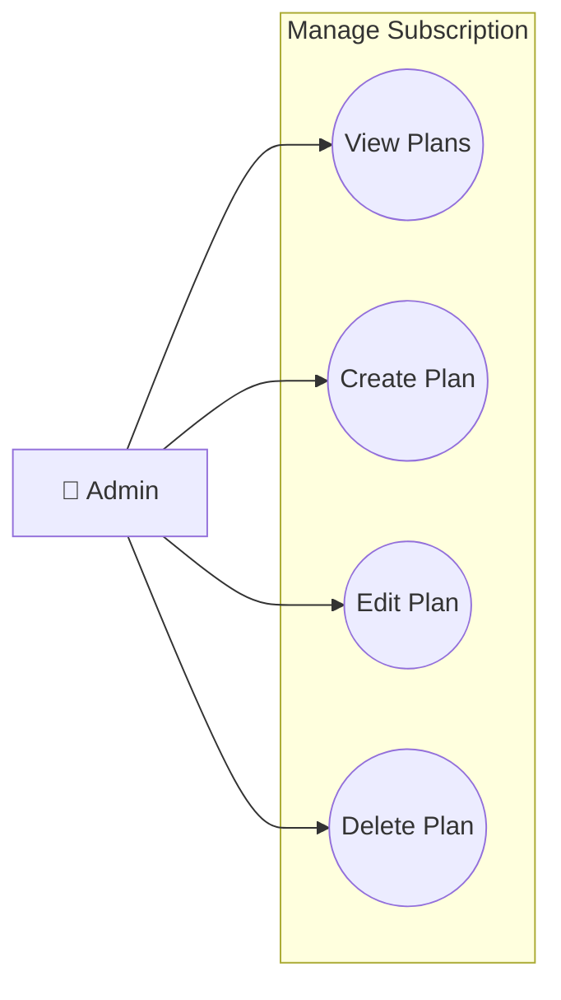

### 4.1 View Subscription Plans
| Field | Description |
|-------|-------------|
| **Purpose** | Xem danh sách tất cả gói subscription |
| **Inputs** | None |
| **Outputs** | List of all subscription plans với pricing, features |
| **API Endpoint** | `GET /v1/user/subscription-plans` |

### 4.2 Create Subscription Plan
| Field | Description |
|-------|-------------|
| **Purpose** | Tạo gói subscription mới cho shop owners |
| **Inputs** | Plan name, Price, Duration, Features[], Max products |
| **Outputs** | Created plan object, Success message |
| **API Endpoint** | `POST /v1/user/subscription-plans` |

### 4.3 Edit Subscription Plan
| Field | Description |
|-------|-------------|
| **Purpose** | Chỉnh sửa thông tin gói subscription |
| **Inputs** | Plan ID, Updated data (name, price, features) |
| **Outputs** | Updated plan object, Success message |
| **API Endpoint** | `PUT /v1/user/subscription-plans/{id}` |

### 4.4 Delete Subscription Plan
| Field | Description |
|-------|-------------|
| **Purpose** | Xóa gói subscription |
| **Inputs** | Plan ID |
| **Outputs** | Success message |
| **API Endpoint** | `DELETE /v1/user/subscription-plans/{id}` |

---

## 5. MANAGE VOUCHER (Quản Lý Mã Giảm Giá Platform)

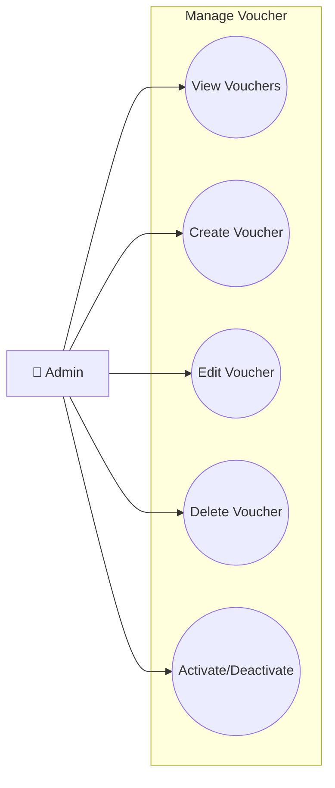

### 5.1 View Platform Vouchers
| Field | Description |
|-------|-------------|
| **Purpose** | Xem danh sách tất cả vouchers cấp platform |
| **Inputs** | Status filter, Date range |
| **Outputs** | List of platform vouchers với usage stats |
| **API Endpoint** | `GET /v1/stock/admin/vouchers` |

### 5.2 Create Platform Voucher
| Field | Description |
|-------|-------------|
| **Purpose** | Tạo voucher giảm giá mới cho toàn platform |
| **Inputs** | Code, Discount type, Discount value, Min order, Max discount, Start/End date, Usage limit |
| **Outputs** | Created voucher object |
| **API Endpoint** | `POST /v1/stock/admin/vouchers` |

### 5.3 Edit Platform Voucher
| Field | Description |
|-------|-------------|
| **Purpose** | Chỉnh sửa thông tin voucher |
| **Inputs** | Voucher ID, Updated data |
| **Outputs** | Updated voucher object |
| **API Endpoint** | `PUT /v1/stock/admin/vouchers/{id}` |

### 5.4 Delete Platform Voucher
| Field | Description |
|-------|-------------|
| **Purpose** | Xóa voucher khỏi hệ thống |
| **Inputs** | Voucher ID |
| **Outputs** | Success message |
| **API Endpoint** | `DELETE /v1/stock/admin/vouchers/{id}` |

### 5.5 Activate/Deactivate Voucher
| Field | Description |
|-------|-------------|
| **Purpose** | Kích hoạt hoặc tạm dừng voucher |
| **Inputs** | Voucher ID, Status (active/inactive) |
| **Outputs** | Updated voucher status |
| **API Endpoint** | `PUT /v1/stock/admin/vouchers/{id}` |

---

## 6. MANAGE ADMIN'S WALLET (Quản Lý Ví Platform)

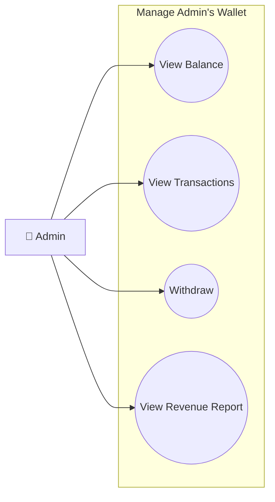

### 6.1 View Platform Balance
| Field | Description |
|-------|-------------|
| **Purpose** | Xem số dư ví của platform |
| **Inputs** | None |
| **Outputs** | Current balance, Available balance |
| **API Endpoint** | `GET /v1/user/admin/wallet` |

### 6.2 View Transaction History
| Field | Description |
|-------|-------------|
| **Purpose** | Xem lịch sử giao dịch của platform |
| **Inputs** | Date range, Transaction type filter, Page number |
| **Outputs** | Paginated list of transactions |
| **API Endpoint** | `GET /v1/user/admin/wallet/transactions` |

### 6.3 Withdraw Funds
| Field | Description |
|-------|-------------|
| **Purpose** | Rút tiền từ ví platform |
| **Inputs** | Amount, Bank account info |
| **Outputs** | Withdrawal request, Transaction ID |
| **API Endpoint** | `POST /v1/user/admin/wallet/withdraw` |

### 6.4 View Revenue Report
| Field | Description |
|-------|-------------|
| **Purpose** | Xem báo cáo doanh thu platform |
| **Inputs** | Date range, Group by (day/week/month) |
| **Outputs** | Revenue statistics, Commission earned |
| **API Endpoint** | `GET /v1/user/admin/wallet/revenue-report` |

---

## 7. CREATE DASHBOARD (Tạo/Xem Dashboard)

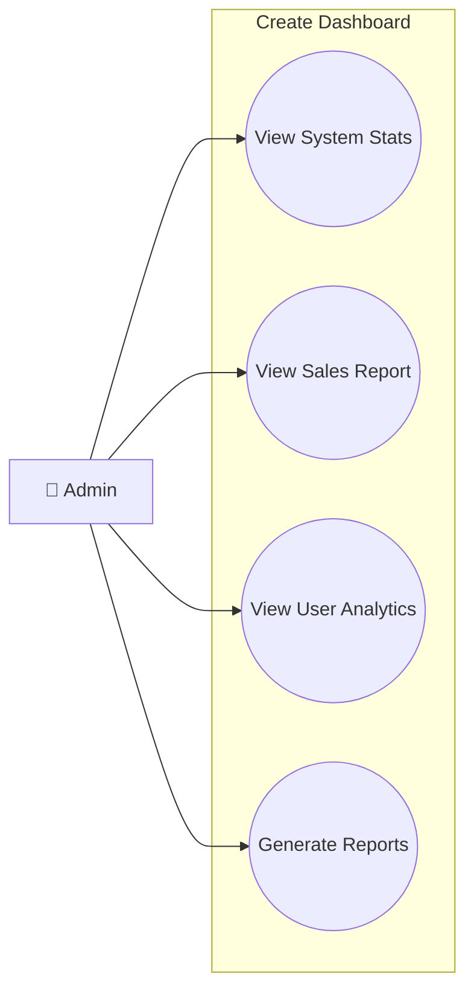

### 7.1 View System Statistics
| Field | Description |
|-------|-------------|
| **Purpose** | Xem thống kê tổng quan hệ thống |
| **Inputs** | Date range |
| **Outputs** | Total users, Total shops, Total orders, Total revenue |
| **API Endpoint** | `GET /v1/user/admin/dashboard/stats` |

### 7.2 View Sales Report
| Field | Description |
|-------|-------------|
| **Purpose** | Xem báo cáo doanh số bán hàng |
| **Inputs** | Date range, Category filter |
| **Outputs** | Sales by category, Top products, Revenue trends |
| **API Endpoint** | `GET /v1/order/admin/sales-report` |

### 7.3 View User Analytics
| Field | Description |
|-------|-------------|
| **Purpose** | Xem phân tích người dùng |
| **Inputs** | Date range |
| **Outputs** | New registrations, Active users, Conversion rates |
| **API Endpoint** | `GET /v1/user/admin/analytics` |

### 7.4 Generate Reports
| Field | Description |
|-------|-------------|
| **Purpose** | Tạo báo cáo xuất file (PDF/Excel) |
| **Inputs** | Report type, Date range, Format (PDF/Excel) |
| **Outputs** | Downloadable report file |
| **API Endpoint** | `POST /v1/user/admin/reports/generate` |

---

## 8. MANAGE NOTIFICATIONS (Quản Lý Thông Báo)

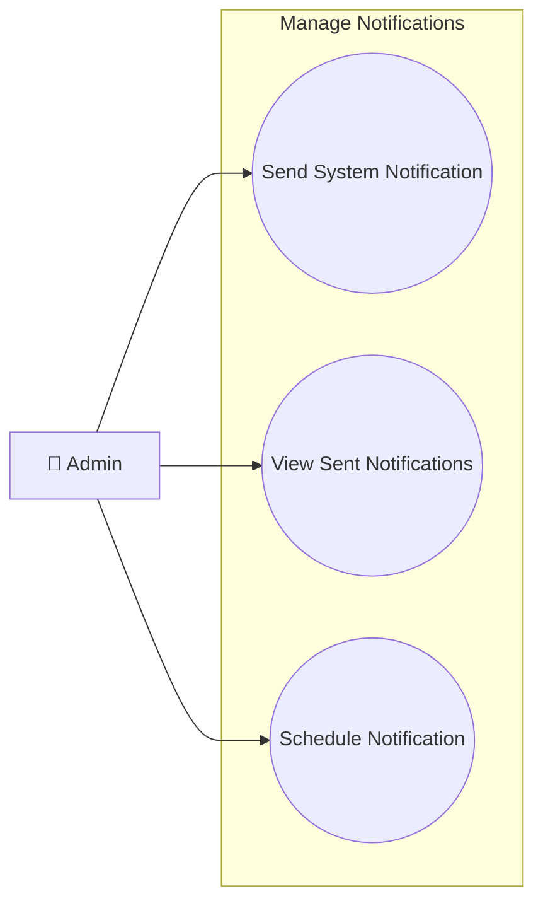

### 8.1 Send System Notification
| Field | Description |
|-------|-------------|
| **Purpose** | Gửi thông báo hệ thống đến users/shops |
| **Inputs** | Title, Content, Target audience (all/users/shops), Priority |
| **Outputs** | Notification sent confirmation, Delivery stats |
| **API Endpoint** | `POST /v1/notifications/admin/broadcast` |

### 8.2 View Sent Notifications
| Field | Description |
|-------|-------------|
| **Purpose** | Xem lịch sử thông báo đã gửi |
| **Inputs** | Date range, Type filter |
| **Outputs** | List of sent notifications với read rates |
| **API Endpoint** | `GET /v1/notifications/admin/history` |

### 8.3 Schedule Notification
| Field | Description |
|-------|-------------|
| **Purpose** | Lên lịch gửi thông báo |
| **Inputs** | Title, Content, Target, Scheduled time |
| **Outputs** | Scheduled notification object |
| **API Endpoint** | `POST /v1/notifications/admin/schedule` |

---

## 9. MANAGE ADVERTISING (Quản Lý Quảng Cáo)

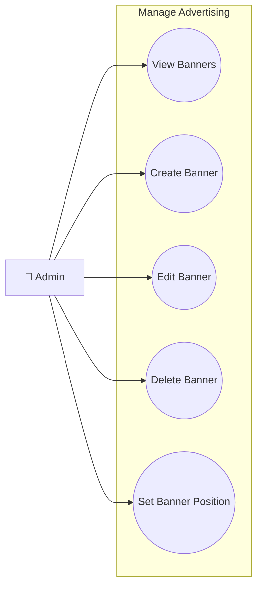

### 9.1 View Banners
| Field | Description |
|-------|-------------|
| **Purpose** | Xem danh sách banners quảng cáo |
| **Inputs** | Status filter, Position filter |
| **Outputs** | List of banners với views, clicks stats |
| **API Endpoint** | `GET /v1/user/banners` |

### 9.2 Create Banner
| Field | Description |
|-------|-------------|
| **Purpose** | Tạo banner quảng cáo mới |
| **Inputs** | Image, Link URL, Position, Start/End date, Priority |
| **Outputs** | Created banner object |
| **API Endpoint** | `POST /v1/user/banners` |

### 9.3 Edit Banner
| Field | Description |
|-------|-------------|
| **Purpose** | Chỉnh sửa thông tin banner |
| **Inputs** | Banner ID, Updated data |
| **Outputs** | Updated banner object |
| **API Endpoint** | `PUT /v1/user/banners/{id}` |

### 9.4 Delete Banner
| Field | Description |
|-------|-------------|
| **Purpose** | Xóa banner khỏi hệ thống |
| **Inputs** | Banner ID |
| **Outputs** | Success message |
| **API Endpoint** | `DELETE /v1/user/banners/{id}` |

### 9.5 Set Banner Position
| Field | Description |
|-------|-------------|
| **Purpose** | Đặt vị trí hiển thị của banner |
| **Inputs** | Banner ID, Position (home_top, home_middle, category_page) |
| **Outputs** | Updated banner với new position |
| **API Endpoint** | `PUT /v1/user/banners/{id}/position` |

---

## 10. MANAGE ROLE REQUESTS (Quản Lý Yêu Cầu Nâng Cấp)

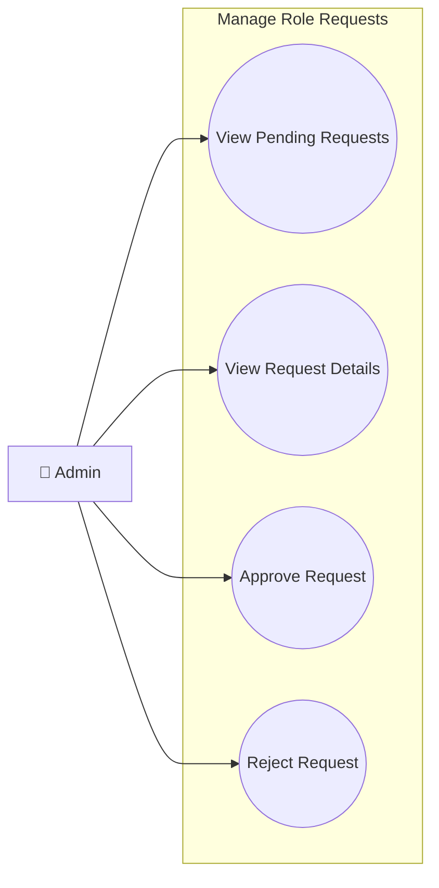

### 10.1 View Pending Requests
| Field | Description |
|-------|-------------|
| **Purpose** | Xem danh sách yêu cầu nâng cấp đang chờ duyệt |
| **Inputs** | Status filter (PENDING/APPROVED/REJECTED) |
| **Outputs** | List of role requests với user info |
| **API Endpoint** | `GET /v1/user/role-requests` |

### 10.2 View Request Details
| Field | Description |
|-------|-------------|
| **Purpose** | Xem chi tiết yêu cầu nâng cấp |
| **Inputs** | Request ID |
| **Outputs** | Request details, User profile, Business documents |
| **API Endpoint** | `GET /v1/user/role-requests/{id}` |

### 10.3 Approve Request
| Field | Description |
|-------|-------------|
| **Purpose** | Duyệt yêu cầu nâng cấp lên Shop Owner |
| **Inputs** | Request ID |
| **Outputs** | Updated request (APPROVED), User role updated, ShopOwner created |
| **API Endpoint** | `PUT /v1/user/role-requests/approve/{id}` |

### 10.4 Reject Request
| Field | Description |
|-------|-------------|
| **Purpose** | Từ chối yêu cầu nâng cấp |
| **Inputs** | Request ID, Rejection reason |
| **Outputs** | Updated request (REJECTED), Notification to user |
| **API Endpoint** | `PUT /v1/user/role-requests/reject/{id}` |

---

## 11. MANAGE ORDERS (Giám Sát Đơn Hàng)

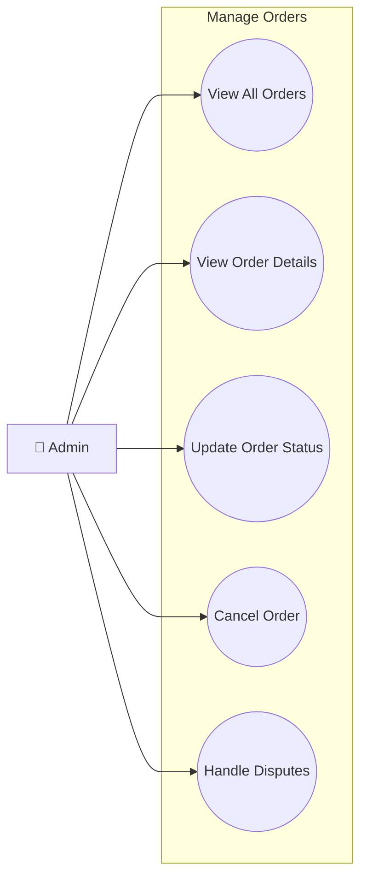

### 11.1 View All Orders
| Field | Description |
|-------|-------------|
| **Purpose** | Xem tất cả đơn hàng trong hệ thống |
| **Inputs** | Status filter, Date range, Shop filter, Page number |
| **Outputs** | Paginated list of orders |
| **API Endpoint** | `GET /v1/order/getAllOrders` |

### 11.2 View Order Details
| Field | Description |
|-------|-------------|
| **Purpose** | Xem chi tiết bất kỳ đơn hàng nào |
| **Inputs** | Order ID |
| **Outputs** | Order details, Items, Shipping info, Payment status |
| **API Endpoint** | `GET /v1/order/getOrderById/{id}` |

### 11.3 Update Order Status
| Field | Description |
|-------|-------------|
| **Purpose** | Cập nhật trạng thái đơn hàng (xử lý khiếu nại) |
| **Inputs** | Order ID, New status, Reason |
| **Outputs** | Updated order, Notification to user & shop |
| **API Endpoint** | `PUT /v1/order/updateStatus/{orderId}` |

### 11.4 Cancel Order
| Field | Description |
|-------|-------------|
| **Purpose** | Hủy đơn hàng |
| **Inputs** | Order ID, Cancellation reason |
| **Outputs** | Cancelled order, Refund initiated |
| **API Endpoint** | `PUT /v1/order/cancel/{orderId}` |

### 11.5 Handle Disputes
| Field | Description |
|-------|-------------|
| **Purpose** | Xử lý tranh chấp giữa buyer và seller |
| **Inputs** | Order ID, Resolution decision, Action |
| **Outputs** | Dispute resolved, Notifications sent |
| **API Endpoint** | `PUT /v1/order/admin/resolve-dispute/{orderId}` |

---

## 12. MANAGE LIVE (Quản Lý Livestream)

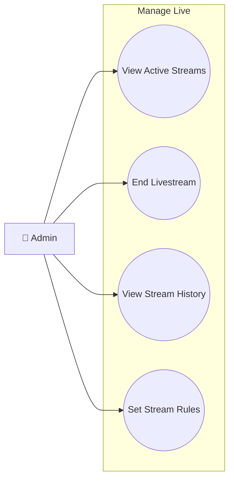

### 12.1 View Active Streams
| Field | Description |
|-------|-------------|
| **Purpose** | Xem danh sách livestreams đang diễn ra |
| **Inputs** | None |
| **Outputs** | List of active streams với viewer count |
| **API Endpoint** | `GET /v1/notifications/admin/live/active` |

### 12.2 End Livestream
| Field | Description |
|-------|-------------|
| **Purpose** | Kết thúc/cấm livestream vi phạm |
| **Inputs** | Stream ID, Reason |
| **Outputs** | Stream ended, Shop owner notified |
| **API Endpoint** | `PUT /v1/notifications/admin/live/{id}/end` |

### 12.3 View Stream History
| Field | Description |
|-------|-------------|
| **Purpose** | Xem lịch sử livestream |
| **Inputs** | Date range, Shop filter |
| **Outputs** | List of past streams với stats |
| **API Endpoint** | `GET /v1/notifications/admin/live/history` |

### 12.4 Set Stream Rules
| Field | Description |
|-------|-------------|
| **Purpose** | Thiết lập quy định cho livestream |
| **Inputs** | Max duration, Max viewers, Banned words |
| **Outputs** | Updated streaming rules |
| **API Endpoint** | `PUT /v1/notifications/admin/live/rules` |

---

## 13. ANALYS USER (Phân Tích Người Dùng)

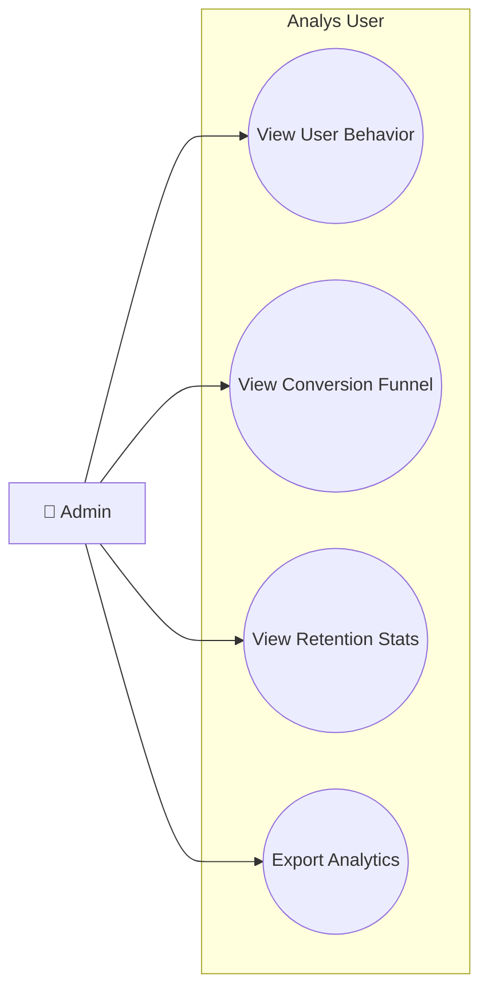

### 13.1 View User Behavior
| Field | Description |
|-------|-------------|
| **Purpose** | Phân tích hành vi người dùng |
| **Inputs** | Date range, User segment |
| **Outputs** | Page views, Session duration, Popular products |
| **API Endpoint** | `GET /v1/user/admin/analytics/behavior` |

### 13.2 View Conversion Funnel
| Field | Description |
|-------|-------------|
| **Purpose** | Xem phễu chuyển đổi (visit → cart → purchase) |
| **Inputs** | Date range |
| **Outputs** | Funnel stages với conversion rates |
| **API Endpoint** | `GET /v1/user/admin/analytics/funnel` |

### 13.3 View Retention Stats
| Field | Description |
|-------|-------------|
| **Purpose** | Xem tỷ lệ giữ chân khách hàng |
| **Inputs** | Cohort period |
| **Outputs** | Retention by week/month, Churn rate |
| **API Endpoint** | `GET /v1/user/admin/analytics/retention` |

### 13.4 Export Analytics
| Field | Description |
|-------|-------------|
| **Purpose** | Xuất báo cáo phân tích |
| **Inputs** | Report type, Date range, Format |
| **Outputs** | Downloadable analytics report |
| **API Endpoint** | `POST /v1/user/admin/analytics/export` |

---

## 14. LOGIN (Đăng Nhập)

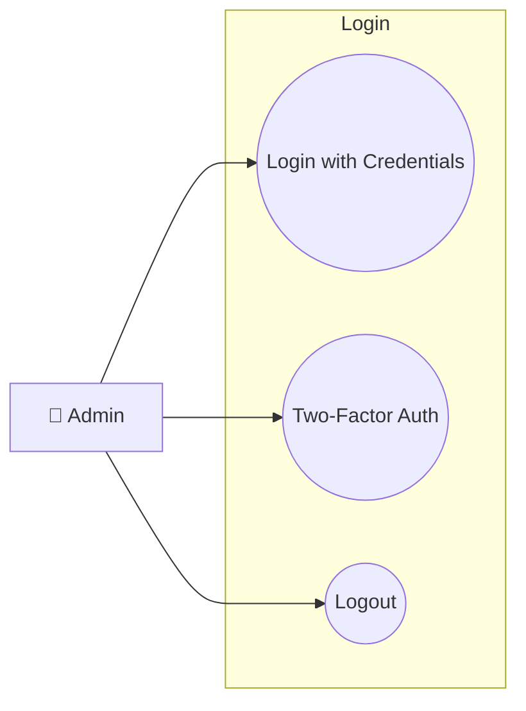

### 14.1 Login with Credentials
| Field | Description |
|-------|-------------|
| **Purpose** | Đăng nhập vào hệ thống admin |
| **Inputs** | Email, Password |
| **Outputs** | JWT Token, Admin profile |
| **API Endpoint** | `POST /v1/auth/login` |

### 14.2 Two-Factor Authentication
| Field | Description |
|-------|-------------|
| **Purpose** | Xác thực 2 lớp cho admin |
| **Inputs** | Admin credentials, OTP code |
| **Outputs** | JWT Token (after OTP verified) |
| **API Endpoint** | `POST /v1/auth/verify-2fa` |

### 14.3 Logout
| Field | Description |
|-------|-------------|
| **Purpose** | Đăng xuất khỏi hệ thống |
| **Inputs** | JWT Token |
| **Outputs** | Token invalidated, Logout success |
| **API Endpoint** | `POST /v1/auth/logout` |

---

## 15. CHAT (Chat Hỗ Trợ)

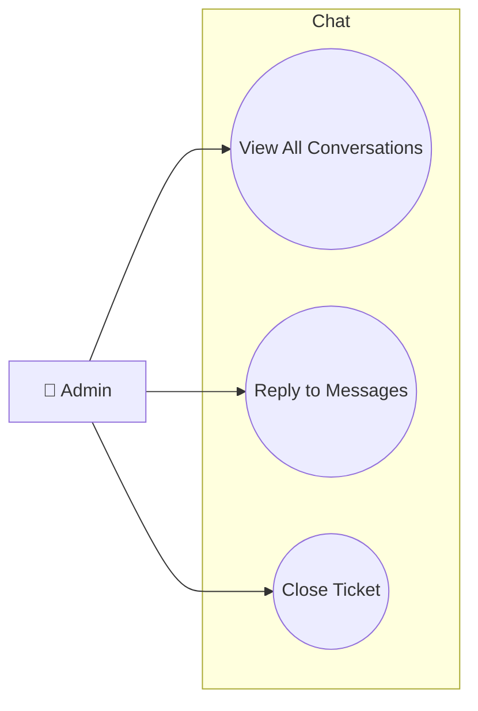

### 15.1 View All Conversations
| Field | Description |
|-------|-------------|
| **Purpose** | Xem tất cả conversations cần hỗ trợ |
| **Inputs** | Status filter (open/closed) |
| **Outputs** | List of support tickets/conversations |
| **API Endpoint** | `GET /v1/notifications/admin/chat/conversations` |

### 15.2 Reply to Messages
| Field | Description |
|-------|-------------|
| **Purpose** | Trả lời tin nhắn hỗ trợ |
| **Inputs** | Conversation ID, Message content |
| **Outputs** | Sent message, Real-time delivery |
| **API Endpoint** | `POST /v1/notifications/chat/messages` |

### 15.3 Close Ticket
| Field | Description |
|-------|-------------|
| **Purpose** | Đóng ticket hỗ trợ |
| **Inputs** | Conversation ID, Resolution notes |
| **Outputs** | Closed conversation |
| **API Endpoint** | `PUT /v1/notifications/admin/chat/{id}/close` |

---

## 16. CHATBOT (Quản Lý Chatbot)

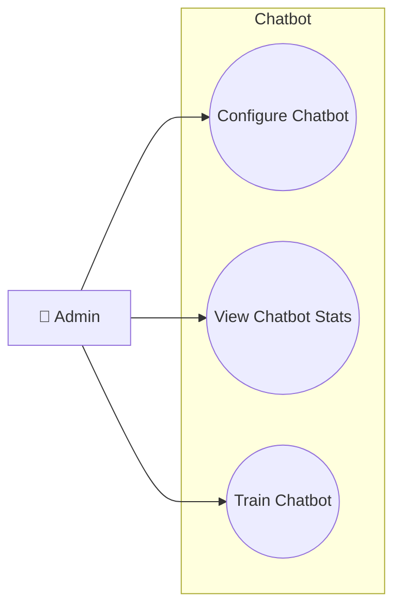

### 16.1 Configure Chatbot
| Field | Description |
|-------|-------------|
| **Purpose** | Cấu hình responses của chatbot |
| **Inputs** | FAQ items, Auto-reply templates |
| **Outputs** | Updated chatbot configuration |
| **API Endpoint** | `PUT /v1/notifications/admin/chatbot/config` |

### 16.2 View Chatbot Stats
| Field | Description |
|-------|-------------|
| **Purpose** | Xem thống kê chatbot |
| **Inputs** | Date range |
| **Outputs** | Messages handled, Resolution rate |
| **API Endpoint** | `GET /v1/notifications/admin/chatbot/stats` |

### 16.3 Train Chatbot
| Field | Description |
|-------|-------------|
| **Purpose** | Thêm dữ liệu training cho chatbot |
| **Inputs** | Training data (questions/answers) |
| **Outputs** | Training status, Accuracy improvement |
| **API Endpoint** | `POST /v1/notifications/admin/chatbot/train` |
