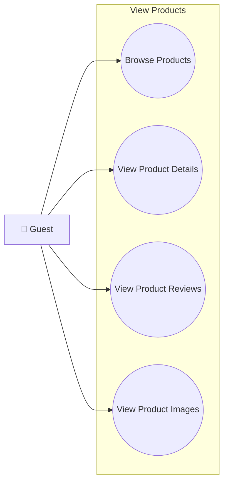
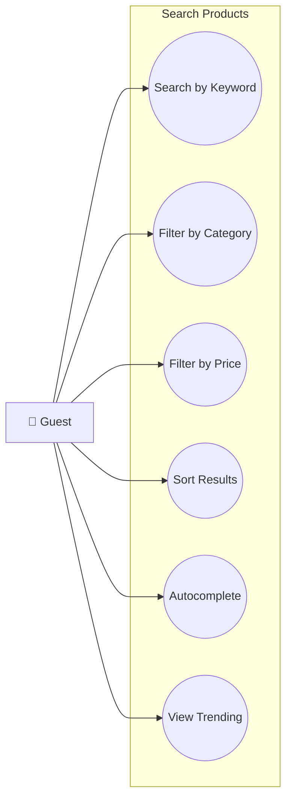
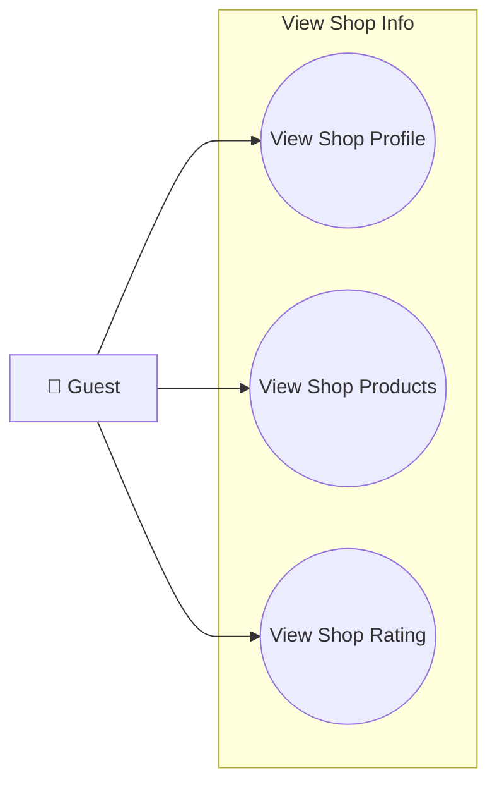
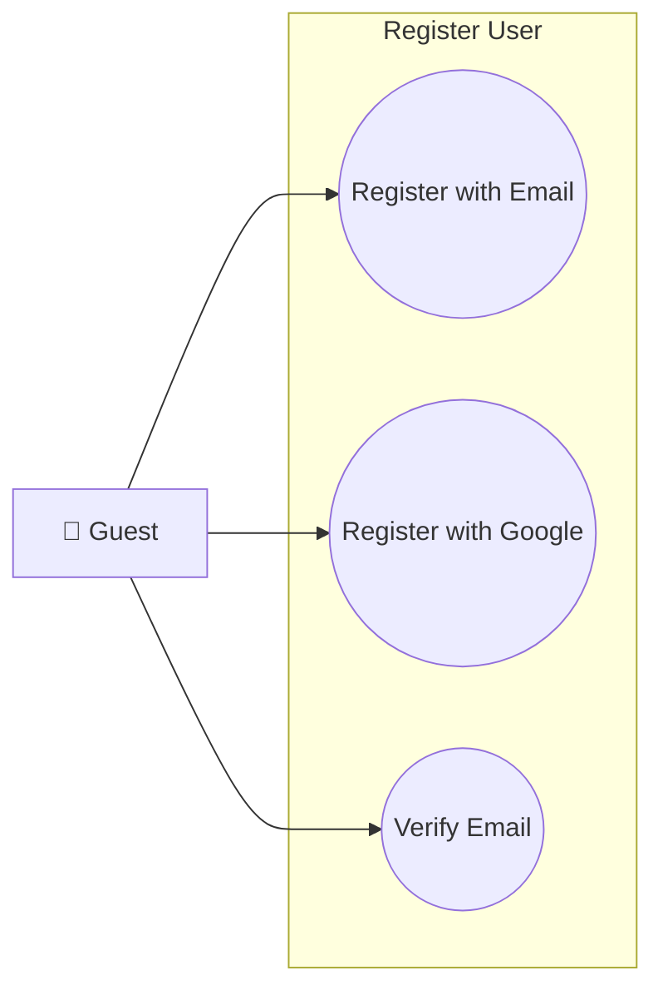
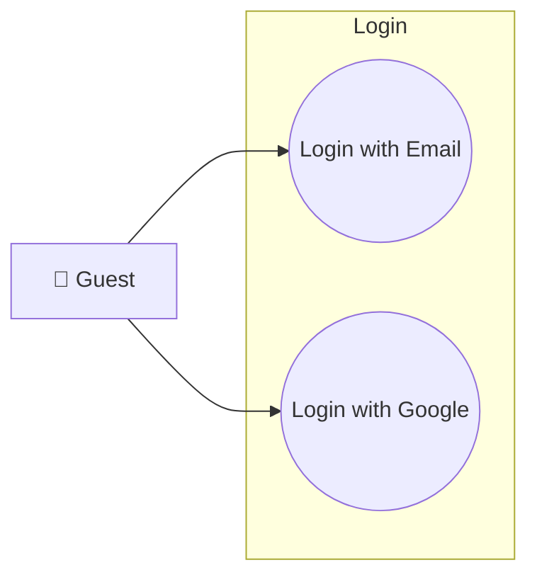
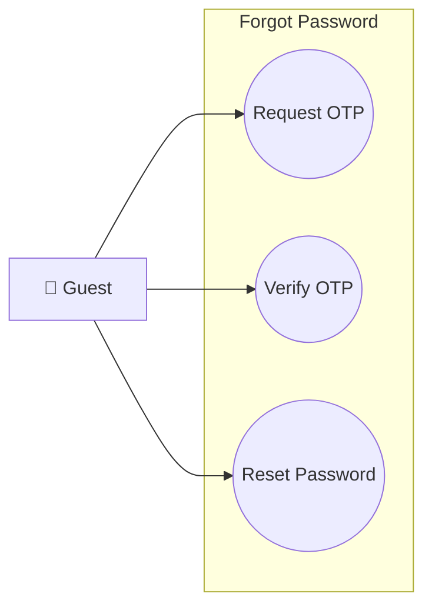
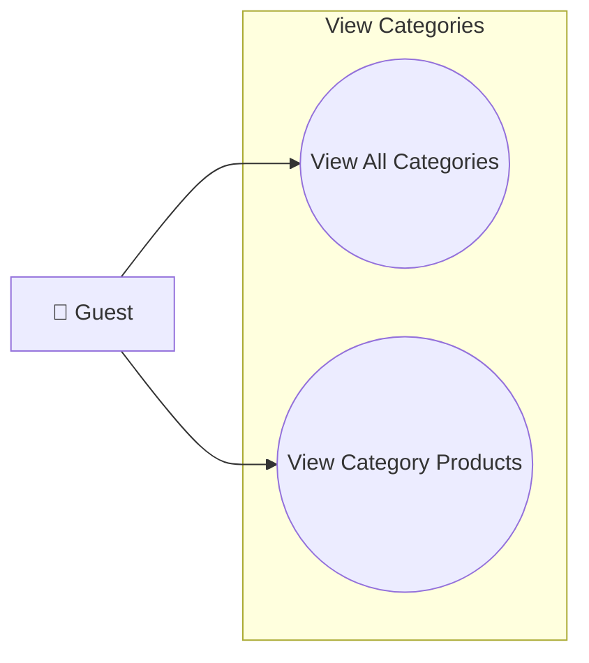
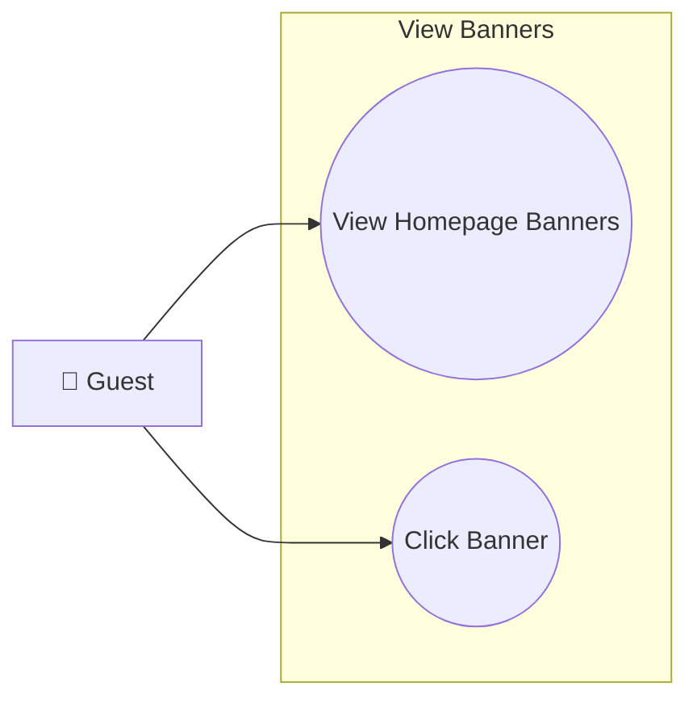
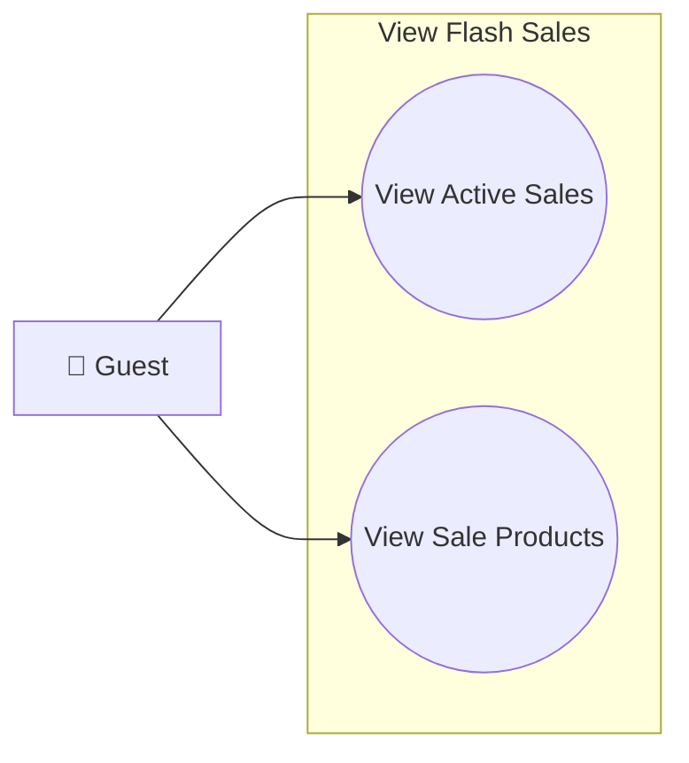
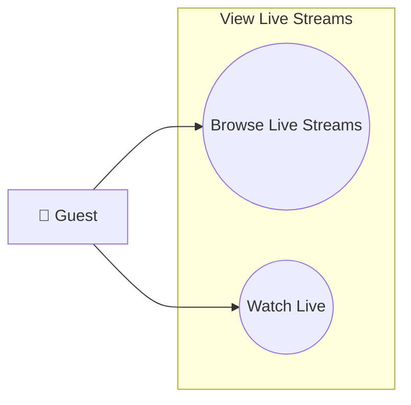

# 👤 GUEST - USE CASE SPECIFICATIONS

## Tổng Quan
**Actor:** Guest (Khách Chưa Đăng Nhập)
**Mô tả:** Người truy cập website nhưng chưa có tài khoản hoặc chưa đăng nhập. Có quyền hạn giới hạn chỉ cho phép xem và tìm kiếm sản phẩm.

---

## 1. VIEW PRODUCTS (Xem Sản Phẩm)

### 1.1 Browse Products
| Field | Description |
|-------|-------------|
| **Purpose** | Duyệt danh sách sản phẩm trên website |
| **Inputs** | Category ID (optional), Page number (default 1), Page size (default 20) |
| **Outputs** | Paginated list of products với basic info (name, price, image, rating) |
| **API Endpoint** | `GET /v1/stock/product` |

### 1.2 View Product Details
| Field | Description |
|-------|-------------|
| **Purpose** | Xem thông tin chi tiết của sản phẩm |
| **Inputs** | Product ID |
| **Outputs** | Full product info (name, description, price, sizes, stock, images, shop info) |
| **API Endpoint** | `GET /v1/stock/product/{id}` |

### 1.3 View Product Reviews
| Field | Description |
|-------|-------------|
| **Purpose** | Xem đánh giá của người mua về sản phẩm |
| **Inputs** | Product ID, Rating filter (optional), Page number |
| **Outputs** | List of reviews với rating, comment, images, reviewer info |
| **API Endpoint** | `GET /v1/stock/reviews/product/{productId}` |

### 1.4 View Product Images
| Field | Description |
|-------|-------------|
| **Purpose** | Xem gallery ảnh sản phẩm |
| **Inputs** | Product ID |
| **Outputs** | List of product images (included in product details) |
| **API Endpoint** | `GET /v1/stock/product/{id}` — images array |

---

## 2. SEARCH PRODUCTS (Tìm Kiếm Sản Phẩm)

### 2.1 Search by Keyword
| Field | Description |
|-------|-------------|
| **Purpose** | Tìm kiếm sản phẩm với smart query parsing và Redis cache |
| **Inputs** | Query string, Filters (optional), Sort (optional), Page number, Page size |
| **Outputs** | List of matching products, Total count, Parsed criteria (extracted price/category), Cached status |
| **API Endpoint** | `POST /v1/stock/search/query` |
| **Smart Parsing** | Tự động parse giá và category từ query: - "laptop dưới 10tr" → priceMax: 10,000,000 - "áo từ 100k đến 500k" → priceMin: 100,000, priceMax: 500,000 - "điện thoại trên 5tr" → priceMin: 5,000,000 |
| **Cache** | Results cached in Redis 24h, Response time: <50ms (cache hit), ~300-500ms (cache miss) |

### 2.2 Filter by Category
| Field | Description |
|-------|----------------|
| **Purpose** | Lọc sản phẩm theo danh mục |
| **Inputs** | Category names (array), Combined with search query |
| **Outputs** | Products in selected categories |
| **API Endpoint** | Included in `POST /v1/stock/search/query` filters |

### 2.3 Filter by Price
| Field | Description |
|-------|----------------|
| **Purpose** | Lọc sản phẩm theo khoảng giá |
| **Inputs** | Min price, Max price |
| **Outputs** | Products within price range |
| **API Endpoint** | Included in `POST /v1/stock/search/query` filters |
| **Quick Presets** | UI provides quick buttons: < 100k, 100k-500k, 500k-1tr, > 1tr |

### 2.4 Sort Results
| Field | Description |
|-------|----------------|
| **Purpose** | Sắp xếp kết quả tìm kiếm |
| **Inputs** | Sort by (relevance, price-asc, price-desc, newest, bestselling) |
| **Outputs** | Sorted product list |
| **API Endpoint** | Included in `POST /v1/stock/search/query` sortBy parameter |

### 2.5 Autocomplete Suggestions
| Field | Description |
|-------|----------------|
| **Purpose** | Gợi ý sản phẩm và keywords khi user đang nhập |
| **Inputs** | Partial query string (min 2 chars), Limit (default 10) |
| **Outputs** | List of suggestions: product names + trending keywords |
| **API Endpoint** | `GET /v1/stock/search/autocomplete?q={query}&limit=10` |
| **Response Types** | - "product": Product name với productId - "keyword": Trending search term |
| **Performance** | Debounced 300ms, Response time: <200ms |

### 2.6 View Trending Keywords
| Field | Description |
|-------|----------------|
| **Purpose** | Xem các từ khóa được tìm kiếm nhiều nhất |
| **Inputs** | None (displayed on homepage/search page) |
| **Outputs** | Top trending keywords với search count |
| **Storage** | Redis analytics:search:{keyword}, TTL: 7 days |
| **Update** | Real-time increment mỗi khi có search |

---

## 3. VIEW SHOP INFO (Xem Thông Tin Shop)

### 3.1 View Shop Profile
| Field | Description |
|-------|-------------|
| **Purpose** | Xem thông tin profile của shop |
| **Inputs** | Shop Owner ID |
| **Outputs** | Shop info (name, logo, description, address, verified status), Stats |
| **API Endpoint** | `GET /v1/user/shop-owners/{id}` |

### 3.2 View Shop Products
| Field | Description |
|-------|-------------|
| **Purpose** | Xem danh sách sản phẩm của shop |
| **Inputs** | Shop ID, Page number, Sort/Filter |
| **Outputs** | Paginated list of shop's products |
| **API Endpoint** | `GET /v1/stock/product/public/shop/{shopId}` |

### 3.3 View Shop Rating
| Field | Description |
|-------|-------------|
| **Purpose** | Xem đánh giá tổng thể của shop |
| **Inputs** | Shop ID |
| **Outputs** | Average rating, Total products, Total reviews |
| **API Endpoint** | `GET /v1/stock/product/public/shop/{shopId}/stats` |

---

## 4. REGISTER USER (Đăng Ký Tài Khoản)

### 4.1 Register with Email
| Field | Description |
|-------|-------------|
| **Purpose** | Đăng ký tài khoản mới bằng email |
| **Inputs** | Full name, Email, Password, Confirm password |
| **Outputs** | Success message, Verification email sent |
| **API Endpoint** | `POST /v1/auth/register` |

### 4.2 Register with Google
| Field | Description |
|-------|-------------|
| **Purpose** | Đăng ký/Đăng nhập bằng Google OAuth2 |
| **Inputs** | Google authorization code |
| **Outputs** | JWT Token, User profile (auto-created if new) |
| **API Endpoint** | `POST /v1/auth/login/google` |

### 4.3 Verify Email
| Field | Description |
|-------|-------------|
| **Purpose** | Xác thực email sau khi đăng ký |
| **Inputs** | Verification token (from email link) |
| **Outputs** | Email verified, Account activated |
| **API Endpoint** | `GET /v1/auth/verify?token={token}` |

---

## 5. LOGIN (Đăng Nhập)

### 5.1 Login with Email/Password
| Field | Description |
|-------|-------------|
| **Purpose** | Đăng nhập bằng email và mật khẩu |
| **Inputs** | Email, Password |
| **Outputs** | JWT Token (Access + Refresh), User profile |
| **API Endpoint** | `POST /v1/auth/login` |

### 5.2 Login with Google OAuth2
| Field | Description |
|-------|-------------|
| **Purpose** | Đăng nhập bằng tài khoản Google |
| **Inputs** | Google authorization code |
| **Outputs** | JWT Token, User profile |
| **API Endpoint** | `POST /v1/auth/login/google` |

---

## 6. FORGOT PASSWORD (Quên Mật Khẩu)

### 6.1 Request OTP
| Field | Description |
|-------|-------------|
| **Purpose** | Yêu cầu mã OTP để reset mật khẩu |
| **Inputs** | Email address |
| **Outputs** | OTP sent to email, Success message |
| **API Endpoint** | `POST /v1/auth/forgotPassword` |

### 6.2 Verify OTP
| Field | Description |
|-------|-------------|
| **Purpose** | Xác thực mã OTP |
| **Inputs** | Email, OTP code (6 digits) |
| **Outputs** | OTP verified, Reset token |
| **API Endpoint** | `POST /v1/auth/verifyOtp` |

### 6.3 Reset Password
| Field | Description |
|-------|-------------|
| **Purpose** | Đặt mật khẩu mới |
| **Inputs** | Email, New password, Confirm password |
| **Outputs** | Password updated, Success message |
| **API Endpoint** | `POST /v1/auth/updatePassword` |

---

## 7. VIEW CATEGORIES (Xem Danh Mục)

### 7.1 View All Categories
| Field | Description |
|-------|-------------|
| **Purpose** | Xem danh sách tất cả danh mục sản phẩm |
| **Inputs** | None |
| **Outputs** | List of categories với name, image, product count |
| **API Endpoint** | `GET /v1/stock/category/getAll` |

### 7.2 View Category Products
| Field | Description |
|-------|-------------|
| **Purpose** | Xem sản phẩm trong một danh mục |
| **Inputs** | Category ID, Page number |
| **Outputs** | Paginated products in category |
| **API Endpoint** | `GET /v1/stock/product?categoryId={categoryId}` |

---

## 8. VIEW BANNERS (Xem Banner Quảng Cáo)

### 8.1 View Homepage Banners
| Field | Description |
|-------|-------------|
| **Purpose** | Xem các banner quảng cáo trên trang chủ |
| **Inputs** | None |
| **Outputs** | List of active banners với image, link |
| **API Endpoint** | `GET /v1/user/banners/public` |

### 8.2 Click Banner
| Field | Description |
|-------|-------------|
| **Purpose** | Click vào banner để xem chi tiết |
| **Inputs** | Banner ID |
| **Outputs** | Redirect to banner link URL |
| **API Endpoint** | Client-side redirect |

---

## 9. VIEW FLASH SALES (Xem Flash Sale)

### 9.1 View Active Flash Sales
| Field | Description |
|-------|-------------|
| **Purpose** | Xem các chương trình flash sale đang diễn ra |
| **Inputs** | None |
| **Outputs** | List of active flash sales với countdown timer |
| **API Endpoint** | `GET /v1/stock/flash-sales/active` |

### 9.2 View Flash Sale Products
| Field | Description |
|-------|-------------|
| **Purpose** | Xem sản phẩm trong flash sale |
| **Inputs** | Flash sale ID |
| **Outputs** | Products with discounted prices |
| **API Endpoint** | `GET /v1/stock/flash-sales/{id}/products` |

---

## 10. VIEW LIVE STREAMS (Xem Livestream - Limited)

### 10.1 Browse Live Streams
| Field | Description |
|-------|-------------|
| **Purpose** | Duyệt các livestream đang diễn ra |
| **Inputs** | None |
| **Outputs** | List of active livestreams |
| **API Endpoint** | `GET /v1/notifications/live/active` |

### 10.2 Watch Live (Read-only)
| Field | Description |
|-------|-------------|
| **Purpose** | Xem livestream (không thể chat hoặc mua) |
| **Inputs** | Stream ID |
| **Outputs** | Live stream video, Products being shown |
| **API Endpoint** | `GET /v1/notifications/live/{id}` |

> **⚠️ Hạn chế:** Guest chỉ có thể xem livestream, không thể chat hoặc mua hàng từ live. Cần đăng nhập để tương tác.

---

## SUMMARY - GUEST LIMITATIONS

### ✅ CÓ THỂ LÀM (Allowed):
- Xem danh sách sản phẩm
- Tìm kiếm sản phẩm
- Xem chi tiết sản phẩm
- Xem đánh giá sản phẩm
- Xem thông tin shop
- Xem danh mục
- Xem banner
- Xem flash sale
- Xem livestream (read-only)
- Đăng ký tài khoản
- Đăng nhập
- Quên/Reset mật khẩu

### ❌ KHÔNG THỂ LÀM (Not Allowed):
- Thêm sản phẩm vào giỏ hàng
- Đặt hàng
- Thanh toán
- Xem lịch sử đơn hàng
- Viết đánh giá
- Chat với shop
- Chat trong livestream
- Mua hàng từ livestream
- Theo dõi shop
- Quản lý profile
- Quản lý địa chỉ
- Nhận thông báo
