# 🏪 SHOP OWNER - USE CASE SPECIFICATIONS

## Tổng Quan
**Actor:** Shop Owner (Chủ Shop)
**Mô tả:** User đã được Admin duyệt để bán hàng trên nền tảng. Bao gồm tất cả quyền của User cộng thêm quyền quản lý shop.

---

## 1. MANAGE SHOP PROFILE (Quản Lý Thông Tin Shop)

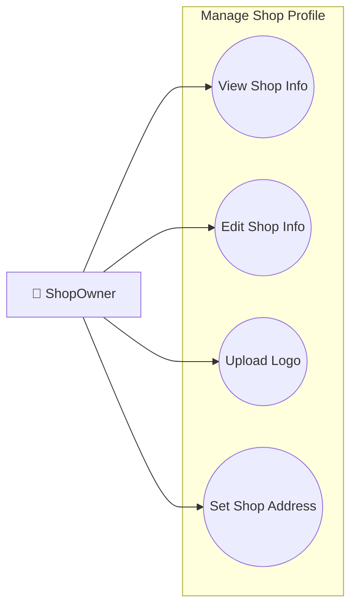

### 1.1 View Shop Info
| Field | Description |
|-------|-------------|
| **Purpose** | Xem thông tin profile của shop |
| **Inputs** | JWT Token (Shop Owner ID extracted) |
| **Outputs** | Shop profile (name, logo, address, rating, verified status) |
| **API Endpoint** | `GET /v1/user/shop-owners` |

### 1.2 Edit Shop Info
| Field | Description |
|-------|-------------|
| **Purpose** | Cập nhật thông tin shop |
| **Inputs** | Shop name, Description, Contact phone, Business hours |
| **Outputs** | Updated shop profile |
| **API Endpoint** | `PUT /v1/user/shop-owners` |

### 1.3 Upload Logo
| Field | Description |
|-------|-------------|
| **Purpose** | Upload/thay đổi logo shop |
| **Inputs** | Image file (JPG/PNG, max 5MB) |
| **Outputs** | Image URL, Updated shop profile |
| **API Endpoint** | `PUT /v1/user/shop-owners` (with file-storage integration) |

### 1.4 Set Shop Address
| Field | Description |
|-------|-------------|
| **Purpose** | Thiết lập địa chỉ shop (dùng cho tính phí ship) |
| **Inputs** | Province, District, Ward, Street address |
| **Outputs** | Updated shop address, GHN District/Ward codes |
| **API Endpoint** | `PUT /v1/user/shop-owners` |

---

## 2. MANAGE PRODUCTS (Quản Lý Sản Phẩm)

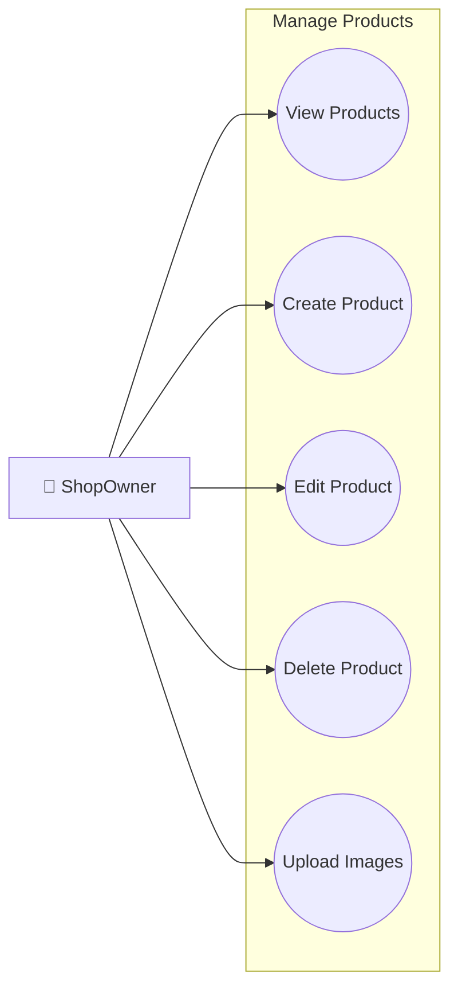

### 2.1 View Products
| Field | Description |
|-------|-------------|
| **Purpose** | Xem danh sách sản phẩm của shop |
| **Inputs** | Page number, Page size, Status filter, Category filter |
| **Outputs** | Paginated list of products với stock info |
| **API Endpoint** | `GET /v1/stock/product/getProductByUserId` |

### 2.2 Create Product
| Field | Description |
|-------|-------------|
| **Purpose** | Tạo sản phẩm mới |
| **Inputs** | Name, Description, Price, Category ID, Images[], Sizes[] |
| **Outputs** | Created product object |
| **API Endpoint** | `POST /v1/stock/product/create` |

### 2.3 Edit Product
| Field | Description |
|-------|-------------|
| **Purpose** | Chỉnh sửa thông tin sản phẩm |
| **Inputs** | Product ID, Updated fields (name, price, description) |
| **Outputs** | Updated product object |
| **API Endpoint** | `PUT /v1/stock/product/update` |

### 2.4 Delete Product
| Field | Description |
|-------|-------------|
| **Purpose** | Xóa sản phẩm khỏi shop |
| **Inputs** | Product ID |
| **Outputs** | Success message, Cascade delete sizes |
| **API Endpoint** | `DELETE /v1/stock/product/deleteProductById/{id}` |

### 2.5 Upload Product Images
| Field | Description |
|-------|-------------|
| **Purpose** | Upload ảnh cho sản phẩm |
| **Inputs** | Product ID, Image files[] |
| **Outputs** | Image URLs, Updated product |
| **API Endpoint** | `POST /v1/file-storage/upload` + `PUT /v1/stock/product/update` |

---

## 3. MANAGE SIZES & STOCK (Quản Lý Size & Tồn Kho)

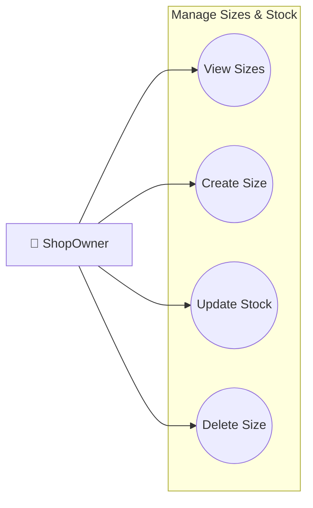

### 3.1 View Sizes
| Field | Description |
|-------|-------------|
| **Purpose** | Xem danh sách sizes của sản phẩm |
| **Inputs** | Product ID |
| **Outputs** | List of sizes với stock quantity |
| **API Endpoint** | `GET /v1/stock/size/getByProductId/{productId}` |

### 3.2 Create Size
| Field | Description |
|-------|-------------|
| **Purpose** | Thêm size mới cho sản phẩm |
| **Inputs** | Product ID, Size name, Stock quantity |
| **Outputs** | Created size object |
| **API Endpoint** | `POST /v1/stock/size/create` |

### 3.3 Update Stock
| Field | Description |
|-------|-------------|
| **Purpose** | Cập nhật số lượng tồn kho |
| **Inputs** | Size ID, New stock quantity |
| **Outputs** | Updated size object |
| **API Endpoint** | `PUT /v1/stock/size/update` |

### 3.4 Delete Size
| Field | Description |
|-------|-------------|
| **Purpose** | Xóa size khỏi sản phẩm |
| **Inputs** | Size ID |
| **Outputs** | Success message |
| **API Endpoint** | `DELETE /v1/stock/size/delete/{id}` |

---

## 4. MANAGE ORDERS (Quản Lý Đơn Hàng)

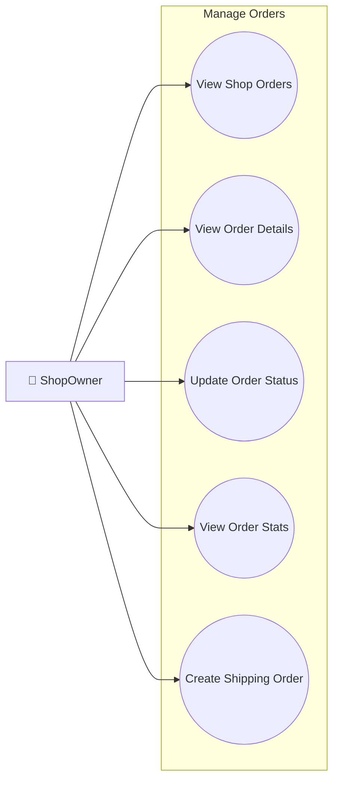

### 4.1 View Shop Orders
| Field | Description |
|-------|-------------|
| **Purpose** | Xem danh sách đơn hàng có products của shop |
| **Inputs** | Status filter, Date range, Page number |
| **Outputs** | Paginated list of orders |
| **API Endpoint** | `GET /v1/order/shop-owner/orders` |

### 4.2 View Order Details
| Field | Description |
|-------|-------------|
| **Purpose** | Xem chi tiết đơn hàng (chỉ items của shop) |
| **Inputs** | Order ID |
| **Outputs** | Order details, Items, Customer info, Shipping info |
| **API Endpoint** | `GET /v1/order/getOrderById/{id}` |

### 4.3 Update Order Status
| Field | Description |
|-------|-------------|
| **Purpose** | Cập nhật trạng thái đơn hàng |
| **Inputs** | Order ID, New status (PROCESSING, SHIPPED) |
| **Outputs** | Updated order, Notification sent to customer |
| **API Endpoint** | `PUT /v1/order/updateStatus/{orderId}` |

### 4.4 View Order Statistics
| Field | Description |
|-------|-------------|
| **Purpose** | Xem thống kê đơn hàng |
| **Inputs** | Date range |
| **Outputs** | Orders by status, Revenue today, Pending count |
| **API Endpoint** | `GET /v1/order/shop-owner/stats` |

### 4.5 Create Shipping Order
| Field | Description |
|-------|-------------|
| **Purpose** | Tạo vận đơn GHN |
| **Inputs** | Order ID (auto-triggered when PROCESSING) |
| **Outputs** | GHN order code, Tracking URL |
| **API Endpoint** | Auto-trigger via order-service → GHN API |

---

## 5. MANAGE SHOPOWNER WALLET (Quản Lý Ví Shop)

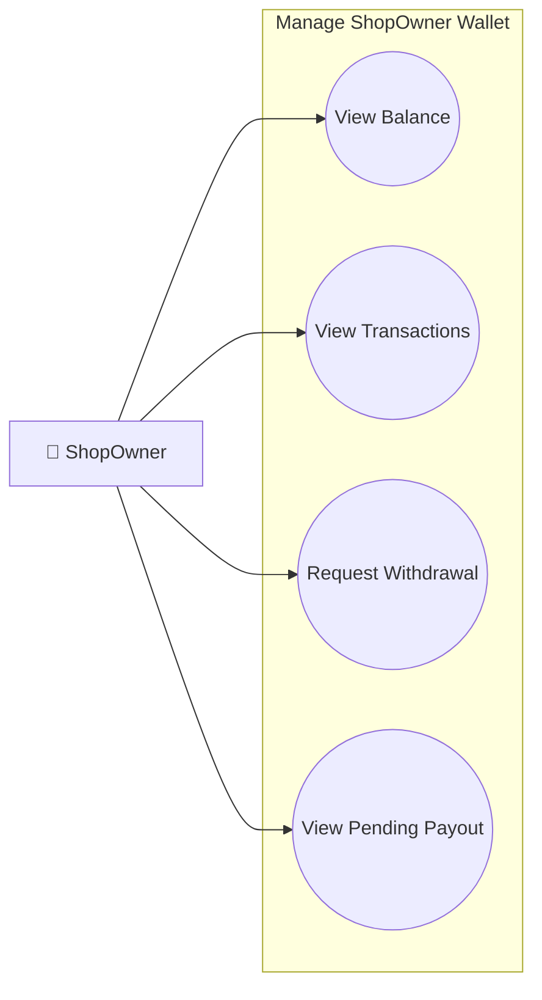

### 5.1 View Balance
| Field | Description |
|-------|-------------|
| **Purpose** | Xem số dư ví của shop |
| **Inputs** | JWT Token |
| **Outputs** | Available balance, Pending balance |
| **API Endpoint** | `GET /v1/user/wallet` |

### 5.2 View Transactions
| Field | Description |
|-------|-------------|
| **Purpose** | Xem lịch sử giao dịch |
| **Inputs** | Date range, Transaction type |
| **Outputs** | List of transactions (credits, debits) |
| **API Endpoint** | `GET /v1/user/wallet/transactions` |

### 5.3 Request Withdrawal
| Field | Description |
|-------|-------------|
| **Purpose** | Yêu cầu rút tiền về tài khoản ngân hàng |
| **Inputs** | Amount, Bank account info |
| **Outputs** | Withdrawal request ID, Pending status |
| **API Endpoint** | `POST /v1/user/wallet/withdraw` |

### 5.4 View Pending Payout
| Field | Description |
|-------|-------------|
| **Purpose** | Xem tiền đang chờ thanh toán từ đơn hàng |
| **Inputs** | None |
| **Outputs** | Pending payout amount, Expected release date |
| **API Endpoint** | `GET /v1/user/wallet/pending-payout` |

---

## 6. MANAGE LIVE (Quản Lý Livestream)

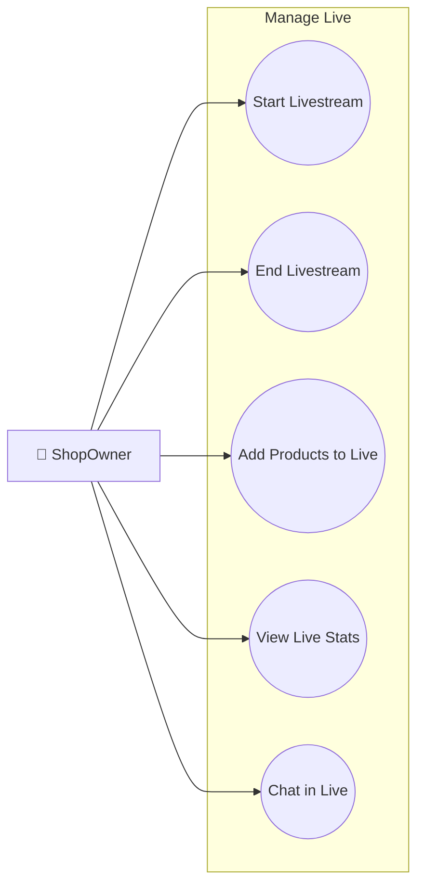

### 6.1 Start Livestream
| Field | Description |
|-------|-------------|
| **Purpose** | Bắt đầu phiên livestream bán hàng |
| **Inputs** | Title, Description, Thumbnail |
| **Outputs** | Live stream URL, Stream key |
| **API Endpoint** | `POST /v1/notifications/live/start` |

### 6.2 End Livestream
| Field | Description |
|-------|-------------|
| **Purpose** | Kết thúc phiên livestream |
| **Inputs** | Stream ID |
| **Outputs** | Stream ended, Final stats |
| **API Endpoint** | `PUT /v1/notifications/live/{id}/end` |

### 6.3 Add Products to Live
| Field | Description |
|-------|-------------|
| **Purpose** | Thêm sản phẩm vào livestream để bán |
| **Inputs** | Stream ID, Product IDs[], Special prices[] |
| **Outputs** | Products added to live |
| **API Endpoint** | `POST /v1/notifications/live/{id}/products` |

### 6.4 View Live Statistics
| Field | Description |
|-------|-------------|
| **Purpose** | Xem thống kê livestream |
| **Inputs** | Stream ID or Date range |
| **Outputs** | Peak viewers, Total views, Orders from live |
| **API Endpoint** | `GET /v1/notifications/live/{id}/stats` |

### 6.5 Chat in Live
| Field | Description |
|-------|-------------|
| **Purpose** | Trả lời chat trong livestream |
| **Inputs** | Stream ID, Message content |
| **Outputs** | Message sent to all viewers |
| **API Endpoint** | WebSocket `/live/{id}/chat` |

---

## 7. TRACKING ORDER (Theo Dõi Đơn Hàng)

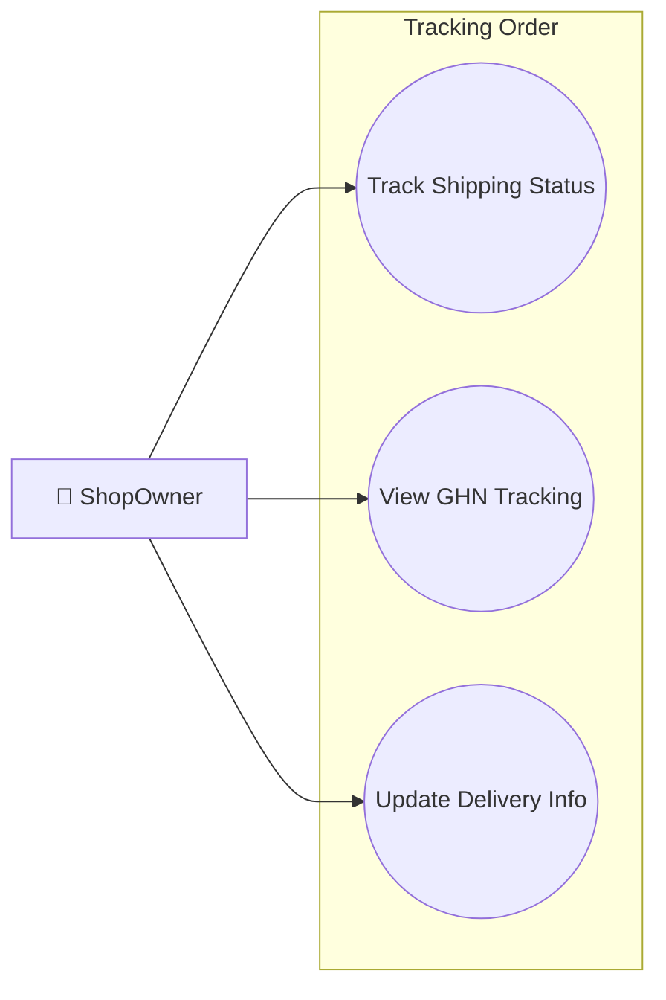

### 7.1 Track Shipping Status
| Field | Description |
|-------|-------------|
| **Purpose** | Theo dõi trạng thái vận chuyển đơn hàng |
| **Inputs** | Order ID |
| **Outputs** | Current shipping status, Location |
| **API Endpoint** | `GET /v1/order/{id}/shipping-status` |

### 7.2 View GHN Tracking
| Field | Description |
|-------|-------------|
| **Purpose** | Xem chi tiết tracking từ GHN |
| **Inputs** | GHN Order Code |
| **Outputs** | Full tracking history, Expected delivery |
| **API Endpoint** | `GET /v1/order/ghn/tracking/{orderCode}` |

### 7.3 Update Delivery Info
| Field | Description |
|-------|-------------|
| **Purpose** | Cập nhật thông tin giao hàng |
| **Inputs** | Order ID, Carrier, Tracking number |
| **Outputs** | Updated shipping info |
| **API Endpoint** | `PUT /v1/order/{id}/shipping-info` |

---

## 8. SHOP ANALYTIC REVENUE (Phân Tích Doanh Thu)

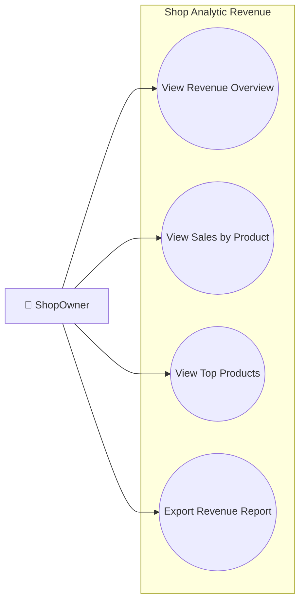

### 8.1 View Revenue Overview
| Field | Description |
|-------|-------------|
| **Purpose** | Xem tổng quan doanh thu |
| **Inputs** | Date range (day/week/month) |
| **Outputs** | Total revenue, Orders count, Average order value |
| **API Endpoint** | `GET /v1/order/shop-owner/analytics` |

### 8.2 View Sales by Product
| Field | Description |
|-------|-------------|
| **Purpose** | Xem doanh thu theo từng sản phẩm |
| **Inputs** | Date range, Product filter |
| **Outputs** | Sales breakdown by product |
| **API Endpoint** | `GET /v1/order/shop-owner/analytics/by-product` |

### 8.3 View Top Products
| Field | Description |
|-------|-------------|
| **Purpose** | Xem sản phẩm bán chạy nhất |
| **Inputs** | Date range, Top N |
| **Outputs** | Top selling products với quantity, revenue |
| **API Endpoint** | `GET /v1/order/shop-owner/analytics/top-products` |

### 8.4 Export Revenue Report
| Field | Description |
|-------|-------------|
| **Purpose** | Xuất báo cáo doanh thu |
| **Inputs** | Date range, Format (PDF/Excel) |
| **Outputs** | Downloadable report file |
| **API Endpoint** | `POST /v1/order/shop-owner/analytics/export` |

---

## 9. MANAGE VOUCHERS (Quản Lý Mã Giảm Giá Shop)

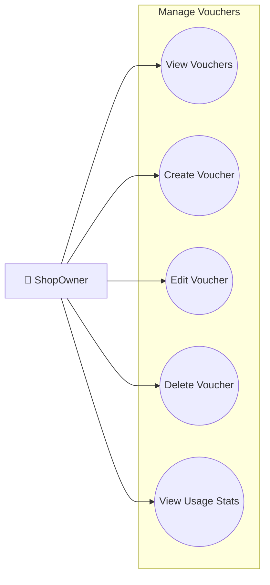

### 9.1 View Vouchers
| Field | Description |
|-------|-------------|
| **Purpose** | Xem danh sách vouchers của shop |
| **Inputs** | Status filter, Date range |
| **Outputs** | List of shop vouchers |
| **API Endpoint** | `GET /v1/stock/vouchers` |

### 9.2 Create Voucher
| Field | Description |
|-------|-------------|
| **Purpose** | Tạo voucher mới cho shop |
| **Inputs** | Code, Discount type/value, Min order, Start/End date, Limit |
| **Outputs** | Created voucher object |
| **API Endpoint** | `POST /v1/stock/vouchers` |

### 9.3 Edit Voucher
| Field | Description |
|-------|-------------|
| **Purpose** | Chỉnh sửa voucher |
| **Inputs** | Voucher ID, Updated fields |
| **Outputs** | Updated voucher |
| **API Endpoint** | `PUT /v1/stock/vouchers/{id}` |

### 9.4 Delete Voucher
| Field | Description |
|-------|-------------|
| **Purpose** | Xóa voucher |
| **Inputs** | Voucher ID |
| **Outputs** | Success message |
| **API Endpoint** | `DELETE /v1/stock/vouchers/{id}` |

### 9.5 View Usage Statistics
| Field | Description |
|-------|-------------|
| **Purpose** | Xem thống kê sử dụng voucher |
| **Inputs** | Voucher ID |
| **Outputs** | Usage count, Revenue impact |
| **API Endpoint** | `GET /v1/stock/vouchers/{id}/stats` |

---

## 10. MANAGE SUBSCRIPTION (Quản Lý Gói Đăng Ký)

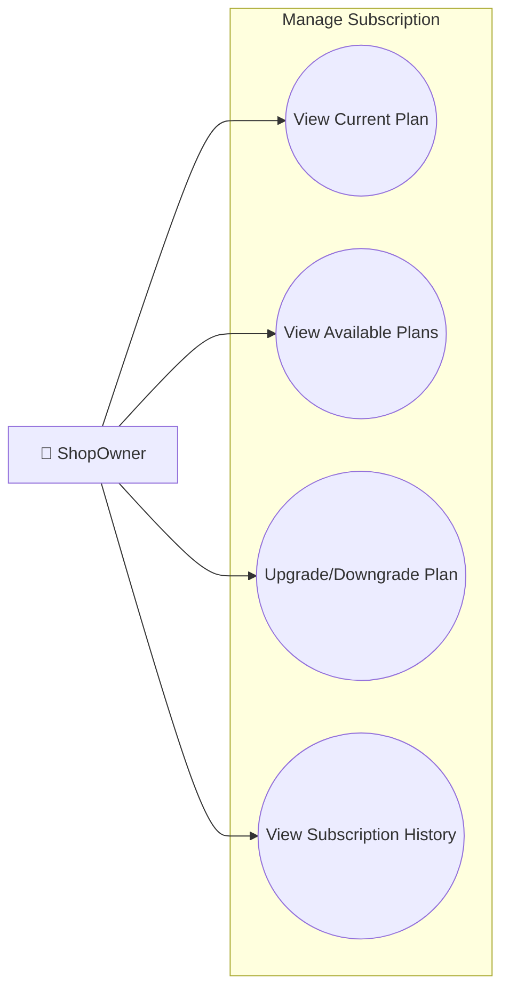

### 10.1 View Current Plan
| Field | Description |
|-------|-------------|
| **Purpose** | Xem gói subscription hiện tại |
| **Inputs** | JWT Token (Shop ID) |
| **Outputs** | Current plan details, Expiry date, Features |
| **API Endpoint** | `GET /v1/user/subscriptions/shop/{shopId}` |

### 10.2 View Available Plans
| Field | Description |
|-------|-------------|
| **Purpose** | Xem các gói subscription có sẵn |
| **Inputs** | None |
| **Outputs** | List of plans với pricing, features |
| **API Endpoint** | `GET /v1/user/subscription-plans` |

### 10.3 Upgrade/Downgrade Plan
| Field | Description |
|-------|-------------|
| **Purpose** | Nâng cấp hoặc hạ cấp gói subscription |
| **Inputs** | New plan ID, Payment method |
| **Outputs** | Updated subscription, Payment processed |
| **API Endpoint** | `POST /v1/user/subscriptions/change` |

### 10.4 View Subscription History
| Field | Description |
|-------|-------------|
| **Purpose** | Xem lịch sử subscription |
| **Inputs** | None |
| **Outputs** | List of past subscriptions |
| **API Endpoint** | `GET /v1/user/subscriptions/history` |

---

## 11. MANAGE NOTIFICATIONS (Thông Báo)

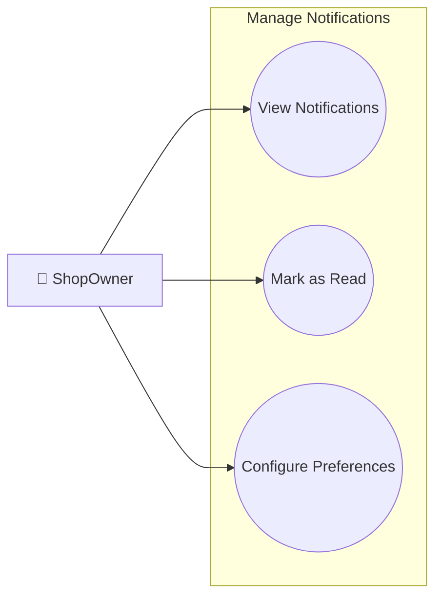

### 11.1 View Notifications
| Field | Description |
|-------|-------------|
| **Purpose** | Xem danh sách thông báo |
| **Inputs** | Read/Unread filter, Page number |
| **Outputs** | List of notifications |
| **API Endpoint** | `GET /v1/notifications/getAllByShopId` |

### 11.2 Mark as Read
| Field | Description |
|-------|-------------|
| **Purpose** | Đánh dấu thông báo đã đọc |
| **Inputs** | Notification ID |
| **Outputs** | Updated notification |
| **API Endpoint** | `PUT /v1/notifications/markAsRead/{id}` |

### 11.3 Configure Notification Preferences
| Field | Description |
|-------|-------------|
| **Purpose** | Cấu hình loại thông báo muốn nhận |
| **Inputs** | Preferences (orders, reviews, messages) |
| **Outputs** | Updated preferences |
| **API Endpoint** | `PUT /v1/notifications/preferences` |

---

## 12. CHAT (Chat với Khách Hàng)

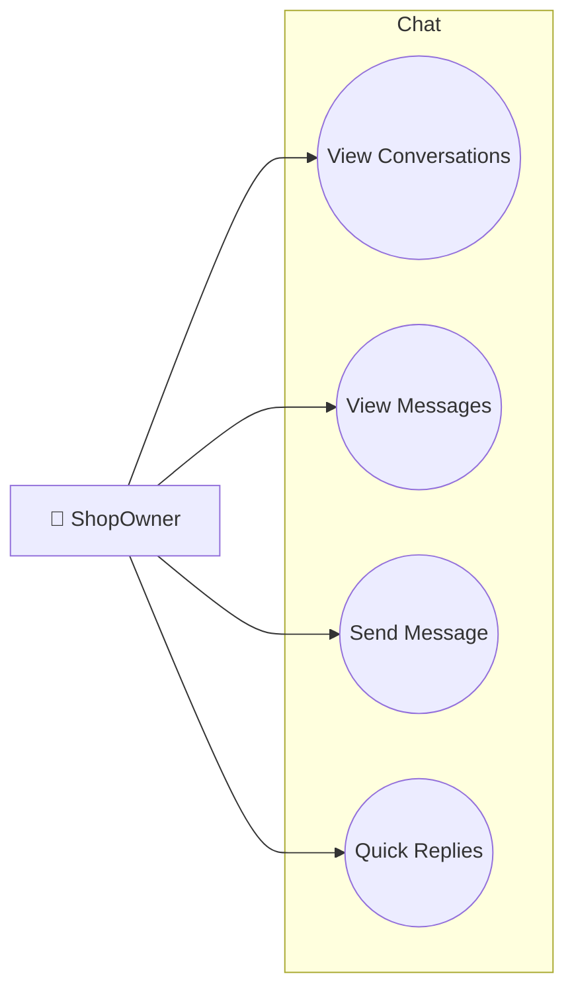

### 12.1 View Conversations
| Field | Description |
|-------|-------------|
| **Purpose** | Xem danh sách conversations với khách hàng |
| **Inputs** | Page number, Unread filter |
| **Outputs** | List of conversations với last message |
| **API Endpoint** | `GET /v1/notifications/chat/conversations` |

### 12.2 View Messages
| Field | Description |
|-------|-------------|
| **Purpose** | Xem tin nhắn trong conversation |
| **Inputs** | Conversation ID, Page number |
| **Outputs** | List of messages |
| **API Endpoint** | `GET /v1/notifications/chat/conversations/{id}/messages` |

### 12.3 Send Message
| Field | Description |
|-------|-------------|
| **Purpose** | Gửi tin nhắn cho khách hàng |
| **Inputs** | Conversation ID, Message content, Attachments |
| **Outputs** | Sent message, Real-time delivery |
| **API Endpoint** | `POST /v1/notifications/chat/messages` |

### 12.4 Quick Replies
| Field | Description |
|-------|-------------|
| **Purpose** | Sử dụng mẫu trả lời nhanh |
| **Inputs** | Template ID, Conversation ID |
| **Outputs** | Message sent with template content |
| **API Endpoint** | `POST /v1/notifications/chat/messages` với template |

---

## 13. LOGIN (Đăng Nhập)

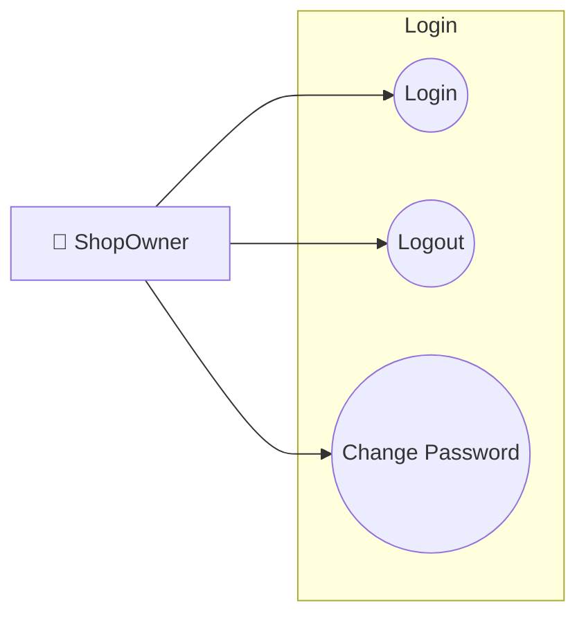

### 13.1 Login
| Field | Description |
|-------|-------------|
| **Purpose** | Đăng nhập vào hệ thống |
| **Inputs** | Email, Password |
| **Outputs** | JWT Token, User + Shop profile |
| **API Endpoint** | `POST /v1/auth/login` |

### 13.2 Logout
| Field | Description |
|-------|-------------|
| **Purpose** | Đăng xuất khỏi hệ thống |
| **Inputs** | JWT Token |
| **Outputs** | Token invalidated |
| **API Endpoint** | `POST /v1/auth/logout` |

### 13.3 Change Password
| Field | Description |
|-------|-------------|
| **Purpose** | Đổi mật khẩu |
| **Inputs** | Old password, New password |
| **Outputs** | Success message |
| **API Endpoint** | `PUT /v1/user/change-password` |

---

## 14. VIEW DASHBOARD STATS (Xem Thống Kê Dashboard)

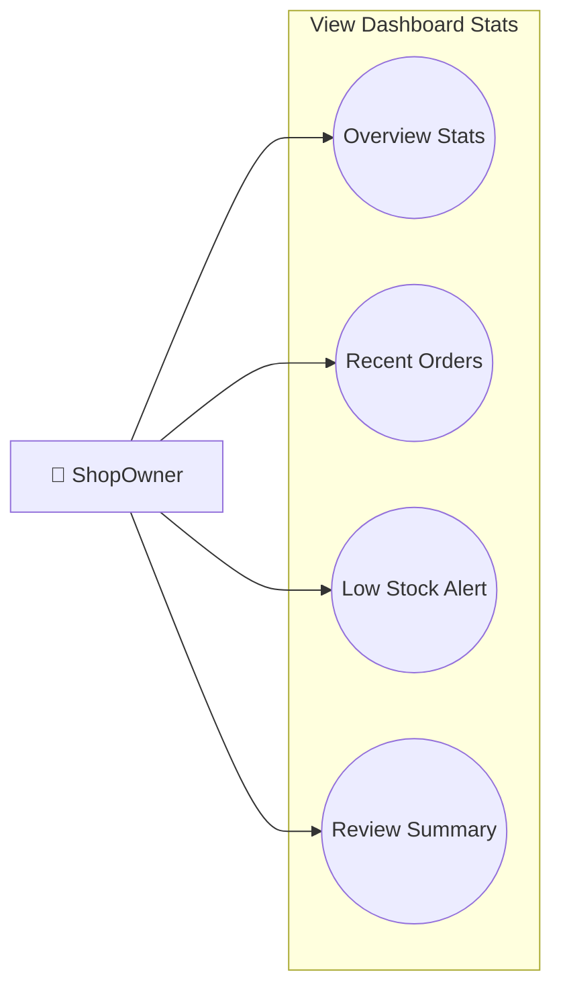

### 14.1 Overview Stats
| Field | Description |
|-------|-------------|
| **Purpose** | Xem thống kê tổng quan |
| **Inputs** | None |
| **Outputs** | Today's revenue, Pending orders, Total products |
| **API Endpoint** | `GET /v1/order/shop-owner/dashboard-stats` |

### 14.2 Recent Orders
| Field | Description |
|-------|-------------|
| **Purpose** | Xem đơn hàng gần đây |
| **Inputs** | None |
| **Outputs** | List of 5-10 recent orders |
| **API Endpoint** | `GET /v1/order/shop-owner/orders?pageSize=10` |

### 14.3 Low Stock Alert
| Field | Description |
|-------|-------------|
| **Purpose** | Xem sản phẩm sắp hết hàng |
| **Inputs** | Threshold (e.g., < 10 items) |
| **Outputs** | List of low stock products |
| **API Endpoint** | `GET /v1/stock/product/low-stock` |

### 14.4 Review Summary
| Field | Description |
|-------|-------------|
| **Purpose** | Xem tóm tắt đánh giá |
| **Inputs** | None |
| **Outputs** | Average rating, Recent reviews |
| **API Endpoint** | `GET /v1/stock/product/public/shop/{shopId}/stats` |
