# 👤 USER - USE CASE SPECIFICATIONS

## Tổng Quan
**Actor:** User (Khách Hàng Đã Đăng Nhập)
**Mô tả:** Khách hàng đã đăng ký và đăng nhập hệ thống, có đầy đủ quyền mua sắm và tương tác.

---

## 1. MANAGE USER PROFILE (Quản Lý Hồ Sơ Cá Nhân)

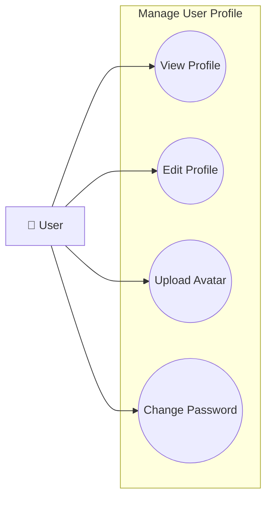

### 1.1 View Profile
| Field | Description |
|-------|-------------|
| **Purpose** | Xem thông tin cá nhân của user |
| **Inputs** | JWT Token |
| **Outputs** | User profile (name, email, phone, avatar, created date) |
| **API Endpoint** | `GET /v1/user/information` |

### 1.2 Edit Profile
| Field | Description |
|-------|-------------|
| **Purpose** | Cập nhật thông tin cá nhân |
| **Inputs** | Full name, Phone number, Date of birth, Gender |
| **Outputs** | Updated user profile |
| **API Endpoint** | `PUT /v1/user/update` |

### 1.3 Upload Avatar
| Field | Description |
|-------|-------------|
| **Purpose** | Upload/thay đổi ảnh đại diện |
| **Inputs** | Image file (JPG/PNG, max 2MB) |
| **Outputs** | Image URL, Updated profile |
| **API Endpoint** | `PUT /v1/user/update` (with file-storage) |

### 1.4 Change Password
| Field | Description |
|-------|-------------|
| **Purpose** | Đổi mật khẩu tài khoản |
| **Inputs** | Current password, New password, Confirm password |
| **Outputs** | Success message |
| **API Endpoint** | `PUT /v1/user/change-password` |

---

## 2. MANAGE ADDRESS (Quản Lý Địa Chỉ)

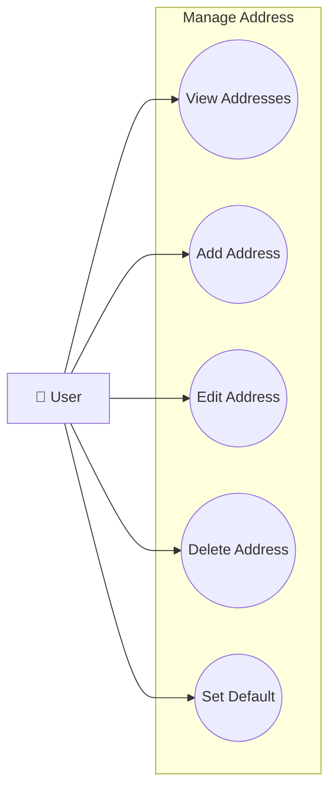

### 2.1 View Addresses
| Field | Description |
|-------|-------------|
| **Purpose** | Xem danh sách địa chỉ giao hàng |
| **Inputs** | JWT Token |
| **Outputs** | List of addresses với default indicator |
| **API Endpoint** | `GET /v1/user/address/getAllAddresses` |

### 2.2 Add Address
| Field | Description |
|-------|-------------|
| **Purpose** | Thêm địa chỉ mới |
| **Inputs** | Full name, Phone, Province/District/Ward, Street address |
| **Outputs** | Created address object |
| **API Endpoint** | `POST /v1/user/address/save` |

### 2.3 Edit Address
| Field | Description |
|-------|-------------|
| **Purpose** | Chỉnh sửa địa chỉ |
| **Inputs** | Address ID, Updated fields |
| **Outputs** | Updated address |
| **API Endpoint** | `PUT /v1/user/address/update` |

### 2.4 Delete Address
| Field | Description |
|-------|-------------|
| **Purpose** | Xóa địa chỉ |
| **Inputs** | Address ID |
| **Outputs** | Success message |
| **API Endpoint** | `DELETE /v1/user/address/deleteAddressById/{id}` |

### 2.5 Set Default Address
| Field | Description |
|-------|-------------|
| **Purpose** | Đặt địa chỉ mặc định cho giao hàng |
| **Inputs** | Address ID |
| **Outputs** | Updated address với isDefault = true |
| **API Endpoint** | `PUT /v1/user/address/setDefault/{id}` |

---

## 3. MANAGE USER'S WALLET (Quản Lý Ví Coins)

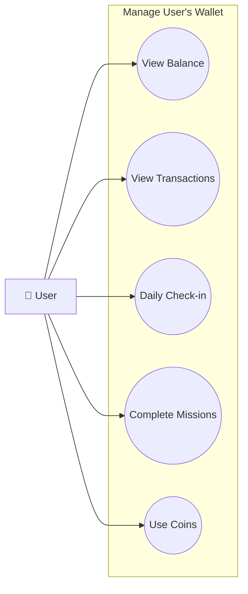

### 3.1 View Coin Balance
| Field | Description |
|-------|-------------|
| **Purpose** | Xem số dư coin hiện tại |
| **Inputs** | JWT Token |
| **Outputs** | Coin balance, Pending coins |
| **API Endpoint** | `GET /v1/user/wallet/coins` |

### 3.2 View Transaction History
| Field | Description |
|-------|-------------|
| **Purpose** | Xem lịch sử giao dịch coin |
| **Inputs** | Date range, Transaction type |
| **Outputs** | List of coin transactions |
| **API Endpoint** | `GET /v1/user/wallet/transactions` |

### 3.3 Daily Check-in
| Field | Description |
|-------|-------------|
| **Purpose** | Điểm danh hàng ngày để nhận coins |
| **Inputs** | JWT Token |
| **Outputs** | Bonus coins, Streak count |
| **API Endpoint** | `POST /v1/user/wallet/daily-checkin` |

### 3.4 Complete Missions
| Field | Description |
|-------|-------------|
| **Purpose** | Hoàn thành nhiệm vụ để nhận coins |
| **Inputs** | Mission ID |
| **Outputs** | Coins earned, Mission status |
| **API Endpoint** | `POST /v1/user/wallet/missions/{id}/complete` |

### 3.5 Use Coins at Checkout
| Field | Description |
|-------|-------------|
| **Purpose** | Sử dụng coins để giảm giá khi thanh toán |
| **Inputs** | Coins amount to use |
| **Outputs** | Discount applied, Remaining coins |
| **API Endpoint** | Used in `POST /v1/order/create-from-cart` |

---

## 4. MANAGE FLASH SALE (Mua Hàng Flash Sale)

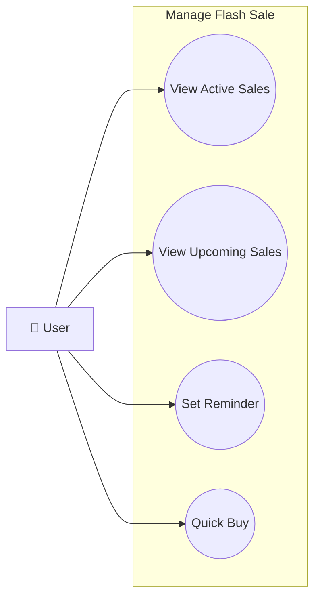

### 4.1 View Active Flash Sales
| Field | Description |
|-------|-------------|
| **Purpose** | Xem các flash sale đang diễn ra |
| **Inputs** | None |
| **Outputs** | List of active flash sales với countdown |
| **API Endpoint** | `GET /v1/stock/flash-sales/active` |

### 4.2 View Upcoming Sales
| Field | Description |
|-------|-------------|
| **Purpose** | Xem các flash sale sắp diễn ra |
| **Inputs** | None |
| **Outputs** | List of upcoming flash sales |
| **API Endpoint** | `GET /v1/stock/flash-sales/upcoming` |

### 4.3 Set Sale Reminder
| Field | Description |
|-------|-------------|
| **Purpose** | Đặt nhắc nhở khi flash sale bắt đầu |
| **Inputs** | Flash sale ID |
| **Outputs** | Reminder set confirmation |
| **API Endpoint** | `POST /v1/stock/flash-sales/{id}/remind` |

### 4.4 Quick Buy from Flash Sale
| Field | Description |
|-------|-------------|
| **Purpose** | Mua nhanh sản phẩm flash sale |
| **Inputs** | Product ID, Size ID, Quantity |
| **Outputs** | Order created với flash sale price |
| **API Endpoint** | `POST /v1/order/flash-sale/buy` |

---

## 5. REVIEW PRODUCTS (Đánh Giá Sản Phẩm)

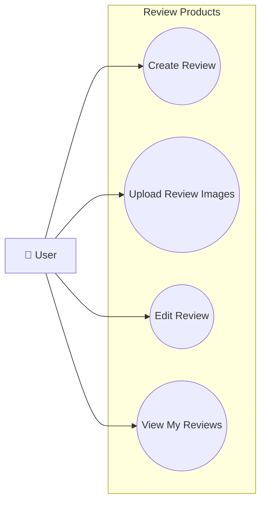

### 5.1 Create Review
| Field | Description |
|-------|-------------|
| **Purpose** | Tạo đánh giá cho sản phẩm đã mua |
| **Inputs** | Product ID, Rating (1-5), Comment |
| **Outputs** | Created review object |
| **API Endpoint** | `POST /v1/stock/reviews` |

### 5.2 Upload Review Images
| Field | Description |
|-------|-------------|
| **Purpose** | Upload ảnh cho review |
| **Inputs** | Review ID, Image files[] |
| **Outputs** | Updated review với images |
| **API Endpoint** | `POST /v1/stock/reviews` (with file-storage) |

### 5.3 Edit Review
| Field | Description |
|-------|-------------|
| **Purpose** | Chỉnh sửa review đã tạo |
| **Inputs** | Review ID, Updated rating/comment |
| **Outputs** | Updated review |
| **API Endpoint** | `PUT /v1/stock/reviews/{id}` |

### 5.4 View My Reviews
| Field | Description |
|-------|-------------|
| **Purpose** | Xem danh sách review đã viết |
| **Inputs** | JWT Token |
| **Outputs** | List of user's reviews |
| **API Endpoint** | `GET /v1/stock/reviews/user` |

---

## 6. MANAGE CART (Quản Lý Giỏ Hàng)

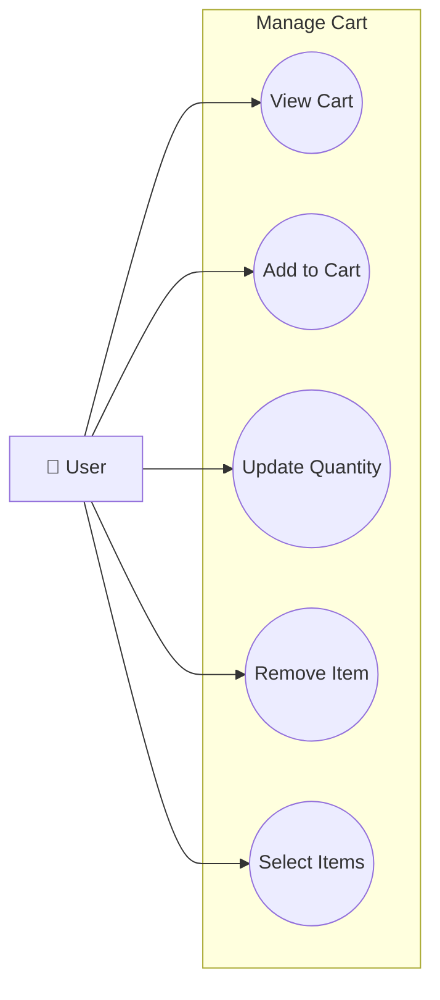

### 6.1 View Cart
| Field | Description |
|-------|-------------|
| **Purpose** | Xem nội dung giỏ hàng |
| **Inputs** | JWT Token |
| **Outputs** | Cart items với product info, prices, stock status |
| **API Endpoint** | `GET /v1/stock/cart/getCartByUserId` |

### 6.2 Add to Cart
| Field | Description |
|-------|-------------|
| **Purpose** | Thêm sản phẩm vào giỏ hàng |
| **Inputs** | Product ID, Size ID, Quantity |
| **Outputs** | Updated cart, Cart item count |
| **API Endpoint** | `POST /v1/stock/cart/item/add` |

### 6.3 Update Quantity
| Field | Description |
|-------|-------------|
| **Purpose** | Cập nhật số lượng sản phẩm trong giỏ |
| **Inputs** | Cart Item ID, New quantity |
| **Outputs** | Updated cart item |
| **API Endpoint** | `PUT /v1/stock/cart/item/update` |

### 6.4 Remove Item
| Field | Description |
|-------|-------------|
| **Purpose** | Xóa sản phẩm khỏi giỏ hàng |
| **Inputs** | Cart Item ID |
| **Outputs** | Updated cart |
| **API Endpoint** | `DELETE /v1/stock/cart/item/remove/{cartItemId}` |

### 6.5 Select Items for Checkout
| Field | Description |
|-------|-------------|
| **Purpose** | Chọn các items để thanh toán |
| **Inputs** | Cart Item IDs[] |
| **Outputs** | Selected items, Subtotal |
| **API Endpoint** | `PUT /v1/stock/cart/select-items` |

---

## 7. CHECKOUT ORDERS (Thanh Toán Đơn Hàng)

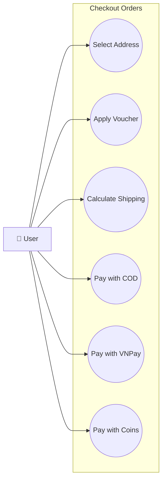

### 7.1 Select Delivery Address
| Field | Description |
|-------|-------------|
| **Purpose** | Chọn địa chỉ giao hàng |
| **Inputs** | Address ID |
| **Outputs** | Selected address, Updated shipping fee |
| **API Endpoint** | Used in checkout flow |

### 7.2 Apply Voucher
| Field | Description |
|-------|-------------|
| **Purpose** | Áp dụng mã giảm giá |
| **Inputs** | Voucher code |
| **Outputs** | Discount amount, Updated total |
| **API Endpoint** | `POST /v1/stock/vouchers/validate` |

### 7.3 Calculate Shipping Fee
| Field | Description |
|-------|-------------|
| **Purpose** | Tính phí vận chuyển |
| **Inputs** | Address ID, Cart items |
| **Outputs** | Shipping fee (from GHN) |
| **API Endpoint** | `POST /v1/order/calculate-shipping-fee` |

### 7.4 Pay with COD
| Field | Description |
|-------|-------------|
| **Purpose** | Thanh toán khi nhận hàng |
| **Inputs** | Cart items, Address ID, Payment method = COD |
| **Outputs** | Order created, Order ID |
| **API Endpoint** | `POST /v1/order/create-from-cart` |

### 7.5 Pay with VNPay
| Field | Description |
|-------|-------------|
| **Purpose** | Thanh toán qua VNPay |
| **Inputs** | Cart items, Address ID, Payment method = VNPAY |
| **Outputs** | VNPay redirect URL |
| **API Endpoint** | `POST /v1/payment/vnpay/create` |

### 7.6 Pay with Coins
| Field | Description |
|-------|-------------|
| **Purpose** | Sử dụng coins để thanh toán một phần |
| **Inputs** | Coins amount to use |
| **Outputs** | Discount applied, Remaining payment |
| **API Endpoint** | Used in `POST /v1/order/create-from-cart` |

---

## 8. FOLLOW SHOPOWNER (Theo Dõi Shop)

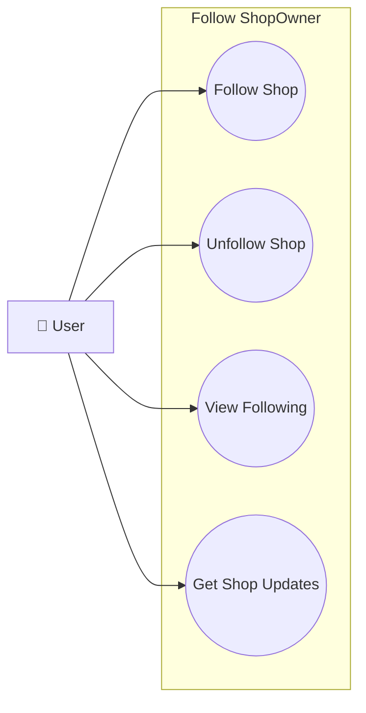

### 8.1 Follow Shop
| Field | Description |
|-------|-------------|
| **Purpose** | Theo dõi shop để nhận cập nhật |
| **Inputs** | Shop ID |
| **Outputs** | Following status |
| **API Endpoint** | `POST /v1/user/shop-owners/{id}/follow` |

### 8.2 Unfollow Shop
| Field | Description |
|-------|-------------|
| **Purpose** | Hủy theo dõi shop |
| **Inputs** | Shop ID |
| **Outputs** | Unfollowed confirmation |
| **API Endpoint** | `DELETE /v1/user/shop-owners/{id}/follow` |

### 8.3 View Following Shops
| Field | Description |
|-------|-------------|
| **Purpose** | Xem danh sách shop đang theo dõi |
| **Inputs** | JWT Token |
| **Outputs** | List of followed shops |
| **API Endpoint** | `GET /v1/user/following-shops` |

### 8.4 Get Shop Updates
| Field | Description |
|-------|-------------|
| **Purpose** | Nhận thông báo từ shop đang follow |
| **Inputs** | Auto via WebSocket |
| **Outputs** | New products, Promotions notifications |
| **API Endpoint** | WebSocket subscription |

---

## 9. LOGIN (Đăng Nhập)

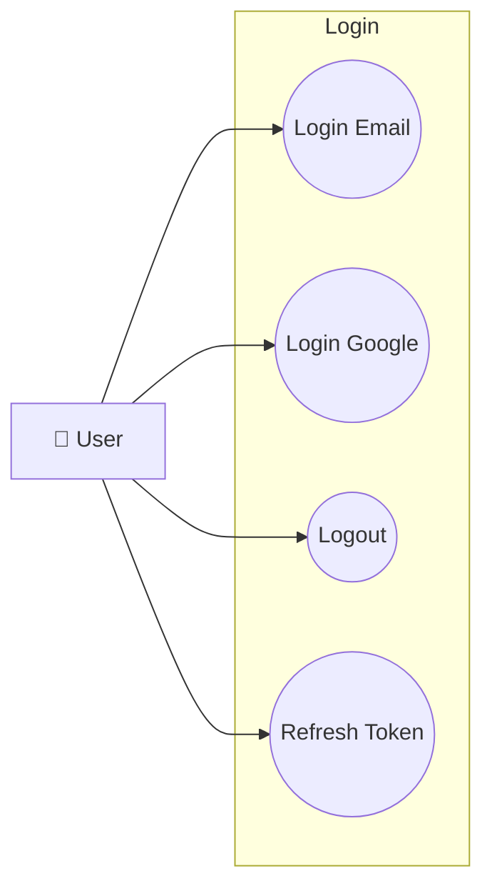

### 9.1 Login with Email
| Field | Description |
|-------|-------------|
| **Purpose** | Đăng nhập bằng email và password |
| **Inputs** | Email, Password |
| **Outputs** | JWT Token, User profile |
| **API Endpoint** | `POST /v1/auth/login` |

### 9.2 Login with Google
| Field | Description |
|-------|-------------|
| **Purpose** | Đăng nhập bằng Google OAuth2 |
| **Inputs** | Google authorization code |
| **Outputs** | JWT Token, User profile |
| **API Endpoint** | `POST /v1/auth/login/google` |

### 9.3 Logout
| Field | Description |
|-------|-------------|
| **Purpose** | Đăng xuất khỏi hệ thống |
| **Inputs** | JWT Token |
| **Outputs** | Token invalidated |
| **API Endpoint** | `POST /v1/auth/logout` |

### 9.4 Refresh Token
| Field | Description |
|-------|-------------|
| **Purpose** | Làm mới access token |
| **Inputs** | Refresh token |
| **Outputs** | New access token |
| **API Endpoint** | `POST /v1/auth/refresh` |

---

## 10. CHATBOT (Trò Chuyện với Bot)

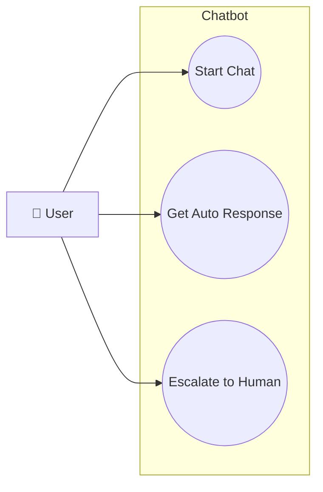

### 10.1 Start Chat with Bot
| Field | Description |
|-------|-------------|
| **Purpose** | Bắt đầu cuộc trò chuyện với chatbot |
| **Inputs** | Initial question |
| **Outputs** | Chatbot response, Conversation ID |
| **API Endpoint** | `POST /v1/notifications/chatbot/start` |

### 10.2 Get Auto Response
| Field | Description |
|-------|-------------|
| **Purpose** | Nhận câu trả lời tự động từ bot |
| **Inputs** | User message |
| **Outputs** | Bot response, Suggested actions |
| **API Endpoint** | `POST /v1/notifications/chatbot/message` |

### 10.3 Escalate to Human Support
| Field | Description |
|-------|-------------|
| **Purpose** | Chuyển sang hỗ trợ viên thực |
| **Inputs** | Conversation ID |
| **Outputs** | Support ticket created, Queue position |
| **API Endpoint** | `POST /v1/notifications/chatbot/escalate` |

---

## 11. CHAT (Chat với Shop)

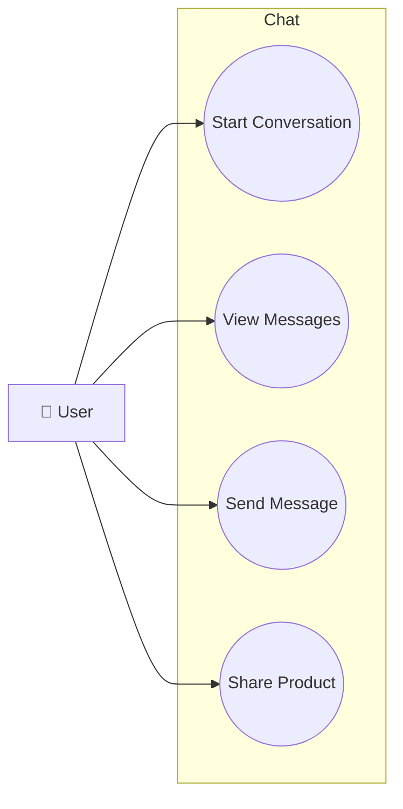

### 11.1 Start Conversation with Shop
| Field | Description |
|-------|-------------|
| **Purpose** | Bắt đầu chat với shop |
| **Inputs** | Shop Owner ID |
| **Outputs** | Conversation created/retrieved |
| **API Endpoint** | `POST /v1/notifications/chat/conversations/start` |

### 11.2 View Messages
| Field | Description |
|-------|-------------|
| **Purpose** | Xem tin nhắn trong cuộc hội thoại |
| **Inputs** | Conversation ID, Page number |
| **Outputs** | List of messages |
| **API Endpoint** | `GET /v1/notifications/chat/conversations/{id}/messages` |

### 11.3 Send Message
| Field | Description |
|-------|-------------|
| **Purpose** | Gửi tin nhắn cho shop |
| **Inputs** | Conversation ID, Message content, Attachments |
| **Outputs** | Sent message, Real-time delivery |
| **API Endpoint** | `POST /v1/notifications/chat/messages` |

### 11.4 Share Product in Chat
| Field | Description |
|-------|-------------|
| **Purpose** | Chia sẻ sản phẩm trong chat để hỏi shop |
| **Inputs** | Conversation ID, Product ID |
| **Outputs** | Product card shared in chat |
| **API Endpoint** | `POST /v1/notifications/chat/messages` với product attachment |

---

## 12. VIEW LIVE (Xem Livestream)

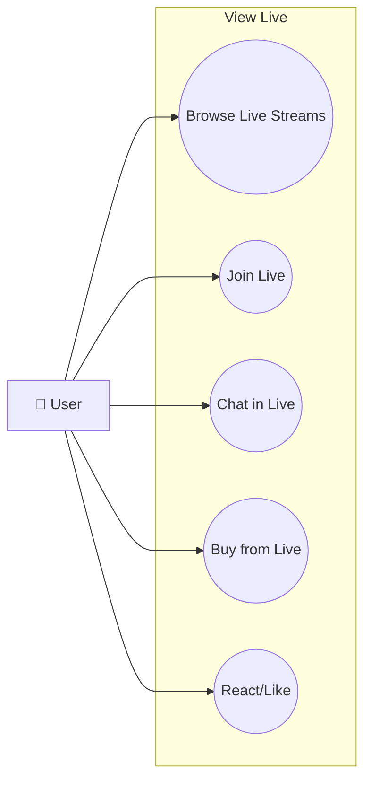

### 12.1 Browse Live Streams
| Field | Description |
|-------|-------------|
| **Purpose** | Duyệt các livestream đang diễn ra |
| **Inputs** | Category filter |
| **Outputs** | List of active livestreams |
| **API Endpoint** | `GET /v1/notifications/live/active` |

### 12.2 Join Live Stream
| Field | Description |
|-------|-------------|
| **Purpose** | Tham gia xem livestream |
| **Inputs** | Stream ID |
| **Outputs** | Stream URL, Live products |
| **API Endpoint** | `POST /v1/notifications/live/{id}/join` |

### 12.3 Chat in Live
| Field | Description |
|-------|-------------|
| **Purpose** | Gửi tin nhắn trong livestream |
| **Inputs** | Stream ID, Message |
| **Outputs** | Message broadcast to all viewers |
| **API Endpoint** | WebSocket `/live/{id}/chat` |

### 12.4 Buy from Live
| Field | Description |
|-------|-------------|
| **Purpose** | Mua sản phẩm đang được bán trong live |
| **Inputs** | Product ID, Size, Quantity |
| **Outputs** | Item added to cart với live price |
| **API Endpoint** | `POST /v1/stock/cart/item/add` với live session |

### 12.5 React/Like
| Field | Description |
|-------|-------------|
| **Purpose** | Thả tim/react trong livestream |
| **Inputs** | Stream ID, Reaction type |
| **Outputs** | Reaction displayed |
| **API Endpoint** | WebSocket `/live/{id}/react` |

---

## 13. TRACKING ORDER (Theo Dõi Đơn Hàng)

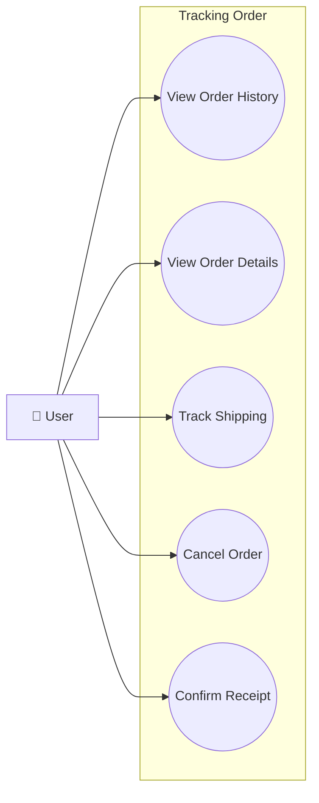

### 13.1 View Order History
| Field | Description |
|-------|-------------|
| **Purpose** | Xem lịch sử đơn hàng |
| **Inputs** | Status filter, Page number |
| **Outputs** | Paginated list of orders |
| **API Endpoint** | `GET /v1/order/getOrderByUserId` |

### 13.2 View Order Details
| Field | Description |
|-------|-------------|
| **Purpose** | Xem chi tiết đơn hàng |
| **Inputs** | Order ID |
| **Outputs** | Order details, Items, Shipping info |
| **API Endpoint** | `GET /v1/order/getOrderById/{id}` |

### 13.3 Track Shipping
| Field | Description |
|-------|-------------|
| **Purpose** | Theo dõi vận chuyển |
| **Inputs** | Order ID |
| **Outputs** | Shipping status, Tracking history |
| **API Endpoint** | `GET /v1/order/{id}/tracking` |

### 13.4 Cancel Order
| Field | Description |
|-------|-------------|
| **Purpose** | Hủy đơn hàng (chỉ khi PENDING) |
| **Inputs** | Order ID, Cancel reason |
| **Outputs** | Cancelled order confirmation |
| **API Endpoint** | `PUT /v1/order/cancel/{orderId}` |

### 13.5 Confirm Receipt
| Field | Description |
|-------|-------------|
| **Purpose** | Xác nhận đã nhận hàng |
| **Inputs** | Order ID |
| **Outputs** | Order marked as DELIVERED |
| **API Endpoint** | `PUT /v1/order/{id}/confirm-receipt` |

---

## 14. VIEW PRODUCTS (Xem Sản Phẩm)

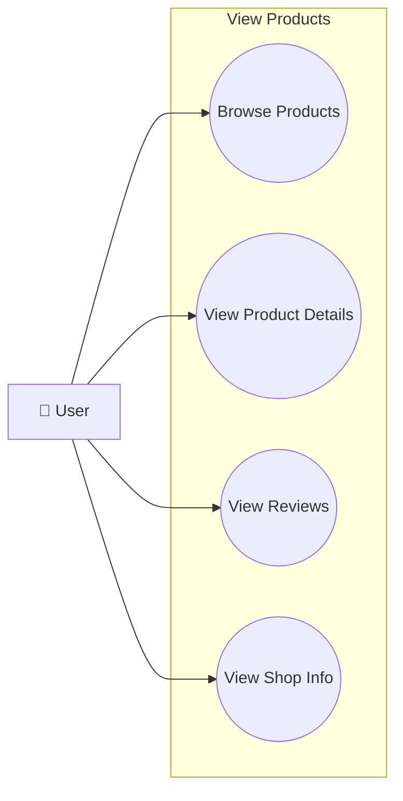

### 14.1 Browse Products
| Field | Description |
|-------|-------------|
| **Purpose** | Duyệt danh sách sản phẩm |
| **Inputs** | Category, Sort, Filter, Page number |
| **Outputs** | Paginated product list |
| **API Endpoint** | `GET /v1/stock/product` |

### 14.2 View Product Details
| Field | Description |
|-------|-------------|
| **Purpose** | Xem chi tiết sản phẩm |
| **Inputs** | Product ID |
| **Outputs** | Product info, Images, Sizes, Reviews |
| **API Endpoint** | `GET /v1/stock/product/{id}` |

### 14.3 View Product Reviews
| Field | Description |
|-------|-------------|
| **Purpose** | Xem đánh giá sản phẩm |
| **Inputs** | Product ID, Rating filter |
| **Outputs** | List of reviews với images |
| **API Endpoint** | `GET /v1/stock/reviews/product/{productId}` |

### 14.4 View Shop Info from Product
| Field | Description |
|-------|-------------|
| **Purpose** | Xem thông tin shop bán sản phẩm |
| **Inputs** | Shop Owner ID (from product) |
| **Outputs** | Shop profile, Other products |
| **API Endpoint** | `GET /v1/user/shop-owners/{id}` |

---

## 15. SEARCH PRODUCTS (Tìm Kiếm Sản Phẩm)

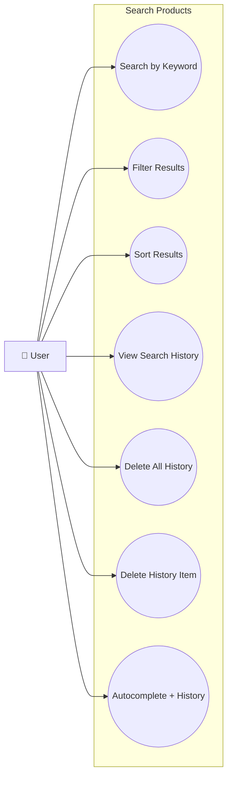

### 15.1 Search by Keyword
| Field | Description |
|-------|-------------|
| **Purpose** | Tìm kiếm thông minh với cache và lưu lịch sử |
| **Inputs** | Query string, Filters, Sort, Page, Size, JWT Token |
| **Outputs** | Products list, Total count, Parsed criteria, Cached status |
| **API Endpoint** | `POST /v1/stock/search/query` |
| **Smart Parsing** | Tự động parse từ query: - "laptop dưới 10tr" → priceMax: 10,000,000 - "áo từ 100k đến 500k" → priceMin: 100,000, priceMax: 500,000 - "điện thoại trên 5tr" → priceMin: 5,000,000 - "áo size M" → sizes: [M] |
| **Side Effects** | Query được lưu vào search history (max 10 items, LIFO, TTL 30 days) |
| **Cache** | Redis 24h, <50ms (hit) ~300-500ms (miss) |

### 15.2 Filter Results
| Field | Description |
|-------|-------------|
| **Purpose** | Lọc kết quả tìm kiếm theo nhiều tiêu chí |
| **Inputs** | Price range (min/max), Categories (array), Locations (array), Sizes (array) |
| **Outputs** | Filtered product list matching all criteria |
| **API Endpoint** | Included in `POST /v1/stock/search/query` filters object |
| **Smart Features** | - Quick price presets (< 100k, 100k-500k, 500k-1tr, > 1tr) - Dynamic category loading from API - Active filter badges with X button to remove |

### 15.3 Sort Results
| Field | Description |
|-------|-------------|
| **Purpose** | Sắp xếp kết quả theo tiêu chí |
| **Inputs** | Sort by (relevance, price-asc, price-desc, newest, bestselling) |
| **Outputs** | Sorted product list |
| **API Endpoint** | Included in `POST /v1/stock/search/query` sortBy parameter |

### 15.4 View Search History
| Field | Description |
|-------|-------------|
| **Purpose** | Xem 10 queries tìm kiếm gần nhất |
| **Inputs** | JWT Token |
| **Outputs** | List of recent search queries (max 10, ordered LIFO) |
| **API Endpoint** | `GET /v1/stock/search/history` |
| **Storage** | Redis key: `search:history:{userId}`, TTL: 30 days |
| **Display** | Shown in autocomplete dropdown when search box is focused |

### 15.5 Delete All Search History
| Field | Description |
|-------|-------------|
| **Purpose** | Xóa toàn bộ lịch sử tìm kiếm của user |
| **Inputs** | JWT Token |
| **Outputs** | Success message, History cleared |
| **API Endpoint** | `DELETE /v1/stock/search/history` |
| **Effect** | Redis key `search:history:{userId}` deleted |

### 15.6 Delete Single History Item
| Field | Description |
|-------|-------------|
| **Purpose** | Xóa 1 query cụ thể khỏi lịch sử |
| **Inputs** | JWT Token, Query string to remove |
| **Outputs** | Success message, Item removed from history |
| **API Endpoint** | `DELETE /v1/stock/search/history/item?query={query}` |
| **UI** | X button next to each history item in autocomplete dropdown |

### 15.7 Autocomplete with History
| Field | Description |
|-------|-------------|
| **Purpose** | Gợi ý thông minh kết hợp products, history và trending |
| **Inputs** | Partial query (or empty), JWT Token, Limit (default 10) |
| **Outputs** | Mixed suggestions: user's history + matching products + trending keywords |
| **API Endpoint** | `GET /v1/stock/search/autocomplete?q={query}&limit=10` |
| **Empty Query** | Returns user's search history only (max 10) |
| **With Query** | Returns: matching products + matching history items + trending keywords |
| **Response Types** | - "history": từ search history của user - "product": product name với productId - "keyword": trending search term |
| **UX** | - Debounced 300ms - Icons for each type - X button on history items - Click to navigate or remove |

---

## 17. USER BEHAVIOR ANALYTICS & RECOMMENDATIONS (Phân Tích Hành Vi & Gợi Ý)

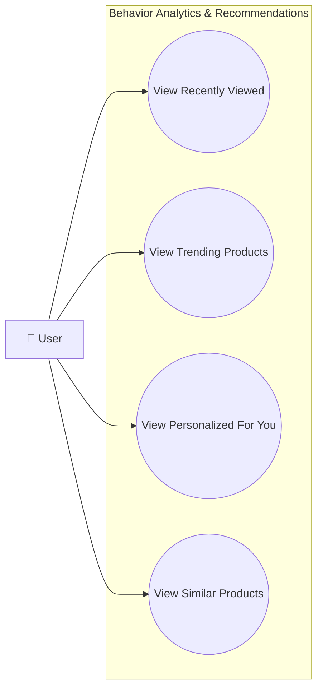

> **📌 Context**: Phase 1 (Behavior Tracking) tự động theo dõi hành vi user (VIEW, SEARCH, ADD_CART, PURCHASE) và lưu vào Redis + Kafka. Phase 2 (Recommendations) sử dụng data này để tạo gợi ý cá nhân hóa.

### 17.1 View Recently Viewed Products
| Field | Description |
|-------|-------------|
| **Purpose** | Xem danh sách sản phẩm đã xem gần đây |
| **Inputs** | JWT Token, Limit (default 10) |
| **Outputs** | List of recently viewed products với product details, source, reason |
| **API Endpoint** | `GET /v1/stock/analytics/recommendations/recently-viewed?limit=10` |
| **Data Source** | Redis key: `recent_views:{userId}`, LIFO order |
| **Tracking** | Tự động track khi user xem ProductDetailPage |
| **Display** | Homepage section "ĐÃ XEM GẦN ĐÂY" |
| **Guest Behavior** | ❌ Guest không có data → section không hiển thị |

### 17.2 View Trending Products
| Field | Description |
|-------|-------------|
| **Purpose** | Xem sản phẩm xu hướng (được xem nhiều nhất) |
| **Inputs** | Limit (default 12) |
| **Outputs** | List of trending products sorted by view count (24h window) |
| **API Endpoint** | `GET /v1/stock/analytics/recommendations/trending?limit=12` |
| **Data Source** | Redis sorted set: `product_views` với scores = view count |
| **Algorithm** | Top N products với view count cao nhất |
| **Display** | Homepage section "SẢN PHẨM XU HƯỚNG" với badge 🔥 |
| **Available For** | ✅ All users (Guest + Logged-in) |

### 17.3 View Personalized Recommendations
| Field | Description |
|-------|-------------|
| **Purpose** | Xem gợi ý sản phẩm cá nhân hóa dựa trên hành vi |
| **Inputs** | JWT Token, Limit (default 12) |
| **Outputs** | Personalized product list với reason (e.g., "Vì bạn đã xem [ProductName]") |
| **API Endpoint** | `GET /v1/stock/analytics/recommendations/personalized?limit=12` |
| **Algorithm** | 1. Lấy 5 sản phẩm recently viewed 2. Lấy category của sản phẩm đầu tiên 3. Tìm products cùng category 4. Exclude products đã xem 5. Random shuffle để tạo diversity |
| **Fallback** | Nếu không đủ data → return trending products |
| **Display** | Homepage section "CÓ THỂ BẠN QUAN TÂM" |
| **Guest Behavior** | ❌ Guest không có data → section không hiển thị |

### 17.4 View Similar Products
| Field | Description |
|-------|-------------|
| **Purpose** | Xem sản phẩm tương tự với một sản phẩm cụ thể |
| **Inputs** | Product ID, Limit (default 6) |
| **Outputs** | List of similar products (same category or shop) |
| **API Endpoint** | `GET /v1/stock/analytics/recommendations/similar/{productId}?limit=6` |
| **Algorithm** | 1. Tìm products cùng category với productId 2. Nếu không đủ → thêm products cùng shop 3. Exclude chính product đang xem |
| **Display** | ProductDetailPage section "SẢN PHẨM TƯƠNG TỰ" |
| **Available For** | ✅ All users (Guest + Logged-in) |

---

## 18. BEHAVIOR TRACKING (Tự Động - Background)

> **⚠️ Note**: User không cần gọi trực tiếp các API này. Frontend tự động track khi có hành động.

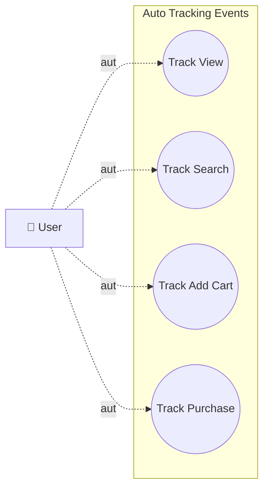

### 18.1 Track Product View (Auto)
| Field | Description |
|-------|-------------|
| **Purpose** | Theo dõi sự kiện xem sản phẩm |
| **Trigger** | User navigate to ProductDetailPage |
| **Tracked Data** | Product ID, Session ID, Source (search/category/home), Duration |
| **API Endpoint** | `POST /v1/stock/analytics/track/view` (called by frontend) |
| **Side Effects** | - Increment Redis view counter - Add to recently viewed (if logged in) - Send Kafka event → MySQL behavior_logs |
| **Performance** | < 10ms (async via Kafka) |

### 18.2 Track Search (Auto)
| Field | Description |
|-------|-------------|
| **Purpose** | Theo dõi từ khóa tìm kiếm |
| **Trigger** | User submit search query |
| **Tracked Data** | Keyword, Session ID, User ID (if logged in) |
| **API Endpoint** | `POST /v1/stock/analytics/track/search` (called by frontend) |
| **Side Effects** | - Increment Redis search counter - Update trending keywords - Add to search history (Phase 3, if logged in) |

### 18.3 Track Add to Cart (Auto)
| Field | Description |
|-------|-------------|
| **Purpose** | Theo dõi sự kiện thêm vào giỏ hàng |
| **Trigger** | User click "Add to Cart" successfully |
| **Tracked Data** | Product ID, Quantity, User ID |
| **API Endpoint** | `POST /v1/stock/analytics/track/cart` (called by frontend) |
| **Side Effects** | - Send Kafka event → MySQL - Update product analytics (cart_count) |

### 18.4 Track Purchase (Auto)
| Field | Description |
|-------|-------------|
| **Purpose** | Theo dõi sự kiện mua hàng thành công |
| **Trigger** | Order status = CONFIRMED |
| **Tracked Data** | User ID, Product ID, Shop ID, Order ID, Quantity |
| **API Endpoint** | `POST /v1/stock/analytics/track/purchase` (called by Order Service) |
| **Side Effects** | - Send Kafka event → MySQL - Update product analytics (purchase_count, conversion_rate, popularity_score) |
| **Integration** | Called from Order Service via Kafka or Feign |

---

## 16. MANAGE NOTIFICATIONS (Quản Lý Thông Báo)

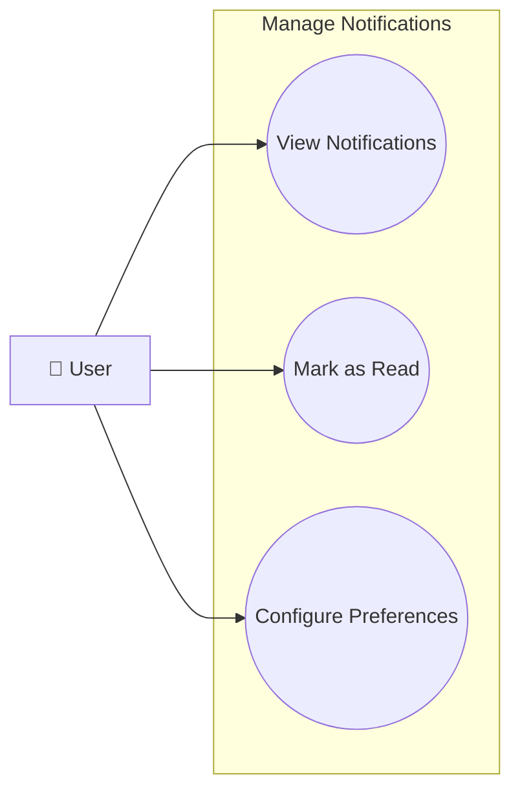

### 16.1 View Notifications
| Field | Description |
|-------|-------------|
| **Purpose** | Xem danh sách thông báo |
| **Inputs** | Read/Unread filter |
| **Outputs** | List of notifications |
| **API Endpoint** | `GET /v1/notifications/getAllByUserId` |

### 16.2 Mark as Read
| Field | Description |
|-------|-------------|
| **Purpose** | Đánh dấu thông báo đã đọc |
| **Inputs** | Notification ID |
| **Outputs** | Updated notification |
| **API Endpoint** | `PUT /v1/notifications/markAsRead/{id}` |

### 16.3 Configure Notification Preferences
| Field | Description |
|-------|-------------|
| **Purpose** | Cấu hình loại thông báo muốn nhận |
| **Inputs** | Preferences settings |
| **Outputs** | Updated preferences |
| **API Endpoint** | `PUT /v1/notifications/preferences` |

---

## 17. REQUEST SHOP OWNER ROLE (Yêu Cầu Nâng Cấp)

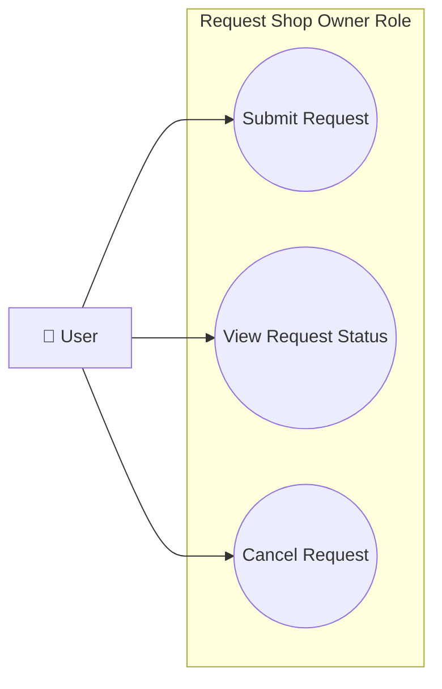

### 17.1 Submit Upgrade Request
| Field | Description |
|-------|-------------|
| **Purpose** | Gửi yêu cầu nâng cấp lên Shop Owner |
| **Inputs** | Shop name, Business info, CCCD/Business license |
| **Outputs** | Request created, Pending status |
| **API Endpoint** | `POST /v1/user/role-requests` |

### 17.2 View Request Status
| Field | Description |
|-------|-------------|
| **Purpose** | Xem trạng thái yêu cầu |
| **Inputs** | JWT Token |
| **Outputs** | Request status (PENDING/APPROVED/REJECTED) |
| **API Endpoint** | `GET /v1/user/role-requests` |

### 17.3 Cancel Request
| Field | Description |
|-------|-------------|
| **Purpose** | Hủy yêu cầu nâng cấp |
| **Inputs** | Request ID |
| **Outputs** | Request cancelled |
| **API Endpoint** | `DELETE /v1/user/role-requests/{id}` |
