# 👤 USER - USE CASE SPECIFICATIONS

## Tổng Quan
**Actor:** User (Khách Hàng Đã Đăng Nhập)
**Mô tả:** Khách hàng đã đăng ký và đăng nhập hệ thống, có đầy đủ quyền mua sắm và tương tác.

---

## 1. MANAGE USER PROFILE (Quản Lý Hồ Sơ Cá Nhân)

```mermaid
graph LR
    USER[👤 User]
    subgraph "Manage User Profile"
        UC1((View Profile))
        UC2((Edit Profile))
        UC3((Upload Avatar))
        UC4((Change Password))
    end
    USER --> UC1
    USER --> UC2
    USER --> UC3
    USER --> UC4
```

### 1.1 View Profile
| Field | Description |
|-------|-------------|
| **Purpose** | Xem thông tin cá nhân của user |
| **Inputs** | JWT Token |
| **Outputs** | User profile (name, email, phone, avatar, created date) |
| **API Endpoint** | `GET /v1/user/information` |

### 1.2 Edit Profile
| Field | Description |
|-------|-------------|
| **Purpose** | Cập nhật thông tin cá nhân |
| **Inputs** | Full name, Phone number, Date of birth, Gender |
| **Outputs** | Updated user profile |
| **API Endpoint** | `PUT /v1/user/update` |

### 1.3 Upload Avatar
| Field | Description |
|-------|-------------|
| **Purpose** | Upload/thay đổi ảnh đại diện |
| **Inputs** | Image file (JPG/PNG, max 2MB) |
| **Outputs** | Image URL, Updated profile |
| **API Endpoint** | `PUT /v1/user/update` (with file-storage) |

### 1.4 Change Password
| Field | Description |
|-------|-------------|
| **Purpose** | Đổi mật khẩu tài khoản |
| **Inputs** | Current password, New password, Confirm password |
| **Outputs** | Success message |
| **API Endpoint** | `PUT /v1/user/change-password` |

---

## 2. MANAGE ADDRESS (Quản Lý Địa Chỉ)

```mermaid
graph LR
    USER[👤 User]
    subgraph "Manage Address"
        UC1((View Addresses))
        UC2((Add Address))
        UC3((Edit Address))
        UC4((Delete Address))
        UC5((Set Default))
    end
    USER --> UC1
    USER --> UC2
    USER --> UC3
    USER --> UC4
    USER --> UC5
```

### 2.1 View Addresses
| Field | Description |
|-------|-------------|
| **Purpose** | Xem danh sách địa chỉ giao hàng |
| **Inputs** | JWT Token |
| **Outputs** | List of addresses với default indicator |
| **API Endpoint** | `GET /v1/user/address/getAllAddresses` |

### 2.2 Add Address
| Field | Description |
|-------|-------------|
| **Purpose** | Thêm địa chỉ mới |
| **Inputs** | Full name, Phone, Province/District/Ward, Street address |
| **Outputs** | Created address object |
| **API Endpoint** | `POST /v1/user/address/save` |

### 2.3 Edit Address
| Field | Description |
|-------|-------------|
| **Purpose** | Chỉnh sửa địa chỉ |
| **Inputs** | Address ID, Updated fields |
| **Outputs** | Updated address |
| **API Endpoint** | `PUT /v1/user/address/update` |

### 2.4 Delete Address
| Field | Description |
|-------|-------------|
| **Purpose** | Xóa địa chỉ |
| **Inputs** | Address ID |
| **Outputs** | Success message |
| **API Endpoint** | `DELETE /v1/user/address/deleteAddressById/{id}` |

### 2.5 Set Default Address
| Field | Description |
|-------|-------------|
| **Purpose** | Đặt địa chỉ mặc định cho giao hàng |
| **Inputs** | Address ID |
| **Outputs** | Updated address với isDefault = true |
| **API Endpoint** | `PUT /v1/user/address/setDefault/{id}` |

---

## 3. MANAGE USER'S WALLET (Quản Lý Ví Coins)

```mermaid
graph LR
    USER[👤 User]
    subgraph "Manage User's Wallet"
        UC1((View Balance))
        UC2((View Transactions))
        UC3((Daily Check-in))
        UC4((Complete Missions))
        UC5((Use Coins))
    end
    USER --> UC1
    USER --> UC2
    USER --> UC3
    USER --> UC4
    USER --> UC5
```

### 3.1 View Coin Balance
| Field | Description |
|-------|-------------|
| **Purpose** | Xem số dư coin hiện tại |
| **Inputs** | JWT Token |
| **Outputs** | Coin balance, Pending coins |
| **API Endpoint** | `GET /v1/user/wallet/coins` |

### 3.2 View Transaction History
| Field | Description |
|-------|-------------|
| **Purpose** | Xem lịch sử giao dịch coin |
| **Inputs** | Date range, Transaction type |
| **Outputs** | List of coin transactions |
| **API Endpoint** | `GET /v1/user/wallet/transactions` |

### 3.3 Daily Check-in
| Field | Description |
|-------|-------------|
| **Purpose** | Điểm danh hàng ngày để nhận coins |
| **Inputs** | JWT Token |
| **Outputs** | Bonus coins, Streak count |
| **API Endpoint** | `POST /v1/user/wallet/daily-checkin` |

### 3.4 Complete Missions
| Field | Description |
|-------|-------------|
| **Purpose** | Hoàn thành nhiệm vụ để nhận coins |
| **Inputs** | Mission ID |
| **Outputs** | Coins earned, Mission status |
| **API Endpoint** | `POST /v1/user/wallet/missions/{id}/complete` |

### 3.5 Use Coins at Checkout
| Field | Description |
|-------|-------------|
| **Purpose** | Sử dụng coins để giảm giá khi thanh toán |
| **Inputs** | Coins amount to use |
| **Outputs** | Discount applied, Remaining coins |
| **API Endpoint** | Used in `POST /v1/order/create-from-cart` |

---

## 4. MANAGE FLASH SALE (Mua Hàng Flash Sale)

```mermaid
graph LR
    USER[👤 User]
    subgraph "Manage Flash Sale"
        UC1((View Active Sales))
        UC2((View Upcoming Sales))
        UC3((Set Reminder))
        UC4((Quick Buy))
    end
    USER --> UC1
    USER --> UC2
    USER --> UC3
    USER --> UC4
```

### 4.1 View Active Flash Sales
| Field | Description |
|-------|-------------|
| **Purpose** | Xem các flash sale đang diễn ra |
| **Inputs** | None |
| **Outputs** | List of active flash sales với countdown |
| **API Endpoint** | `GET /v1/stock/flash-sales/active` |

### 4.2 View Upcoming Sales
| Field | Description |
|-------|-------------|
| **Purpose** | Xem các flash sale sắp diễn ra |
| **Inputs** | None |
| **Outputs** | List of upcoming flash sales |
| **API Endpoint** | `GET /v1/stock/flash-sales/upcoming` |

### 4.3 Set Sale Reminder
| Field | Description |
|-------|-------------|
| **Purpose** | Đặt nhắc nhở khi flash sale bắt đầu |
| **Inputs** | Flash sale ID |
| **Outputs** | Reminder set confirmation |
| **API Endpoint** | `POST /v1/stock/flash-sales/{id}/remind` |

### 4.4 Quick Buy from Flash Sale
| Field | Description |
|-------|-------------|
| **Purpose** | Mua nhanh sản phẩm flash sale |
| **Inputs** | Product ID, Size ID, Quantity |
| **Outputs** | Order created với flash sale price |
| **API Endpoint** | `POST /v1/order/flash-sale/buy` |

---

## 5. REVIEW PRODUCTS (Đánh Giá Sản Phẩm)

```mermaid
graph LR
    USER[👤 User]
    subgraph "Review Products"
        UC1((Create Review))
        UC2((Upload Review Images))
        UC3((Edit Review))
        UC4((View My Reviews))
    end
    USER --> UC1
    USER --> UC2
    USER --> UC3
    USER --> UC4
```

### 5.1 Create Review
| Field | Description |
|-------|-------------|
| **Purpose** | Tạo đánh giá cho sản phẩm đã mua |
| **Inputs** | Product ID, Rating (1-5), Comment |
| **Outputs** | Created review object |
| **API Endpoint** | `POST /v1/stock/reviews` |

### 5.2 Upload Review Images
| Field | Description |
|-------|-------------|
| **Purpose** | Upload ảnh cho review |
| **Inputs** | Review ID, Image files[] |
| **Outputs** | Updated review với images |
| **API Endpoint** | `POST /v1/stock/reviews` (with file-storage) |

### 5.3 Edit Review
| Field | Description |
|-------|-------------|
| **Purpose** | Chỉnh sửa review đã tạo |
| **Inputs** | Review ID, Updated rating/comment |
| **Outputs** | Updated review |
| **API Endpoint** | `PUT /v1/stock/reviews/{id}` |

### 5.4 View My Reviews
| Field | Description |
|-------|-------------|
| **Purpose** | Xem danh sách review đã viết |
| **Inputs** | JWT Token |
| **Outputs** | List of user's reviews |
| **API Endpoint** | `GET /v1/stock/reviews/user` |

---

## 6. MANAGE CART (Quản Lý Giỏ Hàng)

```mermaid
graph LR
    USER[👤 User]
    subgraph "Manage Cart"
        UC1((View Cart))
        UC2((Add to Cart))
        UC3((Update Quantity))
        UC4((Remove Item))
        UC5((Select Items))
    end
    USER --> UC1
    USER --> UC2
    USER --> UC3
    USER --> UC4
    USER --> UC5
```

### 6.1 View Cart
| Field | Description |
|-------|-------------|
| **Purpose** | Xem nội dung giỏ hàng |
| **Inputs** | JWT Token |
| **Outputs** | Cart items với product info, prices, stock status |
| **API Endpoint** | `GET /v1/stock/cart/getCartByUserId` |

### 6.2 Add to Cart
| Field | Description |
|-------|-------------|
| **Purpose** | Thêm sản phẩm vào giỏ hàng |
| **Inputs** | Product ID, Size ID, Quantity |
| **Outputs** | Updated cart, Cart item count |
| **API Endpoint** | `POST /v1/stock/cart/item/add` |

### 6.3 Update Quantity
| Field | Description |
|-------|-------------|
| **Purpose** | Cập nhật số lượng sản phẩm trong giỏ |
| **Inputs** | Cart Item ID, New quantity |
| **Outputs** | Updated cart item |
| **API Endpoint** | `PUT /v1/stock/cart/item/update` |

### 6.4 Remove Item
| Field | Description |
|-------|-------------|
| **Purpose** | Xóa sản phẩm khỏi giỏ hàng |
| **Inputs** | Cart Item ID |
| **Outputs** | Updated cart |
| **API Endpoint** | `DELETE /v1/stock/cart/item/remove/{cartItemId}` |

### 6.5 Select Items for Checkout
| Field | Description |
|-------|-------------|
| **Purpose** | Chọn các items để thanh toán |
| **Inputs** | Cart Item IDs[] |
| **Outputs** | Selected items, Subtotal |
| **API Endpoint** | `PUT /v1/stock/cart/select-items` |

---

## 7. CHECKOUT ORDERS (Thanh Toán Đơn Hàng)

```mermaid
graph LR
    USER[👤 User]
    subgraph "Checkout Orders"
        UC1((Select Address))
        UC2((Apply Voucher))
        UC3((Calculate Shipping))
        UC4((Pay with COD))
        UC5((Pay with VNPay))
        UC6((Pay with Coins))
    end
    USER --> UC1
    USER --> UC2
    USER --> UC3
    USER --> UC4
    USER --> UC5
    USER --> UC6
```

### 7.1 Select Delivery Address
| Field | Description |
|-------|-------------|
| **Purpose** | Chọn địa chỉ giao hàng |
| **Inputs** | Address ID |
| **Outputs** | Selected address, Updated shipping fee |
| **API Endpoint** | Used in checkout flow |

### 7.2 Apply Voucher
| Field | Description |
|-------|-------------|
| **Purpose** | Áp dụng mã giảm giá |
| **Inputs** | Voucher code |
| **Outputs** | Discount amount, Updated total |
| **API Endpoint** | `POST /v1/stock/vouchers/validate` |

### 7.3 Calculate Shipping Fee
| Field | Description |
|-------|-------------|
| **Purpose** | Tính phí vận chuyển |
| **Inputs** | Address ID, Cart items |
| **Outputs** | Shipping fee (from GHN) |
| **API Endpoint** | `POST /v1/order/calculate-shipping-fee` |

### 7.4 Pay with COD
| Field | Description |
|-------|-------------|
| **Purpose** | Thanh toán khi nhận hàng |
| **Inputs** | Cart items, Address ID, Payment method = COD |
| **Outputs** | Order created, Order ID |
| **API Endpoint** | `POST /v1/order/create-from-cart` |

### 7.5 Pay with VNPay
| Field | Description |
|-------|-------------|
| **Purpose** | Thanh toán qua VNPay |
| **Inputs** | Cart items, Address ID, Payment method = VNPAY |
| **Outputs** | VNPay redirect URL |
| **API Endpoint** | `POST /v1/payment/vnpay/create` |

### 7.6 Pay with Coins
| Field | Description |
|-------|-------------|
| **Purpose** | Sử dụng coins để thanh toán một phần |
| **Inputs** | Coins amount to use |
| **Outputs** | Discount applied, Remaining payment |
| **API Endpoint** | Used in `POST /v1/order/create-from-cart` |

---

## 8. FOLLOW SHOPOWNER (Theo Dõi Shop)

```mermaid
graph LR
    USER[👤 User]
    subgraph "Follow ShopOwner"
        UC1((Follow Shop))
        UC2((Unfollow Shop))
        UC3((View Following))
        UC4((Get Shop Updates))
    end
    USER --> UC1
    USER --> UC2
    USER --> UC3
    USER --> UC4
```

### 8.1 Follow Shop
| Field | Description |
|-------|-------------|
| **Purpose** | Theo dõi shop để nhận cập nhật |
| **Inputs** | Shop ID |
| **Outputs** | Following status |
| **API Endpoint** | `POST /v1/user/shop-owners/{id}/follow` |

### 8.2 Unfollow Shop
| Field | Description |
|-------|-------------|
| **Purpose** | Hủy theo dõi shop |
| **Inputs** | Shop ID |
| **Outputs** | Unfollowed confirmation |
| **API Endpoint** | `DELETE /v1/user/shop-owners/{id}/follow` |

### 8.3 View Following Shops
| Field | Description |
|-------|-------------|
| **Purpose** | Xem danh sách shop đang theo dõi |
| **Inputs** | JWT Token |
| **Outputs** | List of followed shops |
| **API Endpoint** | `GET /v1/user/following-shops` |

### 8.4 Get Shop Updates
| Field | Description |
|-------|-------------|
| **Purpose** | Nhận thông báo từ shop đang follow |
| **Inputs** | Auto via WebSocket |
| **Outputs** | New products, Promotions notifications |
| **API Endpoint** | WebSocket subscription |

---

## 9. LOGIN (Đăng Nhập)

```mermaid
graph LR
    USER[👤 User]
    subgraph "Login"
        UC1((Login Email))
        UC2((Login Google))
        UC3((Logout))
        UC4((Refresh Token))
    end
    USER --> UC1
    USER --> UC2
    USER --> UC3
    USER --> UC4
```

### 9.1 Login with Email
| Field | Description |
|-------|-------------|
| **Purpose** | Đăng nhập bằng email và password |
| **Inputs** | Email, Password |
| **Outputs** | JWT Token, User profile |
| **API Endpoint** | `POST /v1/auth/login` |

### 9.2 Login with Google
| Field | Description |
|-------|-------------|
| **Purpose** | Đăng nhập bằng Google OAuth2 |
| **Inputs** | Google authorization code |
| **Outputs** | JWT Token, User profile |
| **API Endpoint** | `POST /v1/auth/login/google` |

### 9.3 Logout
| Field | Description |
|-------|-------------|
| **Purpose** | Đăng xuất khỏi hệ thống |
| **Inputs** | JWT Token |
| **Outputs** | Token invalidated |
| **API Endpoint** | `POST /v1/auth/logout` |

### 9.4 Refresh Token
| Field | Description |
|-------|-------------|
| **Purpose** | Làm mới access token |
| **Inputs** | Refresh token |
| **Outputs** | New access token |
| **API Endpoint** | `POST /v1/auth/refresh` |

---

## 10. CHATBOT (Trò Chuyện với Bot)

```mermaid
graph LR
    USER[👤 User]
    subgraph "Chatbot"
        UC1((Start Chat))
        UC2((Get Auto Response))
        UC3((Escalate to Human))
    end
    USER --> UC1
    USER --> UC2
    USER --> UC3
```

### 10.1 Start Chat with Bot
| Field | Description |
|-------|-------------|
| **Purpose** | Bắt đầu cuộc trò chuyện với chatbot |
| **Inputs** | Initial question |
| **Outputs** | Chatbot response, Conversation ID |
| **API Endpoint** | `POST /v1/notifications/chatbot/start` |

### 10.2 Get Auto Response
| Field | Description |
|-------|-------------|
| **Purpose** | Nhận câu trả lời tự động từ bot |
| **Inputs** | User message |
| **Outputs** | Bot response, Suggested actions |
| **API Endpoint** | `POST /v1/notifications/chatbot/message` |

### 10.3 Escalate to Human Support
| Field | Description |
|-------|-------------|
| **Purpose** | Chuyển sang hỗ trợ viên thực |
| **Inputs** | Conversation ID |
| **Outputs** | Support ticket created, Queue position |
| **API Endpoint** | `POST /v1/notifications/chatbot/escalate` |

---

## 11. CHAT (Chat với Shop)

```mermaid
graph LR
    USER[👤 User]
    subgraph "Chat"
        UC1((Start Conversation))
        UC2((View Messages))
        UC3((Send Message))
        UC4((Share Product))
    end
    USER --> UC1
    USER --> UC2
    USER --> UC3
    USER --> UC4
```

### 11.1 Start Conversation with Shop
| Field | Description |
|-------|-------------|
| **Purpose** | Bắt đầu chat với shop |
| **Inputs** | Shop Owner ID |
| **Outputs** | Conversation created/retrieved |
| **API Endpoint** | `POST /v1/notifications/chat/conversations/start` |

### 11.2 View Messages
| Field | Description |
|-------|-------------|
| **Purpose** | Xem tin nhắn trong cuộc hội thoại |
| **Inputs** | Conversation ID, Page number |
| **Outputs** | List of messages |
| **API Endpoint** | `GET /v1/notifications/chat/conversations/{id}/messages` |

### 11.3 Send Message
| Field | Description |
|-------|-------------|
| **Purpose** | Gửi tin nhắn cho shop |
| **Inputs** | Conversation ID, Message content, Attachments |
| **Outputs** | Sent message, Real-time delivery |
| **API Endpoint** | `POST /v1/notifications/chat/messages` |

### 11.4 Share Product in Chat
| Field | Description |
|-------|-------------|
| **Purpose** | Chia sẻ sản phẩm trong chat để hỏi shop |
| **Inputs** | Conversation ID, Product ID |
| **Outputs** | Product card shared in chat |
| **API Endpoint** | `POST /v1/notifications/chat/messages` với product attachment |

---

## 12. VIEW LIVE (Xem Livestream)

```mermaid
graph LR
    USER[👤 User]
    subgraph "View Live"
        UC1((Browse Live Streams))
        UC2((Join Live))
        UC3((Chat in Live))
        UC4((Buy from Live))
        UC5((React/Like))
    end
    USER --> UC1
    USER --> UC2
    USER --> UC3
    USER --> UC4
    USER --> UC5
```

### 12.1 Browse Live Streams
| Field | Description |
|-------|-------------|
| **Purpose** | Duyệt các livestream đang diễn ra |
| **Inputs** | Category filter |
| **Outputs** | List of active livestreams |
| **API Endpoint** | `GET /v1/notifications/live/active` |

### 12.2 Join Live Stream
| Field | Description |
|-------|-------------|
| **Purpose** | Tham gia xem livestream |
| **Inputs** | Stream ID |
| **Outputs** | Stream URL, Live products |
| **API Endpoint** | `POST /v1/notifications/live/{id}/join` |

### 12.3 Chat in Live
| Field | Description |
|-------|-------------|
| **Purpose** | Gửi tin nhắn trong livestream |
| **Inputs** | Stream ID, Message |
| **Outputs** | Message broadcast to all viewers |
| **API Endpoint** | WebSocket `/live/{id}/chat` |

### 12.4 Buy from Live
| Field | Description |
|-------|-------------|
| **Purpose** | Mua sản phẩm đang được bán trong live |
| **Inputs** | Product ID, Size, Quantity |
| **Outputs** | Item added to cart với live price |
| **API Endpoint** | `POST /v1/stock/cart/item/add` với live session |

### 12.5 React/Like
| Field | Description |
|-------|-------------|
| **Purpose** | Thả tim/react trong livestream |
| **Inputs** | Stream ID, Reaction type |
| **Outputs** | Reaction displayed |
| **API Endpoint** | WebSocket `/live/{id}/react` |

---

## 13. TRACKING ORDER (Theo Dõi Đơn Hàng)

```mermaid
graph LR
    USER[👤 User]
    subgraph "Tracking Order"
        UC1((View Order History))
        UC2((View Order Details))
        UC3((Track Shipping))
        UC4((Cancel Order))
        UC5((Confirm Receipt))
    end
    USER --> UC1
    USER --> UC2
    USER --> UC3
    USER --> UC4
    USER --> UC5
```

### 13.1 View Order History
| Field | Description |
|-------|-------------|
| **Purpose** | Xem lịch sử đơn hàng |
| **Inputs** | Status filter, Page number |
| **Outputs** | Paginated list of orders |
| **API Endpoint** | `GET /v1/order/getOrderByUserId` |

### 13.2 View Order Details
| Field | Description |
|-------|-------------|
| **Purpose** | Xem chi tiết đơn hàng |
| **Inputs** | Order ID |
| **Outputs** | Order details, Items, Shipping info |
| **API Endpoint** | `GET /v1/order/getOrderById/{id}` |

### 13.3 Track Shipping
| Field | Description |
|-------|-------------|
| **Purpose** | Theo dõi vận chuyển |
| **Inputs** | Order ID |
| **Outputs** | Shipping status, Tracking history |
| **API Endpoint** | `GET /v1/order/{id}/tracking` |

### 13.4 Cancel Order
| Field | Description |
|-------|-------------|
| **Purpose** | Hủy đơn hàng (chỉ khi PENDING) |
| **Inputs** | Order ID, Cancel reason |
| **Outputs** | Cancelled order confirmation |
| **API Endpoint** | `PUT /v1/order/cancel/{orderId}` |

### 13.5 Confirm Receipt
| Field | Description |
|-------|-------------|
| **Purpose** | Xác nhận đã nhận hàng |
| **Inputs** | Order ID |
| **Outputs** | Order marked as DELIVERED |
| **API Endpoint** | `PUT /v1/order/{id}/confirm-receipt` |

---

## 14. VIEW PRODUCTS (Xem Sản Phẩm)

```mermaid
graph LR
    USER[👤 User]
    subgraph "View Products"
        UC1((Browse Products))
        UC2((View Product Details))
        UC3((View Reviews))
        UC4((View Shop Info))
    end
    USER --> UC1
    USER --> UC2
    USER --> UC3
    USER --> UC4
```

### 14.1 Browse Products
| Field | Description |
|-------|-------------|
| **Purpose** | Duyệt danh sách sản phẩm |
| **Inputs** | Category, Sort, Filter, Page number |
| **Outputs** | Paginated product list |
| **API Endpoint** | `GET /v1/stock/product` |

### 14.2 View Product Details
| Field | Description |
|-------|-------------|
| **Purpose** | Xem chi tiết sản phẩm |
| **Inputs** | Product ID |
| **Outputs** | Product info, Images, Sizes, Reviews |
| **API Endpoint** | `GET /v1/stock/product/{id}` |

### 14.3 View Product Reviews
| Field | Description |
|-------|-------------|
| **Purpose** | Xem đánh giá sản phẩm |
| **Inputs** | Product ID, Rating filter |
| **Outputs** | List of reviews với images |
| **API Endpoint** | `GET /v1/stock/reviews/product/{productId}` |

### 14.4 View Shop Info from Product
| Field | Description |
|-------|-------------|
| **Purpose** | Xem thông tin shop bán sản phẩm |
| **Inputs** | Shop Owner ID (from product) |
| **Outputs** | Shop profile, Other products |
| **API Endpoint** | `GET /v1/user/shop-owners/{id}` |

---

## 15. SEARCH PRODUCTS (Tìm Kiếm Sản Phẩm)

```mermaid
graph LR
    USER[👤 User]
    subgraph "Search Products"
        UC1((Search by Keyword))
        UC2((Filter Results))
        UC3((Sort Results))
        UC4((View Search History))
    end
    USER --> UC1
    USER --> UC2
    USER --> UC3
    USER --> UC4
```

### 15.1 Search by Keyword
| Field | Description |
|-------|-------------|
| **Purpose** | Tìm kiếm sản phẩm theo từ khóa |
| **Inputs** | Search keyword |
| **Outputs** | Matching products |
| **API Endpoint** | `GET /v1/stock/product?keyword={keyword}` |

### 15.2 Filter Results
| Field | Description |
|-------|-------------|
| **Purpose** | Lọc kết quả tìm kiếm |
| **Inputs** | Price range, Category, Rating, Location |
| **Outputs** | Filtered product list |
| **API Endpoint** | `GET /v1/stock/product?minPrice={}&maxPrice={}&category={}` |

### 15.3 Sort Results
| Field | Description |
|-------|-------------|
| **Purpose** | Sắp xếp kết quả |
| **Inputs** | Sort by (price, rating, newest, bestselling) |
| **Outputs** | Sorted product list |
| **API Endpoint** | `GET /v1/stock/product?sortBy={}&sortDir={}` |

### 15.4 View Search History
| Field | Description |
|-------|-------------|
| **Purpose** | Xem lịch sử tìm kiếm |
| **Inputs** | JWT Token |
| **Outputs** | Recent search keywords |
| **API Endpoint** | `GET /v1/user/search-history` |

---

## 16. MANAGE NOTIFICATIONS (Quản Lý Thông Báo)

### 16.1 View Notifications
| Field | Description |
|-------|-------------|
| **Purpose** | Xem danh sách thông báo |
| **Inputs** | Read/Unread filter |
| **Outputs** | List of notifications |
| **API Endpoint** | `GET /v1/notifications/getAllByUserId` |

### 16.2 Mark as Read
| Field | Description |
|-------|-------------|
| **Purpose** | Đánh dấu thông báo đã đọc |
| **Inputs** | Notification ID |
| **Outputs** | Updated notification |
| **API Endpoint** | `PUT /v1/notifications/markAsRead/{id}` |

### 16.3 Configure Notification Preferences
| Field | Description |
|-------|-------------|
| **Purpose** | Cấu hình loại thông báo muốn nhận |
| **Inputs** | Preferences settings |
| **Outputs** | Updated preferences |
| **API Endpoint** | `PUT /v1/notifications/preferences` |

---

## 17. REQUEST SHOP OWNER ROLE (Yêu Cầu Nâng Cấp)

```mermaid
graph LR
    USER[👤 User]
    subgraph "Request Shop Owner Role"
        UC1((Submit Request))
        UC2((View Request Status))
        UC3((Cancel Request))
    end
    USER --> UC1
    USER --> UC2
    USER --> UC3
```

### 17.1 Submit Upgrade Request
| Field | Description |
|-------|-------------|
| **Purpose** | Gửi yêu cầu nâng cấp lên Shop Owner |
| **Inputs** | Shop name, Business info, CCCD/Business license |
| **Outputs** | Request created, Pending status |
| **API Endpoint** | `POST /v1/user/role-requests` |

### 17.2 View Request Status
| Field | Description |
|-------|-------------|
| **Purpose** | Xem trạng thái yêu cầu |
| **Inputs** | JWT Token |
| **Outputs** | Request status (PENDING/APPROVED/REJECTED) |
| **API Endpoint** | `GET /v1/user/role-requests` |

### 17.3 Cancel Request
| Field | Description |
|-------|-------------|
| **Purpose** | Hủy yêu cầu nâng cấp |
| **Inputs** | Request ID |
| **Outputs** | Request cancelled |
| **API Endpoint** | `DELETE /v1/user/role-requests/{id}` |
